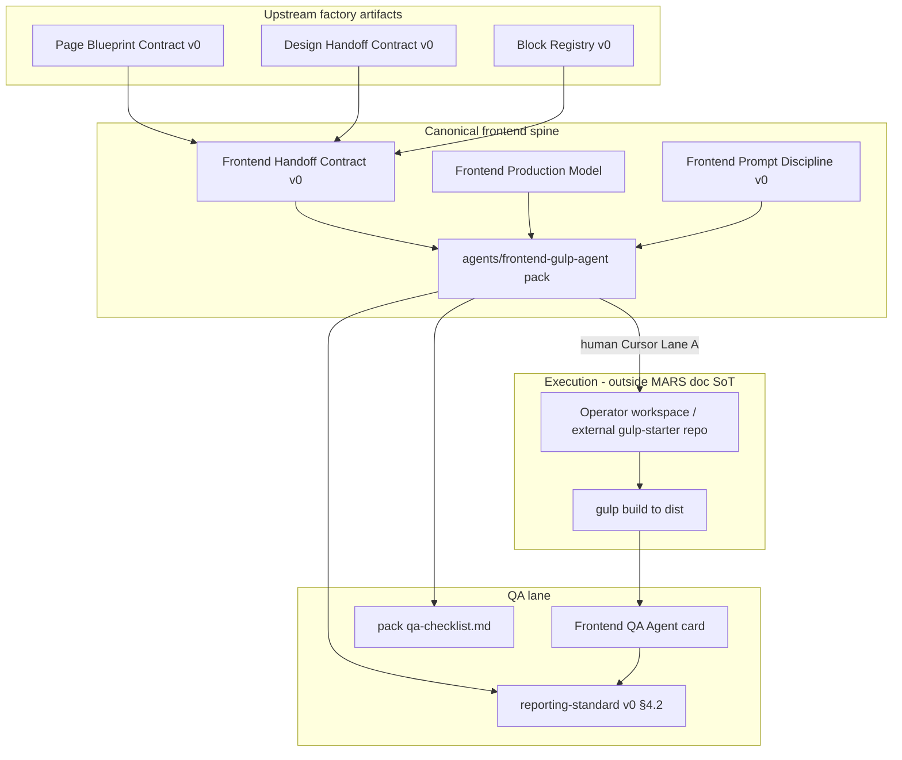

# REPORT — FRONTEND ECOSYSTEM AUDIT

**Task:** Frontend ecosystem audit + frontend agent consolidation prep  
**Date:** 2026-05-15  
**Scope:** Audit, classification, stabilization preparation only — **no** implementation, **no** runtime, **no** governance expansion beyond this artifact.  
**Authority posture:** Per [AGENTS.md](../AGENTS.md) — documentation and human-operated Cursor work only; registry rows ≠ deployed systems.

---

## Executive summary

MARS has a **mature documentation spine** for Gulp-oriented static frontend production (Website Factory contracts + `agents/frontend-gulp-agent/` operational pack), but the ecosystem is **fragmented across generations**: legacy Web-GPT import (Russian), factory v0 contracts (English), a sanitized agent pack (formerly vendored gulp-starter), project-specific Triumph docs, and **forbidden** workspace trees that hold real `gulpfile.js` execution. Nothing in-repo constitutes an autonomous frontend agent or enforced build pipeline.

**Consolidation prep recommendation:** Treat **Website Factory frontend contracts + `frontend-gulp-agent` pack** as the **single canonical foundation** for a future frontend specialist; reclassify **web-gpt-sources** Gulp section as **HISTORICAL**; freeze **project-local** frontend briefs behind factory handoff SoT; deliver or explicitly defer **Frontend Production Rules** (registries §6).

---

## 1. Scanned areas

| Area | Path pattern | Scan depth |
|------|----------------|------------|
| Agent operational pack | `agents/frontend-gulp-agent/**` | Full |
| Agent cards | `agents/cards/*frontend*`, `agents/cards/gulp-*`, `agents/cards/design-qa-*`, related QA cards | Full |
| Agent registry | `agents/registry.md`, `agents/README.md` | Full |
| Website Factory pack | `projects/mars-website-factory/**` (frontend-tagged + workflow/QA layers) | Broad (131 files in tree; ~25 core frontend docs deep-read) |
| Governance cross-links | `governance/capability-map.md`, `dependency-map.md`, `parallel-cursor-chat-work-mode-v0.md`, `canonical-terminology-registry.md`, `current-operational-state-v1.md` | Targeted |
| Legacy import | `web-gpt-sources/04_agents.md`, `web-gpt-sources/chat-migration/05-agent-system-state.md`, `web-gpt-sources/mars-v2/*` | Targeted |
| Reference case | `projects/mars-website-factory/reference-cases/triumph-manipulator-landing/frontend-*` | Targeted |
| Adjacent project ops (not in task ALLOWED list but discovered) | `projects/triumph-manipulator-landing/frontend-*`, design PDF/rules | Noted for fragmentation only — **not** canonical SoT |
| Shared assets | `shared/assets/icon-libraries/**`, `shared/README.md` | Policy surface only |
| **Excluded (per task)** | `workspaces/*`, `dist/*`, `mars-runtime/**/*.js`, `node_modules/*`, client implementation | **Not scanned for content** — existence noted as **external execution locus** only |

---

## 2. Frontend ecosystem inventory

### 2.1 Frontend-related agents (documentation)

| agent_id | Display name | Primary artifact | Registry status | Notes |
|----------|--------------|------------------|-----------------|-------|
| `gulp_frontend_agent` | Gulp Frontend Agent | `agents/frontend-gulp-agent/` pack + `agents/cards/gulp-frontend-agent-v0.md` | **Dual label:** §4 summary **legacy-bridge**; §4.1 row **planned**; pack `AGENT.md` **operational_doc_pack** | **Only** dedicated frontend **implementation** specialist |
| `frontend_qa_agent` | Frontend QA Agent | `agents/cards/frontend-qa-agent-v0.md` | planned | Build, semantics, responsive, a11y heuristics — Stage 12 |
| `design_qa_agent` | Design QA Agent | `agents/cards/design-qa-agent-v0.md` | planned | Visual/spacing/typography — overlaps responsive/a11y with frontend QA |
| `validator_agent_integration` | Validator (factory) | `agents/cards/validator-agent-integration-v0.md` | planned | Cross-cutting; complements specialist QA |
| `ux_structure_agent` | UX Structure Agent | card + factory map | planned | Upstream layout intent → feeds design/frontend |
| `ai_designer_agent` | AI Designer Agent | card + factory map | planned | Tokens/visual direction → design handoff |
| `full_design_generator_agent` | Full Design Generator | card | planned | High-fidelity spec — upstream of frontend |
| `wireframe_generator_agent` | Wireframe Generator | card | planned | Low-fi — upstream |

**Not frontend specialists but in frontend pipeline:** Page Blueprint, Information Architecture, SEO/Marketing strategy agents (produce inputs to handoff).

**Registry honesty:** `agents/registry.md` explicitly states **no API, no database, no running registry** — all rows are contracts.

### 2.2 Gulp / frontend implementation systems (documentation vs execution)

| System | Location | Type | Runnable in MARS repo? |
|--------|----------|------|------------------------|
| **Frontend Gulp Agent operational pack** | `agents/frontend-gulp-agent/` | Canonical **doc pack** (workflow, rules, QA, prompts, reporting) | **No** — sanitized; see `migration-notes.md` |
| **Website Factory frontend layer** | `projects/mars-website-factory/frontend-*.md`, handoff contracts, prompt discipline | Canonical **factory contracts** | **No** |
| **Legacy Gulp profile (import)** | `web-gpt-sources/04_agents.md` (embedded `gulp-frontend-agent.md`) | **HISTORICAL** import (Russian) | **No** |
| **Reference case artifacts** | `reference-cases/triumph-manipulator-landing/frontend-*` | Simulated run documentation | **No** |
| **Triumph project ops docs** | `projects/triumph-manipulator-landing/frontend-agent-brief.md`, `frontend-workspace.md`, design rules PDF | **Project-local** fragmentation | **No** |
| **Real gulp execution (out of scope)** | `workspaces/triumph-manipulator-landing*/gulpfile.js` | **External execution** — forbidden path | **Yes, outside MARS doc pack** — operator workspace |

### 2.3 Frontend standards, contracts, and workflows (Website Factory)

| Document | Role |
|----------|------|
| [frontend-production-model.md](../projects/mars-website-factory/frontend-production-model.md) | Stack intent, gulp-starter **target shape**, outputs, honesty |
| [frontend-handoff-contract-v0.md](../projects/mars-website-factory/frontend-handoff-contract-v0.md) | **Primary input contract** for production (section_map, SCSS_mapping, hooks, QA fields) |
| [frontend-prompt-discipline-v0.md](../projects/mars-website-factory/frontend-prompt-discipline-v0.md) | Prompt structure for S11 production |
| [frontend-artifact-model-v0.md](../projects/mars-website-factory/frontend-artifact-model-v0.md) | Conceptual deliverable categories |
| [frontend-delivery-template-v0.md](../projects/mars-website-factory/frontend-delivery-template-v0.md) | Delivery-stage template |
| [website-factory-workflow-v0.md](../projects/mars-website-factory/website-factory-workflow-v0.md) | Stages S10 handoff, S11 production, S12 frontend QA |
| [qa-validation-model.md](../projects/mars-website-factory/qa-validation-model.md) | QA lanes including frontend |
| [reference-project-qa-matrix-v0.md](../projects/mars-website-factory/reference-project-qa-matrix-v0.md) | Stage × QA matrix (Frontend row) |
| [reporting-standard-v0.md](../projects/mars-website-factory/reporting-standard-v0.md) | §4.2 frontend REPORT lane |
| [cursor-execution-standard-v0.md](../projects/mars-website-factory/cursor-execution-standard-v0.md) | Cursor/git/scope discipline |
| [prompt-structure-standard-v0.md](../projects/mars-website-factory/prompt-structure-standard-v0.md) | §3.5 frontend variant |
| [OPERATIONAL-INDEX.md](../projects/mars-website-factory/OPERATIONAL-INDEX.md) | Entry map — frontend row points to 3 docs |
| [block-registry-v0.md](../projects/mars-website-factory/block-registry-v0.md) | `block_id` → partials |
| [registries.md](../projects/mars-website-factory/registries.md) §6 | **Frontend Production Rules** — **planned, not delivered as standalone file** |

### 2.4 Frontend Gulp Agent pack (file-level)

| File | Function |
|------|----------|
| `AGENT.md` | Role definition, SoT links, non-goals |
| `README.md` | Pack boundary, SAFE UNKNOWN, index |
| `workflow.md` | 9-step human/Cursor flow; Lane A |
| `frontend-rules.md` | HTML/SCSS/JS/source-first rules |
| `gulp-architecture.md` | Target tree reference (verify in target repo) |
| `handoff-rules.md` | Consumption of factory handoff |
| `prompt-patterns.md` | Cursor prompt shapes (audit, section, responsive, …) |
| `qa-checklist.md` | Target-project QA checklist |
| `reporting.md` | REPORT requirements |
| `constraints.md` | Git safety, scope |
| `migration-notes.md` | **Critical:** removed vendored gulp-starter |
| `prompts/`, `examples/` | Placeholders (`.gitkeep` only) |

### 2.5 Governance and lane discipline

| Document | Frontend relevance |
|----------|-------------------|
| [parallel-cursor-chat-work-mode-v0.md](parallel-cursor-chat-work-mode-v0.md) | **Lane A** = production frontend; forbids mixing governance commits with frontend |
| [capability-map.md](capability-map.md) C16 | Website Factory includes Gulp Frontend + prompt/execution layers |
| [dependency-map.md](dependency-map.md) | `website_factory_frontend_handoff_contract_v0` entity edges |
| [canonical-terminology-registry.md](canonical-terminology-registry.md) | Anti-mythology: registry ≠ runtime |
| [enforcement/governance-checks.md](enforcement/governance-checks.md) | Lane separation checks |

### 2.6 Shared / icon policy (production adjacency)

| Asset | Path | Note |
|-------|------|------|
| Font Awesome Pro 5.15.4 | `shared/assets/icon-libraries/Font Awesome Pro 5.15.4/` | Large vendor tree; [fontawesome-pro-5.15.4-usage.md](../shared/assets/icon-libraries/fontawesome-pro-5.15.4-usage.md) |
| Triumph icon policy | `projects/triumph-manipulator-landing/notes/icon-source-policy.md` | Project-local — may diverge from shared |

---

## 3. Frontend systems classification

| System / artifact | Classification | Rationale |
|-------------------|------------------|-----------|
| `agents/frontend-gulp-agent/` (post-sanitization) | **canonical** + **reusable** | Declared operational pack; correct boundary after `migration-notes` cleanup |
| Website Factory `frontend-handoff-contract-v0` | **canonical** | Primary machine-facing **contract** for production inputs |
| `frontend-prompt-discipline-v0` | **canonical** | Normative prompt behavior for S11 |
| `frontend-production-model` | **canonical** | Stack and honesty boundary |
| `gulp-architecture.md` + `frontend-rules.md` | **reusable** | Operator-quick reference; overlaps factory — keep as **pack-local** cheat sheet |
| `prompt-patterns.md`, `qa-checklist.md`, `reporting.md` | **reusable** | Executable discipline for Cursor sessions |
| `agents/cards/gulp-frontend-agent-v0.md` | **canonical** (registry) | Stable `agent_id` card for policy hooks |
| `agents/cards/frontend-qa-agent-v0.md` | **canonical** (registry) | QA lane definition |
| `web-gpt-sources/04_agents.md` Gulp section | **legacy** / **HISTORICAL** | Russian import; superseded in intent by factory + pack |
| Vendored gulp-starter (removed) | **abandoned** | Was **accidental**; documented removal |
| `registries.md` §6 Frontend Production Rules | **partial** | Described but **no** `frontend-production-rules-v0.md` file |
| Triumph `frontend-agent-brief.md`, `V2-CANONICAL-STATE.md`, design PDF | **fragmented** / **duplicated** | Project-local rules parallel factory |
| `workspaces/*/gulpfile.js` | **EXCLUDED execution** | Real build — **not** MARS canonical docs |
| Specialist design agents (AI Designer, etc.) | **partial** (upstream) | Not frontend implementation but **required** for handoff |
| Design QA vs Frontend QA | **fragmented** (boundary) | Shared concerns (responsive, a11y) — needs **lane split** doc |
| `prompts/`, `examples/` in agent pack | **experimental** / empty | Placeholders for future curated snippets |

---

## 4. Reusable frontend core analysis

**Foundation the future canonical frontend specialist should inherit (in priority order):**

### 4.1 Contracts and factory SoT (must inherit)

1. [frontend-handoff-contract-v0.md](../projects/mars-website-factory/frontend-handoff-contract-v0.md) — consumption contract  
2. [frontend-prompt-discipline-v0.md](../projects/mars-website-factory/frontend-prompt-discipline-v0.md) — prompt law  
3. [frontend-production-model.md](../projects/mars-website-factory/frontend-production-model.md) — stack honesty  
4. [block-registry-v0.md](../projects/mars-website-factory/block-registry-v0.md) + blueprint contracts — upstream IDs  
5. [website-factory-workflow-v0.md](../projects/mars-website-factory/website-factory-workflow-v0.md) — S10–S12 gates  
6. [reporting-standard-v0.md](../projects/mars-website-factory/reporting-standard-v0.md) §4.2 — REPORT shape  

### 4.2 Operational pack (must inherit)

7. `agents/frontend-gulp-agent/workflow.md` — session flow  
8. `agents/frontend-gulp-agent/prompt-patterns.md` — Cursor templates  
9. `agents/frontend-gulp-agent/qa-checklist.md` — verification list  
10. `agents/frontend-gulp-agent/frontend-rules.md` + `gulp-architecture.md` — implementation discipline  
11. `agents/frontend-gulp-agent/constraints.md` + `handoff-rules.md` — scope/git/handoff  
12. [parallel-cursor-chat-work-mode-v0.md](parallel-cursor-chat-work-mode-v0.md) — Lane A separation  

### 4.3 Gulp workflow discipline (target shape — verify per project)

| Concern | Canonical rule source |
|---------|----------------------|
| Source-first, no `dist/` edits | handoff contract, production model, all pack rules |
| `gulp-file-include` / partials | handoff `partials_mapping`, legacy profile, `frontend-rules.md` |
| Modular SCSS, tokens entry | prompt discipline §5, handoff `SCSS_mapping` |
| `data-*` JS hooks | handoff, prompt discipline §6 |
| Responsive mobile-first | handoff `responsive_rules`, qa-checklist |
| One block per prompt | prompt discipline §4 |
| Build verification honest | workflow step 5, qa-checklist, SAFE UNKNOWN |

### 4.4 QA and reporting patterns (must inherit)

- Frontend QA agent card + [qa-validation-model.md](../projects/mars-website-factory/qa-validation-model.md)  
- [qa-prompt-rules-v0.md](../projects/mars-website-factory/qa-prompt-rules-v0.md)  
- [reference-project-qa-matrix-v0.md](../projects/mars-website-factory/reference-project-qa-matrix-v0.md) Frontend row  
- Pack `reporting.md` + factory reporting §4.2  

### 4.5 Explicitly NOT inherited as canonical

- Legacy Russian prose in `web-gpt-sources/04_agents.md` (reference only)  
- Triumph project-local briefs/PDFs (derive handoff instances instead)  
- Workspace `gulpfile.js` implementations (project SoT on disk)  
- Font Awesome vendor tree without license policy sign-off  

---

## 5. Duplication and conflict analysis

### 5.1 Duplicated rules (same semantics, multiple files)

| Rule cluster | Copies | Severity |
|--------------|--------|----------|
| Source-first / no `dist/` | handoff contract, production model, frontend-rules, prompt discipline, gulp card, legacy web-gpt | **Low** — consistent, but **drift risk** |
| Modular SCSS / no global pollution | same set | **Low–medium** |
| `data-*` hooks | handoff, prompt discipline, frontend-rules, card | **Low** |
| Gulp target tree | gulp-architecture, production model, handoff examples | **Low** |
| QA checklist items | pack qa-checklist, handoff `QA_requirements`, frontend-qa card | **Medium** — operators may use wrong checklist |
| Workflow steps | pack workflow, factory workflow S11, first-operational-runbook | **Medium** — stage IDs differ |

### 5.2 Conflicts and naming chaos

| Issue | Detail |
|-------|--------|
| **Status trinity** | `legacy-bridge` (registry §4) vs `planned` (§4.1) vs `operational_doc_pack` (`AGENT.md`) for same `gulp_frontend_agent` |
| **Agent naming** | “Gulp Frontend Agent” vs “Frontend Gulp Agent” (folder `frontend-gulp-agent`) |
| **Frontend Production Rules** | Referenced in handoff contract as [registries.md §6](../projects/mars-website-factory/registries.md) but **no delivered v0 file** — handoff says “compatible with those rules where they exist” |
| **Design vs Frontend QA** | Both claim responsive + a11y review — **unclear primacy** at Stage 9 vs 12 |
| **Canonical entry** | OPERATIONAL-INDEX lists 3 factory docs; pack README lists 8 files — no **single** frontend consolidation index before this audit |
| **Project vs factory** | Triumph `V2-CANONICAL-STATE.md`, design PDF, `frontend-agent-brief.md` can contradict factory handoff if not reconciled |
| **Execution locus** | Docs say “external gulp-starter”; workspaces exist in repo but are **forbidden** for this audit — operators may confuse **where** SoT lives |

### 5.3 Outdated methodology

| Item | Assessment |
|------|------------|
| `web-gpt-sources/04_agents.md` Gulp section | **Outdated presentation** (Russian, “draft/planned migration”) but core rules still **align** |
| jQuery/Swiper/Fancybox as default stack | **Legacy optional** libs — still valid as **allowed** but not **required**; factory is more neutral |
| “Coding Agent / Frontend Specialist” rename note in legacy | **Superseded** by `gulp_frontend_agent` id |

### 5.4 Governance drift signals

- Capability map C16 lists extensive layers — easy to over-claim “factory operational” vs doc-only reality  
- No dedicated frontend row in `canonical-terminology-registry.md` (gulp mentioned only indirectly)  
- `current-operational-state-v1.md` excludes `workspaces/**/dist/**` but does not index frontend doc SoT hierarchy  

---

## 6. Consolidation recommendations

### 6.1 What becomes canonical (single spine)

| Layer | Canonical SoT |
|-------|----------------|
| **Identity** | `agent_id` = `gulp_frontend_agent`; card = `agents/cards/gulp-frontend-agent-v0.md` |
| **Operational behavior** | `agents/frontend-gulp-agent/` pack |
| **Inputs/outputs** | Website Factory `frontend-handoff-contract-v0` + `frontend-artifact-model-v0` |
| **Prompts** | `frontend-prompt-discipline-v0` (factory) + `prompt-patterns.md` (pack templates) |
| **QA** | `frontend-qa-agent` card + pack `qa-checklist.md` + factory QA matrix row |
| **Lanes** | `parallel-cursor-chat-work-mode-v0` Lane A |
| **Entry index** | `OPERATIONAL-INDEX.md` frontend row **plus** this audit’s §7 foundation map |

**Normalize status label** (documentation action, not runtime): adopt **`operational_doc_pack`** in registry §4.1 notes for `gulp_frontend_agent`, retain **legacy-bridge** only as **historical alignment** footnote to Web-GPT import — **one sentence**, not dual primary status.

### 6.2 What becomes legacy

| Item | Action |
|------|--------|
| `web-gpt-sources/04_agents.md` Gulp section | Mark **HISTORICAL**; add pointer to pack + factory (no deletion yet) |
| Removed vendored starter in agent pack | **Closed** — document in pack README only |
| Triumph design PDF / local “canonical state” | **Legacy project artifacts** — content feeds handoff, not parallel standard |

### 6.3 What should be archived (future, not in this task)

| Candidate | Condition |
|-----------|-----------|
| Duplicate Triumph `frontend-agent-brief.md` | After handoff instance fully captures rules |
| Empty `prompts/`, `examples/` if still empty at specialist launch | Archive or populate — not leave ambiguous |
| Any re-appearance of `node_modules`/`dist` under `agents/` | **Immediate remove** per `migration-notes.md` |

### 6.4 What should be merged

| Merge target | Sources |
|--------------|---------|
| **Frontend Production Rules v0** (new file or registries annex) | `registries.md` §6 + `frontend-rules.md` + handoff forbidden_patterns + prompt discipline constraints |
| **QA checklist (operator)** | Pack `qa-checklist.md` as **short form**; handoff `QA_requirements` as **per-page overlay** — document relationship in pack README |
| **Design vs Frontend QA boundary** | One table in `qa-validation-model.md` or new ½-page **QA lane split** doc (factory) |

### 6.5 What should be frozen

| Item | Freeze meaning |
|------|----------------|
| `frontend-handoff-contract-v0` field set | No new required fields without v1 contract |
| Pack folder structure | No re-vendoring starters |
| `workspaces/*` | Out of MARS governance edits — execution only |
| Legacy web-gpt Gulp section | No new edits except pointer banner |

### 6.6 What the future frontend specialist inherits

See **§4** — summarized as: **Handoff contract + prompt discipline + operational pack + Lane A + reporting/QA matrix**. Specialist must **open external target repo**, verify scripts/paths (**SAFE UNKNOWN** until inspected), never claim build green without evidence.

### 6.7 Do NOT do yet (per task)

- Design the new agent card v1 or runtime adapter  
- Rewrite gulp projects in workspaces  
- Mass-refactor governance beyond this audit file  
- Git commit/archive/delete  

---

## 7. Recommended archival strategy

| Phase | Action | Owner |
|-------|--------|-------|
| **A — Pointer pass** | Add **HISTORICAL** banner to legacy Gulp section in `web-gpt-sources/04_agents.md` linking to `agents/frontend-gulp-agent/README.md` | Human doc PR |
| **B — Status normalization** | Align `agents/registry.md` §4 and §4.1 narrative for `gulp_frontend_agent` to single primary status + legacy footnote | Human doc PR |
| **C — Deliver or defer §6 rules** | Either publish `frontend-production-rules-v0.md` or amend handoff to say “rules live in pack `frontend-rules.md` until v0 file exists” | Human doc PR |
| **D — Project doc reconciliation** | For each active project (e.g. Triumph), map `frontend-agent-brief` → single `frontend_handoff_id` instance; archive brief when redundant | Per-project operator |
| **E — Pack population** | Curate `prompts/` and `examples/` from reference run (Triumph case) or delete placeholders | Frontend specialist prep |
| **F — Workspace boundary** | Keep workspaces **outside** agent pack; document in pack README that **execution SoT = target repo root** chosen by operator | Already partially stated |

**No file deletions in this audit.**

---

## 8. Proposed canonical frontend foundation map

**Reading order for operators (proposed):**

1. [OPERATIONAL-INDEX.md](../projects/mars-website-factory/OPERATIONAL-INDEX.md) → Frontend discipline row  
2. [frontend-handoff-contract-v0.md](../projects/mars-website-factory/frontend-handoff-contract-v0.md) (instance for page)  
3. [agents/frontend-gulp-agent/README.md](../agents/frontend-gulp-agent/README.md) → workflow → prompt-patterns  
4. Target repo inspection (paths/scripts) — **SAFE UNKNOWN** until done  
5. Implement → qa-checklist → REPORT §4.2  

---

## 9. SAFE UNKNOWN

| Topic | Status |
|-------|--------|
| Whether any project still uses **jQuery** as default | **UNKNOWN** — legacy profile allows; factory neutral |
| CI/Lighthouse/a11y automation per project | **UNKNOWN** — explicitly not in factory v0 |
| Exact gulp-starter version in active workspaces | **UNKNOWN** — workspaces not audited |
| `frontend-production-rules-v0.md` delivery date | **UNKNOWN** — §6 still planned |
| Triumph production implementation state vs reference case | **UNKNOWN** — reference case is documented simulation |
| Font Awesome Pro license compliance in repo | **UNKNOWN** — large vendor tree present; policy doc exists but legal review not evidenced |
| Future runtime mapping for `gulp_frontend_agent` | **FUTURE** — card notes Tool Layer TBD |

---

## 10. Risks

| Risk | Impact | Mitigation (prep) |
|------|--------|-------------------|
| Status label confusion (`legacy-bridge` vs `operational_doc_pack`) | Wrong agent maturity claims | Normalize registry narrative (§6.1) |
| Re-vendoring gulp-starter into `agents/` | Boundary violation, repo bloat | Enforce `migration-notes.md`; governance check |
| Parallel project “canonical” docs (Triumph) | Drift from factory handoff | Reconcile to single handoff instance |
| Design QA / Frontend QA overlap | Duplicate or missed checks | Publish lane split table |
| Missing Frontend Production Rules file | Handoff references non-existent module | Deliver v0 or amend reference |
| Operator edits `dist/` under time pressure | Unreproducible production | Keep qa-checklist + forbidden_patterns prominent |
| Over-claiming automated frontend agent | Mythology drift | AGENTS.md + this audit in onboarding |

---

## 11. Git confirmation

- **No commit** performed  
- **No push** performed  
- **No stage** performed  
- **No delete** performed  
- **No archive** performed  

**Changed files (audit only):**

- `governance/frontend-ecosystem-audit-v0.md` (this file, **created**)

---

*End of audit — consolidation foundation ready for future canonical frontend specialist design phase.*
