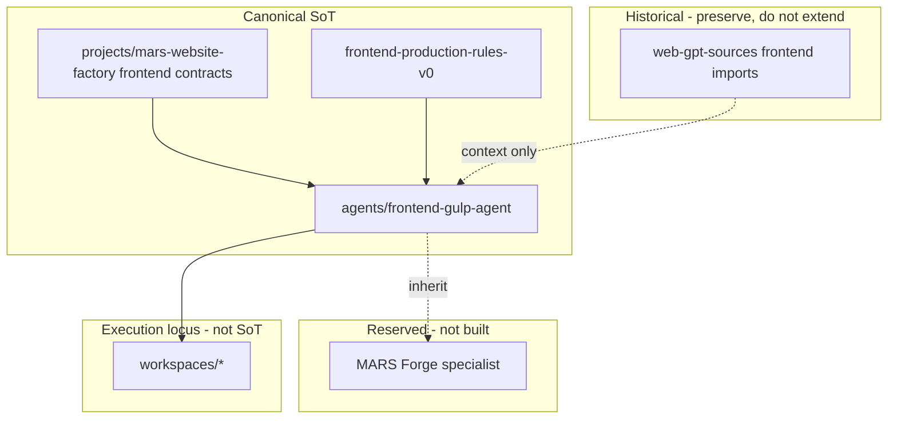

# Frontend legacy and foundation map v0

**Status:** **documentation only** — stabilization map for the MARS frontend ecosystem. **Not** runtime, **not** agent implementation, **not** physical archive or file moves.

**Related:** [frontend-ecosystem-audit-v0.md](frontend-ecosystem-audit-v0.md) (inventory), [AGENTS.md](../AGENTS.md) (honesty), [agents/registry.md](../agents/registry.md) §4 / §4.1.

---

## 1. Canonical frontend foundation (SoT)

**Single canonical frontend production foundation** for new work:

| Layer | Path | Role |
|-------|------|------|
| **Operational specialist pack** | [`agents/frontend-gulp-agent/`](../agents/frontend-gulp-agent/) | Gulp-centered implementation specialist — **`operational_doc_pack`**; human + Cursor/Codex workflow; prompts, workflow, constraints, QA, reporting |
| **Factory methodology & contracts** | [`projects/mars-website-factory/`](../projects/mars-website-factory/) | Handoff, production model, prompt discipline, artifact model, delivery template |
| **Compact operator rules** | [`projects/mars-website-factory/frontend-production-rules-v0.md`](../projects/mars-website-factory/frontend-production-rules-v0.md) | src-first, no `dist/` edits, include/SCSS/JS scope — **documentation only** |
| **Registry identity** | [`agents/registry.md`](../agents/registry.md) | `gulp_frontend_agent` — same role as §4 **Gulp Frontend Agent** |
| **Agent card** | [`agents/cards/gulp-frontend-agent-v0.md`](../agents/cards/gulp-frontend-agent-v0.md) | Catalog row; defers to pack + factory for behaviour |

### 1.1 What the foundation **is**

- **Canonical** frontend production foundation for Website Factory **Stage 11** (static HTML/SCSS/JS assembly).
- **`operational_doc_pack`** — documentation-backed discipline, **not** autonomous runtime, **not** a deployed agent service, **not** in-repo Gulp build proof.
- **Human + Cursor/Codex** execution against an **external** gulp-starter (or equivalent) project opened by the operator ([`agents/frontend-gulp-agent/README.md`](../agents/frontend-gulp-agent/README.md)).

### 1.2 What the foundation **is not**

- **Not** MARS runtime / Control Plane routing implementation.
- **Not** `workspaces/*` — real `gulpfile.js` execution lives there; workspaces are **Lane A execution locus**, not governance SoT.
- **Not** a second parallel “frontend governance system” — factory contracts + this pack **are** the governance surface for frontend production semantics.

### 1.3 Inheritance rule (future specialists)

**Future frontend specialists** (including the reserved **MARS Forge** role below) **inherit from** this foundation:

- Do **not** replace or fork factory handoff / production-rules SoT without an explicit governance transition.
- May **extend** prompts, cards, and operator UX — **must not** claim runtime, autonomy, or in-repo build pipelines without evidence.

---

## 2. Historical frontend imports (non-canonical)

Classified **historical · migration-era · non-canonical · not source-of-truth**. **Preserve in place** — no deletion or physical archive in this phase.

| Import | Location | Classification | Operator rule |
|--------|----------|----------------|---------------|
| **Web-GPT Gulp profile** | [`web-gpt-sources/04_agents.md`](../web-gpt-sources/04_agents.md) (embedded `gulp-frontend-agent.md`, Russian) | Historical import | Read for context only; banner marks non-SoT |
| **Legacy architecture prose** | [`web-gpt-sources/03_core.md`](../web-gpt-sources/03_core.md), [`web-gpt-sources/02_architecture.md`](../web-gpt-sources/02_architecture.md) | Migration-era | Terminology map input; not authoritative for new frontend work |
| **Chat-migration snapshots** | [`web-gpt-sources/chat-migration/`](../web-gpt-sources/chat-migration/) | Point-in-time export | Lane/state notes may be stale; verify against canonical paths |
| **MARS v2 context packs** | [`web-gpt-sources/mars-v2/`](../web-gpt-sources/mars-v2/) | Historical context | Factory v0 docs supersede for Website Factory semantics |

**Do not** extend historical imports as authoritative SoT for new work. **Do not** re-vendor gulp-starter or production `src/` trees into `agents/`.

---

## 3. Legacy frontend layers (adjacent, not SoT)

| Layer | Examples | Status |
|-------|----------|--------|
| **Reference case docs** | `projects/mars-website-factory/reference-cases/*/frontend-*` | **Example / simulation** — not production proof |
| **Project-local ops** | e.g. `projects/triumph-manipulator-landing/frontend-agent-brief.md`, design PDFs | **Project fragmentation risk** — reconcile to factory handoff instance |
| **QA specialist cards (planned)** | `agents/cards/frontend-qa-agent-v0.md`, `design-qa-agent-v0.md` | **Upstream/downstream** of foundation — not a second implementation specialist |
| **Execution trees (forbidden to govern here)** | `workspaces/*`, `dist/*` | **External execution** — operator opens separately; pack defines *how*, not *where* on disk |

---

## 4. Deprecated / transitional references

| Reference | Posture |
|-----------|---------|
| **`legacy-bridge`** on Gulp Frontend Agent | **Historical footnote only** — catalog once aligned Web-GPT import; canonical status is **`operational_doc_pack`** ([`agents/registry.md`](../agents/registry.md)) |
| **Second “canonical” frontend brief per project** | **Deprecated pattern** — one handoff instance per page via [frontend-handoff-contract-v0.md](../projects/mars-website-factory/frontend-handoff-contract-v0.md) |
| **Manual `dist/` fixes** | **Forbidden** — see [frontend-production-rules-v0.md](../projects/mars-website-factory/frontend-production-rules-v0.md) |
| **Autonomous frontend agent / build bot narratives** | **Forbidden claims** — per [AGENTS.md](../AGENTS.md), [enforcement/forbidden-runtime-claims.md](enforcement/forbidden-runtime-claims.md) |

---

## 5. MARS Forge — overlay pack (operational_doc_pack)

**Stabilization (2026-05-19):** Pack and card **exist** — [`agents/mars-forge/`](../agents/mars-forge/), [`agents/cards/mars-forge-frontend-agent-v0.md`](../agents/cards/mars-forge-frontend-agent-v0.md), registry `mars_forge_frontend_agent` (**`operational_doc_pack`**). [mars-forge-operational-design-v0.md](mars-forge-operational-design-v0.md) remains **design precedent**; see [mars-forge-transition-stabilization-v0.md](mars-forge-transition-stabilization-v0.md).

| Field | Current direction |
|-------|-------------------|
| **Working name** | **MARS Forge** (display); stable id **`mars_forge_frontend_agent`** |
| **Role** | **Thin overlay** on Gulp foundation — phased pipeline, freeze, anti-drift, overlay QA (not parallel SoT) |
| **Inherits** | Handoff contract, production model, production rules v0, prompt discipline, pack workflow/QA — **no** parallel SoT |
| **Forge additions** | See pack [`AGENT.md`](../agents/mars-forge/AGENT.md), [`workflow.md`](../agents/mars-forge/workflow.md) |
| **Explicit non-claims** | No autonomous runtime, no orchestration product, no in-repo gulp pipeline proof, no workspace ownership in MARS repo |

**Do not** mark **`active`** (runtime) without implementation proof per registry honesty rules.

---

## 6. Anti-chaos guidance (compact)

| Risk | Prevention |
|------|------------|
| **Duplicate frontend implementation specialists** | **`gulp_frontend_agent`** is canonical foundation; MARS Forge is **overlay only**, not parallel SoT |
| **Conflicting frontend SoT** | Factory `frontend-*` contracts + `frontend-gulp-agent/` pack; project-local briefs are **instances**, not competing standards |
| **Parallel frontend governance** | No new “frontend policy engine” — extend v0 docs or pack files via governed edit |
| **Frontend runtime mythology** | Registry rows ≠ running agents; pack ≠ gulp-starter repo; REPORT must not fake build/CI |
| **Workspace vs pack confusion** | Pack = **discipline**; `workspaces/*` = **implementation** — never cite workspace paths as MARS canonical frontend home |

**Operator reading order:** [OPERATIONAL-INDEX.md](../projects/mars-website-factory/OPERATIONAL-INDEX.md) **Core Run** → [Frontend & Forge](../projects/mars-website-factory/OPERATIONAL-INDEX.md#frontend--forge-canonical-once) → handoff instance → [`agents/frontend-gulp-agent/README.md`](../agents/frontend-gulp-agent/README.md) → target repo inspection (**SAFE UNKNOWN** until done).

---

## 7. Future evolution path (documentation-only)

1. **Now:** foundation declared; legacy classified; Forge **overlay pack** live ([`agents/mars-forge/`](../agents/mars-forge/)) — design precedent in [mars-forge-operational-design-v0.md](mars-forge-operational-design-v0.md).  
2. **Next (when scoped):** tighten Forge/Factory checklist tiers and editorial merges per [website-factory-compression-review-v0.md](website-factory-compression-review-v0.md) — no runtime claim.  
3. **Later:** optional physical legacy archive under governance lifecycle rules — **not** in this task.  
4. **Runtime integration (if ever):** separate phase; Control Plane + registry read — **planned only** until code exists.

---

## 8. Quick map

---

*Last updated: 2026-05-15 — Frontend Consolidation Phase D.*
