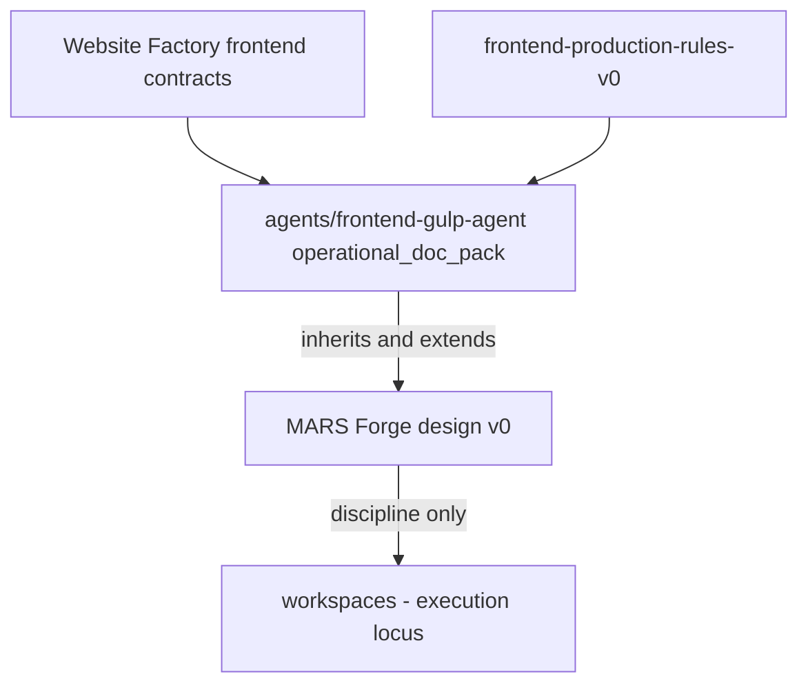

# MARS Forge — Operational Design v0

**Status:** **documentation only** — **design precedent** for the Forge overlay. **Not** runtime, **not** orchestration.

**Stabilization note (2026-05-19):** The live pack [`agents/mars-forge/`](../agents/mars-forge/), card, and registry row **were authored after** this design doc. For **current existence and status**, prefer the pack README and [mars-forge-transition-stabilization-v0.md](mars-forge-transition-stabilization-v0.md) over the “not created” wording below.

**Date:** 2026-05-15  
**Phase:** Design v0 (pre-pack; pack now exists as **operational_doc_pack**)

**Related:** [frontend-legacy-and-foundation-map-v0.md](frontend-legacy-and-foundation-map-v0.md), [frontend-ecosystem-audit-v0.md](frontend-ecosystem-audit-v0.md), [AGENTS.md](../AGENTS.md), [agents/frontend-gulp-agent/README.md](../agents/frontend-gulp-agent/README.md), [agents/mars-forge/README.md](../agents/mars-forge/README.md), [frontend-production-rules-v0.md](../projects/mars-website-factory/frontend-production-rules-v0.md).

**Historical note:** This document originally stated the pack/card would not be created here; implementation followed as documentation-only overlay — see transition stabilization doc.

---

## 1. Forge position

### 1.1 What MARS Forge is

**MARS Forge** is the **reserved evolution** of the stabilized Gulp frontend foundation into a **canonical AI-assisted frontend production specialist** — documentation-backed discipline for **human + Cursor/Codex** static implementation.

| Dimension | Definition |
|-----------|------------|
| **Role** | Deterministic frontend implementation intelligence: structure → layout → style → responsive → interaction → QA → freeze |
| **Execution surface** | Operator opens **external** gulp-starter (or equivalent) project; Forge governs **how** work is sliced, validated, and reported |
| **Parent system** | `mars_website_factory` — Stage 11 production lane |
| **Suggested stable id (reserved)** | `mars_forge_frontend_agent` |
| **Display name** | MARS Forge |

Forge adds **operational precision** (anti-drift, phased pipeline, stronger QA sequencing) **on top of** existing contracts — it does **not** replace them.

### 1.2 What MARS Forge is not

| Forbidden identity | Clarification |
|--------------------|---------------|
| Autonomous runtime / build bot | No self-running Gulp, no implied CI green without evidence |
| Orchestration engine | No task routing, queues, or multi-agent choreography |
| Self-healing frontend AI | No automatic rollback, patch, or “fix drift” product |
| Visual neural / pixel-perfect engine | v0 prioritizes **stabilization before precision** |
| Auto-deploy / hosting runtime | Delivery and publish remain separate ops |
| Parallel SoT | Factory handoff + production rules remain authoritative |

### 1.3 Relationships (no replacement)

| Neighbor | Relationship |
|----------|--------------|
| **`agents/frontend-gulp-agent/`** | **Direct predecessor.** Forge **inherits** pack workflow, rules, QA, reporting, prompt patterns. Pack remains valid until Forge pack is explicitly authored and governance transitions. |
| **Website Factory** | **Upstream contracts:** handoff, prompt discipline, artifact model, workflow stages S10–S12, block registry, reporting standard. Forge **consumes**; does not redefine handoff fields without governance change. |
| **`frontend-production-rules-v0.md`** | **Compact operator law.** Forge operationalizes these rules through phased pipeline + anti-drift mechanics; rules file stays the **normative cheat sheet**. |
| **`gulp_frontend_agent`** | Same production lane today. Forge is **not** a second implementation specialist in v0 design — it is the **named future** of that lane with stronger discipline. |
| **Frontend QA Agent (planned)** | **Downstream reviewer** at Stage 12 — separate card; Forge **prepares** evidence; QA **validates** per factory QA model. |
| **`workspaces/*`** | **Execution locus only** — never cited as MARS canonical home for frontend SoT. |

---

## 2. Inheritance model

**Rule: inherit, do not fork.** Any future Forge pack or card **must** defer to foundation paths for semantics that already exist.

### 2.1 Inherited surfaces (mandatory)

| Foundation element | Source | Forge usage |
|--------------------|--------|-------------|
| Gulp / include workflow | Pack `workflow.md`, `gulp-architecture.md` | Same target shape; verify repo before claims |
| Implementation discipline | Pack `frontend-rules.md`, `constraints.md` | Non-negotiable baseline |
| SCSS architecture | Production rules §4; handoff `SCSS_mapping` | Modular partials; no mega-sheets |
| JS module discipline | Production rules §5–6; handoff `JS_requirements`, `data_attribute_hooks` | Modules, idempotent init, hook separation |
| Component / section structure | `block-registry-v0.md`, handoff `section_map` / `partials_mapping` | One block → one partial pair (+ scoped JS) |
| Prompt discipline | `frontend-prompt-discipline-v0.md`, pack `prompt-patterns.md` | One block per prompt; scope anchors |
| Reporting | Pack `reporting.md`, `reporting-standard-v0.md` §4.2 | Honest REPORT; source paths only |
| Frontend QA foundations | Pack `qa-checklist.md`, handoff `QA_requirements` | Checklist + factory QA lanes |
| Responsive rules | Handoff `responsive_rules`; production rules §7 | Mobile-first; frozen breakpoints |
| Handoff consumption | `frontend-handoff-contract-v0.md`, pack `handoff-rules.md` | Primary input contract |
| Lane discipline | `parallel-cursor-chat-work-mode-v0.md` Lane A | Production vs governance separation |
| Honesty / SAFE UNKNOWN | `AGENTS.md`, `safe-unknown-prompt-rules-v0.md` | No fake build, CI, or runtime claims |

### 2.2 What Forge may add (extensions only)

Operational overlays documented in §3–§6 of **this** design — implemented later in a Forge pack **without** duplicating or contradicting foundation SoT.

### 2.3 What Forge must not do

- Fork `frontend-handoff-contract-v0` or `frontend-production-rules-v0` into a competing standard.
- Re-vendor gulp-starter or production `src/` into `agents/`.
- Mark registry status `active` or imply runtime without evidence ([`agents/registry.md`](../agents/registry.md)).

---

## 3. New capabilities (v0 design — practical only)

Forge v0 design adds **operator mechanics**, not product features.

| Capability | Purpose | Grounding |
|------------|---------|-----------|
| **Phased implementation pipeline** | Reduce style-before-structure drift | §4 |
| **Section anatomy invariants** | Predictable DOM skeleton per `block_id` | Handoff + block registry |
| **Spacing discipline** | Token- or scale-aligned margins/padding; no ad-hoc px chasing | Design handoff + SCSS tokens |
| **Responsive invariants** | Defined breakpoint set; no orphan `max-width` without documentation | Handoff `responsive_rules` |
| **Implementation freeze** | Lock section after QA pass; changes require explicit unfreeze | §6 |
| **Design-to-code interpretation discipline** | Map mockup intent → handoff fields; flag ambiguity as SAFE UNKNOWN | No pixel-diff automation in v0 |
| **Stronger QA sequencing** | QA gates per pipeline phase, not only at end | §5 |
| **Anti-drift reporting** | REPORT records phase completed, freeze state, drift risks found | Extends reporting standard |

**Out of scope for v0 design:** visual diff tools, autonomous regression bots, design-token sync products, Figma plugins.

---

## 4. Implementation pipeline

Deterministic **human/Cursor** sequence for a section, page slice, or repair task. Skipping phases increases drift risk.

| Phase | Order | Validates | Drift reduced by |
|-------|-------|-----------|------------------|
| **1. Structure** | First | Semantic HTML skeleton, landmarks, heading order, `block_id` alignment, include graph | Prevents painting wrong hierarchy |
| **2. Layout** | Second | Grid/flex regions, section shell, content slots, no cosmetic tuning | Separates composition from polish |
| **3. Styling** | Third | SCSS partial scoped to block; tokens; no global reset waves | Avoids layout fights with globals |
| **4. Responsive** | Fourth | Breakpoints from handoff; overflow; tap targets | Catches desktop-only markup early |
| **5. Interaction** | Fifth | JS modules, `data-*` hooks, idempotent bind | Prevents behavior on unstable DOM |
| **6. QA** | Sixth | Build (if available), checklist, handoff QA fields | Evidence before narrative |
| **7. Freeze** | Last | Section marked complete; change control engaged | Stops endless micro-tweaks |

### 4.1 Why sequence matters

| Anti-pattern | Consequence |
|--------------|-------------|
| Styling before structure | Selectors tied to wrong DOM; rework cascades |
| Responsive after heavy interaction | JS bound to breakpoints that will change |
| Interaction before layout stable | Double-bind, race on resize |
| QA only at page end | Faulty section poisons neighbors |
| No freeze | Spacing/hierarchy drift across sessions |

### 4.2 Phase exit criteria (minimum)

Each phase ends with a **micro-check** recorded in session notes or REPORT subsection:

1. **Structure** — partial resolves in include graph; heading policy satisfied.  
2. **Layout** — section holds content at default viewport without horizontal scroll.  
3. **Styling** — SCSS partial exists; no inline `<style>`; no unscoped `!important`.  
4. **Responsive** — spot widths from handoff pass (e.g. 375 / 768 / 1280) or documented defaults.  
5. **Interaction** — hooks match handoff; one owner per hook.  
6. **QA** — checklist pass/fail/partial with evidence; SAFE UNKNOWN listed.  
7. **Freeze** — `frozen: true` for section scope in REPORT; further edits need **unfreeze reason**.

### 4.3 Mapping to existing pack workflow

| Forge phase | Pack `workflow.md` step alignment |
|-------------|-----------------------------------|
| 1–2 | Inspect handoff + plan sections (steps 1–3) |
| 3–5 | Implement source files (step 4) — **split internally** by Forge phases |
| 6 | Run build + QA (steps 5–6) |
| 7 | Report + HITL + checkpoint (steps 7–9) |

---

## 5. Frontend QA role (Forge context)

QA is **human-operated verification** with honest limits — not an autonomous test platform.

### 5.1 What QA validates

| Lane | Checks |
|------|--------|
| **Build** | Documented command run; exit code captured — or SAFE UNKNOWN |
| **Source integrity** | Fixes in `src/` only; no manual `dist/` |
| **Responsive** | Handoff widths; overflow; sticky/fixed not clipping targets |
| **Spacing** | Section rhythm vs design intent; obvious collisions — **heuristic** |
| **Hierarchy** | Heading order, landmark structure, CTA prominence vs blueprint |
| **Markup / a11y basics** | Semantic tags, focus, required ARIA where specified |
| **Behavior** | Hooks present; forms; no duplicate bind |
| **Regression (session)** | Previously frozen sections still pass spot checks after adjacent edits |
| **Handoff compliance** | `section_map`, forbidden patterns, QA_requirements |

### 5.2 What QA does not validate (unless explicitly scoped)

| Out of scope | Posture |
|--------------|---------|
| Full WCAG audit | Heuristic only |
| Lighthouse / CI performance gates | SAFE UNKNOWN unless project defines |
| Pixel-perfect vs Figma | v0 — not claimed |
| Cross-browser matrix | Spot-check default; document gaps |
| SEO completeness beyond handoff | Factory SEO QA lane when planned |
| Legal/compliance copy | HITL |

### 5.3 QA sequencing (Forge)

| When | QA depth |
|------|----------|
| After phase 4 (responsive) | Layout + responsive smoke for **current section** |
| After phase 5 (interaction) | Behavior + hook checks |
| After phase 6 (full QA) | Pack checklist + handoff fields + build |
| Before phase 7 (freeze) | Regression spot on adjacent frozen sections if touched |

### 5.4 Freeze semantics

| State | Meaning |
|-------|---------|
| **Unfrozen** | Section open for phased work |
| **Frozen** | Structure/layout/style/responsive/interaction accepted for scope; only bugfix or governed **STRUCTURE CHANGE** |
| **Unfreeze** | Requires reason in REPORT (handoff update, HITL, blueprint change) |

Frozen ≠ deployed. Freeze is **implementation discipline**, not release approval.

---

## 6. Anti-drift model

Practical mechanisms operators apply in Cursor sessions.

| Mechanism | Rule |
|-----------|------|
| **Spacing system** | Prefer design tokens / agreed scale; document one-off px in REPORT |
| **Section anatomy** | Fixed outer wrapper pattern per `block_id`; inner slots named consistently |
| **Responsive invariants** | Breakpoint set from handoff; no new breakpoints without handoff update |
| **Structure-before-style** | Pipeline §4 enforced per section |
| **Modular discipline** | One HTML + one SCSS partial per block; shared only via tokens/mixins |
| **Implementation freeze** | §5.4 — stop churn after QA pass |
| **One block per prompt** | `frontend-prompt-discipline-v0.md` §4 |
| **No `dist/` edits** | Production rules §2 |
| **Hook/class separation** | Styling classes ≠ `data-*` behavior hooks |
| **STRUCTURE CHANGE signal** | Blueprint/handoff gap → upstream fix, not silent frontend invention |

**Drift signals (stop and report):** duplicate sections for “small tweaks,” global `!important` waves, new `window.*`, breakpoints not in handoff, heading level skips, competing scroll owners.

---

## 7. Future evolution path

**Strategy:** stabilization before precision. No autonomous runtime narratives at any tier.

| Version | Focus | Deliverables (future phase) | Explicitly not |
|---------|-------|----------------------------|----------------|
| **Forge v1** | Stable deterministic production specialist | Agent card; optional `agents/mars-forge/` pack mirroring gulp-agent structure; registry row `operational_doc_pack`; pipeline + anti-drift prompts | Runtime, orchestration, in-repo Gulp |
| **Forge v2** | Stronger precision + validation discipline | Expanded QA matrices; spacing audit prompts; stronger freeze/unfreeze templates; tighter reference-run alignment | Auto-fix bots, visual AI |
| **Forge future** | Optional visual comparison | Human-triggered screenshot diff, design baseline checks — **tooling experiment** only if evidenced | Autonomous visual regression service |

**Transition from foundation:** When Forge v1 pack is authored, `gulp_frontend_agent` pack may remain as **read-only alias** or merge-by-reference — governance decision at implementation time (**SAFE UNKNOWN** today).

---

## 8. Boundaries

### 8.1 Forge must never become

- MARS runtime frontend worker or Control Plane route target **without** separate evidenced phase.
- Second Website Factory or parallel handoff schema owner.
- Workspace canonicalization layer (`workspaces/*` as SoT).
- Design QA replacement (visual sign-off stays design lane / HITL).
- Governance mega-framework (no new taxonomy layers beyond pack + card).

### 8.2 Forbidden narratives

- “Forge builds and deploys landings automatically.”
- “Forge self-heals responsive breakage.”
- “Forge orchestrates Designer → Frontend → QA agents.”
- “Forge is production-ready because the design doc exists.”
- Registry row or card existence = running agent.

### 8.3 Forbidden runtime claims

Per [enforcement/forbidden-runtime-claims.md](enforcement/forbidden-runtime-claims.md) and [AGENTS.md](../AGENTS.md): no implied `mars-runtime` integration, n8n routing, or CI unless files and operator evidence exist.

### 8.4 Forbidden governance inflation

- No new “frontend policy engine” or enforcement product.
- No duplicate of S4–S7 governance phases under Forge branding.
- Extend via **pack files** and **factory v0 docs** — not parallel rule hierarchies.

---

## 9. Implementation checklist (future — not executed in v0)

When moving from design to pack (separate task):

1. Author `agents/cards/mars-forge-frontend-agent-v0.md` — `operational_doc_pack`, inherit links from gulp card.  
2. Optional `agents/mars-forge/` — workflow, pipeline, anti-drift, QA sequencing (thin; defer to foundation).  
3. Update [frontend-legacy-and-foundation-map-v0.md](frontend-legacy-and-foundation-map-v0.md) §5 — reserved → defined.  
4. Registry §4.1 row — **planned** / `operational_doc_pack` only.  
5. Cross-link from [agent-map.md](../projects/mars-website-factory/agent-map.md) — no `active` without proof.

---

## Changelog

| Date | Change |
|------|--------|
| 2026-05-15 | v0 — operational design (design phase only; no pack/runtime). |
