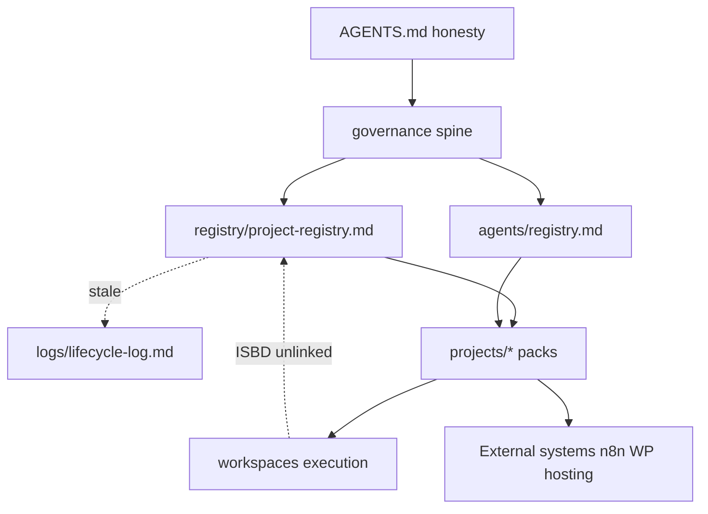

# MARS Ecosystem Integrity Census v1

**Date:** 2026-06-03  
**Lane:** B  
**Mode:** Read-only inventory — **no fixes, no archive, no delete, no registry edits**  
**Baseline:** MARS v2 Stable Baseline 2026-06 (`45518bb`, tag `mars-v2-stable-baseline-2026-06`; evidence `c2876cf`)

**Supporting evidence:**

- [README.md](README.md) — cleanup program structure  
- [discoveries/2026-06-03-ecosystem-census-discoveries-v1.md](discoveries/2026-06-03-ecosystem-census-discoveries-v1.md)  
- [actions/2026-06-03-ecosystem-census-proposed-actions-v1.md](actions/2026-06-03-ecosystem-census-proposed-actions-v1.md)  
- [archive-candidates/2026-06-03-census-archive-candidates-v1.md](archive-candidates/2026-06-03-census-archive-candidates-v1.md)

---

# REPORT — MARS Ecosystem Integrity Census v1

## Systems discovered

### A. Registered programs (`registry/project-registry.md`)

| project_id | Status | Primary pack |
|------------|--------|--------------|
| `orca` | active | `projects/orca/` |
| `mig` | active | `projects/mig/` |
| `ocpilot` | active | `projects/ocpilot/` |
| `ear-runtime` | active (engineering) | `projects/ear-runtime/` |
| `mars-survivability` | active | `projects/mars-survivability/` |
| `wpilot` | active | `projects/wpilot/` |
| `metabot-seo-content-agent` | active | `projects/metabot-seo-content-agent/` |
| `mars-website-factory` | planned (strategic) | `projects/mars-website-factory/` |
| `triumph-manipulator-landing` | planned | `projects/triumph-manipulator-landing/` |
| `nova` | planned (foundation) | `projects/nova/` |
| `homegateway-v4-ai` | planned | `projects/homegateway-v4-ai/` |
| `seo-content-agent` | planned (legacy) | `projects/seo-content-agent/` |
| `mars-core` | planned (example row) | — |

### B. Cross-cutting / non-project systems (documented)

| System | Canonical surface | Bucket (baseline) |
|--------|-------------------|-------------------|
| Governance spine | `governance/` | operational (maintenance) |
| MARS Core contracts | `control-plane/`, `workflows/`, `interfaces/`, `security/`, `memory/`, `observability/`, `evaluation/`, `storage/`, `models/`, `integrations/` | conceptual + doc |
| IdeaBox / Continuity | `continuity/` | operational discipline |
| MARS Forge | `agents/mars-forge/` | operational_doc_pack |
| Gulp Frontend Agent | `agents/frontend-gulp-agent/` | operational_doc_pack |
| GitGuard (concept) | survivability registries + entity model | conceptual / SAFE UNKNOWN |
| mars-runtime R1 | `mars-runtime/` | experimental |
| Knowledge Center / Visual Brain | out-of-git KC + `docs/visualization/obsidian-canvas/` | operational (operator) |
| EAR Architecture (frozen) | `shared/external-access-runtime/` | conceptual / frozen |
| Tool helpers | `tools/` (governance-scanner, registry-checker, markdown-link-validator) | local / human-invoked |
| MARS Bridge (stub) | `incoming/mars-bridge/` | experimental stub |

### C. Execution loci (not programs)

| Locus | Contents |
|-------|----------|
| `workspaces/` | Triumph v1–v6, `website-factory-reference-v1`, `isbd-care-landing`, `homegateway-v4-ai`, hygiene dirs (`_sandbox`, `_quarantine`, …) |
| `incoming/` | metabot exports, mig drop, mars-bridge, orca raw pack, legal cleanup extracts |
| `archive/` | `orca-lrl-foundation-v1` |

### D. Agent catalog (`agents/registry.md`)

- **Operational doc packs:** `gulp_frontend_agent`, `mars_forge_frontend_agent` (+ §4 summary rows).  
- **Website Factory planned agents:** 16 `agent_id` rows with cards under `agents/cards/` (18 card files).  
- **Core planned roles:** Agent Builder, Validator, Memory, Research, Coding, Documentation (no implementation).

---

## Unregistered entities

Entities with **in-repo evidence** but **no** `project_id` in `registry/project-registry.md` (or explicit exclusion):

| Entity | Evidence | Notes |
|--------|----------|-------|
| **ISBD Care Landing** | `workspaces/isbd-care-landing/` | Active Gulp landing; ~8k+ files incl. nested `.git` |
| **IdeaBox** | `continuity/` | Intentionally excluded (documented) |
| **GitGuard** | Survivability + entity model | No `projects/gitguard/` |
| **MARS Bridge** | `incoming/mars-bridge/` | Stub workflow only |
| **Knowledge Center** | Operator path + baseline doc | Out of git |
| **Incoming packs** | `incoming/*` | Intake, not registered |
| **WPilot agent roles** | `projects/wpilot/README.md` | Candidates not in agent registry |
| **Integration instances** | — | `integrations/integration-registry-v0.md` has **no** data rows |
| **MARS Core** | Contract folders | Not a single registry row (by design) |

**In maturity / topology maps but weak registry linkage:** ISBD (canvas SAFE UNKNOWN only); MARS Bridge (cited from MIG docs only).

---

## Classification conflicts

| Conflict | Details |
|----------|---------|
| **Program vs execution case** | `triumph-manipulator-landing` is one registry row; six Triumph workspaces + ORCA nested `triumph-manipulator-krasnodar` imply multiple execution cases. |
| **ISBD: system vs case** | Substantial workspace delivery; governance silent — canvas says SAFE UNKNOWN. |
| **HomeGateway: planned vs OPERATIONAL** | Registry column `planned`; boundary prose says **OPERATIONAL** documentation. |
| **Website Factory: planned vs operational methodology** | Registry `planned`; reality/maturity maps call methodology **operational**. |
| **GitGuard: Program example vs survivability contract** | `system-entity-model.md` lists GitGuard as Program; survivability/README denies GitGuard **product**. |
| **Operational vs historical** | `seo-content-agent` still `planned` in registry vs **legacy** narrative; live work must use metabot id. |
| **Structural audit staleness** | `mars-v2-structural-coherence-audit-v0.md` claims WPilot missing from registry — **false** vs current registry (2026-06-02 row). |

---

## Duplicate entities

| Cluster | Instances | Risk |
|---------|-----------|------|
| SEO / MetaBOT lineage | `seo-content-agent`, `metabot-seo-content-agent`, R1 adapter filename, incoming JSON, mars-bridge stub | Wrong SoT for execution truth (n8n external) |
| Triumph | Factory pack, reference case, ORCA ppc tree, ORCA nested project, workspaces ×6 | Version and authority drift |
| Registry “kinds” | `registry/project-registry.md`, `agents/registry.md`, `tools/registry.md`, `mars-runtime/runtime/tool-registry.js`, pack-local registries (Factory, ORCA, WF reference) | Collapsed into one imaginary registry |
| MIG n8n export | Live `projects/mig/workflows/` vs `archive/.../mig-project/workflows/` | Duplicate spine artefacts |
| ORCA stable snapshots | `freeze/` + `archive/stable-orca-after-triumph-battle-v1/` | Parallel “stable” trees |
| Factory blocks | `projects/mars-website-factory/block-registry-v0.md` vs `workspaces/website-factory-reference-v1/block-registry/` | Schema drift |

**No merge performed** per charter.

---

## Pilot / prototype review

| Signal | Examples | Classification |
|--------|----------|----------------|
| **Active** | ORCA `live-pilot/`, `live-pilots/`, `pilot-cases/`; MIG v0.1 spine; `ear-runtime` R1 code | Human-supervised operational pilots |
| **Experimental** | `mars-runtime/**/*.js`; `incoming/`; `workspaces/_sandbox`; HomeGateway MVP tools; docx-pilot exporter | Bounded probes |
| **Historical** | `projects/mig/archive/pre-pilot-*`; `web-gpt-sources/`; `seo-content-agent/`; `archive/orca-lrl-foundation-v1/` | Do-not-extend / import |
| **Archive candidate** | Old Triumph workspace versions; ORCA archive trees; raw incoming packs | See [archive-candidates](archive-candidates/2026-06-03-census-archive-candidates-v1.md) |

---

## Orphaned entities

| Type | Example |
|------|---------|
| **Implementation, no registration** | `workspaces/isbd-care-landing/` |
| **Registration, weak implementation proof** | `mars-core` example row; many Factory agents `planned` only |
| **Documentation, no owner** | ISBD (no owner in registry); empty `continuity/registry/master-index.md` |
| **Owner/id, stale references** | Lifecycle log behind registry (no evt for mig/ocpilot/ear/survivability/nova/homegateway band) |
| **Cards without active role** | Most Website Factory agent cards = planned |
| **Concept without pack** | GitGuard Program taxonomy vs no `projects/gitguard/` |

---

## Relationship integrity review

**Broken / outdated / one-way (identified):**

- Registry → lifecycle: **one-way** (registry newer than log).  
- ISBD workspace → Factory/registry: **missing**.  
- KC ↔ git canvas: **manual** sync only.  
- MetaBOT: repo docs ↔ live n8n — **external SoT**, sync UNKNOWN.  
- Triumph multi-workspace → single `project_id`: **no version map**.  
- Structural coherence audit → registry: **outdated** WPilot claim.

---

## ISBD review

| Dimension | Finding |
|-----------|---------|
| **Current classification** | De facto **Website Factory execution case** (Gulp landing, content freeze, WP integration target); **not** classified in governance docs |
| **Current ownership** | **SAFE UNKNOWN** — no registry row or agent assignment |
| **Website Factory relationship** | Same production lane patterns as Triumph (gulp, sections, archives); **no** explicit Factory doc reference to ISBD |
| **Registry status** | **Unregistered** |
| **Maturity status** | Active client workspace (V2 polish; content frozen per `docs/content-lock-v1.md`) |
| **Inconsistencies** | Canvas placeholder “no ISBD execution case”; workspace contradicts. Nested `.git` inside monorepo workspace — boundary risk. Not in baseline checkpoint scope (workspaces WIP excluded). |

**Proposed (not executed):** REGISTER as execution case or `project_id`; RECLASSIFY in topology + canvas (actions A-007, A-008, A-027).

---

## Archive candidates

Listed in [archive-candidates/2026-06-03-census-archive-candidates-v1.md](archive-candidates/2026-06-03-census-archive-candidates-v1.md) (11 entries). **No archival action taken.**

---

## Proposed actions

30 proposed actions in [actions/2026-06-03-ecosystem-census-proposed-actions-v1.md](actions/2026-06-03-ecosystem-census-proposed-actions-v1.md). Summary counts:

| Action | Count |
|--------|------:|
| KEEP | 8 |
| RECLASSIFY | 6 |
| REGISTER | 4 |
| ARCHIVE | 5 |
| MERGE | 1 |
| INVESTIGATE | 10 |

---

## Evidence created

| File | Purpose |
|------|---------|
| `logs/cleanup/README.md` | Cleanup program charter |
| `logs/cleanup/discoveries/2026-06-03-ecosystem-census-discoveries-v1.md` | Distilled findings D-001–D-010 |
| `logs/cleanup/actions/2026-06-03-ecosystem-census-proposed-actions-v1.md` | Action candidates A-001–A-030 |
| `logs/cleanup/archive-candidates/2026-06-03-census-archive-candidates-v1.md` | AC-01–AC-11 |
| `logs/cleanup/MARS-ECOSYSTEM-INTEGRITY-CENSUS-v1.md` | This canonical report |

Empty dirs reserved: `reclassifications/`, `fixes/` (no pass-1 writes).

---

## Risks

1. **Silent client work** — ISBD-scale workspace outside registry invites wrong lane assumptions.  
2. **Lifecycle / registry desync** — Undermines audit chronology (evt stops at 0016).  
3. **Triumph version sprawl** — Six workspace folders; wrong rollback target.  
4. **MetaBOT / legacy id confusion** — Adapter and bridge still say `seo-content-agent`.  
5. **Registry mythology** — “Planned” program + “operational” methodology read as shipped factory.  
6. **Nested git in workspace** — `isbd-care-landing/.git` complicates survivability and backup scope.  
7. **Incoming folder growth** — Unreviewed JSON/docx without intake SOP.  
8. **Stale governance audits** — Operators may trust outdated coherence audit over registry.  
9. **Out-of-git KC** — Operator navigation diverges from git SoT without discipline.  
10. **Archive duplicate trees (ORCA)** — Editors may patch wrong copy.

---

## SAFE UNKNOWN

| Topic | Unknown | Would verify |
|-------|---------|--------------|
| KC folder population & sync | Which program cards exist on disk | Operator listing of `C:\AI MARS STORAGE\MARS KNOWLEDGE CENTER` |
| Cold Brain per-item state | Archive contents | Operator inventory |
| Live n8n graph ids vs `incoming/metabot/` | Export freshness | n8n UI + export dates |
| ISBD production URL / WP insertion | Deployment | Operator/hosting |
| Canonical Triumph workspace version | v6 vs base vs project pack pointer | Operator decision + registry note |
| `incoming/website-factory-legal-cleanup/` destiny | Promote to Factory legal registry or stay intake | Charter |
| HomeGateway implementation depth | MVP tools vs “draft only” | `projects/homegateway-v4-ai/` evidence review pass |
| GitGuard future `project_id` | Whether separate pack is intended | Governance decision |
| OCPilot/WPilot production bridge | Runtime ownership | External env + reconciliation maps |

---

## Workload estimate & recommended order

### 1. Estimated cleanup workload

| Tier | Scope | Effort (human) |
|------|--------|----------------|
| **S** | Lifecycle backfill 0017–0021; fix HomeGateway status prose; ISBD registry row + canvas node | 2–4 h |
| **M** | Triumph workspace authority map; incoming triage SOP; integration registry seed rows | 1–2 days |
| **L** | ORCA archive compression; Factory/reference registry alignment; web-gpt-sources historical marking | 3–5 days |
| **XL** | Full block-registry merge Factory ↔ reference-v1 | Charter + review gate |

**Total (full proposal set):** roughly **5–10 operator days** spread over multiple gated passes — not one session.

### 2. Recommended cleanup order

1. **Traceability fixes** — lifecycle append, HomeGateway status alignment, errata on stale structural audit.  
2. **ISBD registration** — highest drift between delivery and governance.  
3. **Triumph workspace canonicalization** — before any archive of v2–v5.  
4. **Incoming triage** — metabot, legal cleanup, raw orca pack.  
5. **Legacy band clarity** — seo-content-agent, web-gpt-sources, adapter rename plan.  
6. **Archive candidates** — ORCA/MIG/Triumph only after pointers frozen.  
7. **Registry depth** — integration rows, WPilot agent cards (if roles activate).  
8. **MERGE-class** — Factory block registry (last; highest blast radius).

### 3. Top 10 highest-value fixes

1. **Register or classify ISBD** (`workspaces/isbd-care-landing`) — closes largest unregistered delivery gap.  
2. **Append lifecycle events 0017–0021** — restores registry/log integrity.  
3. **Resolve HomeGateway `planned` vs OPERATIONAL prose** — stops classification conflict.  
4. **Publish Triumph workspace authority map** (one canonical path + archive candidates).  
5. **Mark `governance/mars-v2-structural-coherence-audit-v0.md` WPilot finding superseded** — prevents false audits.  
6. **ISBD / Factory canvas + topology update** — align Visual Brain with repo.  
7. **Incoming folder SOP + triage** — prevents silent growth.  
8. **Rename or document `seo-content-agent-adapter.js`** toward metabot canonical id.  
9. **Populate integration registry stub rows** (n8n, WordPress, Sheets) — clarifies external boundaries.  
10. **Decide GitGuard: survivability-only vs future `project_id`** — ends Program-taxonomy ambiguity.

---

*Census v1 complete — Lane B, read-only. No filesystem cleanup executed.*
