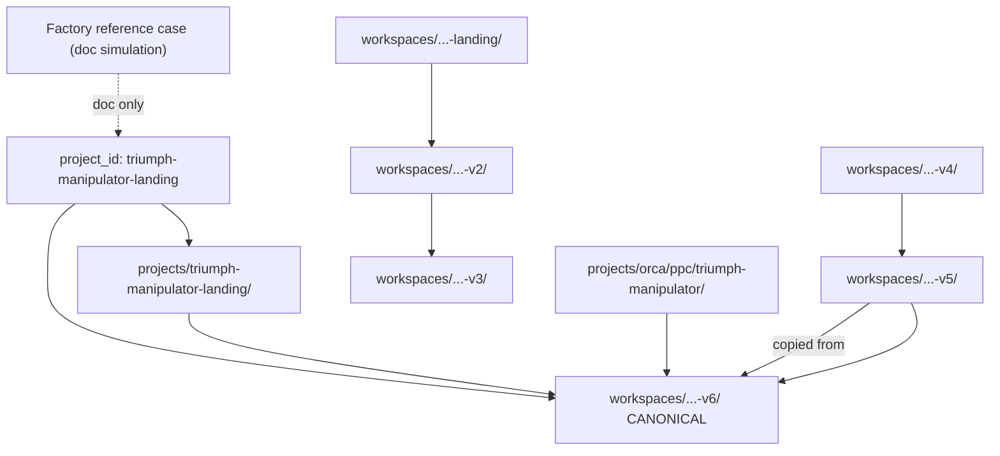

# Triumph Version Map v1

**Date:** 2026-06-03  
**Lane:** B — MARS Cleanup Wave 1  
**Mode:** Lineage discovery + recommendations (**no archive**, **no delete**)  
**Baseline:** MARS v2 Stable Baseline 2026-06 (`45518bb`)  
**Registry `project_id`:** `triumph-manipulator-landing` (single row; six workspace folders)

---

## Executive summary

| Question | Answer |
|----------|--------|
| **Canonical workspace** | **`workspaces/triumph-manipulator-landing-v6/`** — confirmed by V6 README, `frontend-workspace.md`, `V6-PRODUCTION-CANDIDATE-STATE.md`, production-candidate freeze report |
| **Canonical program pack** | `projects/triumph-manipulator-landing/` (governance + rules; not build sources) |
| **Archive candidates** | v1 (base), v2, v3, v4, v5 — **older generations**; v5 retains reference value until ORCA/calibration docs retargeted |
| **Drift** | ORCA calibration OPERATIONAL-INDEX still cites **v5** as canonical case workspace |

---

## Workspace inventory (filesystem)

Verified directories under `workspaces/` (2026-06-03):

| Directory | Version label | Present |
|-----------|---------------|---------|
| `triumph-manipulator-landing` | **v1 / base** | ✓ |
| `triumph-manipulator-landing-v2` | **v2** | ✓ |
| `triumph-manipulator-landing-v3` | **v3** | ✓ |
| `triumph-manipulator-landing-v4` | **v4** | ✓ |
| `triumph-manipulator-landing-v5` | **v5** | ✓ |
| `triumph-manipulator-landing-v6` | **v6** | ✓ |

**Additional Triumph-related loci (not version workspaces):**

| Path | Role |
|------|------|
| `projects/triumph-manipulator-landing/` | MARS project documentation pack |
| `projects/mars-website-factory/reference-cases/triumph-manipulator-landing/` | Factory **documentation-first** reference execution case (simulated run — not built site) |
| `projects/orca/ppc/triumph-manipulator/` | ORCA PPC semantic / export toolkit |
| `projects/orca/projects/triumph-manipulator-krasnodar/` | ORCA-scoped nested case container |
| `workspaces/_snapshots/snap-20260529-triumph-v6-production-candidate-v1/` | Filesystem freeze snapshot |
| `workspaces/_snapshots/snap-20260528-triumph-v5-mailer-mvp-final-stable/` | V5 recovery snapshot |

**No v7+ workspace** observed in-repo.

---

## Lineage table

| Version | Path | Purpose | Status | Evidence |
|---------|------|---------|--------|----------|
| **v1 (base)** | `workspaces/triumph-manipulator-landing/` | Initial Gulp starter / V1 landing; frozen at git tag `triumph-manipulator-v1` | **Historical** | v2 README cites V1 frozen; generic starter README + project pack links |
| **v2** | `workspaces/triumph-manipulator-landing-v2/` | V2 product intent — single-machine landing; design system + Forge rules | **Historical** | V2 README; `V2-FRONTEND-SOURCE-OF-TRUTH.md` references |
| **v3** | `workspaces/triumph-manipulator-landing-v3/` | Clean Forge rebuild from V1 source authority | **Abandoned / prep-only** | README: *"Initialization and execution readiness only"* — no rebuild proof |
| **v4** | `workspaces/triumph-manipulator-landing-v4/` | Reset-plan boundary for future reconstruction | **Stale / planning residue** | `docs/V4-RESET-PLAN.md` — planning only; no root README |
| **v5** | `workspaces/triumph-manipulator-landing-v5/` | Index-only baseline; mailer MVP final; operator visual QA checkpoint | **Historical stable reference** | v5 README; v6 README: *"Historical stable source (mailer MVP final)"* |
| **v6** | `workspaces/triumph-manipulator-landing-v6/` | **Active multi-page PPC rollout** (12 routes); production candidate | **Canonical** | v6 README; `V6-PRODUCTION-CANDIDATE-STATE.md`; freeze report 2026-05-29; `frontend-workspace.md` points here |

---

## Canonical workspace verification

| Authority surface | Statement |
|-------------------|-----------|
| `workspaces/triumph-manipulator-landing-v6/README.md` | *"Canonical production base for multi-page PPC rollout"* |
| `projects/triumph-manipulator-landing/frontend-workspace.md` | Recommended path: **`triumph-manipulator-landing-v6`** (2026-05-28) |
| `projects/triumph-manipulator-landing/V6-PRODUCTION-CANDIDATE-STATE.md` | Status: **Production candidate**; 12 routes complete; mailer wired |
| `workspaces/triumph-manipulator-landing-v6/reports/v6-production-candidate-freeze-report-v1.md` | Build QA PASS; snapshot created |
| Maturity map (`08_SYSTEM_MATURITY_MAP.md`) | Triumph programme: **operational delivery (workspace)** |

**Expected v6 canonical:** **Confirmed** with multi-source agreement.

**Exception / drift:** `projects/orca/calibration/OPERATIONAL-INDEX.md` still lists `workspaces/triumph-manipulator-landing-v5/` as v5 implementation path and canonical case workspace reference — **stale vs v6**.

---

## Version → program relationship

---

## Per-version recommendation

| Version | Recommendation | Wave |
|---------|----------------|------|
| **v6** | **KEEP** — canonical edit surface | — |
| **v5** | **KEEP** (short term) → **ARCHIVE CANDIDATE** after ORCA/calibration docs retarget to v6 | Wave 2 |
| **v4** | **ARCHIVE CANDIDATE** — reset-plan residue | Wave 2 |
| **v3** | **ARCHIVE CANDIDATE** — init-only, no delivery | Wave 2 |
| **v2** | **ARCHIVE CANDIDATE** — superseded design generation | Wave 2 |
| **v1 (base)** | **ARCHIVE CANDIDATE** — tag-pinned historical (`triumph-manipulator-v1`) | Wave 2 |
| **Snapshots** | **KEEP** until archive policy for `_snapshots/` | INVESTIGATE |
| **ORCA calibration index** | **RECLASSIFY** paths v5 → v6 | Wave 2 |
| **Factory reference case** | **KEEP** — distinct doc-simulation layer | — |

**No archival action in Wave 1.**

---

## Archive candidates summary

| ID | Path | Class | Rationale |
|----|------|-------|-----------|
| TM-AC-01 | `workspaces/triumph-manipulator-landing/` | Historical | V1 frozen; tag `triumph-manipulator-v1` |
| TM-AC-02 | `workspaces/triumph-manipulator-landing-v2/` | Historical | Superseded by v5/v6 line |
| TM-AC-03 | `workspaces/triumph-manipulator-landing-v3/` | Abandoned prep | No rebuild completion |
| TM-AC-04 | `workspaces/triumph-manipulator-landing-v4/` | Stale planning | V4 reset plan only |
| TM-AC-05 | `workspaces/triumph-manipulator-landing-v5/` | Historical reference | Superseded by v6; keep until doc drift fixed |
| TM-AC-06 | `workspaces/_snapshots/snap-*-triumph-*` | Ops hygiene | Retention policy TBD |

Aligns with census AC-07, AC-08.

---

## SAFE UNKNOWN

| Topic | Note |
|-------|------|
| Live production URL vs v6 build | External hosting |
| Whether v3 battle-test will resume | Operator charter |
| Git tags for v5/v6 beyond v1 tag | Not fully audited |

---

*Triumph version map v1 — Wave 1 evidence only.*
