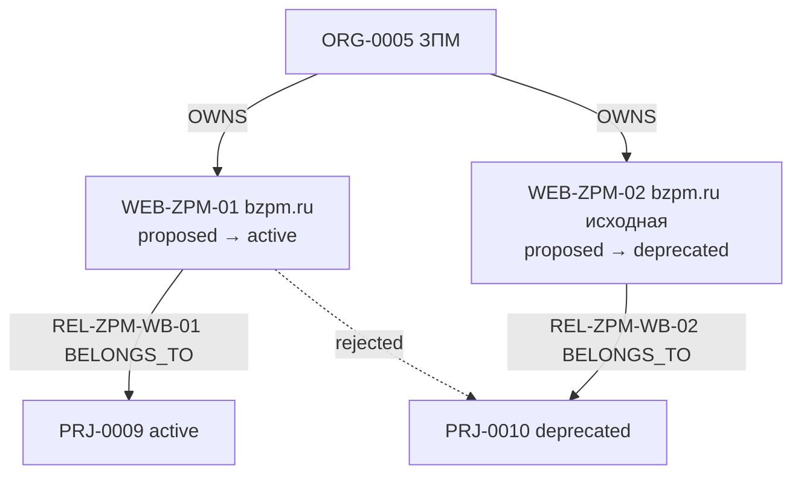
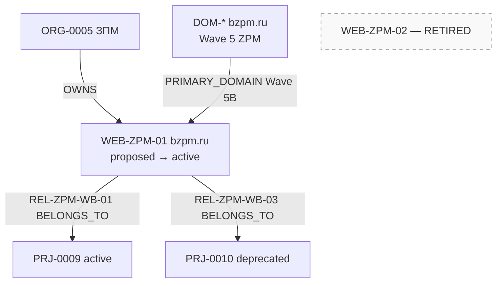

# ATLAS ZPM Website Model Correction Summary v1

**Status:** **executed**  
**Program:** ATLAS — Business Reality Registry  
**Date:** 2026-06-07  
**Parent:** [ATLAS-ZPM-WEBSITE-MODEL-CORRECTION-EXECUTION-v1.md](ATLAS-ZPM-WEBSITE-MODEL-CORRECTION-EXECUTION-v1.md) · [ATLAS-ZPM-WEBSITE-MODEL-CORRECTION-REGISTER-v1.md](ATLAS-ZPM-WEBSITE-MODEL-CORRECTION-REGISTER-v1.md)

---

# REPORT — ATLAS ZPM Website Model Correction Summary

**Summary date:** 2026-06-07  
**Operator decision:** PASS WITH CORRECTION  
**Execution layer:** Population documentation — Foundation unchanged.

---

## 1. Executive summary

Коррекция ZPM Website Model **выполнена** на уровне population layer. Модель приведена к операторскому канону и attested precedent Triumph:

- **Один hostname** `bzpm.ru` → **один Website** (WEB-ZPM-01)
- **Исторические поколения доставки** → **Projects** (PRJ-0010), не отдельные Website
- **WEB-ZPM-02** снят с population — не mint, не attest, не promote
- **Wave 4B queue** обновлена: REL-ZPM-WB-01 сохранён; REL-ZPM-WB-02 отменён; REL-ZPM-WB-03 создан

---

## 2. Corrections executed (12/12)

| # | Action | Target |
|---|--------|--------|
| 1 | Retire entity | WEB-ZPM-02 |
| 2 | Revoke policy | ZPM-WEB-POL-01 (dual-generation Website) |
| 3 | Adopt single-property model | WEB-ZPM-01 |
| 4 | Re-route evidence | EV-ZPM-OP-HIST-01 → PRJ-0010 |
| 5 | Block attestation | AT-W4-ZPM-02 |
| 6 | Cancel relationship | REL-ZPM-WB-02 |
| 7 | Queue relationship | REL-ZPM-WB-03 |
| 8 | Retain relationship | REL-ZPM-WB-01 |
| 9 | Simplify OWNS | ORG-0005 → WEB-ZPM-01 only |
| 10 | Resolve SAFE UNKNOWN | SU-W4-ZPM-03 (PRIMARY_DOMAIN) |
| 11 | Reopen duplicate review | ZPM-WEB-D-01 → Fail |
| 12 | Clarify EFV-03 | Project layer only |

---

## 3. Entities affected

| Entity | Action |
|--------|--------|
| **WEB-ZPM-01** `bzpm.ru` | **Keep** — единственный Website |
| **WEB-ZPM-02** `bzpm.ru (исходная версия)` | **Retire** |
| **PRJ-0009** | **Unchanged** — active |
| **PRJ-0010** | **Unchanged** — deprecated |
| **ORG-0005** ЗПМ | **Unchanged** — active |

---

## 4. Relationships affected

| rel_id | Action |
|--------|--------|
| REL-ZPM-WB-01 | **Keep** — WEB-ZPM-01 → PRJ-0009 BELONGS_TO |
| REL-ZPM-WB-02 | **Remove** — cancelled |
| REL-ZPM-WB-03 | **Create** — WEB-ZPM-01 → PRJ-0010 BELONGS_TO |

---

## 5. Graph before



---

## 6. Graph after



---

## 7. Impact assessment

| Dimension | Before | After | Risk |
|-----------|--------|-------|------|
| Website count (ZPM) | 2 | 1 | **None** — pre-attestation |
| Attestation tranches | 2 | 1 | **Reduced complexity** |
| Wave 4B edges | 2 (1:1 generation map) | 2 (multi-Project on one Website) | **Aligned with Triumph** |
| Wave 5B PRIMARY_DOMAIN | Ambiguous | Singleton | **Resolved** |
| Project / Org layers | 2 Projects, 1 Org | Unchanged | **None** |
| Foundation | — | No amendment | **None** |

**Deferred (non-blocking):** Backup Snapshot refresh; Integrity Snapshot COR note on next sync pass.

---

## 8. Foundation consistency

| Check | Verdict |
|-------|---------|
| EIR-W01 one property per hostname | **Pass** |
| Website vs Project class separation | **Pass** |
| Triumph REL-0027/0028 multi-BELONGS_TO | **Pass** |
| EIR-D01 + PRIMARY_DOMAIN singleton | **Pass** |
| No new entity classes | **Pass** |
| No Foundation amendment | **Pass** |

---

## 9. Cross-wave validation summary

| Wave | Result |
|------|--------|
| Wave 3 ZPM | **Pass** — no change |
| Wave 3B ZPM | **Pass** — no change |
| Wave 4 ZPM | **Pass** — docs synced |
| Wave 4B ZPM | **Pass** — queue ready |
| Wave 5 ZPM | **Pass** — DOM plan unambiguous |
| Wave 5B ZPM | **Pass** — PRIMARY_DOMAIN resolved |
| Backup Snapshot | **Pass** — WEB-ZPM not yet in baseline |
| Integrity Snapshot | **Pass** — pre–Wave 4 ZPM consistent |
| Relationship graph | **Pass** — no attested ZPM Website edges yet |

---

## 10. Final verdict

```text
ZPM WEBSITE MODEL CORRECTION COMPLETE

READY FOR WAVE 4B ZPM WEBSITE RELATIONSHIPS
```

**Authorized next steps:**

1. Execute **AT-W4-ZPM-01** — WEB-ZPM-01 → **active**
2. Wave 4B-ZPM population — **REL-ZPM-WB-01** + **REL-ZPM-WB-03**
3. Wave 5 ZPM — mint DOM-* `bzpm.ru`; Wave 5B — PRIMARY_DOMAIN → WEB-ZPM-01

**Blocked:**

- AT-W4-ZPM-02 (WEB-ZPM-02)
- REL-ZPM-WB-02
- ORG-0005 OWNS WEB-ZPM-02

---

## 11. Document index

| Document | Role |
|----------|------|
| [ATLAS-ZPM-WEBSITE-MODEL-AUDIT-v1.md](ATLAS-ZPM-WEBSITE-MODEL-AUDIT-v1.md) | Audit findings |
| [ATLAS-ZPM-WEBSITE-MODEL-CORRECTION-v1.md](ATLAS-ZPM-WEBSITE-MODEL-CORRECTION-v1.md) | Correction spec |
| [ATLAS-ZPM-WEBSITE-MODEL-DECISION-v1.md](ATLAS-ZPM-WEBSITE-MODEL-DECISION-v1.md) | Operator decision |
| [ATLAS-ZPM-WEBSITE-MODEL-CORRECTION-EXECUTION-v1.md](ATLAS-ZPM-WEBSITE-MODEL-CORRECTION-EXECUTION-v1.md) | Full execution record |
| [ATLAS-ZPM-WEBSITE-MODEL-CORRECTION-REGISTER-v1.md](ATLAS-ZPM-WEBSITE-MODEL-CORRECTION-REGISTER-v1.md) | Action register |
| [ATLAS-WAVE4-ZPM-WEBSITE-POPULATION-v1.md](ATLAS-WAVE4-ZPM-WEBSITE-POPULATION-v1.md) | Synced population |
| [ATLAS-WAVE4-ZPM-WEBSITE-REGISTER-v1.md](ATLAS-WAVE4-ZPM-WEBSITE-REGISTER-v1.md) | Synced register |
| [ATLAS-WAVE4-ZPM-WEBSITE-ATTESTATION-v1.md](ATLAS-WAVE4-ZPM-WEBSITE-ATTESTATION-v1.md) | Synced attestation plan |

---

*ATLAS ZPM Website Model Correction Summary v1 — executed 2026-06-07.*
