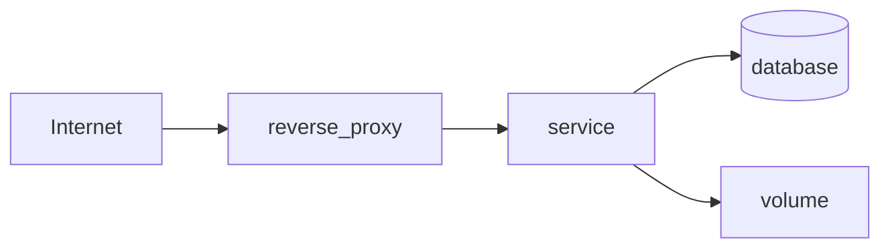

# MARS Server Ops — Service Map v1

**Status:** **reusable relationship model** — documentation-first  
**Not:** live topology diagram or discovered network map

---

## 1. Purpose

Define how to document **service relationships** on a server or small cluster: exposure, dependencies, backups, and ownership — without inventing production topology in Phase 1A.

---

## 2. Relationship chain

Document each logical service using this chain (fill what applies; mark rest **SAFE UNKNOWN**):

```text
server (inventory_ref)
  → service (name + role)
    → exposed_ports / surface (sanitized — avoid raw secrets)
      → domain (public hostname)
        → reverse_proxy (route / upstream)
          → database (engine + instance ref)
            → volume / storage (path class or Storage ref)
              → consumer (programme or product)
                → backup_dependency (class + manifest ref)
                  → healthcheck (method + frequency)
                    → owner_of_truth (programme or operator)
```

---

## 3. Entity definitions

| Entity | Description | Git-safe content |
|--------|-------------|------------------|
| **server** | `inventory_ref` from [SERVER-INVENTORY-v1.md](SERVER-INVENTORY-v1.md) | Label, role, criticality |
| **service** | Process, container, or daemon | Name, version class, config ref (sanitized) |
| **exposed_ports/surface** | What is reachable | Port numbers optional — policy TBD; prefer "443 via proxy" |
| **domain** | Public DNS name | Sanitized FQDN |
| **reverse_proxy** | nginx, Caddy, Traefik, etc. | Route name, upstream label — not full config |
| **database** | PostgreSQL, MySQL, etc. | Instance name — no credentials |
| **volume/storage** | Docker volume, bind mount, Storage path | Path class or `storage_ref` |
| **consumer** | MetaBOT, n8n workflow, site, etc. | Programme name |
| **backup_dependency** | What must be backed up with this service | Link to backup class |
| **healthcheck** | HTTP, TCP, script — documented only | Not automated in Phase 1A |
| **owner_of_truth** | Who owns config/content | Operator or programme |

---

## 4. Example schema (empty — no real topology)

### Service entry template

```yaml
# EXAMPLE SCHEMA ONLY — not factual
server_ref: SRV-OPS-XXX
service_name: example-service
service_role: app | proxy | db | vpn | automation
exposed_surface: "443 public via reverse proxy"
domain: example.example.com
reverse_proxy: nginx → upstream example-service:8080
database: postgres/example_db (ref only)
volume_storage: storage_ref:mars-server-ops/backups/...
consumer: MetaBOT | n8n | NONE
backup_dependency: CLASS-B-service-data
healthcheck: GET /health — manual
owner_of_truth: operator | programme-name
safe_unknown:
  - internal_port
  - exact_volume_path
evidence_refs: []
```

---

## 5. Diagram convention (optional)

When documenting in Phase 1B+, prefer tabular or mermaid **only from verified facts**:



Do not publish diagrams with unverified nodes.

---

## 6. Boundaries

| Rule | Detail |
|------|--------|
| **No auto-discovery** | Maps are human-maintained |
| **EAR separation** | EAR snapshots may **inform** maps; Server Ops map is not EAR output |
| **MLI separation** | Local `.test` / Laragon services belong in MLI, not Server Ops |
| **Change control** | Map updates after verified change + REPORT |

---

## 7. Related documents

- [SERVER-INVENTORY-v1.md](SERVER-INVENTORY-v1.md)  
- [VPS-PASSPORT-v1.md](VPS-PASSPORT-v1.md)  
- [BACKUP-RESTORE-MODEL-v1.md](BACKUP-RESTORE-MODEL-v1.md)  
- [ACCESS-MODEL-v1.md](ACCESS-MODEL-v1.md)  

---

*Service Map v1 · model only · Phase 1A.*
