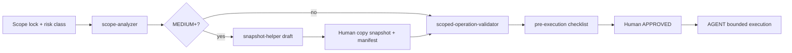

# MARS Survivability — Operational Index

**Status:** **documented** — navigation hub for G0–G4 operational survivability layer.  
**Not:** runtime orchestration index, automated router, or enforcement dashboard.

**Lane:** B (Survivability / Operational Hardening)  
**Domain root:** [README.md](README.md)  
**Quick start:** [QUICKSTART.md](QUICKSTART.md)  
**Stabilization baseline:** [reports/s1-stabilization-checkpoint-v1.md](reports/s1-stabilization-checkpoint-v1.md)

---

## X-Drive Root Authority (X0–X9)

| Item | Status |
|------|--------|
| **X-Drive Root Authority** | **ACTIVE** |
| **Canonical volume** | **AI WS** / `X:` |
| **Canonical roots** | `X:\AI MARS\`, `X:\AI MARS STORAGE\`, `X:\MARS-Localhost\` |
| **Migration state** | **X0–X9 COMPLETE** — **MARS X-Drive Migration CLOSED** |

**Enforcement honesty (unchanged):** validator **human-invoked**; automatic interception **not implemented**; reparse protection **partial**; volume label precheck **manual**.

**Authority document:** [governance/mars-x-drive-root-authority-v1.md](../../governance/mars-x-drive-root-authority-v1.md)

---

## Canonical reading order

Use this order for **first-time** Lane B operators or post-incident orientation:

| Step | Document | Why |
|------|----------|-----|
| 1 | [QUICKSTART.md](QUICKSTART.md) | Practical flows without governance waterfall |
| 2 | [guardrails/cursor-operational-safety-rules-v1.md](guardrails/cursor-operational-safety-rules-v1.md) | Non-negotiable AGENT safety rules |
| 3 | [contracts/agent-operation-risk-classes-v1.md](contracts/agent-operation-risk-classes-v1.md) | SAFE → FORBIDDEN taxonomy |
| 4 | [templates/safe-agent-task-template-v1.md](templates/safe-agent-task-template-v1.md) | Scope lock for every AGENT task |
| 5 | [registries/protected-zones-registry-v1.md](registries/protected-zones-registry-v1.md) | P0–P3 path tiers |
| 6 | [protocols/operational-halt-protocol-v1.md](protocols/operational-halt-protocol-v1.md) | When to stop |
| 7 | [registries/gitguard-system-entry-v1.md](registries/gitguard-system-entry-v1.md) | GitGuard positioning (advisory only) |
| 8 | This index — tool sections below | Validator, helpers, observability |

**Drill evidence (optional):** [reports/d01-operational-drill-assessment-v1.md](reports/d01-operational-drill-assessment-v1.md) → [reports/d02-survivability-readiness-v1.md](reports/d02-survivability-readiness-v1.md)

**Terminology:** [contracts/survivability-terminology-freeze-v1.md](contracts/survivability-terminology-freeze-v1.md)

---

## G0 → G4 evolution map

| Phase | Name | Delivered | Operator meaning |
|-------|------|-----------|------------------|
| **G0** | Awareness & infrastructure | Contracts, protected zones, infra folders, snapshot standard, guardrails | Know where snapshots/quarantine live; refuse destructive ops by default |
| **G1** | Validation & enforcement docs | Halt/drift protocols, enforcement registry, checklists, prompt library, Factory enforcement | Documented stop conditions; human-enforced FORBIDDEN list |
| **G2** | Pre-execution validator | `scoped-operation-validator-v1.mjs` + rules JSON | Manual CLI check before shell — **no** auto-block |
| **G3** | Advisory helpers | snapshot-helper, scope-analyzer, diff/rollback advisors, human authority | Assists operator **before** risky work — **no** auto snapshot/copy |
| **G4** | Observability & drift | manifest cross-validator, drift linter, diff-report-helper, integrity checker, log format | Read-only signals after work — **no** auto-fix |
| **G5+** | Chartered only | Hooks (suggest-only), rollback-map CLI validator, scheduled snapshots | **Not** baseline — requires explicit human charter |

**Drills:** D-01 validated G0–G4 tooling in sandbox; D-02 validated human-operated restore.

---

## Quick-start operator flow

Before any **AGENT** task with filesystem or git impact:

1. Read [guardrails/cursor-operational-safety-rules-v1.md](guardrails/cursor-operational-safety-rules-v1.md)  
2. Paste [templates/safe-agent-task-template-v1.md](templates/safe-agent-task-template-v1.md) — fill all sections  
3. Classify work: [contracts/agent-operation-risk-classes-v1.md](contracts/agent-operation-risk-classes-v1.md)  
4. If **MEDIUM RISK** or higher → snapshot per [protocols/snapshot-manifest-standard-v1.md](protocols/snapshot-manifest-standard-v1.md)  
5. Check path tier: [registries/protected-zones-registry-v1.md](registries/protected-zones-registry-v1.md)  
6. On workspace failure → [protocols/workspace-quarantine-protocol-v1.md](protocols/workspace-quarantine-protocol-v1.md) — **no fix-on-top**

**Default:** refuse destructive ops; report **SAFE UNKNOWN** when evidence missing.

---

## Core operational flows

### Pre-agent flow (MEDIUM+ risk)

### Validator flow

1. Classify risk → list intended shell commands.  
2. `cd projects/mars-survivability/tools/validator/`  
3. Run `scoped-operation-validator-v1.mjs` with command string + scope paths.  
4. Interpret `ALLOW | DENY | NEED_HUMAN` — record per [validator-report-format-v1.md](tools/validator/validator-report-format-v1.md).  
5. **DENY** or ambiguous → [operational-halt-protocol-v1.md](protocols/operational-halt-protocol-v1.md).  
6. Safe testing: [validator-operational-test-protocol-v1.md](protocols/validator-operational-test-protocol-v1.md) — `_sandbox/` only.

### Snapshot flow

1. **snapshot-helper** → suggested name + manifest draft.  
2. Human copies scope paths to `workspaces/_snapshots/<id>/`.  
3. Complete `SNAPSHOT-MANIFEST.md` per [snapshot-manifest-standard-v1.md](protocols/snapshot-manifest-standard-v1.md).  
4. Optional: **manifest-cross-validator** + **snapshot-integrity-checker** (G4).  
5. Record snapshot id in task header.

### Rollback flow

1. **Stop** all AGENT sessions on affected tree.  
2. Read [tools/helpers/rollback-advisor-v1.md](tools/helpers/rollback-advisor-v1.md).  
3. Locate snapshot + git ref; prefer **restore-to-new-workspace** over in-place repair.  
4. Human executes restore (git checkout or copy from snapshot).  
5. **diff-report-helper** + diff advisor post-review.  
6. Append entry to `logs/rollback-history/`.  
7. If contamination suspected → [workspace-quarantine-protocol-v1.md](protocols/workspace-quarantine-protocol-v1.md).

**D-02 evidence:** [reports/d02-human-operated-restore-review-v1.md](reports/d02-human-operated-restore-review-v1.md), logs under `logs/rollback-history/`.

### Post-task observability flow

1. `git diff --stat` → **diff-report-helper**.  
2. If snapshot used → **manifest-cross-validator** + **snapshot-integrity-checker**.  
3. Optional → **registry-drift-linter** after registry edits.  
4. Append operational log per [operational-log-format-v1.md](protocols/operational-log-format-v1.md).

### Drill flow

1. [protocols/recovery-drill-protocol-v1.md](protocols/recovery-drill-protocol-v1.md)  
2. Execute only in `_sandbox/` or disposable drill workspaces.  
3. Log to `logs/survivability/`; assessment in `reports/`.  
4. **D-01:** [reports/d01-operational-drill-assessment-v1.md](reports/d01-operational-drill-assessment-v1.md) + `logs/survivability/d01-*`  
5. **D-02:** [reports/d02-survivability-readiness-v1.md](reports/d02-survivability-readiness-v1.md) + `logs/survivability/d02-*`

---

## Emergency references

| Situation | Go to |
|-----------|-------|
| Agent ran destructive command | [operational-halt-protocol-v1.md](protocols/operational-halt-protocol-v1.md) → quarantine → rollback advisor |
| Context drift / wrong workspace | [chat-context-drift-protocol-v1.md](protocols/chat-context-drift-protocol-v1.md) — **new chat** |
| Workspace corrupted | [workspace-quarantine-protocol-v1.md](protocols/workspace-quarantine-protocol-v1.md) — **no fix-on-top** |
| Missing snapshot / unknown state | Report **SAFE UNKNOWN** — do not proceed |
| Factory landing incident | [contracts/website-factory-enforcement-v1.md](contracts/website-factory-enforcement-v1.md) + [protocols/website-factory-safe-production-rules-v1.md](protocols/website-factory-safe-production-rules-v1.md) |
| Human authority dispute | [protocols/human-authority-protocol-v1.md](protocols/human-authority-protocol-v1.md) |
| Forbidden ops list | [contracts/destructive-operations-policy-v1.md](contracts/destructive-operations-policy-v1.md) + [registries/enforcement-rules-registry-v1.md](registries/enforcement-rules-registry-v1.md) |

---

## G1 enforcement run (after G0 preflight)

For validation, enforcement, and consistency tasks:

1. Read [registries/enforcement-rules-registry-v1.md](registries/enforcement-rules-registry-v1.md)  
2. On ambiguity → [protocols/operational-halt-protocol-v1.md](protocols/operational-halt-protocol-v1.md)  
3. Map user phrasing → [guardrails/safe-prompt-pattern-library-v1.md](guardrails/safe-prompt-pattern-library-v1.md)  
4. Long session / summarization → [protocols/chat-context-drift-protocol-v1.md](protocols/chat-context-drift-protocol-v1.md)  
5. Factory landing work → [contracts/website-factory-enforcement-v1.md](contracts/website-factory-enforcement-v1.md)  
6. GitGuard positioning → [registries/gitguard-system-entry-v1.md](registries/gitguard-system-entry-v1.md)

---

## Infrastructure folders (G0)

| Path | Role | README |
|------|------|--------|
| `workspaces/_snapshots/` | Point-in-time workspace copies + manifests | [README.md](../../workspaces/_snapshots/README.md) |
| `workspaces/_sandbox/` | Disposable experiments | [README.md](../../workspaces/_sandbox/README.md) |
| `workspaces/_quarantine/` | Isolated broken/drifted workspaces | [README.md](../../workspaces/_quarantine/README.md) |
| `workspaces/_recovery/` | Staged recovery in progress | [README.md](../../workspaces/_recovery/README.md) |
| `logs/survivability/` | Operational survivability log entries | `.gitkeep` — append markdown entries |
| `logs/incidents/` | Incident narratives | `.gitkeep` — append markdown entries |
| `logs/rollback-history/` | Restore / rollback records | `.gitkeep` — append markdown entries |

---

## Protocols

| Document | Purpose |
|----------|---------|
| [protocols/safe-execution-layer-v1.md](protocols/safe-execution-layer-v1.md) | Safe execution architecture (pre-G0 baseline) |
| [protocols/website-factory-safe-production-rules-v1.md](protocols/website-factory-safe-production-rules-v1.md) | Website Factory production hardening |
| [protocols/snapshot-manifest-standard-v1.md](protocols/snapshot-manifest-standard-v1.md) | Snapshot manifest format and validation |
| [protocols/workspace-quarantine-protocol-v1.md](protocols/workspace-quarantine-protocol-v1.md) | Quarantine triggers, naming, workflow |
| [protocols/recovery-drill-protocol-v1.md](protocols/recovery-drill-protocol-v1.md) | Disaster simulation and restore drills |
| [protocols/operational-halt-protocol-v1.md](protocols/operational-halt-protocol-v1.md) | **G1** — mandatory AGENT stop conditions + escalation |
| [protocols/chat-context-drift-protocol-v1.md](protocols/chat-context-drift-protocol-v1.md) | **G1** — drift detection + mandatory new chat |
| [protocols/validator-operational-test-protocol-v1.md](protocols/validator-operational-test-protocol-v1.md) | **G2** — safe validator testing (sandbox-only) |
| [protocols/human-authority-protocol-v1.md](protocols/human-authority-protocol-v1.md) | **G3** — operator supremacy; no autonomous cleanup/recovery |
| [protocols/operational-log-format-v1.md](protocols/operational-log-format-v1.md) | **G4** — incident, rollback, drift, snapshot log severity model |

---

## Contracts

| Document | Purpose |
|----------|---------|
| [contracts/destructive-operations-policy-v1.md](contracts/destructive-operations-policy-v1.md) | FORBIDDEN / ALLOWED destructive ops |
| [contracts/agent-operation-risk-classes-v1.md](contracts/agent-operation-risk-classes-v1.md) | SAFE → FORBIDDEN risk taxonomy |
| [contracts/survivability-terminology-freeze-v1.md](contracts/survivability-terminology-freeze-v1.md) | **S1** — canonical + forbidden terminology |
| [contracts/gitguard-survivability-evolution-v1.md](contracts/gitguard-survivability-evolution-v1.md) | GitGuard evolution direction (design only) |
| [contracts/website-factory-enforcement-v1.md](contracts/website-factory-enforcement-v1.md) | **G1** — Factory enforcement gates |
| [contracts/gitguard-tooling-map-v1.md](contracts/gitguard-tooling-map-v1.md) | **G2** — GitGuard tooling map |
| [contracts/gitguard-advisory-layer-v1.md](contracts/gitguard-advisory-layer-v1.md) | **G3** — GitGuard advisory framework |
| [contracts/observability-philosophy-v1.md](contracts/observability-philosophy-v1.md) | **G4** — observability ≠ control plane |

---

## Templates

| Document | Purpose |
|----------|---------|
| [templates/safe-agent-task-template-v1.md](templates/safe-agent-task-template-v1.md) | **Mandatory** AGENT task scope-lock block |
| [templates/snapshot-manifest-template.md](templates/snapshot-manifest-template.md) | Snapshot `SNAPSHOT-MANIFEST.md` fill-in form |
| [templates/survivability-preflight-checklist-v1.md](templates/survivability-preflight-checklist-v1.md) | **G1** — pre-AGENT operator checklist |
| [templates/survivability-recovery-checklist-v1.md](templates/survivability-recovery-checklist-v1.md) | **G1** — post-incident recovery checklist |
| [templates/survivability-agent-handoff-checklist-v1.md](templates/survivability-agent-handoff-checklist-v1.md) | **G1** — new-chat handoff block |

---

## Registries

| Document | Purpose |
|----------|---------|
| [registries/protected-zones-registry-v1.md](registries/protected-zones-registry-v1.md) | P0–P3 zones + CRITICAL/HIGH/MEDIUM tiers |
| [registries/enforcement-rules-registry-v1.md](registries/enforcement-rules-registry-v1.md) | **G1** — FORBIDDEN ops, snapshots, halt triggers |
| [registries/gitguard-system-entry-v1.md](registries/gitguard-system-entry-v1.md) | **G1** — GitGuard intent, boundaries, non-goals |

---

## Guardrails

| Document | Purpose |
|----------|---------|
| [guardrails/cursor-agent-guardrails-v1.md](guardrails/cursor-agent-guardrails-v1.md) | Session header v1, deny list, recovery halt |
| [guardrails/cursor-operational-safety-rules-v1.md](guardrails/cursor-operational-safety-rules-v1.md) | G0 operational safety rules |
| [guardrails/safe-prompt-pattern-library-v1.md](guardrails/safe-prompt-pattern-library-v1.md) | **G1** — safe vs unsafe prompt patterns |

---

## G2 validator tooling (human-operated)

**First validation tooling layer** — read-only CLI, **no** autonomous enforcement, **no** Cursor hooks.

| Resource | Purpose |
|----------|---------|
| [tools/validator/validator-architecture-v1.md](tools/validator/validator-architecture-v1.md) | ALLOW/DENY/NEED_HUMAN model |
| [tools/validator/scoped-operation-validator-v1.mjs](tools/validator/scoped-operation-validator-v1.mjs) | CLI — manual invoke only |
| [tools/validator/rules/validator-rules-registry-v1.json](tools/validator/rules/validator-rules-registry-v1.json) | Pattern + protected path registry |
| [tools/validator/validator-report-format-v1.md](tools/validator/validator-report-format-v1.md) | Report structure |
| [tools/validator/examples/](tools/validator/examples/) | Sandbox safe/dangerous test strings |
| [protocols/validator-operational-test-protocol-v1.md](protocols/validator-operational-test-protocol-v1.md) | How to test validator safely |

---

## G3 pre-execution safety assistants (advisory)

**Helper layer** — assists operator **before** risky work. **No** auto snapshot, **no** auto rollback, **no** hooks.

| Resource | Purpose |
|----------|---------|
| [tools/helpers/snapshot-helper-v1.mjs](tools/helpers/snapshot-helper-v1.mjs) | Snapshot name + manifest **draft** |
| [tools/helpers/scope-analyzer-v1.mjs](tools/helpers/scope-analyzer-v1.mjs) | SAFE / RISKY / CROSS-WORKSPACE / PROTECTED-ZONE-HIT |
| [tools/helpers/diff-advisor-v1.md](tools/helpers/diff-advisor-v1.md) | Pre/post diff review guidance |
| [tools/helpers/diff-advisor-workflow-v1.md](tools/helpers/diff-advisor-workflow-v1.md) | Step-by-step diff workflows |
| [tools/helpers/rollback-advisor-v1.md](tools/helpers/rollback-advisor-v1.md) | Human rollback guidance |
| [tools/helpers/pre-execution-check-assistant-v1.md](tools/helpers/pre-execution-check-assistant-v1.md) | Short BEFORE checklist |
| [protocols/human-authority-protocol-v1.md](protocols/human-authority-protocol-v1.md) | Operator authority |
| [contracts/gitguard-advisory-layer-v1.md](contracts/gitguard-advisory-layer-v1.md) | GitGuard = advisory survivability framework |

---

## G4 observability & drift detection (read-only)

| Resource | Purpose |
|----------|---------|
| [contracts/observability-philosophy-v1.md](contracts/observability-philosophy-v1.md) | Observability ≠ control plane |
| [tools/observability/manifest-cross-validator-v1.mjs](tools/observability/manifest-cross-validator-v1.mjs) | Scope lock ↔ manifest |
| [tools/observability/registry-drift-linter-v1.mjs](tools/observability/registry-drift-linter-v1.mjs) | Registry / validator JSON drift |
| [tools/observability/diff-report-helper-v1.mjs](tools/observability/diff-report-helper-v1.mjs) | Structured diff report |
| [tools/observability/snapshot-integrity-checker-v1.mjs](tools/observability/snapshot-integrity-checker-v1.mjs) | Snapshot dir heuristics |
| [tools/observability/rollback-map-validator-v1.md](tools/observability/rollback-map-validator-v1.md) | Rollback plan validation procedure |
| [tools/observability/rollback-map-schema-v1.json](tools/observability/rollback-map-schema-v1.json) | Rollback plan JSON structure |
| [protocols/operational-log-format-v1.md](protocols/operational-log-format-v1.md) | Log severity standard |

---

## GitGuard evolution

| Document | Status |
|----------|--------|
| [registries/gitguard-system-entry-v1.md](registries/gitguard-system-entry-v1.md) | **G1** — intent, boundaries, non-goals |
| [contracts/gitguard-survivability-evolution-v1.md](contracts/gitguard-survivability-evolution-v1.md) | Design contract — **no** GitGuard product in-repo |
| [contracts/gitguard-tooling-map-v1.md](contracts/gitguard-tooling-map-v1.md) | **G2–G4** tooling map |
| [contracts/gitguard-advisory-layer-v1.md](contracts/gitguard-advisory-layer-v1.md) | **G3** advisory framework |
| [contracts/destructive-operations-policy-v1.md](contracts/destructive-operations-policy-v1.md) | Human-operated enforcement baseline |

**G2–G4 implemented** (human-invoked). **G5+ planned** — hooks (suggest-only), rollback-map CLI validator, scheduled snapshots.

---

## Audit docs (reports)

| Document | Purpose |
|----------|---------|
| [reports/s1-stabilization-checkpoint-v1.md](reports/s1-stabilization-checkpoint-v1.md) | **S1** — stabilization checkpoint (baseline) |
| [reports/d01-operational-drill-assessment-v1.md](reports/d01-operational-drill-assessment-v1.md) | D-01 sandbox drill assessment |
| [reports/d02-human-operated-restore-review-v1.md](reports/d02-human-operated-restore-review-v1.md) | D-02 manual restore review |
| [reports/d02-survivability-readiness-v1.md](reports/d02-survivability-readiness-v1.md) | D-02 readiness table |
| [reports/incident-analysis-cursor-agent-context-drift-v1.md](reports/incident-analysis-cursor-agent-context-drift-v1.md) | Context-drift incident class |
| [reports/cursor-agent-operational-risk-analysis-v1.md](reports/cursor-agent-operational-risk-analysis-v1.md) | Agent operational risk |
| [reports/mars-survivability-scorecard-v1.md](reports/mars-survivability-scorecard-v1.md) | Pre-drill scorecard (2026-05-23) |

---

## Upstream references (not owned by this domain)

| Path | Role |
|------|------|
| [AGENTS.md](../../AGENTS.md) | Repo-wide agent contract |
| [.cursorrules](../../.cursorrules) | Cursor project rules |
| [governance/operational-survivability.md](../../governance/operational-survivability.md) | Phase S3 baseline + link to this pack |
| [tools/tool-safety-model-v0.md](../../tools/tool-safety-model-v0.md) | Tool risk taxonomy |

---

## Changelog

| Date | Change |
|------|--------|
| 2026-05-24 | G0 operationalization — infrastructure, protocols, templates, guardrails |
| 2026-05-24 | G1 validation & enforcement — registry, halt/drift, checklists, Factory, GitGuard entry |
| 2026-05-24 | G2 scoped operation validator — CLI, rules registry, test protocol |
| 2026-05-24 | G3 pre-execution safety assistants — helpers, advisory layer, human authority |
| 2026-05-24 | G4 observability & drift detection — read-only diagnostics, logs, rollback map schema |
| 2026-05-24 | D-01/D-02 drills — sandbox validation + human-operated restore evidence |
| 2026-05-24 | **S1 stabilization** — index hardening, terminology freeze, QUICKSTART, checkpoint reports |
| 2026-06-29 | **X0–X9** — X-drive migration closed; root authority, filesystem boundary, validator rules |

---

*End of MARS Survivability Operational Index.*
