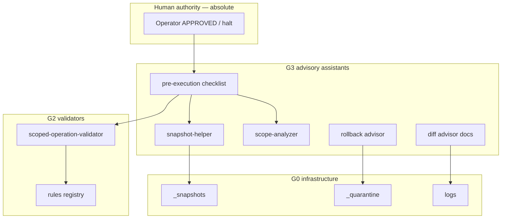

# GitGuard Advisory Layer (v1)

**Status:** **documented** — survivability advisory framework for human-operated GitGuard evolution.  
**Not:** autonomous recovery, self-healing runtime, orchestration product, or deployed security system.

**Implements direction from:** [gitguard-system-entry-v1.md](../registries/gitguard-system-entry-v1.md), [gitguard-survivability-evolution-v1.md](gitguard-survivability-evolution-v1.md), [gitguard-tooling-map-v1.md](gitguard-tooling-map-v1.md)

---

## 1. Definition

**GitGuard (MARS survivability context)** = **advisory framework** combining:

- Validators (G2)  
- Helpers / assistants (G3)  
- Manifests and snapshot discipline (G0)  
- Rollback guidance and quarantine protocols (G0–G1)  
- Diff analysis workflows (G3)  
- Human authority protocol (G3)  

**Operator** remains the sole execution authority.

---

## 2. What GitGuard is NOT

| Non-goal | Clarification |
|----------|---------------|
| Autonomous recovery | No auto-restore, no self-healing |
| Orchestration runtime | No multi-agent router |
| Silent blocking | No hidden Shell interception (G3) |
| Policy engine product | Rules are docs + optional CLI advice |
| Compliance certification | Human discipline only |

---

## 3. Layer model

---

## 4. Component roles (G0–G3)

| Layer | Component | Role | Autonomous? |
|-------|-----------|------|-------------|
| G2 | scoped-operation-validator | Command string ALLOW/DENY/NEED_HUMAN | No |
| G2 | validator-rules-registry | Pattern + path rules | No |
| G3 | snapshot-helper | Manifest draft + snapshot name suggestion | No |
| G3 | scope-analyzer | SAFE / RISKY / CROSS / PROTECTED labels | No |
| G3 | diff-advisor + workflow | Pre/post git diff discipline | No |
| G3 | rollback-advisor | When/how to restore | No |
| G3 | pre-execution-check-assistant | Operator checklist | No |
| G0 | snapshot manifests | Restore audit trail | Human-written |
| G0 | quarantine / recovery | Isolation paths | Human-operated |
| G1 | enforcement + halt protocols | Stop conditions | Human-enforced |

---

## 5. Typical pre-risk flow

1. Classify risk → scope lock.  
2. **scope-analyzer** on paths.  
3. **snapshot-helper** if MEDIUM+.  
4. Human copy snapshot + manifest.  
5. **validator** on shell commands.  
6. **pre-execution checklist** + human APPROVED.  
7. AGENT (bounded).  
8. **diff advisor** post-review.  
9. REPORT + rollback log if needed.

---

## 6. Relationship to G4 and future G5+

| Component | Status |
|-----------|--------|
| Manifest cross-validator (scope ⊆ snapshot) | **Done (G4)** — advisory |
| Structured diff report helper script | **Done (G4)** — read-only |
| Registry drift linter | **Done (G4)** — report-only |
| Snapshot integrity checker | **Done (G4)** — read-only |
| Rollback map schema + validator procedure | **Done (G4)** — human-operated |
| Optional IDE **suggestion** hooks | **Planned (G5+)** — chartered only; never silent block |

**SAFE UNKNOWN:** timeline and Cursor hook feasibility.

---

## 7. Truth discipline

Documentation and tools in this layer must **not** claim:

- “GitGuard blocked the operation” (unless human blocked)  
- “GitGuard created snapshot” (unless human copied files)  
- “GitGuard recovered workspace” (unless human restored)  

Correct language: **“GitGuard advisory tooling recommended X; operator did Y.”**

---

## 8. Changelog

| Date | Change |
|------|--------|
| 2026-05-24 | G3 — GitGuard advisory layer v1 |

---

*End of GitGuard Advisory Layer v1.*
