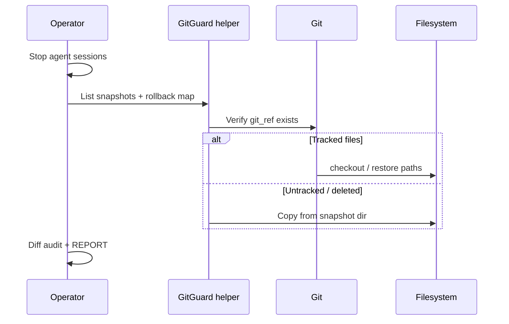

# GitGuard Survivability Evolution (v1)

**Status:** **documented** — design contract for a future **GitGuard** operational system.  
**Reality check:** GitGuard is a **named example** in [system-entity-model.md](../../../governance/system-entity-model.md); **no** `projects/gitguard/` pack exists ([mars-reality-index-v0.md](../../../governance/mars-reality-index-v0.md)). This document defines **evolution direction**, not shipped software.

---

## 1. Mission (proposed)

**GitGuard** = human-operated **survivability helper** for:

- pre-agent filesystem/git snapshots  
- protected-folder policy  
- rollback maps  
- emergency restore playbooks  
- pre-destructive verification  

**Not:** autonomous agent, governance SoT, or replacement for git hosting.

---

## 2. Pre-agent snapshot system

| Field | Spec |
|-------|------|
| **Trigger** | Before AGENT session with write intent; mandatory before R3/R4 class |
| **Contents** | Git SHA + optional copy of scope paths to `workspaces/_snapshots/<id>/` |
| **Metadata** | `snapshot-manifest.json`: timestamp, operator, scope lock, chat lane, reason |
| **Retention** | Human pruning; default keep last N per workspace |
| **Restore** | Documented in rollback map — not one-click unless helper script exists |

**Integration:** Cursor task header includes `SNAPSHOT_ID: <id>` after human runs `gitguard snapshot create` (future CLI).

---

## 3. Protected folders

Source of truth: [../registries/protected-zones-registry-v1.md](../registries/protected-zones-registry-v1.md).

Future GitGuard should:

- **Warn** on agent/shell commands targeting protected paths  
- **Block** (optional hook) recursive delete on protected roots  
- **Allow** scoped writes when manifest includes explicit waiver  

---

## 4. Rollback map

Human-maintained `projects/gitguard/rollback-map.json` (future) — v1 schema sketch:

```json
{
  "entries": [
    {
      "id": "triumph-v4-src-20260523",
      "snapshot_ref": "workspaces/_snapshots/2026-05-23-triumph-src",
      "git_ref": "abc1234",
      "scope_paths": ["workspaces/triumph-manipulator-landing-v4/src"],
      "restore_steps": ["git checkout abc1234 -- <paths>", "or copy from snapshot dir"],
      "owner": "operator"
    }
  ]
}
```

**Rule:** Every production workspace with active AGENT work should have **≥1** rollback entry or explicit SAFE UNKNOWN.

---

## 5. Workspace quarantine

| Concept | Use |
|---------|-----|
| `workspaces/_sandbox/` | Disposable experiments, cleanup drills |
| `workspaces/_quarantine/` | Suspected bad agent output — review before merge |
| Promotion | Copy **out** of quarantine to real workspace — never delete-in-place at repo root |

Agent destructive policy: [destructive-operations-policy-v1.md](destructive-operations-policy-v1.md) F-11.

---

## 6. Emergency restore flow



**Anti-chaos rule:** No second agent “recovery” pass until restore verified.

---

## 7. Anti-chaos recovery

Forbidden during emergency (agent):

- delete-and-recreate workspace  
- mass git clean  
- governance edits “while fixing”  
- parallel chats on same tree  

Required:

- single operator driver  
- written restore plan  
- filesystem diff audit (below)

---

## 8. Pre-destructive verification

Checklist before any human-approved destructive op:

- [ ] Scope lock paths exist and match intent  
- [ ] Snapshot ID recorded  
- [ ] Protected zones not in path list  
- [ ] Git status reviewed (untracked assets?)  
- [ ] Rollback map entry updated or created  
- [ ] No other active Cursor AGENT on same clone  

Future helper: `gitguard verify --plan <file>`.

---

## 9. Filesystem diff audit

Post-operation (or post-incident):

| Output | Purpose |
|--------|---------|
| `git diff --stat` | Tracked change summary |
| `git status -u` | Untracked loss signal |
| Optional hash compare | Snapshot dir vs current scope |

Store reports under `projects/mars-survivability/reports/` or future `projects/gitguard/audits/`.

---

## 10. Scoped operation validator

**Input:** proposed command + scope lock + protected registry  
**Output:** `ALLOW | DENY | NEED_HUMAN` + reason  

**Rules engine (v1 doc only):**

- Deny recursive delete outside sandbox  
- Deny git clean / reset --hard for agent role  
- Deny paths matching `protected-zones-registry`  
- Allow single-file write under allowlist  

**Implementation options (future — SAFE UNKNOWN which is chosen):**

- Cursor `beforeShellExecution` hook  
- Wrapper script `gitguard run -- <cmd>`  
- CI-style local pre-commit for agent-generated scripts  

---

## 11. Registration path (future system entry)

Per [mars-future-system-entry-discipline-v0.md](../../../governance/mars-future-system-entry-discipline-v0.md):

1. Create `projects/gitguard/` with README, OPERATIONAL-INDEX  
2. Add `registry/project-registry.md` row  
3. Register tools in `tools/registry.md` with destructive class  
4. Link from [ecosystem-topology-index.md](../../../governance/ecosystem-topology-index.md)  
5. Pilot on **one** workspace before repo-wide hooks  

---

## 12. Phased delivery (recommended)

| Phase | Deliverable | Status |
|-------|-------------|--------|
| **G0** | Contracts + protected registry + manual snapshots + infra folders | **Done** |
| **G1** | Enforcement registry, halt/drift protocols, checklists, prompt library | **Done** — [gitguard-system-entry-v1.md](../registries/gitguard-system-entry-v1.md) |
| **G2** | Scoped operation validator (CLI + rules registry) | **Done** — human-invoked only |
| **G3** | Pre-execution helpers + advisory layer + human authority | **Done** — advisory only |
| **G3+** | Cursor hook integration | **Planned** — test in sandbox; charter required |
| **G4** | Observability + drift detection (read-only tooling) | **Done** |
| **G5+** | Optional scheduled snapshots, rollback-map CLI validator | **Planned** — disk/retention policy |

---

## 13. SAFE UNKNOWN

- Whether GitGuard lives inside MARS repo or external tooling — **operator decision**.  
- Windows vs PowerShell hook support in Cursor — verify against current Cursor docs before G3.

---

*End of GitGuard Survivability Evolution v1.*
