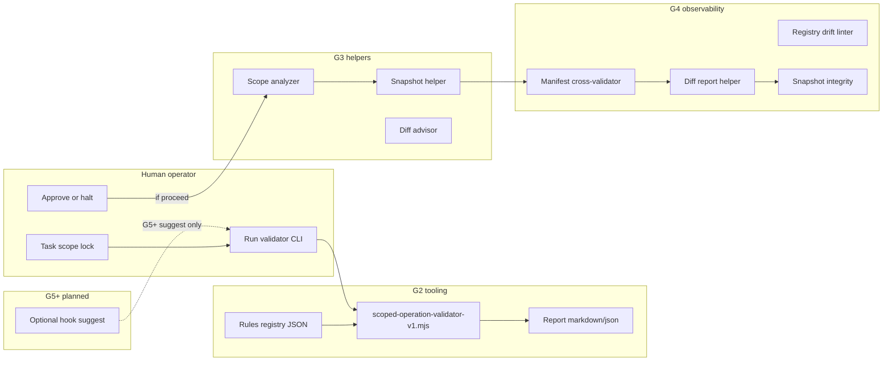

# GitGuard Tooling Map (v1)

**Status:** **documented** — design map linking survivability tooling to future GitGuard evolution.  
**Not:** runtime deployment, hook product, or claim that GitGuard is implemented.

**Related:** [gitguard-survivability-evolution-v1.md](gitguard-survivability-evolution-v1.md), [registries/gitguard-system-entry-v1.md](../registries/gitguard-system-entry-v1.md)

---

## 1. Purpose

Show how **G2 validator tooling** fits into the broader **human-operated** GitGuard direction without implying autonomous enforcement.

---

## 2. Tooling landscape (current vs planned)

| Component | G2 status | Role | Autonomous? |
|-----------|-----------|------|-------------|
| **Scoped operation validator** | **Implemented** (CLI + registry) | Pre-flight command string check | **No** — manual invoke |
| **Validator rules registry** | **Implemented** (JSON) | Pattern + protected path source | **No** — human-maintained |
| **Validator report format** | **Documented** | Audit trail structure | **No** |
| **Operational test protocol** | **Documented** | Safe testing procedure | **No** |
| **Snapshot manifests** | **Documented** + `_snapshots/` infra | Point-in-time workspace copy metadata | **No** — human creates |
| **Rollback history logs** | **Infra** (`logs/rollback-history/`) | Human append audit | **No** |
| **Protected zones registry** | **Documented** | Path tier reference | **No** — validator mirrors subset |
| **Recovery drills** | **Documented** protocol | Tabletop / sandbox restore | **No** |
| **Snapshot helper** | **Implemented G3** | Manifest draft + name suggestion | **No** — does not copy files |
| **Scope analyzer** | **Implemented G3** | Path / zone advisory labels | **No** |
| **Diff advisor + workflow** | **Implemented G3** (docs) | Pre/post git diff discipline | **No** |
| **Rollback advisor** | **Implemented G3** (docs) | Human rollback guidance | **No** |
| **Pre-execution checklist** | **Implemented G3** (docs) | Operator BEFORE flow | **No** |
| **Human authority protocol** | **Implemented G3** | Operator supremacy | **No** |
| **GitGuard advisory layer** | **Implemented G3** | Framework definition | **No** |
| **Manifest cross-validator** | **Implemented G4** | Snapshot vs scope lock | **No** |
| **Registry drift linter** | **Implemented G4** | Doc/registry drift signals | **No** |
| **Diff report helper** | **Implemented G4** | Structured diff --stat report | **No** |
| **Snapshot integrity checker** | **Implemented G4** | Manifest/structure heuristics | **No** |
| **Rollback map validator** | **Implemented G4** (procedure + schema) | Restore plan consistency | **No** |
| **Operational log format** | **Implemented G4** | Severity-standardized logs | **No** |
| **Observability philosophy** | **Implemented G4** | Observability ≠ control plane | **No** |
| **Cursor / IDE hooks** | **Planned G5+** optional | Suggest validation before Shell | **No** default — chartered |
| **Rollback map CLI validator** | **Planned G5+** | JSON schema check | **No** |

---

## 3. Data flow (human-operated)

---

## 4. Validator ↔ snapshots

| Link | Description |
|------|-------------|
| **When** | MEDIUM RISK+ mutations per [agent-operation-risk-classes-v1.md](agent-operation-risk-classes-v1.md) |
| **Where** | `workspaces/_snapshots/` + [snapshot-manifest-standard-v1.md](../protocols/snapshot-manifest-standard-v1.md) |
| **Validator role** | Does **not** create snapshots; may flag missing snapshot plan in operator notes |
| **Future** | Manifest validator checks scope lock paths ⊆ snapshot tree |

---

## 5. Validator ↔ rollback maps

| Link | Description |
|------|-------------|
| **Logs** | `logs/rollback-history/` append-only |
| **Validator role** | Flags `git reset`, `git clean`, force push as **DENY** |
| **Future** | Rollback map validator ensures restore commands don't recurse outside approved tree |

---

## 6. Validator ↔ protected zones

| Link | Description |
|------|-------------|
| **Source of truth** | [protected-zones-registry-v1.md](../registries/protected-zones-registry-v1.md) |
| **Validator copy** | `protected_paths` in JSON — **manual sync** required on registry changes |
| **Drift risk** | If docs update without JSON → **SAFE UNKNOWN** until reconciled |

---

## 7. Validator ↔ recovery drills

| Link | Description |
|------|-------------|
| **Protocol** | [recovery-drill-protocol-v1.md](../protocols/recovery-drill-protocol-v1.md) |
| **Use** | Tabletop: validate scripted commands without execution |
| **Sandbox** | `_sandbox/` only for any destructive drill execution |

---

## 8. Future hooks (non-claims)

Possible **G3+** integrations (all require explicit human charter):

- Cursor `beforeShellExecution` suggestion: “Run validator with this command?”  
- No silent block — operator always confirms.  
- Hook **failure** defaults to **no execution change** (advisory only).

**Not planned for G2.**

---

## 9. Future manifests and diff scanners

| Tool | Function |
|------|----------|
| **Manifest cross-validator** | Compare `SNAPSHOT-MANIFEST.md` paths to task allowlist |
| **Diff scanner** | After AGENT session, list changed files vs scope lock |
| **Enforcement registry linter** | Detect doc/registry drift |

All **read-only** or **report-only** unless chartered otherwise.

---

## 10. Non-goals (restated)

- No autonomous agent orchestration.  
- No “GitGuard deployed” language in reports.  
- No force-push / git-clean automation.  
- No Triumph v4/v5 production mutation via tooling.

---

## 11. SAFE UNKNOWN

- Timeline for G3 helpers — **UNKNOWN**.  
- Whether hooks will be adopted in Cursor — **UNKNOWN** — product-dependent.  
- Registry sync automation — **not implemented**.

---

## Changelog

| Date | Change |
|------|--------|
| 2026-05-24 | G2 — GitGuard tooling map v1 |
| 2026-05-24 | G3 — snapshot-helper, scope-analyzer, advisors, advisory layer |
| 2026-05-24 | G4 — observability tooling, operational logs, rollback map schema |

---

*End of GitGuard Tooling Map v1.*
