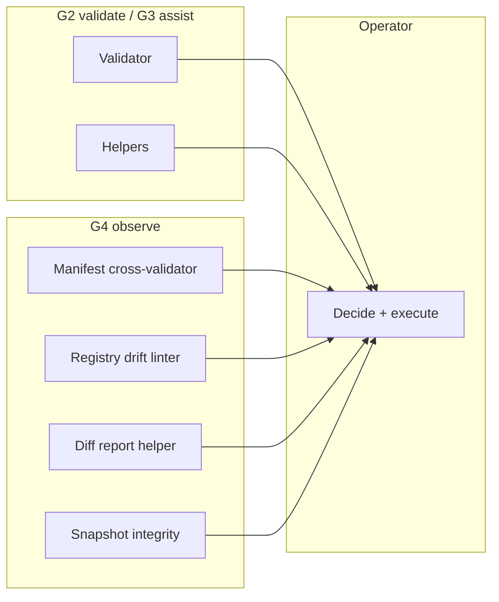

# Observability Philosophy (v1)

**Status:** **documented** — normative stance for MARS survivability observability (G4).  
**Not:** control plane specification, monitoring product, or self-healing architecture.

**Lane:** B  
**Tools:** [../tools/observability/](../tools/observability/)

---

## 1. Core equation

```
OBSERVABILITY ≠ CONTROL PLANE
```

MARS survivability observability **informs** operators. It does **not** command, block, heal, or execute recovery autonomously.

---

## 2. What MARS does not do

| Claim | Reality |
|-------|---------|
| Self-heal | **No** — human restores |
| Self-repair manifests/snapshots | **No** — human edits |
| Auto-correct drift | **No** — human reconciles registries |
| Auto-rollback | **No** — human selective copy / git |
| Silent enforcement | **No** — no hidden hooks or daemons |
| Background monitoring | **No** — manual CLI invocation |

---

## 3. What observability does

| Function | Mechanism |
|----------|-----------|
| Surface risk | Validators, linters, structured reports |
| Detect drift | Registry drift linter, diff report signals |
| Integrity signals | Snapshot checker, manifest cross-validator |
| Assist decisions | Rollback map validation procedure |
| Improve survivability | Logs, severity model, operational index |

**Operator** remains execution authority per [human-authority-protocol-v1.md](../protocols/human-authority-protocol-v1.md).

---

## 4. G4 tool principles

All tools under `tools/observability/`:

1. **Read-only** — no filesystem mutation (except operator saves reports).  
2. **Manual invoke** — no CI/hook/daemon by default.  
3. **Advisory output** — VALID/WARNING/INVALID or drift signals, not blocks.  
4. **Structured reports** — JSON optional; logs per [operational-log-format-v1.md](../protocols/operational-log-format-v1.md).  
5. **Truth discipline** — report tool name + version; no “system prevented” language.

---

## 5. Relationship to G2–G3



G4 runs **after planning** (G3) and **around/after** execution — not instead of human checklist.

---

## 6. Signals vs enforcement

| Output | Meaning for operator |
|--------|----------------------|
| VALID / OK | Proceed if other checks agree |
| WARNING / DRIFT | Review; may proceed with documented waive |
| INVALID / CRITICAL_DRIFT | Stop — fix evidence before restore or continue |
| HIGH / CRITICAL severity (logs) | Halt protocol may apply |

**INVALID from a tool is not a system block** — it is a recommendation to halt.

---

## 7. Observability and GitGuard

GitGuard advisory layer ([gitguard-advisory-layer-v1.md](gitguard-advisory-layer-v1.md)) gains **visibility** in G4:

- Manifest ↔ scope consistency  
- Registry alignment  
- Diff spread analysis  
- Snapshot completeness heuristics  

Still **not** a deployed GitGuard product.

---

## 8. SAFE UNKNOWN

- Long-term telemetry / metrics — **not in scope** Phase G4.  
- Automated scheduled drift scans — **not implemented**; human or chartered CI only.

---

## Changelog

| Date | Change |
|------|--------|
| 2026-05-24 | G4 — observability philosophy v1 |

---

*End of Observability Philosophy v1.*
