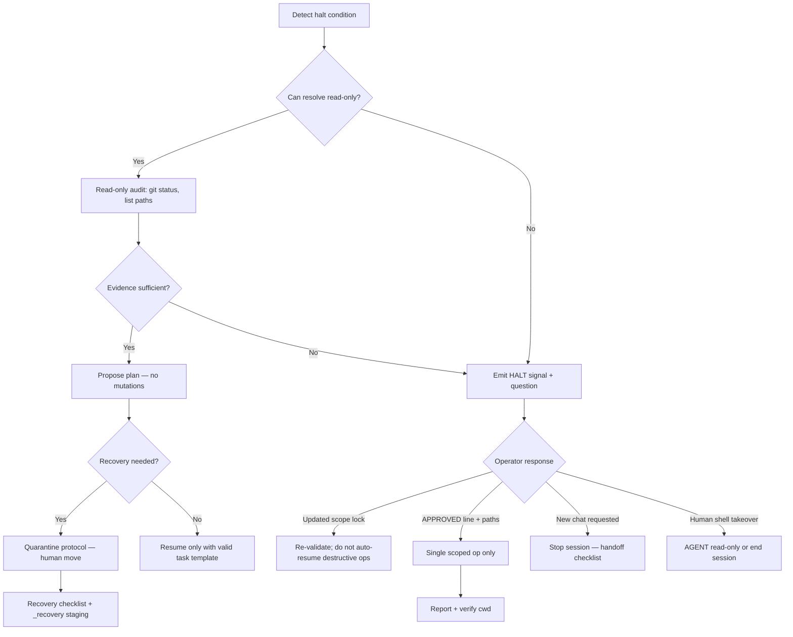

# Operational Halt Protocol (v1)

**Status:** **documented** — mandatory stop conditions for Cursor AGENT on MARS.  
**Not:** automated circuit breaker, IDE plugin, or runtime kill switch.

**Registry:** [enforcement-rules-registry-v1.md](../registries/enforcement-rules-registry-v1.md)  
**Implements:** [cursor-operational-safety-rules-v1.md](../guardrails/cursor-operational-safety-rules-v1.md), [destructive-operations-policy-v1.md](../contracts/destructive-operations-policy-v1.md)

---

## 1. Core rule

When any halt condition in this protocol applies, AGENT **must STOP** all filesystem mutations, destructive shell commands, and scope expansion. Continue **read-only** investigation only if explicitly safe and scoped.

**Output one of:** `SECURITY RISK` · `NEED HUMAN APPROVAL` · `SAFE UNKNOWN` · `INCOMPLETE SNAPSHOT`

---

## 2. When AGENT must STOP

### 2.1 Scope and path

| Condition | Why halt |
|-----------|----------|
| **Scope drift** | Task path ≠ cwd or ≠ ALLOWED PATHS |
| **Path uncertainty** | Cannot verify path exists or is in scope |
| **Multiple candidate workspaces** | Model unsure which `workspaces/<name>/` is anchor |
| **Path-anchor loss** | Post-summary; scope lock not restated |
| **Unknown filesystem state** | Missing files, unexpected git status — do not guess |

### 2.2 Destructive and recovery

| Condition | Why halt |
|-----------|----------|
| **Unexpected delete proposals** | Any recursive delete, mass delete, or delete outside lock |
| **Rebuild-from-memory** | No snapshot, git ref, or SoT for reconstruction |
| **Missing snapshot** | MEDIUM+ operation without snapshot id or waive |
| **Missing SoT** | Factory/landing recovery without handoff, `src/`, or design authority |
| **Recovery ambiguity** | Multiple restore sources; unclear target state |
| **Recovery-loop drift** | Delete → retry → delete pattern detected |

### 2.3 Instruction and language

| Condition | Why halt |
|-----------|----------|
| **Conflicting instructions** | User rules vs task vs lane vs prior turn disagree |
| **Cleanup language** | "clean up", "clean repo", "clean everything" without paths |
| **"Start fresh"** | Implies delete-recreate or unbounded reset |
| **"Wipe"** | Implies destructive bulk removal |
| **"Recreate"** | Implies workspace rebuild without clone-first |
| **"Clean everything"** | Unbounded scope — FORBIDDEN |
| **Recursive operation proposals** | F-01, F-11 |
| **Workspace-wide replace** | F-08 — mass replace without glob lock + dry-run |

---

## 3. Halt response (agent)

On halt, AGENT outputs:

```text
HALT — <signal>
Reason: <one sentence>
Blocked action: <what would have run>
Required from operator: <scope lock | path list | APPROVED line | new chat | human shell>
Safe next step: <read-only audit | ASK plan | quarantine protocol>
```

**Do not:** proceed with "best guess", partial fix, or compensating delete.

---

## 4. HALT escalation flow



### Escalation levels

| Level | Name | Who acts |
|-------|------|----------|
| **L0** | Self-halt | AGENT stops; asks one clarifying question |
| **L1** | Operator re-scope | Human updates safe task template |
| **L2** | Human confirmation | `APPROVED:` line for bounded op |
| **L3** | New chat | Mandatory per drift protocol |
| **L4** | Human shell | Filesystem/git mutations by operator |
| **L5** | Incident | Log to `logs/incidents/`; quarantine; no agent cleanup |

---

## 5. Post-halt forbidden actions

Even after operator responds, AGENT **must not**:

- Chain FORBIDDEN ops as "cleanup"
- Expand ALLOWED PATHS without updated task block
- Run second recovery pass autonomously
- Delete quarantine or snapshot trees
- Edit governance "while fixing"

---

## 6. Relationship to modes

| Halt severity | Mode |
|---------------|------|
| L0–L1 | AGENT may continue read-only |
| L2 | AGENT single scoped mutation after APPROVED |
| L3+ | ASK or end AGENT session |
| Recovery ambiguity | ASK default |
| Post-incident production | Human primary |

---

## 7. Operator checklist after halt

- [ ] Identify halt trigger class (scope / destructive / language / recovery)
- [ ] Verify cwd and ALLOWED PATHS
- [ ] Decide: re-scope, new chat, or human shell
- [ ] If recovery: quarantine before mutate
- [ ] Log L5 incidents to `logs/incidents/`

**Template:** [survivability-recovery-checklist-v1.md](../templates/survivability-recovery-checklist-v1.md)

---

## 8. Changelog

| Date | Change |
|------|--------|
| 2026-05-24 | v1 — G1 operational halt protocol |

---

*End of Operational Halt Protocol v1.*
