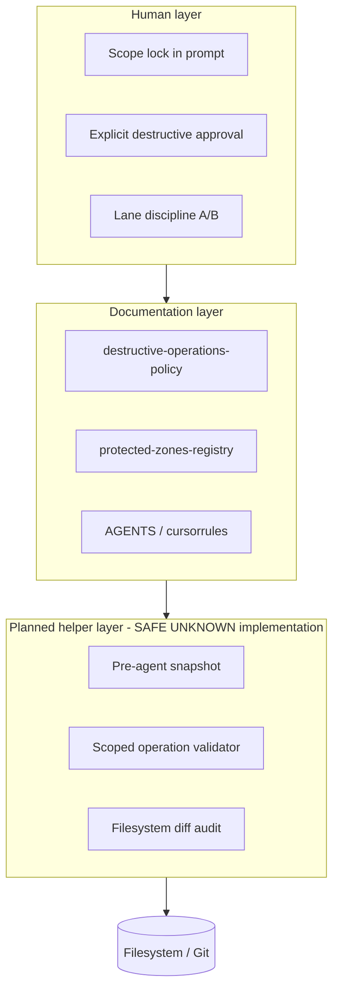

# Safe Execution Layer (v1)

**Status:** **documented** — architecture for human-operated + future helper enforcement.  
**Not:** implemented runtime, Cursor plugin, or OS sandbox.

**Purpose:** Define how MARS constrains **high-privilege** Cursor execution without claiming a product exists today.

---

## 1. Layer overview



---

## 2. Protected zones

Canonical list: [../registries/protected-zones-registry-v1.md](../registries/protected-zones-registry-v1.md).

| Zone | Rationale |
|------|-----------|
| `governance/` | SoT for semantics; deletion = ecosystem brain damage |
| `registry/` | Identity and project registry |
| `projects/` | Operational system packs (ORCA, Factory, wpilot, …) |
| `agents/` | Agent packs and checklists |
| `workspaces/_snapshots/` | Rollback anchors (G0 infrastructure — see [README.md](../../../workspaces/_snapshots/README.md)) |
| `web-gpt-sources/` | Legacy imported architecture pack |
| `memory/` | Memory policy and lifecycle |
| `security/` | Threat model and approval gates |
| `continuity/` | IdeaBox / continuity captures |

**Rule:** Agent **writes** in protected zones require Lane B + narrow task. **Deletes** = always forbidden for agent unless explicit human path list + charter.

---

## 3. High-risk operations

Classify every proposed action:

| Class | Examples | Default |
|-------|----------|---------|
| **R0 read** | read, grep, git diff | Allow |
| **R1 scoped write** | single file edit in allowlist | Allow with scope lock |
| **R2 wide write** | multi-file refactor, mass replace | NEED HUMAN APPROVAL |
| **R3 git destructive** | clean, reset --hard, force push | **Deny** (agent) |
| **R4 FS destructive** | recursive delete, move top-level | **Deny** (agent) |
| **R5 external** | deploy, API with side effects | NEED HUMAN APPROVAL + evidence |

Maps to [tool-safety-model-v0.md](../../../tools/tool-safety-model-v0.md) side-effect classes.

---

## 4. Human-confirm checkpoints

Mandatory pause **before**:

1. First delete or move in session  
2. Any git command beyond status/diff/log  
3. Any shell command touching path outside scope lock  
4. Any operation on protected zone  
5. Recovery mode entry (“rebuild”, “reset”, “start over”)  
6. Commit or push  

**Checkpoint artifact:** operator replies with `APPROVED: <operation> @ <absolute paths>`.

---

## 5. Filesystem boundary contracts

| Contract | Rule |
|----------|------|
| **Repo root** | `C:\AI MARS` — all MARS work; agent must not mutate paths outside without explicit task |
| **Workspace boundary** | Lane A: `workspaces/<project>/` only unless task lists more |
| **Factory boundary** | Implementation under workspace; governance under `projects/mars-website-factory/` |
| **Generated boundary** | No hand-edit of `dist/`, `build/`, `node_modules/` — regen ([.cursorrules](../../../.cursorrules)) |
| **External boundary** | [external-system-boundaries.md](../../../governance/external-system-boundaries.md) |

---

## 6. Workspace scope locks

**Template (paste into AGENT task):**

```text
SCOPE LOCK v1
- Root: C:\AI MARS\workspaces\<name>\
- Allowed ops: read, write files under Root only
- Forbidden: delete directory, git clean/reset, paths outside Root
- Protected: governance/, registry/, other workspaces/
- Snapshot: required before any delete class
```

Without scope lock → agent defaults to **read-only investigation** or asks for lock.

---

## 7. Agent execution constraints

| Constraint | Detail |
|------------|--------|
| **Mode gate** | Destructive recovery → ASK or human-only shell |
| **One workspace per session** | No cross-workspace edits in one AGENT task |
| **No implicit cleanup** | “Done” does not trigger delete |
| **Inventory before delete** | List paths; wait for approval |
| **Prefer git over delete** | Revert tracked files; do not delete tree |
| **Report cwd** | Every REPORT with shell use states cwd |

---

## 8. Safe prompt architecture

**Required elements for AGENT tasks:**

1. Lane (A or B)  
2. Scope lock (absolute paths)  
3. Forbidden operations (link destructive-operations-policy)  
4. Phase (audit / implement / recovery)  
5. SoT pointers (which docs govern)  
6. Explicit “do not touch” list  

**Forbidden prompt shapes:** see [../reports/cursor-agent-operational-risk-analysis-v1.md](../reports/cursor-agent-operational-risk-analysis-v1.md).

---

## 9. Mandatory rollback points

| Trigger | Rollback action |
|---------|-----------------|
| Before R3/R4 operation | GitGuard snapshot (planned) or manual `git stash` / branch |
| Before Factory regen | Tag stable commit or copy `src/` subset to `_snapshots/` |
| Before workspace reset | [workspace-reset-governance.md](../../../projects/mars-website-factory/workspace-reset-governance.md) audit record |
| After failed recovery | **Freeze** — no further agent deletes; human triage |

Aligns with [web-gpt-sources/04-workflows__git-rules.md](../../../web-gpt-sources/04-workflows__git-rules.md) milestone checkpoints.

---

## 10. Snapshot discipline

| Type | Owner | Location (recommended) |
|------|-------|------------------------|
| Pre-agent FS snapshot | Human / future GitGuard | `workspaces/_snapshots/<date>-<reason>/` |
| Git milestone | Human | commit per git-rules |
| Factory stable freeze | Operator | documented in PROJECT.md / handoff |
| Export bundle | ORCA/Factory | existing run artifacts |

**Rule:** No R4 operation without snapshot **or** explicit “snapshot waived” from human.

---

## 11. Anti-drift operational rules

1. **Re-anchor** after summary: restate scope lock in next message.  
2. **Path verify**: `Get-Location` / `pwd` before destructive-class commands.  
3. **Contradiction stop**: if task path ≠ cwd → stop, report SAFE UNKNOWN.  
4. **No architecture in emergency** — freeze scope to repair only.  
5. **New chat** for new lane or new workspace — do not continue cleanup in drifted session.  
6. **Compression checkpoint**: write `CHECKPOINT.md` in task folder before long sessions.  
7. **INDEX-first** — use OPERATIONAL-INDEX / README before broad search.

---

## 12. Relation to execution contracts

- [execution-boundary-clarification.md](../../../governance/execution-boundary-clarification.md) — where execution happens (human + Cursor).  
- [operational-survivability.md](../../../governance/operational-survivability.md) — survivability pillars.  
- This layer — **how** to keep Cursor execution inside boundaries.

---

## 13. Implementation maturity

| Component | Maturity |
|-----------|----------|
| Documentation | **v1 present** |
| Cursor hooks | **SAFE UNKNOWN** — see create-hook skill path for future |
| GitGuard automation | **Not in repo** |
| OS sandbox | **Not in repo** |

---

*End of Safe Execution Layer v1.*
