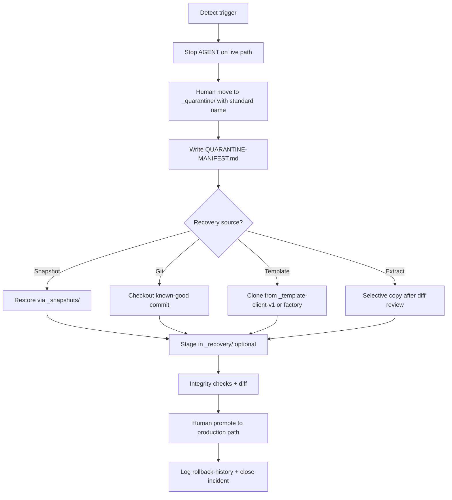

# Workspace Quarantine Protocol (v1)

**Status:** **documented** — human-operated isolation protocol for broken or drifted workspaces.  
**Not:** automated quarantine product, virus scanner, or in-place repair workflow.

**Storage:** [../../../workspaces/_quarantine/README.md](../../../workspaces/_quarantine/README.md)  
**Risk classes:** [../contracts/agent-operation-risk-classes-v1.md](../contracts/agent-operation-risk-classes-v1.md)

---

## 1. Core principle

**Do not repair on top of a contaminated workspace.**

If a workspace is contaminated, unstable, broken, drifted, or partially rebuilt:

1. **Stop** AGENT mutations on the live path.  
2. **Move** (human-operated) the tree to `workspaces/_quarantine/`.  
3. **Inspect, compare, recover, restore, or clone** from verified sources.  
4. **Repopulate** production path only from snapshot, git, template, or verified extract.

---

## 2. Quarantine triggers

| Trigger | Description | Example signal |
|---------|-------------|----------------|
| **Contaminated** | Unknown or agent-generated junk mixed with SoT | Mystery deletes, wrong partials |
| **Unstable** | Build fails unpredictably; repeated agent fix loops | 3+ failed recovery attempts |
| **Broken** | Missing critical paths; partial delete | Empty `src/` subtree |
| **Drifted** | Context drift — implementation ≠ task scope / handoff | Wrong version markers, mixed v4/v5 |
| **Partially rebuilt** | Delete-and-recreate or "from memory" reconstruction | New tree without git continuity |

Any single trigger is sufficient. When in doubt → quarantine.

---

## 3. Quarantine naming standard

```
q-<YYYYMMDD>-<HHMMSS>-<workspace-slug>-<condition>
```

| Segment | Rules |
|---------|-------|
| `q` | Fixed prefix |
| `YYYYMMDD` | UTC or local date — be consistent within incident |
| `HHMMSS` | Time of quarantine move |
| `workspace-slug` | Short kebab-case from source name (e.g. `triumph-v4`, `template-client-v1`) |
| `condition` | Short token: `contaminated`, `drift`, `broken`, `partial-rebuild`, `incident-<id>` |

**Examples:**

- `q-20260524-091500-triumph-v4-drift`
- `q-20260524-143022-template-client-v1-partial-rebuild`
- `q-20260524-160000-triumph-v4-incident-ctx001`

---

## 4. Required manifest per quarantine folder

Create `QUARANTINE-MANIFEST.md` inside each quarantine directory:

| Field | Required |
|-------|----------|
| **quarantine id** | Matches folder name |
| **source path** | Original workspace absolute path |
| **timestamp** | ISO-8601 |
| **trigger** | From trigger table |
| **operator** | Human who performed move |
| **git state** | Branch, HEAD, dirty/clean at quarantine time |
| **linked snapshot** | Path to `_snapshots/` if exists, else SAFE UNKNOWN |
| **linked incident** | Path to `logs/incidents/` or survivability report |
| **recovery status** | `open` \| `restored` \| `archived` |
| **notes** | Factual observations — no speculation |

---

## 5. Workflow



---

## 6. Forbidden during quarantine

| ID | Forbidden action |
|----|------------------|
| QF-01 | AGENT "quick fix" on live workspace after trigger detected |
| QF-02 | Delete quarantine folder without manifest review |
| QF-03 | Rename quarantine → production path (must copy from verified source) |
| QF-04 | Merge quarantine tree without diff and human sign-off |
| QF-05 | AGENT recursive delete inside `_quarantine/` |
| QF-06 | Skip manifest to "save time" |
| QF-07 | Use `_sandbox/` instead of quarantine for contaminated production trees |

---

## 7. Agent permissions

| Action | AGENT |
|--------|-------|
| Read-only audit of quarantine tree | Allowed |
| Write QUARANTINE-MANIFEST | Only if task explicitly includes quarantine ops |
| Move workspace to quarantine | **Human only** unless explicit human instruction + path list in same turn |
| Restore from quarantine | **Human executes**; AGENT read-only or scoped copy assist |
| Delete quarantine content | **Human only** |

---

## 8. Relationship to other zones

| Zone | Role |
|------|------|
| `_snapshots/` | Known-good point-in-time **before** ops |
| `_quarantine/` | Known-bad or unknown-state **after** failure |
| `_recovery/` | Staging for verified restore in progress |
| `_sandbox/` | Disposable experiments — **not** for production contamination |

---

## 9. Logging

On quarantine move, append entry to:

- `logs/incidents/` — incident narrative  
- `logs/survivability/` — one-line operational note  

On successful restore, append to:

- `logs/rollback-history/` — restore record  

---

## 10. SAFE UNKNOWN

If git state, file completeness, or contamination extent cannot be verified:

- Mark in manifest **SAFE UNKNOWN**  
- Do not restore to production until verified  
- Prefer read-only AGENT diff audit  

---

## 11. Changelog

| Date | Change |
|------|--------|
| 2026-05-24 | v1 — G0 operationalization |

---

*End of Workspace Quarantine Protocol v1.*
