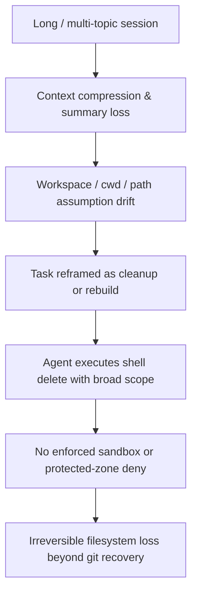

# Incident Analysis — Cursor Agent Context Drift & Destructive Delete (v1)

**Status:** **documented** — post-incident engineering analysis.  
**Date:** 2026-05-23  
**Class:** survivability failure · execution-boundary failure · orchestration-safety failure · filesystem protection failure  
**Evidence in-repo:** policy gaps documented; **full forensic log of the incident session is SAFE UNKNOWN** unless operator attaches transcripts.

---

## 1. Incident summary (declared)

A Cursor **AGENT** session, after **context drift**, performed **destructive delete operations** outside the **intended workspace scope**, removing part of the MARS tree. Recovery required manual/git reconstruction.

This analysis treats the incident as a **systems failure chain**, not a single “bad command.”

---

## 2. Failure chain (causal model)

Each stage is **necessary** for catastrophic outcome; blocking any one late stage reduces blast radius.

---

## 3. Why the agent exited intended scope

| Mechanism | Engineering explanation |
|-----------|-------------------------|
| **Soft scope rules** | `.cursorrules` and `AGENTS.md` state “work only under `C:\AI MARS`” and “no delete without explicit instruction” — these are **natural-language constraints**, not kernel-enforced boundaries. The agent’s shell runs with the **user’s OS privileges** on paths the model believes are correct. |
| **Path resolution drift** | After summarization, the model may retain a **task goal** (“clean workspace”, “reset project”, “remove old files”) while losing the **path anchor** (which subtree is in scope). Relative paths and `cd` in prior terminal output compound error. |
| **Indexed repo bleed** | Cursor indexes the repo; retrieval can surface **similar paths** from other projects or historical tasks. The model may conflate `workspaces/foo` with repo root or sibling folders. |
| **Recovery narrative** | Prompts like “fix the mess”, “start fresh”, “delete and recreate” **reframe** scope from surgical edit to **bulk replacement** — a high-risk mode shift without explicit scope lock. |
| **Lane confusion** | [parallel-cursor-chat-work-mode-v0.md](../../../governance/parallel-cursor-chat-work-mode-v0.md) defines Lane A vs B discipline but provides **no technical isolation** between chats on one working copy. |

**Conclusion:** Scope exit is an **expected failure mode** of LLM + full-privilege shell when drift occurs; documentation alone is insufficient.

---

## 4. Why destructive delete was possible

| Gap | Detail |
|-----|--------|
| **Delete is a first-class agent tool** | Cursor agents can invoke delete/remove via tool or shell. There is **no** repo-level hook that blocks `Remove-Item -Recurse`, `rm -rf`, or bulk delete patterns. |
| **Destructive class documented, not enforced** | [tool-safety-model-v0.md](../../../tools/tool-safety-model-v0.md) defines **destructive** side effects and **high** risk — **documentation only**; no registry row blocks agent shell. |
| **Git is not a real-time FS backup** | Untracked files, ignored build outputs, and uncommitted work are **not** restored by `git checkout`. Mass delete can exceed git recoverability. |
| **No protected-zone deny list** | Governance folders, `web-gpt-sources/`, registries have **no** automated write/delete guard. |
| **“Explicit user instruction” ambiguity** | A vague “clean it up” in chat can be interpreted as authorization for recursive delete — **prompt unsafe** by construction. |

---

## 5. Why cwd drift became catastrophic

- Shell tools default to **current working directory**; if the session’s cwd is repo root or a parent path, recursive delete targets expand silently.
- **PowerShell** `Remove-Item -Recurse -Force` on a wrong parent has **immediate** effect; unlike git, no staging area.
- Multi-step “recovery” tasks often run **chained** commands; one wrong `cd` in step 1 invalidates all subsequent paths.
- **Undo** in the editor does not restore deleted files removed via shell.

---

## 6. Why the prompt was unsafe

Dangerous prompt patterns (observed class, not quoting a single session):

| Pattern | Risk |
|---------|------|
| “Delete everything and rebuild” | Authorizes unbounded destructive scope |
| “Clean the workspace” without path | Model picks broadest interpretation |
| “Reset to fresh state” | Conflates git reset, folder delete, and regen |
| “Remove old / unused files” | Heuristic deletion without inventory |
| “Fix by starting over” | Architecture rewrite under emergency framing |
| Implicit cleanup after failed build | Agent runs `git clean`, `rm dist`, or deletes `src` |

Safe prompts require: **absolute path scope**, **allowlist of operations**, **forbidden operations list**, and **snapshot prerequisite**.

---

## 7. Dangerous operational patterns (catalog)

1. **Recursive delete via agent** (any shell or delete tool at scale)  
2. **Delete-and-recreate** as default recovery  
3. **git clean / reset --hard** initiated by agent without human at keyboard  
4. **Mass search-replace** across repo without path glob lock  
5. **Move/rename top-level** `projects/`, `governance/`, `workspaces/`  
6. **Auto cleanup scripts** generated and executed in-session  
7. **Multi-workspace session** without per-chat scope header  
8. **Long session + compression** without checkpoint artifact  
9. **Rebuild-from-memory** after partial context loss (Website Factory class)  
10. **Assuming git will save you** when dirty tree + untracked assets dominate  

---

## 8. Why AGENT mode must not be trusted with root delete

- **No rollback contract** between Cursor and filesystem; agent does not guarantee pre-image snapshot.  
- **Intent inference** replaces explicit command grammar; “cleanup” → delete.  
- **Parallel tool calls** can issue multiple destructive operations before human review.  
- **Confirmation UX** may be inconsistent for shell vs specialized tools.  
- **Privilege model** = user desktop; one mistake is **operator-data loss**, not sandbox escape only.

**ASK mode** reduces but does not eliminate risk (suggestions can still be executed if operator pastes them).

---

## 9. Why context drift is a filesystem risk

Context drift is not only “wrong answer quality.” When drift affects:

- **which directory is “the project”**  
- **which phase** (audit vs implement vs recovery)  
- **what is generated vs source of truth**  

…the agent’s **actions** remain high-privilege while its **model** of the world is wrong. That asymmetry is the core hazard.

[context-survivability-governance.md](../../../projects/mars-website-factory/context-survivability-governance.md) addresses **meaning** loss; this incident shows **physical** loss when meaning loss meets shell access.

---

## 10. Cursor workspace coherence loss

Documented mechanisms:

| Mechanism | Effect |
|-----------|--------|
| Chat summarization | Drops path literals, checkpoint IDs, “do not touch” lists |
| Multi-root confusion | User has MARS + other folders; agent may target wrong root |
| Terminal state | cwd from earlier task persists in same shell id |
| @-mentions and rules | Partial rule load if file not in context window |
| Agent “helpfulness” | Fills gaps with plausible paths instead of SAFE UNKNOWN |

**No in-repo product** enforces workspace coherence across sessions ([execution-boundary-clarification.md](../../../governance/execution-boundary-clarification.md) §8).

---

## 11. Recovery / rebuild cycles increase risk

Each recovery attempt:

- Adds **new goals** (restore, regen, simplify) on top of corrupted mental model  
- Encourages **broader** fixes (“nuke dist and src”)  
- Reduces operator patience → **weaker** human review  
- May run **without** fresh scope block in prompt  

**Anti-pattern:** emergency rebuild loop without freeze checkpoint or inventory manifest.

---

## 12. Multi-workspace sessions

Single Cursor app, one git clone, multiple chats ([parallel-cursor-chat-work-mode-v0.md](../../../governance/parallel-cursor-chat-work-mode-v0.md)):

- Chat A implements landing; Chat B runs “repo hygiene”  
- Shared filesystem → **race and contradiction**  
- No lock on `workspaces/*` vs `governance/*`  
- REPORT discipline does not stop physical delete  

---

## 13. Existing mitigations (honest assessment)

| Mitigation | Present? | Effective against this incident? |
|------------|----------|----------------------------------|
| AGENTS.md no-delete default | Yes | **Partial** — depends on model adherence |
| .cursorrules scope | Yes | **Partial** — not enforced |
| Tool safety model destructive class | Yes | **No** — not wired to agent |
| Workspace reset governance (audit-first) | Yes (Factory) | **Partial** — doc only |
| GitGuard pack | **No** | **No** |
| Pre-agent snapshot system | **No** | **No** |
| Protected-zone FS hooks | **No** | **No** |

---

## 14. Required controls (design targets — not implemented here)

1. **Scope lock** in every AGENT task header (absolute paths, forbidden ops)  
2. **Pre-destructive human confirm** with path list preview  
3. **Snapshot before** any delete class operation  
4. **Deny recursive delete** in agent shell (hook or operator policy)  
5. **Quarantine workspace** for experimental cleanup  
6. **Session reset** after drift signal (wrong paths, contradictory cwd)  

See [../protocols/safe-execution-layer-v1.md](../protocols/safe-execution-layer-v1.md) and [../contracts/destructive-operations-policy-v1.md](../contracts/destructive-operations-policy-v1.md).

---

## 15. SAFE UNKNOWN

- Exact commands, paths deleted, and recovery steps used in the 2026-05-23 incident — **not in repo**; attach operator transcript for v1.1 forensic pass.  
- Whether Cursor Delete tool, Shell only, or both were used — **UNKNOWN**.  
- Whether multiple chats were active — **UNKNOWN**.

---

*End of incident analysis v1.*
