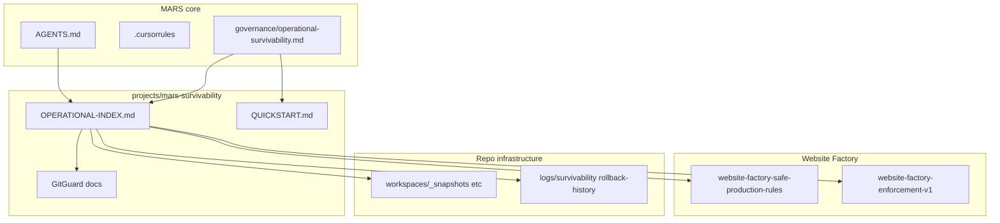

# S1 Ecosystem Integration Review (v1)

**Status:** Human-reviewed integration audit — documentation only  
**Date:** 2026-05-24  
**Scope:** MARS ecosystem touchpoints for `projects/mars-survivability/`

---

## 1. Integration intent

Survivability pack is **Lane B operational layer** extending Phase S3 governance — not a new Program entity, not runtime, not replacement for AGENTS.md.

---

## 2. Integration map

---

## 3. Upstream links (into survivability)

| Source | Link status | Action |
|--------|-------------|--------|
| `AGENTS.md` | References Phase S3 governance; **no** direct mars-survivability path | **Optional defer** — AGENTS already points to governance; adding pack path = low value, avoid AGENTS churn |
| `.cursorrules` | Implicit safety rules | **No change** — aligned |
| `governance/operational-survivability.md` | **Added §9** → OPERATIONAL-INDEX + QUICKSTART | **Applied** |
| `governance/mars-survivability-patterns-hardening-v0.md` | Patterns P1–P9; no project path | **Defer** — patterns sufficient; pack is implementation |
| `tools/tool-safety-model-v0.md` | Referenced from OPERATIONAL-INDEX | **Valid** |

---

## 4. Downstream links (from survivability)

| Target | Link status | Action |
|--------|-------------|--------|
| Website Factory `shell-compatibility-model.md` | **No** mars-survivability ref | **Defer** — Factory has terminal-survivability-governance; cross-link optional G5 |
| `projects/mars-website-factory/` | No direct refs found | **Acceptable** — enforcement contract bridges via mars-survivability |
| ORCA OPERATIONAL-INDEX | No survivability ref | **Defer** — ORCA is Lane A primary; survivability is cross-cutting |
| WPilot backup-rollback-rules | Separate system | **No merge** — note in freeze prep |

---

## 5. Registry references

| Registry | Integration |
|----------|-------------|
| `governance/mars-reality-index-v0.md` | GitGuard = UNKNOWN — **consistent** with advisory-only pack |
| `governance/ecosystem-topology-index.md` | GitGuard = SAFE UNKNOWN — **consistent** |
| `governance/system-entity-model.md` | GitGuard as example entity — **no conflict** |
| `projects/mars-survivability/registries/protected-zones-registry-v1.md` | Self-contained P0–P3 — **canonical for Lane B** |

**No registry row added** — mars-survivability is documentation pack under `projects/`, not registered Program.

---

## 6. GitGuard ecosystem position

| Question | Answer |
|----------|--------|
| Is GitGuard a separate project? | **No** — no `projects/gitguard/` |
| Where does GitGuard live operationally? | `projects/mars-survivability/` contracts + registries |
| Governance entity name vs pack | Entity model **example**; pack **implements direction** with status honesty |

---

## 7. Log and infra integration

| Path | Role | Integrated? |
|------|------|-------------|
| `logs/survivability/` | D-01/D-02 drill logs | **Yes** — referenced from reports |
| `logs/rollback-history/` | D-02 restore evidence | **Yes** |
| `logs/incidents/` | Reserved | **Yes** — .gitkeep |
| `workspaces/_snapshots/` | Drill + future snapshots | **Yes** — README + D-01 snap |

---

## 8. Changes applied in S1 (minimal)

| File | Change |
|------|--------|
| `governance/operational-survivability.md` | Added §9 operational survivability pack entry |
| `projects/mars-survivability/README.md` | QUICKSTART link; G0–G4 |
| GitGuard phase tables | Drift fix (3 files) |

**Not changed (intentional):** AGENTS.md, ecosystem-topology-index, mars-website-factory indexes, ORCA indexes — avoid mass refactor per task constraints.

---

## 9. Recommended future integration (G5+, not S1)

| Target | Action |
|--------|--------|
| Website Factory OPERATIONAL-INDEX | One-line link to mars-survivability QUICKSTART when next touched |
| `governance/onboarding-survivability.md` | Optional Path F for Lane B operators |
| `registry/project-registry.md` | Row only if mars-survivability promoted to registered system — **not recommended now** |

---

## 10. Verdict

**Ecosystem integration: ADEQUATE for S1 baseline.**

Primary entry: `governance/operational-survivability.md` → `projects/mars-survivability/OPERATIONAL-INDEX.md` → `QUICKSTART.md`.

No mass refactor required; no runtime claims introduced.

---

## 11. SAFE UNKNOWN

- Whether mars-survivability should appear in ecosystem-topology-index as explicit node  
- Cross-link from Factory terminal-survivability-governance to mars-survivability pack

---

*End of S1 Ecosystem Integration Review v1.*
