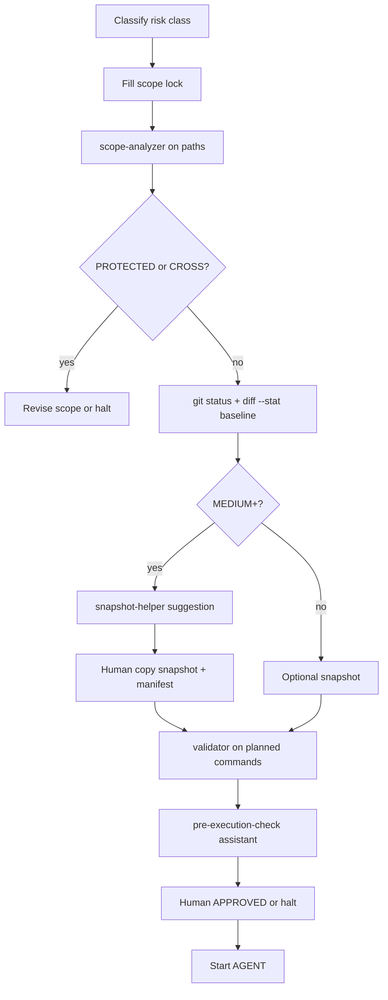

# Diff Advisor Workflow (v1)

**Status:** **documented** — step-by-step human workflow.  
**Not:** automated pipeline.

**Guide:** [diff-advisor-v1.md](diff-advisor-v1.md)

---

## Workflow A — Pre-AGENT (risky edit)



| Step | Action | Tool / doc |
|------|--------|------------|
| 1 | Risk class | [agent-operation-risk-classes-v1.md](../../contracts/agent-operation-risk-classes-v1.md) |
| 2 | Scope lock | [safe-agent-task-template-v1.md](../../templates/safe-agent-task-template-v1.md) |
| 3 | Path analysis | `node scope-analyzer-v1.mjs --paths "..."` |
| 4 | Baseline diff | `git status`; `git diff --stat` |
| 5 | Snapshot plan | `node snapshot-helper-v1.mjs -w ... -o ...` |
| 6 | Command check | `node scoped-operation-validator-v1.mjs -c "..."` |
| 7 | Checklist | [pre-execution-check-assistant-v1.md](pre-execution-check-assistant-v1.md) |
| 8 | Approve | Human `APPROVED: ...` in chat |

---

## Workflow B — Post-AGENT (before commit/handoff)

| Step | Action | Pass criteria |
|------|--------|---------------|
| 1 | `git diff --stat` | File count ⊆ scope lock (+ declared build outputs) |
| 2 | Unexpected paths | **None** — else halt |
| 3 | Protected zones | **None** unless task authorized |
| 4 | Cross-workspace | **One** workspace root only |
| 5 | Dangerous classes | No governance/registry/agent contract edits unless chartered |
| 6 | REPORT | List changed files; UNKNOWN if unsure |
| 7 | Rollback note | If MEDIUM+: snapshot id in REPORT |

---

## Workflow C — Generator / rebuild run

| Step | Action |
|------|--------|
| 1 | Scope lock lists workspace + build command |
| 2 | Pre: `git diff --stat` — note `dist/` / `build/` baseline |
| 3 | Snapshot if deploy-critical or non-reproducible dist |
| 4 | Run generator **once** — human at keyboard |
| 5 | Post: diff only under expected output dirs |
| 6 | If `src/` changed unexpectedly → halt |

---

## Workflow D — Recovery / migration

| Step | Action |
|------|--------|
| 1 | **No** AGENT destructive recovery |
| 2 | Quarantine source workspace first |
| 3 | Diff advisor compares quarantine vs snapshot — selective restore |
| 4 | See [rollback-advisor-v1.md](rollback-advisor-v1.md) |

---

## Report stub (optional)

Save under `tools/helpers/reports/`:

```markdown
# Diff Review — <task>

**When:** pre | post  
**Baseline stat lines:** N  
**Post stat lines:** M  
**Unexpected paths:** <list or none>  
**Decision:** proceed | halt | quarantine  

## SAFE UNKNOWN
- ...
```

---

## Changelog

| Date | Change |
|------|--------|
| 2026-05-24 | G3 — diff advisor workflow v1 |

---

*End of Diff Advisor Workflow v1.*
