# MARS Website Factory — Reference Run Artifact Flow v0

**Status:** **documentation only** — describes **how humans reason** about artifact movement. **Not** a message bus, queue, or runtime transport ([artifact-bus-overview-v0.md](artifact-bus-overview-v0.md)).

**Version:** v0.

**Related:** [reference-run-sequence-v0.md](reference-run-sequence-v0.md), [artifact-transfer-semantics-v0.md](artifact-transfer-semantics-v0.md), [artifact-lineage-semantics-v0.md](artifact-lineage-semantics-v0.md), [artifact-publication-semantics-v0.md](artifact-publication-semantics-v0.md), [artifact-consumption-rules-v0.md](artifact-consumption-rules-v0.md), [dependency-invalidation-v0.md](dependency-invalidation-v0.md), [semantic-freeze-semantics-v0.md](semantic-freeze-semantics-v0.md).

---

## 1. Artifact movement (reference path)

**Direction** (happy path, prose only):

```text
Intake → Classification → Strategy/SEO → IA → Blueprints
  → Blueprint QA → Design Handoff → Design → Design QA
  → Frontend Handoff → Frontend src → Frontend QA
  → Validation bundle → HITL record → Delivery package
```

Each arrow is a **human-authorized transfer** per [artifact-routing-rules-v0.md](artifact-routing-rules-v0.md): allowed routes, forbidden silent reroutes, stale/orphan handling.

---

## 2. Lineage

- Every superseding artifact references **parent artifact_id** (or project-local equivalent) per [artifact-lineage-semantics-v0.md](artifact-lineage-semantics-v0.md).
- **Sibling** experiments (A/B blueprint drafts) must be explicitly labeled; default is **single trunk** unless HITL approves parallel lines.

---

## 3. Freeze propagation

| When | Effect |
|------|--------|
| **C04** blueprint approved | Downstream handoff consumers **must** cite approved blueprint IDs in their REPORTs. |
| **C05** design approved | Frontend handoff/production **binds** to frozen design anchors. |
| **C06** frontend freeze | Validation and delivery packaging **bind** to frozen src/build references. |

Freeze does **not** auto-propagate through tooling — operators **enforce** by refusing stale consumption ([artifact-consumption-rules-v0.md](artifact-consumption-rules-v0.md)).

---

## 4. Revision propagation

- Revisions originate in the **owning lane** and emit **revision report** + dependency impact ([revision-semantics-v0.md](revision-semantics-v0.md)).
- Downstream artifacts become **suspect** until either regenerated or explicitly re-validated.

---

## 5. Invalidation propagation

- Upstream semantic changes (CTA, trust, block, site type) ripple per [dependency-invalidation-v0.md](dependency-invalidation-v0.md) and [semantic-dependency-rules-v0.md](semantic-dependency-rules-v0.md).
- **Delivery candidate** may be logically invalidated on frontend QA fail per [artifact-routing-rules-v0.md](artifact-routing-rules-v0.md) shorthand — **as a governance rule**, not an automated invalidation service.

---

## 6. QA propagation

- QA findings **do not** silently edit artifacts; they attach **issues** and **recommendations** ([qa-result-payloads-v0.md](qa-result-payloads-v0.md)).
- A **fail** in blueprint QA blocks design handoff; a **fail** in frontend QA blocks final validation **go** unless waived with HITL.

---

## 7. Reference sequence diagram

```mermaid
flowchart LR
  subgraph intake [R01-R02]
    A[Intake artifact]
    B[Classification record]
  end
  subgraph plan [R03-R04]
    C[Strategy SEO pack]
    D[IA pack]
  end
  subgraph bp [R05-R06]
    E[Blueprint set]
    F[Blueprint QA result]
  end
  subgraph design [R07-R09]
    G[Design handoff]
    H[Design outputs]
    I[Design QA result]
  end
  subgraph fe [R10-R12]
    J[Frontend handoff]
    K[Frontend src]
    L[Frontend QA result]
  end
  subgraph close [R13-R15]
    M[Validation bundle]
    N[HITL approval record]
    O[Delivery package]
  end
  A --> B --> C --> D --> E --> F --> G --> H --> I --> J --> K --> L --> M --> N --> O
```



**Reading note:** arrows are **authorized progression**, not automated dataflow.

---

## 8. SAFE UNKNOWN handling

| Situation | Handling |
|-----------|----------|
| Storage location for artifacts unknown | Checkpoint evidence may be ticket URLs — state **SAFE UNKNOWN** for repo layout ([reference-project-model-v0.md](reference-project-model-v0.md)). |
| Validator depth unknown | Mark Validator **not invoked** or **observer only** in Validation REPORT ([validation-runtime-boundary-v0.md](validation-runtime-boundary-v0.md)). |
| Export format for design TBD | Handoff pack contains **intent** + **UNKNOWN** flags; **no** implied Figma automation. |

---

## 9. Blocked route examples

| Blocked route | Why |
|---------------|-----|
| Blueprint → Frontend skipping Design QA | Violates **C05** freeze and workflow v0 S09. |
| Silent consumption of stale blueprint by design | Forbidden per [artifact-governance-rules-v0.md](artifact-governance-rules-v0.md). |
| Delivery package built from non-approved commit | Violates **C08** evidence chain. |

---

*End of Reference Run Artifact Flow v0.*
