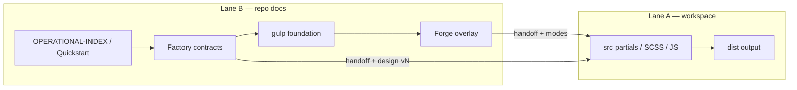

# Website Factory — Wave 1 operational topology

**Status:** **documented** — one hierarchy for Lane B operators.  
**Not:** ecosystem-wide governance map (use Tier 1 routers sparingly).

**Companion:** [wave1-operational-entity-map-v1.md](wave1-operational-entity-map-v1.md) · **Entry:** [frontend-operator-quickstart-v1.md](frontend-operator-quickstart-v1.md).

---

## Topology (top → bottom)

```text
MARS repo (Lane B — methodology & contracts)
│
├── OPERATIONAL-INDEX / Quickstart          ← session entry (Tier 2)
│
├── Website Factory (methodology + contracts)
│   ├── Planning: site-type registry, block registry, blueprints
│   ├── Design law: semantics + implementation-pack (per project vN)
│   ├── Frontend contracts: handoff, production rules, prompt discipline
│   └── Governance layer (Tier 3 — on demand only)
│
├── Foundation (canonical frontend SoT)
│   └── frontend-gulp-agent pack
│
├── Overlay
│   └── MARS Forge (Lite default — modes doc)
│
├── Implementation (external to repo SoT path)
│   └── workspaces/<project>/src → build → dist
│
├── Execution surface
│   └── Human + Cursor + terminal (no MARS orchestration)
│
├── Legacy (read-only context)
│   └── web-gpt-sources, archived v*, old briefs
│
└── Planned systems (honesty boundary)
    └── runtime, WPilot native WP, automated QA engines — not claimed
```

---

## Layer separation

| Layer | What it is | Operator rule |
|-------|------------|---------------|
| **Methodology** | Factory preferred practice (cadence, tokens, commercial UX, QA semantics). | Open **one domain** when task needs it — not breadth-first. |
| **Foundation** | Gulp agent pack + production rules + handoff consumption. | **Default law**; Forge cannot override silently. |
| **Overlays** | Forge phases, freeze, overlay checklists. | **Lite** unless task triggers Standard/Critical. |
| **Implementation** | Real `src/` edits and builds in workspace. | **src-first**; forbidden: `dist/` hand-fix. |
| **Execution** | Cursor session, shell, REPORT commit. | Chat ≠ SoT; evidence in REPORT. |
| **Governance** | `*-governance.md` corpora — frozen baseline, maintenance mode. | **No expansion** without human charter. |
| **Legacy** | Historical imports and archived versions. | **Never** drive new implementation. |
| **Planned** | Documented future bridges (WPilot, runtime). | Label **planned**; SAFE UNKNOWN for live state. |

---

## Session routing (Tier 0–3)

| Tier | Open |
|------|------|
| **0** | [README.md](../../README.md), [AGENTS.md](../../AGENTS.md) |
| **1** | Ecosystem question only — one governance router |
| **2** | [OPERATIONAL-INDEX.md](OPERATIONAL-INDEX.md) → **one Core Run row** OR [frontend-operator-quickstart-v1.md](frontend-operator-quickstart-v1.md) |
| **3** | Single governance doc / single Forge checklist when cited by task |

---

## Factory ↔ Forge ↔ Workspace flow



---

## What not to conflate

| Wrong merge | Correct split |
|-------------|---------------|
| Factory = running agent | Factory = **documentation system** |
| Forge = second Gulp system | Forge = **overlay discipline** |
| Governance doc = build command | Governance = **intent**; build = workspace |
| Block registry row = React component | Block = **planning ID**; component = **implementation unit** |
| Reference case = live production | Reference case = **example / battle test** |

---

## Wave 1 anchors (high-value only)

| Need | Doc |
|------|-----|
| Entities | [wave1-operational-entity-map-v1.md](wave1-operational-entity-map-v1.md) |
| Forge depth | [forge-operational-modes-v1.md](../../agents/mars-forge/forge-operational-modes-v1.md) |
| Section swap | [section-replacement-contract-v1.md](section-replacement-contract-v1.md) |
| Future UI systems | [frontend-foundation-blueprint-v1.md](frontend-foundation-blueprint-v1.md) |

---

*Wave 1 — topology clarification; does not replace [layer-map.md](layer-map.md) target architecture.*
