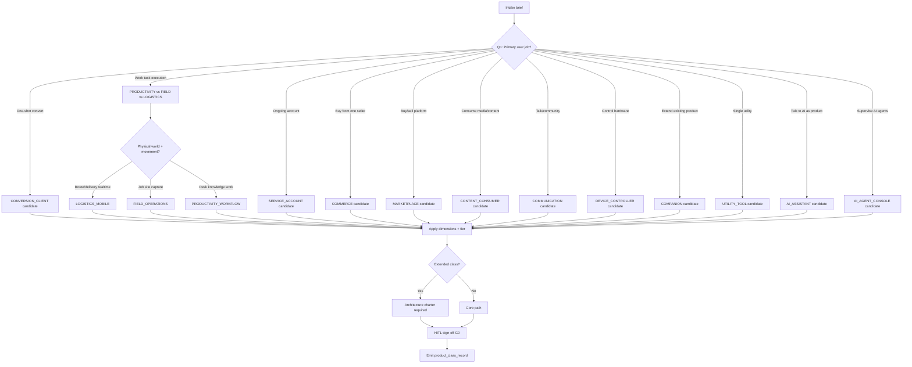

# NOVA Mobile Product Taxonomy v1

**Status:** design-only — Production Reality classification vocabulary, not runtime, not implementation
**Lane:** B · External Systems
**Version:** v1
**Foundation chain:** RBM → NOVA Production Model v1 → **this document** → NOVA Product Class Registry v1 → NOVA Mobile Product Lifecycle Model v1
**Non-claims:** no agents, no orchestration, no automated classification engine, no database schema, no folder structure

**Основание:** RBM (Reality Before Machinery) · NOVA Production Model v1
**Evidence base:** Website Factory Site Type Registry v0/v1, ORCA classification principles, явное разделение Mobile App Factory в репозитории MARS

**Recovery note:** Promoted from Cursor transcript `15bc9485-762c-4ce5-b27f-b4ee01ac3959` — faithful recovery pass v1 (2026-06-04).

---

## 1. Executive Summary

NOVA Mobile Product Taxonomy v1 — **первый слой Production Reality** для мобильного производства. Он отвечает не на вопрос «Flutter или React Native?», а на вопрос **«какой это продукт и как NOVA должен его производить?»**

Таксономия вводит:

| Элемент | Содержание |
|---------|------------|
| **11 Core Product Classes** | Основные классы, которые NOVA может производить по умолчанию |
| **4 Extended Product Classes** | Классы, требующие architecture charter до старта |
| **9 Classification Dimensions** | Оси, влияющие на контракты, QA и release |
| **4 Complexity Tiers** | T1–T4: от focused до platform-scale |
| **5 Mobile Modifiers** | Мобильные свойства, не являющиеся самостоятельными классами |
| **3 AI Product Classes** | Отдельные классы только там, где production path реально расходится |
| **PWA** | Delivery channel + architecture modifier, **не** product class |

**Ключевой тест класса:** если два продукта из разных классов требуют разных lifecycle contracts, QA emphasis, integration charter или release posture — они **должны** быть в разных классах.

**Урок Website Factory:** Site Type Registry — «первый классификационный слой» до strategy, IA, legal и QA ([`site-type-registry-v0.md`](projects/mars-website-factory/site-type-registry-v0.md), [`SITE-TYPE-REGISTRY-v1.md`](workspaces/website-factory-reference-v1/registry/SITE-TYPE-REGISTRY-v1.md)). Mobile apps явно **OUT OF SCOPE** для Website Factory v1 и отнесены к будущей Mobile App Factory ([`SITE-TYPE-IMPLEMENTATION-RULES-v1.md`](workspaces/website-factory-reference-v1/registry/SITE-TYPE-IMPLEMENTATION-RULES-v1.md)). NOVA заполняет этот пробел **без retrofit** Website Factory.

**Урок ORCA:** классификация сохраняет неоднозначность (`mixed_intent`), не форсирует «лучший guess», требует HITL на границах ([`intent-classification-system-v1.md`](projects/orca/semantic/intent-classification-system-v1.md), [`orca-operational-principles-v0.md`](projects/orca/orca-operational-principles-v0.md)).

---

## 2. Taxonomy Philosophy

### 2.1 Зачем существует таксономия

Мобильное производство без классификации производит **технически корректные, продуктово неверные** артефакты:

- legal pack для commerce применяется к utility tool;
- QA stress на store compliance там, где sideload-only internal app;
- architecture charter для marketplace строится для conversion funnel;
- AI copilot проектируется как standalone assistant.

Таксономия — **operational vocabulary**: стабильные `product_class_code`, которые downstream contracts, workflows и roles **читают**, но не «магически применяют».

### 2.2 Какие проблемы решает

| Проблема | Как решает таксономия |
|----------|----------------------|
| **Scope drift** | Фиксирует, что продукт *есть*, до выбора stack |
| **Wrong defaults** | Каждый class несёт default QA, legal, integration emphasis |
| **Hybrid confusion** | Primary class + secondary class + dimensions — явно |
| **Marketing mislabel** | «AI-powered CRM» → class `PRODUCTIVITY_WORKFLOW`, modifier `AI_COPILOT` |
| **Technology-first planning** | Flutter/React Native — **не** входят в taxonomy |
| **Silent best-guess** | Нет подходящего class → **SAFE UNKNOWN** + charter, не угадывание |

### 2.3 Почему RBM требует taxonomy на старте

RBM chain:

```
Reality → Lifecycle → Decisions → Contracts → Workflow → Roles → Tools → Agents → Automation
```

**Production Reality** включает: *какой продукт мы производим, для кого, с какой сложностью, в каком regulatory и mobile context*.

Без taxonomy:

- **Lifecycle** не знает, какие фазы обязательны (store review vs enterprise MDM);
- **Decisions** принимаются ad hoc («это же просто приложение»);
- **Contracts** (legal, integration, QA) не имеют anchor;
- **Workflow** копирует web-паттерны Website Factory без mobile reality.

Taxonomy — **первый committed artifact** NOVA intake, аналог `site_type_code` в Website Factory, но для mobile product reality.

---

## 3. Top-Level Product Classes

### 3.1 Структура: Core · Extended · Out of Scope

| Группа | Правило |
|--------|---------|
| **Core Classes** | Default production targets NOVA v1 |
| **Extended Classes** | Требуют explicit architecture charter + HITL до design freeze |
| **Out of Scope v1** | Не классифицируются в NOVA v1 без отдельного charter |

**Out of Scope v1 (не invent categories):**

- AAA games / game platforms
- OS-level system apps
- Pure SDK / developer tools (без end-user product surface)
- Hardware firmware UI (не mobile app product)

---

### 3.2 Core Classes

#### `CONVERSION_CLIENT`

| Поле | Значение |
|------|----------|
| **Описание** | Мобильный клиент для **разового или короткого** commercial action: заявка, бронь, звонок, калькулятор, onboarding в услугу |
| **Business purpose** | Конверсия трафика в lead / booking / trial start |
| **Primary users** | Prospects, local service seekers, campaign traffic |
| **Typical workflows** | Landing-equivalent flow: value → trust → CTA → form/call → confirmation |
| **Lifecycle complexity** | Low–medium: быстрые итерации, частые A/B, мало persistent state |
| **Release complexity** | Low–medium: store presence опциональна; web-wrapper возможен |

**NOVA build difference vs others:** минимальный account model, conversion QA dominant, legal focused on consent/forms, не subscription lifecycle.

*Evidence parallel:* Website Factory `LANDING`, `service_landing`.

---

#### `SERVICE_ACCOUNT`

| Поле | Значение |
|------|----------|
| **Описание** | Постоянные отношения с сервисом: личный кабинет, статусы, документы, поддержка, подписка |
| **Business purpose** | Retention, self-service, снижение нагрузки на support |
| **Primary users** | Existing customers / subscribers |
| **Typical workflows** | Auth → dashboard → transactions/history → support → notifications |
| **Lifecycle complexity** | Medium–high: account states, billing hooks, long retention |
| **Release complexity** | Medium: auth security, data privacy, regression on account flows |

**NOVA build difference:** session/security contracts, notification strategy, account QA matrix — не conversion-first.

*Evidence parallel:* Website Factory `SAAS` account surface (не marketing shell).

---

#### `CONTENT_CONSUMER`

| Поле | Значение |
|------|----------|
| **Описание** | Потребление контента: статьи, видео, аудио, курсы-as-content, новости |
| **Business purpose** | Engagement, subscription/ads monetization, brand reach |
| **Primary users** | Readers, viewers, learners (passive-to-active consumption) |
| **Typical workflows** | Browse → open → consume → bookmark/share → (optional) paywall |
| **Lifecycle complexity** | Medium: content freshness, CDN, offline reading optional |
| **Release complexity** | Medium: media performance, accessibility, copyright |

**NOVA build difference:** content delivery architecture, media QA, offline/cache policy — не transaction QA.

---

#### `COMMERCE`

| Поле | Значение |
|------|----------|
| **Описание** | Single-vendor shopping: catalog → cart → checkout → order tracking |
| **Business purpose** | Direct product sales |
| **Primary users** | Buyers of one merchant/brand |
| **Typical workflows** | Browse PLP/PDP → cart → payment → order status → returns |
| **Lifecycle complexity** | High: inventory sync, payments, order states |
| **Release complexity** | High: payment compliance, PCI-adjacent flows, store billing rules |

**NOVA build difference:** cart/payment contracts, commerce legal pack, order-state QA.

*Evidence parallel:* Website Factory `ECOMMERCE`, `CATALOG`.

---

#### `PRODUCTIVITY_WORKFLOW`

| Поле | Значение |
|------|----------|
| **Описание** | Выполнение рабочих задач: CRM mobile, approvals, tickets, documents, team coordination |
| **Business purpose** | Operational efficiency for knowledge/service workers |
| **Primary users** | Employees, managers, field office staff |
| **Typical workflows** | Task inbox → act → sync → audit trail → handoff |
| **Lifecycle complexity** | Medium–high: role permissions, sync, audit |
| **Release complexity** | Medium–high: enterprise auth, data residency, regression on workflows |

**NOVA build difference:** role-based contracts, audit QA, integration-heavy — не consumer store marketing.

*Distinct from `FIELD_OPERATIONS`:* desk/knowledge work vs physical-world task execution.

---

#### `FIELD_OPERATIONS`

| Поле | Значение |
|------|----------|
| **Описание** | Работа **исполнителя** в физическом мире: inspection, maintenance, audit, inventory count, healthcare visit |
| **Business purpose** | Capture proof-of-work, compliance, dispatch completion |
| **Primary users** | Technicians, inspectors, nurses, auditors |
| **Typical workflows** | Receive job → navigate → capture data/photos → sign-off → sync |
| **Lifecycle complexity** | High: offline-first often, device sensors, geo |
| **Release complexity** | High: offline sync QA, data integrity, rugged usage |

**NOVA build difference:** offline-first architecture charter, device integration QA, location permissions — кардинально иной production path.

---

#### `LOGISTICS_MOBILE`

| Поле | Значение |
|------|----------|
| **Описание** | Courier/driver/restaurant/warehouse **movement** operations: routes, pickups, handoffs, real-time status |
| **Business purpose** | Throughput and SLA of physical delivery/logistics |
| **Primary users** | Drivers, couriers, dispatch-linked operators |
| **Typical workflows** | Accept route → navigate → scan/confirm → exception handling → complete |
| **Lifecycle complexity** | High: real-time, background location, shift sessions |
| **Release complexity** | Very high: background modes, battery, location policy, store scrutiny |

**NOVA build difference vs `FIELD_OPERATIONS`:** real-time routing, background location, shift lifecycle — отдельный class оправдан.

---

#### `COMMUNICATION`

| Поле | Значение |
|------|----------|
| **Описание** | Messaging, calls, communities, feeds with **social graph** or conversation as core |
| **Business purpose** | Connection, community retention, communication utility |
| **Primary users** | General consumers or community members |
| **Typical workflows** | Connect → converse/post → notify → moderate (platform-side) |
| **Lifecycle complexity** | High: realtime, moderation, abuse, retention loops |
| **Release complexity** | High: UGC policy, privacy, store content rules |

**NOVA build difference:** realtime infrastructure, moderation/legal, notification depth — не workflow audit trail.

---

#### `COMPANION`

| Поле | Значение |
|------|----------|
| **Описание** | Мобильное **продолжение** существующего продукта (web/desktop/SaaS/IoT platform) |
| **Business purpose** | Mobile reach for established product; parity or focused subset |
| **Primary users** | Existing product users |
| **Typical workflows** | Auth with main product → subset of features → sync state |
| **Lifecycle complexity** | Medium: bounded by parent product roadmap |
| **Release complexity** | Medium: API contract lock with parent, version coupling |

**NOVA build difference:** parent product contract is SoT; mobile is derivative surface — другой intake и release coupling.

*Evidence parallel:* Website Factory «web companion only» boundary for SAAS.

---

#### `DEVICE_CONTROLLER`

| Поле | Значение |
|------|----------|
| **Описание** | Управление физическим устройством: smart home, wearable, BLE gadget, industrial controller |
| **Business purpose** | Device pairing, control, monitoring, firmware-adjacent UX |
| **Primary users** | Device owners, installers |
| **Typical workflows** | Pair → configure → control/monitor → alerts → OTA (optional) |
| **Lifecycle complexity** | High: hardware variance, pairing failures, firmware states |
| **Release complexity** | High: Bluetooth/NFC permissions, hardware QA matrix |

**NOVA build difference:** hardware integration charter обязателен до UX freeze.

---

#### `UTILITY_TOOL`

| Поле | Значение |
|------|----------|
| **Описание** | Single-purpose tool: converter, scanner, timer, simple tracker без platform dynamics |
| **Business purpose** | Utility value, ads/subscription optional |
| **Primary users** | Task-focused users |
| **Typical workflows** | Open → perform task → (optional) save/share |
| **Lifecycle complexity** | Low: minimal backend, local-first possible |
| **Release complexity** | Low: fast iteration, narrow QA surface |

**NOVA build difference:** minimal contracts, no account/commerce defaults — **не** строить как mini-SaaS без явного charter.

---

### 3.3 Extended Classes (architecture charter required)

#### `MARKETPLACE`

| Поле | Значение |
|------|----------|
| **Описание** | Multi-sided: buyers + sellers + (optional) operators; listings, trust, disputes |
| **Business purpose** | Platform GMV, network effects |
| **Primary users** | Buyers, sellers, moderators, support |
| **Typical workflows** | List → discover → transact → settle → review/dispute |
| **Lifecycle complexity** | Very high |
| **Release complexity** | Very high: payments split, fraud, multi-role QA |

*Evidence parallel:* Website Factory Extended `MARKETPLACE`.

---

#### `FINTECH_WALLET`

| Поле | Значение |
|------|----------|
| **Описание** | Payments, wallets, transfers, trading, lending mobile surfaces |
| **Business purpose** | Regulated financial operations |
| **Primary users** | Account holders, traders |
| **Typical workflows** | KYC → fund → transact → statements → support |
| **Lifecycle complexity** | Very high: regulatory, audit, fraud |
| **Release complexity** | Very high: licensing, store financial policy, security audits |

**Отдельный class от `COMMERCE`:** regulated money movement ≠ merchant checkout.

---

#### `HEALTH_MEDICAL`

| Поле | Значение |
|------|----------|
| **Описание** | Clinical, diagnostic, patient data, telehealth beyond generic field ops |
| **Business purpose** | Care delivery or regulated health data |
| **Primary users** | Patients, clinicians (role-separated) |
| **Typical workflows** | Intake → session/record → follow-up → compliance logging |
| **Lifecycle complexity** | Very high: HIPAA-class concerns, clinical validity |
| **Release complexity** | Very high: regulatory HITL mandatory |

**Не merge с `FIELD_OPERATIONS`:** regulatory and clinical QA — другой production universe.

---

#### `AI_AGENT_CONSOLE`

| Поле | Значение |
|------|----------|
| **Описание** | Human supervises **autonomous or semi-autonomous agents**: approve, redirect, audit agent actions |
| **Business purpose** | Operational control over agentic automation |
| **Primary users** | Operators, supervisors, power users |
| **Typical workflows** | Monitor agent → intervene → approve/reject → audit trail |
| **Lifecycle complexity** | Very high: safety, failure modes, escalation |
| **Release complexity** | Very high: AI safety QA, HITL gates, liability |

*(Подробный анализ AI classes — §7)*

---

## 4. Classification Dimensions

Dimensions **не заменяют** product class; они **уточняют** production decisions внутри class.

| Dimension | Values | Влияет на |
|-----------|--------|-----------|
| **`audience`** | `consumer` · `prosumer` · `business` · `employee` | Auth model, distribution, legal tone |
| **`distribution`** | `public_store` · `enterprise_mdm` · `sideload` · `web_installable` | Release path, QA store matrix |
| **`connectivity`** | `online_only` · `offline_capable` · `offline_first` | Architecture, sync QA |
| **`interaction_mode`** | `consume` · `transact` · `operate` · `communicate` · `monitor` · `create` | UX priorities, QA focus |
| **`user_model`** | `single_user` · `account` · `multi_role` · `multi_party` | Permissions contracts |
| **`monetization`** | `free` · `ads` · `subscription` · `transaction` · `mixed` | Legal, billing, store rules |
| **`device_integration`** | `none` · `standard` (camera, GPS) · `deep` (BLE, NFC, sensors) | Hardware charter, permissions QA |
| **`location_dependency`** | `none` · `contextual` · `critical` | Maps, background location, privacy |
| **`regulatory_domain`** | `standard` · `regulated` · `children` | HITL depth, legal pack |

**Derived, not assumed:** consumer vs business — **dimension**, не class (employee banking = `SERVICE_ACCOUNT` + `audience: employee`).

**Hybrid rule (из ORCA/Website Factory):** один **primary** `product_class_code` + опциональный **secondary** + explicit dimension set. Silent hybrid запрещён.

---

## 5. Complexity Tiers

Tiers описывают **production load**, не «качество продукта».

| Tier | Name | Profile | Architecture | QA | Release |
|------|------|---------|--------------|-----|---------|
| **T1** | Focused | Single primary flow, minimal roles, local or simple API | Thin client, optional backend | Functional, a11y baseline, device matrix narrow | Fast cadence, low store risk |
| **T2** | Connected | Auth, persistent accounts, moderate integrations | API contract, state management, push | Regression suite, integration smoke, security baseline | Store review standard, privacy labels |
| **T3** | Multi-surface | Payments **or** realtime **or** offline sync **or** multi-role | Domain architecture charter, modular boundaries | Domain QA matrices (commerce, realtime, offline) | Staged rollout, feature flags, rollback plan |
| **T4** | Platform-scale | Marketplace, fintech, health, agent console, multi-party | Platform architecture charter, role separation, fraud/safety | Compliance QA, load, abuse, audit, penetration-adjacent review | Compliance gates, legal sign-off, phased geography |

**Mapping guidance:**

| Class | Default tier | Can reach |
|-------|--------------|-----------|
| `UTILITY_TOOL` | T1 | T2 if accounts added |
| `CONVERSION_CLIENT` | T1–T2 | T3 with complex integrations |
| `CONTENT_CONSUMER` | T2 | T3 with paywall/subscription |
| `SERVICE_ACCOUNT` | T2–T3 | T4 if fintech adjacency |
| `COMMERCE` | T3 | T4 multi-region |
| `PRODUCTIVITY_WORKFLOW` | T2–T3 | T4 enterprise |
| `FIELD_OPERATIONS` | T3 | T4 regulated vertical |
| `LOGISTICS_MOBILE` | T3–T4 | — |
| `COMMUNICATION` | T3–T4 | — |
| `COMPANION` | T2–T3 | inherits parent |
| Extended classes | T4 minimum | — |

*Evidence parallel:* Website Factory matrix complexity column (`low` → `very high`) in [`SITE-TYPE-MATRIX-v1.md`](workspaces/website-factory-reference-v1/registry/SITE-TYPE-MATRIX-v1.md).

---

## 6. Mobile-Specific Product Classes

Следующие категории **часто ошибочно** выделяют как top-level classes. Анализ:

| Candidate | Verdict | Placement |
|-----------|---------|-----------|
| **Field Service** | Not standalone class | → `FIELD_OPERATIONS` |
| **Delivery** | Standalone justified | → `LOGISTICS_MOBILE` (real-time/background differs) |
| **Location-dependent** | Modifier | → dimension `location_dependency: contextual/critical` |
| **Device-integrated** | Modifier | → dimension `device_integration: deep` |
| **Offline-first ops** | Modifier | → dimension `connectivity: offline_first` on `FIELD_OPERATIONS` / `LOGISTICS_MOBILE` |
| **Push-driven engagement** | Production concern | → lifecycle/notifications contract, not class |
| **Wearable companion** | Variant | → `COMPANION` or `DEVICE_CONTROLLER` by primary job |
| **Super app** | Extended composite | → primary class + secondary class charter (e.g. `COMMERCE` + `SERVICE_ACCOUNT`) |

### 6.1 Mobile Modifiers (official vocabulary)

Модификаторы **добавляются** к class + dimensions:

| Modifier code | Meaning | Production trigger |
|---------------|---------|-------------------|
| `MLOC` | Mobile location-critical | Maps SDK, background location QA |
| `MOFF` | Mobile offline-first | Sync engine, conflict resolution QA |
| `MDEV` | Mobile device-integrated | Hardware test matrix, pairing flows |
| `MPUSH` | Push-centric retention | Notification channels, permission UX |
| `MBG` | Background execution | Battery, OS background limits, store review |

Modifiers **не умножают** taxonomy бесконечно: max **2 modifiers** per project без architecture charter.

---

## 7. AI Product Classes

### 7.1 Анализ кандидатов

| Candidate | Primary interface? | Different lifecycle? | Verdict |
|-----------|-------------------|----------------------|---------|
| **AI Assistant** | Often yes | Medium: conversation UX, model routing, safety | **Class: `AI_ASSISTANT`** (Core) |
| **AI Copilot** | No — embedded in workflow | Low alone — follows host class | **Modifier: `AI_COPILOT`**, not class |
| **AI Workflow Tool** | Partial | Medium — structured AI steps | **Absorbed:** host class (`PRODUCTIVITY_WORKFLOW`) + `AI_COPILOT` |
| **AI Agent Interface** | Yes — supervision console | Very high — safety, audit, escalation | **Class: `AI_AGENT_CONSOLE`** (Extended) |

### 7.2 `AI_ASSISTANT` (Core)

- **Описание:** conversational product where **chat/voice is the main surface** (support bot, general assistant, tutor bot).
- **NOVA difference:** prompt/safety contracts, conversation QA, model fallback, content policy — **не** optional add-on.
- **Not** `AI_COPILOT`: copilot без standalone conversational shell не получает этот class.

### 7.3 `AI_COPILOT` (Modifier)

- **Описание:** AI assists **inside** another product class (suggest reply in CRM, summarize ticket, generate report).
- **Production:** inherits host class contracts + AI augmentation appendix (safety, logging, human override).
- **Why not class:** NOVA builds `PRODUCTIVITY_WORKFLOW` first; AI layer does not change store/legal/release class by itself.

### 7.4 `AI_AGENT_CONSOLE` (Extended)

- **Описание:** human supervises agents with tool use, multi-step autonomy, approval gates.
- **NOVA difference:** escalation protocols, audit immutability, kill-switch, liability HITL — **T4 mandatory**.
- **Distinct from `AI_ASSISTANT`:** assistant **responds**; agent console **governs autonomous action**.

### 7.5 Anti-pattern

«AI-powered marketplace» ≠ new class. → `MARKETPLACE` + optional `AI_COPILOT` modifier + tier T4.

---

## 8. PWA Position

### 8.1 Решение

**PWA — delivery channel + architecture modifier, не product class.**

| Layer | PWA role |
|-------|----------|
| **Product class** | Unchanged (`COMMERCE` remains `COMMERCE`) |
| **Dimension `distribution`** | Value: `web_installable` |
| **Architecture modifier** | `PWA_SHELL` when installable web stack chosen |

### 8.2 Reasoning

1. **Website Factory precedent:** responsive web in scope; app store/native SDK — Mobile Factory ([`SITE-TYPE-IMPLEMENTATION-RULES-v1.md`](workspaces/website-factory-reference-v1/registry/SITE-TYPE-IMPLEMENTATION-RULES-v1.md)). PWA — bridge, not new product species.
2. **Build-difference test:** PWA marketplace vs native marketplace — **same** `MARKETPLACE` class; different **delivery** and **capability constraints** (push, background, store policies).
3. **When PWA changes production materially:** apply modifiers (`MOFF`, `MPUSH`, `MBG`) and tier bump — not new class.

### 8.3 PWA capability ceiling rule

If product **requires** deep native capabilities (background location for `LOGISTICS_MOBILE`, BLE for `DEVICE_CONTROLLER`) → PWA may be **disallowed** or **partial** — recorded as **Decision** artifact, not reclassification.

---

## 9. Lifecycle Impact Matrix

NOVA phases (conceptual, from RBM — **not designed here**, referenced for matrix):

`INTAKE → CLASSIFY → PRODUCT_DEF → ARCHITECTURE → DESIGN → BUILD → QA → LEGAL/STORE → RELEASE → HANDOFF`

| Class | Critical phases | Critical QA | Critical release risks |
|-------|-----------------|-------------|------------------------|
| `CONVERSION_CLIENT` | PRODUCT_DEF, DESIGN | Conversion, form a11y, claim honesty | Misleading claims, store rejection for metadata |
| `SERVICE_ACCOUNT` | ARCHITECTURE, QA | Auth/session, data privacy, regression | Account lockout, data leak |
| `CONTENT_CONSUMER` | DESIGN, BUILD | Media perf, offline cache, a11y | Copyright, region restrictions |
| `COMMERCE` | ARCHITECTURE, LEGAL/STORE | Payment flows, cart edge cases | Store IAP policy, PCI-adjacent failures |
| `PRODUCTIVITY_WORKFLOW` | ARCHITECTURE, QA | Role permissions, audit trail | Enterprise auth failure, data loss on sync |
| `FIELD_OPERATIONS` | ARCHITECTURE, BUILD | Offline sync, photo/geo integrity | Offline data loss, permission denial |
| `LOGISTICS_MOBILE` | ARCHITECTURE, BUILD | Background location, battery, realtime | Store location policy, SLA failures |
| `COMMUNICATION` | ARCHITECTURE, LEGAL/STORE | Moderation, abuse, realtime | UGC policy violation, privacy |
| `COMPANION` | INTAKE, ARCHITECTURE | API parity, version coupling | Parent API break, feature drift |
| `DEVICE_CONTROLLER` | ARCHITECTURE, BUILD | Pairing matrix, failure recovery | Hardware fragmentation, BT permissions |
| `UTILITY_TOOL` | DESIGN | Core task correctness | Over-scoping into account/commerce |
| `MARKETPLACE` | All; ARCHITECTURE dominant | Multi-role, payments, fraud | Regulatory, dispute flows |
| `FINTECH_WALLET` | LEGAL/STORE dominant | Security, KYC, transaction audit | Licensing, store financial review |
| `HEALTH_MEDICAL` | LEGAL/STORE dominant | Clinical data, consent | Regulatory halt |
| `AI_ASSISTANT` | PRODUCT_DEF, QA | Safety, hallucination, escalation | Content policy, harmful output |
| `AI_AGENT_CONSOLE` | ARCHITECTURE, QA, LEGAL | Kill-switch, audit, tool-use safety | Autonomous harm, liability |

---

## 10. Classification Engine

Human-operated decision process (ORCA HITL + Website Factory S02 pattern). **No automation claimed.**

### 10.1 Trigger

New project enters NOVA → **Classification Gate G0** before PRODUCT_DEF freeze.

### 10.2 Input artifacts

- Product brief / client request
- Audience and business model statement
- Existing product (if companion)
- Known integrations and compliance hints
- **Evidence or SAFE UNKNOWN** (ORCA principle)

### 10.3 Question sequence



### 10.4 Question bank (minimum)

| # | Question | Determines |
|---|----------|------------|
| Q1 | What is the **primary job** the user hires the app to do? | Primary class |
| Q2 | Is value **one-shot** or **ongoing relationship**? | CONVERSION vs SERVICE_ACCOUNT |
| Q3 | Is money movement **regulated** or **platform-settled**? | FINTECH vs COMMERCE vs MARKETPLACE |
| Q4 | Is the user **moving in physical world** under SLA? | LOGISTICS vs FIELD vs PRODUCTIVITY |
| Q5 | Is mobile **primary product** or **extension** of existing? | COMPANION vs native class |
| Q6 | Is conversational AI **the product** or **feature inside**? | AI_ASSISTANT vs AI_COPILOT modifier |
| Q7 | Does autonomous action require **human supervision console**? | AI_AGENT_CONSOLE |
| Q8 | Who is allowed to install: public, enterprise, sideload? | `distribution` dimension |
| Q9 | Can core value work **offline**? | `connectivity` + MOFF modifier |
| Q10 | Does release require **regulated/legal** sign-off? | Tier bump, HITL depth |

### 10.5 Output artifact: `product_class_record`

| Field | Required |
|-------|----------|
| `product_class_code` | Yes (primary) |
| `product_class_secondary` | If hybrid |
| `complexity_tier` | T1–T4 |
| `dimensions` | Set from §4 |
| `mobile_modifiers` | 0–2 |
| `ai_modifier` | `none` · `AI_COPILOT` · n/a if AI class |
| `delivery` | native · cross-platform · `PWA_SHELL` |
| `classification_rationale` | Evidence-linked prose |
| `hitl_g0_approver` | Human sign-off |
| `safe_unknowns` | Explicit gaps |

### 10.6 Disambiguation rules

1. **No fit** → `SAFE UNKNOWN` + charter proposal; **no silent default**.
2. **Tie between two classes** → choose class with **higher lifecycle cost** as primary (fail-safe).
3. **`mixed` intent** (ORCA) → document both; pick primary by **business revenue path**.
4. **Marketing label ignored** — classify by **production path**.

---

## 11. Anti-Chaos Rules

| Rule | Enforcement |
|------|-------------|
| **AC-1: Max 15 active classes** | Core 11 + Extended 4 in v1; new class requires charter + merge review |
| **AC-2: Max 2 mobile modifiers** | Third modifier → tier bump or class split review |
| **AC-3: No stack-driven classes** | Forbidden: `FLUTTER_APP`, `IOS_APP`, `RN_APP` |
| **AC-4: No marketing classes** | Forbidden: `AI-powered`, `Innovative`, `SuperApp` as code |
| **AC-5: Companion never primary for parity apps** | If >60% features mirror parent → `COMPANION` |
| **AC-6: Copilot never standalone** | `AI_COPILOT` requires host `product_class_code` |
| **AC-7: Extended cannot downgrade silently** | `MARKETPLACE → COMMERCE` needs re-classification G0 |
| **AC-8: Hybrid explicit** | Primary + secondary + rationale — always |
| **AC-9: Dimension ≠ class** | `employee` is dimension, not `INTERNAL_ENTERPRISE` class |
| **AC-10: Annual pruning review** | Unused classes merge or deprecate — documentation-only |

---

## 12. RBM Mapping

```
REALITY          ← Taxonomy lives HERE (Production Reality)
  │
  ├─ product_class_record
  ├─ dimensions + tier + modifiers
  └─ evidence / SAFE UNKNOWN on gaps
  │
LIFECYCLE        ← Matrix §9: which phases critical per class
  │
DECISIONS        ← PWA allowed? tier bump? extended charter?
  │
CONTRACTS        ← Legal pack, integration, QA, store, AI safety appendices
  │
WORKFLOW         ← NOVA stage graph varies by class (future design)
  │
ROLES            ← Classifier (human), architect, QA lead profiles (future)
  │
TOOLS            ← Helpers read product_class_code (future)
  │
AGENTS           ← Propose classification; human approves G0 (future)
  │
AUTOMATION       ← Last; only after stable taxonomy usage (future)
```

**Почему taxonomy в начале:**

RBM утверждает: machinery (workflows, agents, automation) **не может** precede reality. Без shared product reality каждый следующий слой inventing own assumptions — паттерн, который Website Factory устраняет через Site Type Registry как **первый** слой, а ORCA — через evidence-first classification до strategy.

Taxonomy — **не** workflow, **не** tool, **не** agent. Это **vocabulary of reality** для NOVA mobile production.

---

## 13. Risks

| Risk | Severity | Mitigation |
|------|----------|------------|
| **Taxonomy drift from real projects** | High | G0 HITL + annual pruning (AC-10) |
| **Over-classification (class explosion)** | Medium | AC-1, modifiers instead of classes |
| **Under-classification (everything → COMPANION or UTILITY)** | Medium | Build-difference test in reviews |
| **Website Factory identity bleed** | Medium | Separate codes; no `LANDING` in mobile registry |
| **AI hype classes** | High | AI modifier vs class rules §7 |
| **PWA false simplification** | Medium | Capability ceiling rule §8.3 |
| **Regulatory mis-tiering** | High | HEALTH/FINTECH force Extended + T4 |
| **Premature automation of classifier** | High | Human G0 until pattern stability — ORCA lesson |

---

## 14. SAFE UNKNOWN

| Topic | Status |
|-------|--------|
| **NOVA Production Model v1 full text in repo** | **UNKNOWN** — RBM/NOVA referenced by user as approved; in-repo paths for NOVA Foundation **not found** at design time |
| **Exact NOVA phase names and count** | **UNKNOWN** — matrix uses conceptual phases only |
| **Mobile legal pack scope** | **UNKNOWN** — Website Factory legal explicitly excludes Mobile App Factory |
| **Store-specific rules by geography** | **UNKNOWN** — tier implications documented; country matrix deferred |
| **Cross-platform delivery default (native vs PWA vs hybrid)** | **UNKNOWN** — taxonomy records decision; does not mandate stack |
| **Game/creator economy classes** | **UNKNOWN** — out of scope v1; charter needed if NOVA expands |
| **Machine-readable registry format** | **UNKNOWN** — v1 is design vocabulary (Website Factory v0 precedent) |
