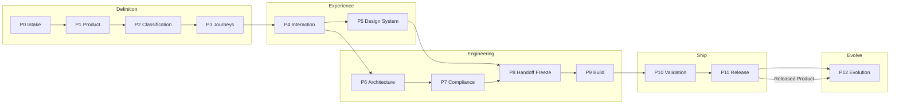

# NOVA Production Model v1

**Status:** design-only — production methodology vocabulary, not runtime, not agents, not folder structure
**Lane:** B · External Systems
**Version:** v1
**Foundation chain:** RBM → **this document** → NOVA Mobile Product Taxonomy v1 → NOVA Product Class Registry v1 → NOVA Mobile Product Lifecycle Model v1
**Non-claims:** no agents, no runtime, no folder structure, no implementation plan, no governance expansion

**Evidence base:** MARS structural coherence audit (`governance/mars-v2-structural-coherence-audit-v0.md`), Website Factory workflow (`projects/mars-website-factory/website-factory-workflow-v0.md`), ORCA freeze/approval patterns (`projects/orca/freeze/`), WPilot safety model (`projects/wpilot/`), MetaBOT external boundaries (`projects/metabot-seo-content-agent/`), Survivability pack (`projects/mars-survivability/`), MARS Core posture (`AGENTS.md`, `web-gpt-sources/mars-v2-final/08_MARS_v2_OPERATIONAL_EVOLUTION_STATE.md`)

**Recovery note:** Promoted from Cursor transcript `06ecf323-6610-47f6-8590-d4a767a5eb8a` — faithful recovery pass v1 (2026-06-04).

---

## 1. Executive Summary

NOVA is a **planned production methodology** for how MARS should take a **mobile application from idea to released product** and through **post-release evolution**. It is **not** an agent system, orchestrator, or runtime.

The central design decision — supported by the ecosystem audit — is:

> **Production model first. Agent architecture later (if ever).**

MARS already proves that documentation-first, human-supervised, contract-driven production works for websites (Website Factory), semantic PPC (ORCA), external WordPress bridges (WPilot), and external n8n workflows (MetaBOT). NOVA adapts those lessons for **mobile-specific constraints**: platform scope, store policies, device matrices, permissions, signing, distribution channels, and rollback under live-user conditions.

NOVA defines **12 production phases** (P0–P11) plus **Post-Release Evolution** (P12). Each phase has explicit purpose, inputs, outputs, artifacts, approval gates, QA gates, freeze points, and failure risks.

**Derived lifecycle (high level):**

```text
Idea
 → P0 Charter & Intake
 → P1 Product Definition
 → P2 Mobile Classification & Distribution Strategy
 → P3 User Journeys & Scope Architecture
 → P4 Experience & Interaction Contract
 → P5 Visual & Design System
 → P6 Technical & Data Architecture
 → P7 Compliance, Privacy & Permissions
 → P8 Build Preparation & Handoff Freeze
 → P9 Implementation Build
 → P10 Validation & Device QA
 → P11 Release Preparation & Store Submission
 → Released Product
 → P12 Post-Release Evolution
```

**Operating reality (aligned with MARS Phase 1 posture):**

```text
Human operator + Cursor + contracts/runbooks + REPORT + explicit git
```

---

## 2. Production Lifecycle

### 2.1 Required analysis — stage taxonomy

| # | Question | Answer |
|---|----------|--------|
| 1 | What stages exist? | P0–P12 as defined below |
| 2 | Mandatory stages | P0, P1, P2, P3, P4, P6, P7 (if store-bound), P8, P9, P10, P11 (if public release), P12 (ongoing) |
| 3 | Optional stages | P5 (visual/design system — skippable only for utilitarian/internal MVPs with explicit waiver); P3 depth (competitive/market analysis); P7 lite (non-store internal builds with charter) |
| 4 | Human approval required | P0 scope, P1 product sign-off, P2 platform/distribution, P4 interaction freeze, P5 design freeze (if P5 run), P6 architecture, P7 compliance, P8 handoff freeze, P10 final validation go/no-go, P11 release/store submission, P12 major evolution charter |
| 5 | Artifact-producing | All phases except pure conversational exploration within P0 before charter draft |
| 6 | QA required | P3 (journey completeness), P4 (interaction QA), P5 (design QA), P9 (build smoke), P10 (full validation matrix), P11 (release candidate QA), P12 (regression on each evolution batch) |
| 7 | Freeze points | P1 scope freeze, P4 interaction contract freeze, P5 design system freeze, P6 API/data contract freeze, P8 implementation handoff freeze, P11 release candidate freeze |
| 8 | High rework if skipped | P1 (scope chaos), P2 (wrong platform), P3 (broken flows), P4 (implementation drift), P6 (backend rework), P7 (store rejection), P8 (handoff ambiguity), P10 (device failures in production) |

### 2.2 Lifecycle map



**Note:** P5 and P6 can run in parallel after P4 freeze, but **P8 cannot start** until both streams reach their respective freeze criteria.

---

## 3. Phase-by-Phase Model

### P0 — Idea Charter & Intake

| Dimension | Definition |
|-----------|------------|
| **Purpose** | Capture the idea, business intent, constraints, and decision to pursue mobile production inside MARS |
| **Inputs** | Stakeholder notes, market hypothesis, existing product context, compliance sensitivity flags |
| **Outputs** | Idea charter draft, `scope_in` / `scope_out`, open questions, risk hypothesis |
| **Required artifacts** | `NOVA-IDEA-CHARTER-v1` (problem, audience, success signal, constraints, owner) |
| **Approval gates** | **G0** — product owner confirms charter accuracy |
| **QA gates** | Completeness: problem, audience, constraints, approval chain identified |
| **Freeze points** | None (exploratory) |
| **Failure risks** | Vague idea → entire downstream chain invents scope; AI fills gaps with fiction |

---

### P1 — Product Definition

| Dimension | Definition |
|-----------|------------|
| **Purpose** | Convert idea into a bounded product definition: jobs-to-be-done, MVP boundary, non-goals, metrics |
| **Inputs** | Approved P0 charter |
| **Outputs** | Product definition doc, MVP feature list, explicit non-goals, success metrics |
| **Required artifacts** | `NOVA-PRODUCT-DEFINITION-v1`, feature/non-feature matrix |
| **Approval gates** | **G1** — product owner approves MVP boundary |
| **QA gates** | Internal consistency: every MVP feature maps to a user job; no orphan features |
| **Freeze points** | **F1 — Scope freeze** (MVP in/out locked) |
| **Failure risks** | Scope creep; “while we're building the app” expansion; undocumented non-goals |

**Mandatory.** Skipping → unbounded build and unrecoverable timeline drift (Website Factory intake lesson).

---

### P2 — Mobile Classification & Distribution Strategy

| Dimension | Definition |
|-----------|------------|
| **Purpose** | Decide *what kind of mobile product this is* and *how it reaches users* — mobile-specific gate absent in web factory |
| **Inputs** | Product definition, technical constraints, business model |
| **Outputs** | Classification record, platform scope, distribution model, stack posture (**SAFE UNKNOWN** until decided) |
| **Required artifacts** | `NOVA-MOBILE-CLASSIFICATION-v1` covering: app type (native / cross-platform / hybrid), platform scope (iOS, Android, both), distribution (public store, enterprise, sideload, TestFlight-only), offline requirements, backend dependency class |
| **Approval gates** | **G2** — product + technical lead approve classification |
| **QA gates** | Classification consistent with P1; no contradictory platform claims |
| **Freeze points** | **F2 — Platform & distribution freeze** |
| **Failure risks** | Wrong platform choice → full rebuild; store-incompatible architecture chosen late |

**Mandatory.** This is the mobile equivalent of Website Factory Site Type Classification — adapted, not copied.

**Optional sub-analysis:** competitive landscape (only if charter requires it).

---

### P3 — User Journeys & Scope Architecture

| Dimension | Definition |
|-----------|------------|
| **Purpose** | Map critical user journeys, screen inventory, navigation model, and content/state requirements |
| **Inputs** | Product definition, classification, strategy notes (if any) |
| **Outputs** | Journey map, screen inventory, navigation spec, state requirements |
| **Required artifacts** | `NOVA-JOURNEY-MAP-v1`, `NOVA-SCREEN-INVENTORY-v1` |
| **Approval gates** | **G3** — PM confirms journeys cover MVP success path |
| **QA gates** | Journey completeness: no dead-end critical paths; auth/onboarding/error paths defined |
| **Freeze points** | Soft freeze on screen inventory (changes trigger P4 invalidation) |
| **Failure risks** | Missing edge flows (offline, permissions denied, empty states) → expensive P9 rework |

**Mandatory.** Equivalent to Website Factory IA — required before experience contract.

---

### P4 — Experience & Interaction Contract

| Dimension | Definition |
|-----------|------------|
| **Purpose** | Define interaction semantics, screen behaviors, states, and handoff-ready experience rules **before implementation** |
| **Inputs** | Journey map, screen inventory, classification constraints |
| **Outputs** | Interaction contract per screen/group; loading/empty/error states; gesture/navigation rules |
| **Required artifacts** | `NOVA-INTERACTION-CONTRACT-v1` (semantic authority layer — ORCA-inspired) |
| **Approval gates** | **G4** — product + UX authority approve interaction contract |
| **QA gates** | Contract completeness vs screen inventory; all critical states defined |
| **Freeze points** | **F3 — Interaction contract freeze** |
| **Failure risks** | Implementation interprets UX from chat memory → silent drift (Factory R-WF-01 lesson) |

**Mandatory.** This is NOVA's semantic authority gate — analogous to ORCA JSON SoT and Factory blueprint freeze, adapted for mobile UX semantics.

---

### P5 — Visual & Design System *(conditionally mandatory)*

| Dimension | Definition |
|-----------|------------|
| **Purpose** | Produce visual language, component inventory, tokens, and screen designs aligned to interaction contract |
| **Inputs** | Frozen P4 contract, brand inputs (if any) |
| **Outputs** | Design system spec, key screen designs, component states |
| **Required artifacts** | `NOVA-DESIGN-SYSTEM-v1`, screen design pack for MVP flows |
| **Approval gates** | **G5** — design authority approves visual freeze |
| **QA gates** | Design QA vs P4 contract; accessibility intent documented |
| **Freeze points** | **F4 — Design system freeze** |
| **Failure risks** | Visual improvisation during build; inconsistent components; store screenshot mismatch |

**Optional** only with explicit waiver for utilitarian/internal tools (documented in P1). Consumer-facing apps: **mandatory**.

---

### P6 — Technical & Data Architecture

| Dimension | Definition |
|-----------|------------|
| **Purpose** | Define architecture, API contracts, data model, auth model, offline/sync strategy, observability hooks |
| **Inputs** | Classification, interaction contract, product definition |
| **Outputs** | Architecture decision record, API/data contracts, integration map |
| **Required artifacts** | `NOVA-ARCHITECTURE-ADR-v1`, `NOVA-API-DATA-CONTRACT-v1` |
| **Approval gates** | **G6** — technical lead approves architecture |
| **QA gates** | Architecture supports all P4 states; API covers MVP journeys; **SAFE UNKNOWN** flagged explicitly |
| **Freeze points** | **F5 — API/data contract freeze** |
| **Failure risks** | Backend rework; auth rework; offline assumptions discovered in P10 |

**Mandatory.** Skipping → implementation becomes the architecture document (MARS `mars-runtime/` mythology lesson inverted: don't let code *become* the spec).

---

### P7 — Compliance, Privacy & Permissions Baseline

| Dimension | Definition |
|-----------|------------|
| **Purpose** | Establish store-readiness baseline: privacy policy, permissions justification, data handling, regional requirements |
| **Inputs** | Architecture, product definition, classification (distribution model) |
| **Outputs** | Compliance baseline, permissions matrix, privacy disclosures |
| **Required artifacts** | `NOVA-COMPLIANCE-BASELINE-v1`, permissions justification map |
| **Approval gates** | **G7** — human compliance authority (role TBD per project charter) |
| **QA gates** | Every permission maps to a feature; privacy text matches data flows |
| **Freeze points** | **F6 — Compliance baseline freeze** (changes invalidate P11 store assets) |
| **Failure risks** | Store rejection; legal exposure; retroactive permission stripping |

**Mandatory** for public store release. **Optional lite** for internal-only builds with explicit charter waiver.

Mobile-specific; no direct Website Factory equivalent — adapted from Factory legal/compliance hooks + WPilot refusal-first discipline.

---

### P8 — Build Preparation & Handoff Freeze

| Dimension | Definition |
|-----------|------------|
| **Purpose** | Assemble implementation handoff package; confirm all upstream freezes; declare build scope |
| **Inputs** | Frozen P4 (+ P5 if run), P6, P7 |
| **Outputs** | Implementation handoff pack, build scope lock, checkpoint reference |
| **Required artifacts** | `NOVA-IMPLEMENTATION-HANDOFF-v1`, freeze rollup (`NOVA-FREEZE-STATUS-v1`) |
| **Approval gates** | **G8** — tech lead confirms handoff completeness |
| **QA gates** | Handoff completeness checklist; no unsupported requirement without **SAFE UNKNOWN** flag |
| **Freeze points** | **F7 — Implementation handoff freeze** (Factory L2 equivalent) |
| **Failure risks** | Ambiguous handoff → AI rebuilds from memory; partial specs → interpretation drift |

**Mandatory.** ORCA lesson: export/build only after validation obligations satisfied — not before semantic freeze.

---

### P9 — Implementation Build

| Dimension | Definition |
|-----------|------------|
| **Purpose** | Produce working mobile application source matching frozen handoff |
| **Inputs** | Implementation handoff, design assets, API contracts |
| **Outputs** | Application source, build instructions, integration notes |
| **Required artifacts** | Source tree in execution workspace (**SAFE UNKNOWN** path until NOVA pack exists), build log, `REPORT — build batch` |
| **Approval gates** | None for starting; **G9** for merge-to-validation (tech lead confirms build matches handoff) |
| **QA gates** | Build smoke: compiles, launches, critical path navigable on reference device |
| **Freeze points** | Per-feature micro-freeze optional; no global freeze break without unfreeze procedure |
| **Failure risks** | Scope expansion during build; editing generated/build artifacts; foundation token changes under freeze (Factory L3 lesson) |

**Mandatory.**

---

### P10 — Validation & Device QA

| Dimension | Definition |
|-----------|------------|
| **Purpose** | Validate product against contracts, devices, performance, accessibility, and compliance baseline |
| **Inputs** | Built app, all frozen contracts, compliance baseline |
| **Outputs** | Validation report, defect backlog, go/no-go recommendation |
| **Required artifacts** | `NOVA-VALIDATION-REPORT-v1`, device matrix results (**SAFE UNKNOWN** — exact matrix not in MARS repo; must be defined per project) |
| **Approval gates** | **G10** — final validation authority (product + tech) |
| **QA gates** | Full QA matrix: functional, device/OS, offline, permissions, performance smoke, accessibility heuristics, regression on critical paths |
| **Freeze points** | **F8 — Validation baseline freeze** on PASS (becomes release candidate input) |
| **Failure risks** | Desktop-only testing; missing OS version coverage; “build passes” ≠ product works (Factory visual parity lesson) |

**Mandatory.** ORCA pending item explicitly notes **Mobile QA post-implementation** as unresolved in Triumph — NOVA makes this a first-class gate, not an afterthought.

---

### P11 — Release Preparation & Store Submission

| Dimension | Definition |
|-----------|------------|
| **Purpose** | Prepare release candidate, store listings, signing, submission, and human-authorized publication |
| **Inputs** | Validation PASS, compliance baseline, design assets for store |
| **Outputs** | Release candidate bundle, store submission package, rollback plan |
| **Required artifacts** | `NOVA-RELEASE-CANDIDATE-v1`, store listing pack, `NOVA-ROLLBACK-PLAN-v1`, approval record |
| **Approval gates** | **G11 — release approval** (explicit human; never agent-automated — ORCA launch rule) |
| **QA gates** | Release candidate QA; store asset parity; signing/provisioning verification |
| **Freeze points** | **F9 — Release candidate freeze** (L4 delivery freeze equivalent) |
| **Failure risks** | Publishing without rollback plan (WPilot lesson); agent-triggered deploy; freeze ≠ launch approval confusion (ORCA baseline lesson) |

**Mandatory** for public release. Internal distribution may use reduced P11 sub-path with charter.

**Released Product** = human-confirmed live availability in target distribution channel, with evidence recorded in `NOVA-RELEASE-RECORD-v1`.

---

### P12 — Post-Release Evolution

| Dimension | Definition |
|-----------|------------|
| **Purpose** | Govern bugfixes, minor features, store updates, and major revisions without destroying production baseline |
| **Inputs** | Live product, analytics/crash feedback (**external** — **SAFE UNKNOWN** until connected), user feedback |
| **Outputs** | Evolution batches, hotfix records, revision charters |
| **Required artifacts** | `REPORT — evolution batch`, freeze override records, regression validation per batch |
| **Approval gates** | Hotfix: tech lead; minor release: **G10** lite; major evolution: new P1–P2 scope charter |
| **QA gates** | Regression on critical paths per batch; store compliance re-check if permissions/data change |
| **Freeze points** | Inherit F9; unfreeze only via documented procedure (Factory override procedure) |
| **Failure risks** | Hotfix becomes redesign; undocumented drift; chat-as-SoT for production fixes |

**Mandatory** as ongoing discipline once released.

---

## 4. Approval Gates

NOVA uses **human approval gates G0–G11**, adapted from Website Factory G1–G7 and ORCA `approved_for_*` flags.

| Gate | Phase | Authority | Blocks until |
|------|-------|-----------|--------------|
| **G0** | P0 | Product owner | Charter accuracy |
| **G1** | P1 | Product owner | MVP scope freeze |
| **G2** | P2 | Product + tech lead | Platform/distribution freeze |
| **G3** | P3 | PM | Journey completeness |
| **G4** | P4 | Product + UX | Interaction contract freeze |
| **G5** | P5 | Design authority | Design system freeze |
| **G6** | P6 | Technical lead | Architecture freeze |
| **G7** | P7 | Compliance authority | Compliance baseline |
| **G8** | P8 | Technical lead | Implementation start |
| **G9** | P9 | Technical lead | Enter full validation |
| **G10** | P10 | Product + tech | Release candidate |
| **G11** | P11 | Release authority | Store publication / go-live |

**Normative rules (from MARS HITL governance):**

- Approver must be outside authorship chain for artifact under review
- **Freeze ≠ approval** (ORCA: production baseline freeze is **not** launch approval)
- **Conditional approval** must carry explicit conditions and expiry
- Upstream revision **invalidates** downstream approvals
- Missing approver role → **SAFE UNKNOWN** → do not advance

---

## 5. QA Gates

| QA layer | Phase | Focus | Blocker policy |
|----------|-------|-------|----------------|
| **QA-0 Completeness** | P0–P1 | Charter/product completeness | Blocks P2 |
| **QA-1 Journey** | P3 | Critical path coverage | Blocks P4 |
| **QA-2 Interaction** | P4 | State/edge completeness | Blocks freeze F3 |
| **QA-3 Design** | P5 | Contract fidelity, a11y intent | Blocks F4 |
| **QA-4 Architecture** | P6 | API/state coverage | Blocks F5 |
| **QA-5 Compliance** | P7 | Permission/privacy alignment | Blocks P8 (store-bound) |
| **QA-6 Build smoke** | P9 | Compile, launch, critical path | Blocks P10 |
| **QA-7 Validation matrix** | P10 | Device, offline, perf, regression | Blocks P11 |
| **QA-8 Release candidate** | P11 | Store assets, signing, rollback readiness | Blocks G11 |

**Waiver policy:** blockers require explicit human waiver with scope and audit trail — not silent AI continuation (Factory QA gating semantics).

---

## 6. Freeze Model

Adapted from Website Factory `freeze-discipline-v1.md` and ORCA freeze packs.

| Level | Name | Trigger | Frozen scope |
|-------|------|---------|--------------|
| **F1** | Scope | G1 | MVP in/out |
| **F2** | Platform | G2 | Platform, distribution, stack class |
| **F3** | Interaction | G4 | Interaction contract |
| **F4** | Design | G5 | Design system + MVP screens |
| **F5** | API/Data | G6 | Architecture + API contracts |
| **F6** | Compliance | G7 | Privacy, permissions baseline |
| **F7** | Handoff | G8 | Full implementation handoff |
| **F8** | Validation baseline | P10 PASS | Release candidate input |
| **F9** | Release candidate | G10 | Binaries, store assets, version |

**Unfreeze procedure (mandatory):**

1. State freeze level being broken and one-sentence reason  
2. Assess blast radius  
3. Minimal diff only  
4. Re-run affected QA layer  
5. `# REPORT — NOVA unfreeze F*` with before/after artifact list  
6. Re-freeze at same or higher level on PASS  

**Hotfix rule (P12):** hotfix ≠ redesign; structural change requires unfreeze, not silent edit.

---

## 7. Artifact Model

### 7.1 Artifact tiers

| Tier | Meaning | Examples |
|------|---------|----------|
| **T0 — exploratory** | Not SoT; may discard | Workshop notes, draft charters |
| **T1 — contractual** | Becomes SoT on approval | Product definition, interaction contract, API contract |
| **T2 — validated** | Passed QA at phase | Validation report, compliance baseline |
| **T3 — frozen** | Immutable without unfreeze | Freeze status rollup, release candidate |
| **T4 — released** | Live product evidence | Release record, store version proof |

### 7.2 SoT hierarchy (NOVA)

```text
Human-approved T3/T4 artifacts in repo or project pack
  > execution workspace source
  > REPORT files
  > chat transcript (never SoT)
```

Aligned with Factory rule: chat is **not** SoT; filesystem artifacts are.

### 7.3 Required artifact index (minimum pack)

| Artifact ID | Phase | Tier on approval |
|-------------|-------|------------------|
| `NOVA-IDEA-CHARTER-v1` | P0 | T1 |
| `NOVA-PRODUCT-DEFINITION-v1` | P1 | T1 → F1 |
| `NOVA-MOBILE-CLASSIFICATION-v1` | P2 | T1 → F2 |
| `NOVA-JOURNEY-MAP-v1` | P3 | T1 |
| `NOVA-INTERACTION-CONTRACT-v1` | P4 | T1 → F3 |
| `NOVA-DESIGN-SYSTEM-v1` | P5 | T1 → F4 |
| `NOVA-ARCHITECTURE-ADR-v1` | P6 | T1 → F5 |
| `NOVA-COMPLIANCE-BASELINE-v1` | P7 | T1 → F6 |
| `NOVA-IMPLEMENTATION-HANDOFF-v1` | P8 | T3 (F7) |
| `NOVA-FREEZE-STATUS-v1` | P8 | T3 |
| `NOVA-VALIDATION-REPORT-v1` | P10 | T2 → F8 |
| `NOVA-RELEASE-CANDIDATE-v1` | P11 | T3 → F9 |
| `NOVA-RELEASE-RECORD-v1` | P11 | T4 |

---

## 8. MARS Lessons Incorporated

| NOVA decision | MARS source | Why it exists | Problem prevented |
|---------------|-------------|---------------|-------------------|
| Production model before agents | Audit + user charter; `08_MARS_v2_OPERATIONAL_EVOLUTION_STATE.md` | MARS agent registry/cards exist without running agents | Agent-first architecture theater |
| Documentation-first methodology | Website Factory posture | Phase 1 reality is human + Cursor + contracts | False runtime claims |
| Semantic authority before build | ORCA JSON SoT + Factory blueprint freeze | Triumph battle proved semantic freeze before export | Implementation invents product meaning |
| Separate freeze from launch approval | ORCA `PPC-EXPORTER-PRODUCTION-BASELINE-v1` | Baseline freeze explicitly **not** launch approval | Accidental go-live |
| `approved_for_*` gate vocabulary | ORCA approval fields | Explicit boolean human gates | Ambiguous “ready” status |
| Human-triggered validation | ORCA validation-cli pattern | Tools assist; humans trigger | Autonomous export/deploy |
| OPERATIONAL-INDEX session discipline | ORCA + Factory OPERATIONAL-INDEX | One Core Run row per session | Governance/read-all bootstrap fatigue |
| REPORT closeout | AGENTS.md + Survivability | Deliverables need filesystem evidence | Chat-as-SoT drift |
| SAFE UNKNOWN when evidence missing | AGENTS.md, Factory workflow | No silent gap-filling | AI invention of stack/hosting/store facts |
| No rebuild-from-memory | Factory safe production R-WF-01 | Context compression destroys fidelity | Silent visual/behavioral drift |
| Clone-first / workspace lineage | Factory R-WF-04–06; Triumph vN workspaces | Experiments copy, not mutate canonical | Destroyed auditable lineage |
| Protected zones + scope lock | Survivability safe-execution-layer | High-privilege ops need boundaries | Agent edits governance/brain |
| Backup/rollback before external writes | WPilot backup-rollback-rules | External systems (stores, backends) are outside MARS | Irreversible production damage |
| External system boundary discipline | MetaBOT, WPilot README | n8n/WordPress/store truth lives externally | MARS over-ownership claims |
| Refusal-first on unknown environments | WPilot Mode B | Legacy/unknown stacks need inspection before mutation | Destructive “fix” on unknown state |
| Anti-bloat / tiered entry | ORCA anti-bloat; post-Cycle 8 maintenance mode | Factory layer proliferation caused operator fatigue | Methodology exceeds working memory |
| Registry row ≠ runtime | Structural audit §5 | WPilot exists but under-registered | Identity/runtime confusion |
| Status honesty | AGENTS.md non-negotiables | Repo docs ≠ deployed systems | Mythology pressure (`mars-runtime/`) |
| Idea capture without auto-governance mutation | continuity/IdeaBox | Ideas feed charter, don't rewrite rules | Chat-driven governance drift |
| Cross-negative / matrix obligations before ship | ORCA CROSS-NEGATIVE-RULES | Complex products need explicit conflict checks | Incompatible feature/store rule combos |
| Device QA as first-class gate | ORCA ROLLUP-STATUS pending Mobile QA | Web QA insufficient for mobile | Store crashes on real devices |
| Hotfix ≠ redesign | Factory freeze override | Emergency fixes stay minimal | Scope expansion under stress |
| Three-way split in all claims | AGENTS.md | documented vs planned vs legacy | Import pack resurrection |

---

## 9. NOVA Core Principles

These are **production principles**, not governance principles.

1. **Production model precedes automation** — Define phases, artifacts, gates, and freezes before any agent roles or runtime vocabulary.

2. **Semantic authority before implementation** — Interaction contract and API contract are SoT; code implements them, not interprets them.

3. **Human approval before publication** — Store submission, go-live, and irreversible releases require explicit human gate G11; never agent-automated (ORCA launch rule).

4. **Filesystem artifacts before chat memory** — If it is not in a committed or chartered artifact, it is not decided (Factory + IdeaBox discipline).

5. **Validation before release** — No release candidate without P10 PASS or documented waiver; freeze baseline is not launch.

6. **Classification before architecture** — Mobile platform and distribution decisions (P2) precede technical architecture (P6).

7. **Compliance before store handoff** — Permissions and privacy baseline precede P11 for public apps.

8. **Scope freeze before build** — F1/F7 boundary; implementation does not expand MVP silently.

9. **Evidence over assertion** — Build PASS, device matrix, store acceptance require recorded evidence in REPORT/artifacts.

10. **SAFE UNKNOWN stops the line** — Missing store policy, device matrix, backend SLA, or approver role → park, don't guess.

11. **External truth stays external** — App Store Connect, Play Console, crash analytics, push services: documented boundaries, not MARS ownership claims (MetaBOT/WPilot pattern).

12. **One lane per batch** — Scope lock per session/task; no parallel unscoped production (Survivability lane discipline).

---

## 10. NOVA Anti-Chaos Model

### Scope control

- P1 `scope_in` / `scope_out` is binding until F1 unfreeze  
- P8 handoff lists exact screens/features in build batch  
- P12 hotfixes touch only implicated scope  
- New features → new batch or return to P1, not smuggled in P9  

### Freeze discipline

- Nine freeze levels F1–F9 with explicit unfreeze procedure  
- Higher freeze wins (Factory L3 over L1 lesson)  
- `NOVA-FREEZE-STATUS-v1` is rollup SoT at P8  

### Validation discipline

- QA layers QA-0 through QA-8 map to phases  
- Blockers require waiver with audit trail  
- Device matrix mandatory at P10 (**SAFE UNKNOWN** template until first NOVA project defines matrix)  

### Release discipline

- F9 release candidate freeze before G11  
- Rollback plan required before external publication (WPilot pattern)  
- Release record captures version, channel, approver, timestamp  

### Survivability discipline

- Snapshot/checkpoint before major phase transitions (Factory checkpoint rule)  
- Clone-first for experimental branches (Triumph vN lineage)  
- No rebuild-from-memory after context loss  
- Protected zones: governance, NOVA pack (future), registry — narrow writes only  
- REPORT on every freeze, unfreeze, release, hotfix  

---

## 11. NOVA Failure Prevention Model

### Likely mobile project failures

| Failure | Mechanism | Prevention |
|---------|-----------|------------|
| Wrong platform/stack | Late P2 | Mandatory P2 + F2 before P6 |
| Store rejection | Missing P7 | Compliance baseline + P11 QA-8 |
| Device-specific crashes | Desktop-only QA | P10 device matrix |
| Permission backlash | Undocumented data use | P7 permissions map |
| Scope explosion | No F1 | G1 scope freeze + P8 handoff lock |
| Backend mismatch | API invented in P9 | F5 contract before P8 |

### Likely AI-assisted production failures

| Failure | Mechanism | Prevention |
|---------|-----------|------------|
| Chat-as-SoT | Decisions only in transcript | Artifact model §7 |
| Memory rebuild | Post-compression regen | No rebuild-from-memory law |
| Silent scope expansion | “While we're at it” | Hotfix ≠ redesign; F7 scope |
| Agent theater | Roles before methodology | Production model first charter |
| Governance drift | AI edits rules | Protected zones; P0/P1 only with human charter |
| False “done” | Build passes only | QA-7 validation matrix |

### Likely documentation failures

| Failure | Mechanism | Prevention |
|---------|-----------|------------|
| Layer proliferation | Too many taxonomies | NOVA pack: one OPERATIONAL-INDEX, tiered depth |
| Stale SoT | Registry/log lag | Project registry row + lifecycle log update on NOVA pack creation |
| Roadmap vocabulary collision | Phase numbers differ | NOVA uses P0–P12 only within NOVA pack |
| Import pack resurrection | web-gpt-sources confusion | Three-way split; NOVA cites live pack only |

### Likely release failures

| Failure | Mechanism | Prevention |
|---------|-----------|------------|
| Freeze confused with launch | ORCA lesson | Separate G11 from F9 |
| No rollback | External write without backup | WPilot rollback plan mandatory |
| Agent deploy | Autonomous publication | G11 human-only |
| Partial store assets | Screenshots/copy drift | QA-8 release candidate check |

---

## 12. Risks

| Risk | Severity | Mitigation in v1 |
|------|----------|-------------------|
| NOVA pack created before first mobile project | Medium | Keep v1 methodology-only until charter selects pilot app |
| Over-copying Website Factory stage count | Medium | Derived 12 phases from mobile constraints, not 1:1 web map |
| Device matrix undefined | High | **SAFE UNKNOWN** — must be authored per project at P2/P10 |
| Compliance authority undefined | High | G7 role = charter **SAFE UNKNOWN** until legal owner named |
| Methodology bloat repeats Factory entropy | Medium | Anti-chaos model + tiered docs; defer extended taxonomies |
| Workspace vs pack authority confusion | Medium | Pack = methodology SoT; workspace = implementation SoT (Factory lane A/B) |
| Store tooling treated as MARS runtime | Medium | External boundary principle #11 |

---

## 13. SAFE UNKNOWN

| Item | Status | What would verify |
|------|--------|-------------------|
| NOVA existence in repo | **Confirmed absent** | Any `projects/nova/` or registry row |
| Target mobile stack (React Native, Flutter, native, etc.) | **UNKNOWN** | P2 classification on first project |
| CI/CD and signing infrastructure | **UNKNOWN** | Operator environment evidence |
| Device/OS test matrix | **UNKNOWN** | P2/P10 project charter |
| App Store / Play Console account ownership | **UNKNOWN** | External operator confirmation |
| Crash analytics / OTA update tooling | **UNKNOWN** | P6 architecture decision |
| Legal/compliance approver identity | **UNKNOWN** | Project charter |
| Whether MetaBOT/WPilot integrate with NOVA | **UNKNOWN** | Explicit integration charter only |
| Agent roles for NOVA | **Out of scope by design** | Future charter after production model stabilizes |
| Exact artifact file paths | **Deferred** | No folder structure in v1 by charter |
