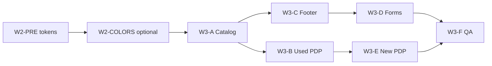

# SITE-001 W2 Implementation Roadmap v1

**Type:** Phase 2 visual refresh execution roadmap — **documentation only**  
**Date:** 2026-06-09  
**Site:** SITE-001 — Автосалон СИБКАР  
**Environment:** **TEST only** — `https://sibcar.new-site.space/`  
**Checkpoint:** `site-001-phase1-stable-2026-06`  
**Specification:** [SITE-001-W2-VISUAL-SPECIFICATION-v1.md](SITE-001-W2-VISUAL-SPECIFICATION-v1.md)  
**Discovery:** [SITE-001-W2-VISUAL-REFRESH-DISCOVERY-v1.md](SITE-001-W2-VISUAL-REFRESH-DISCOVERY-v1.md)

**Explicit exclusions:** No execution authorized by this document · No FTP · No admin · No CSS/Twig edits in this document.

---

## Executive summary

Phase 2 implementation proceeds in **six execution waves (W3-A … W3-F)** after operator authorization. Two **prerequisite sub-steps** — **W2-PRE** (CSS tokens, no visual change) and **W2-COLORS** (optional palette swap) — should complete immediately before or within the opening of **W3-A**.

**Binding:** Each wave requires fresh backup, Phase 2 write charter, and change request — Phase 1 CR **does not** cover W3.

---

## Prerequisites (before W3-A)

| Step | Objective | Affected files | Risk | Rollback | UX impact |
|------|-----------|----------------|------|----------|-----------|
| **W2-PRE** | Add `:root` design tokens mapping existing values; replace zero literals initially | `css/main.css` (top `:root` block); optional `--swiper-theme-color` | **LOW** | Restore single file from backup | **None** if values identical |
| **W2-COLORS** | Swap token values for brand tuning (optional) | `css/main.css` `:root` only | **LOW** | Revert `:root` block | **Medium** — sitewide color shift |

---

## W3-A — Catalog Refresh

| Field | Value |
|-------|--------|
| **Objective** | Modernize vehicle listing grid — card tokens, filter bar, breadcrumbs on `/cars/*` and `/auto/*`, homepage catalog block parity, catalog density per spec §10 |
| **Affected files** | `css/main.css` · `css/media.css` · `catalog/view/theme/auto/template/product/category.twig` · `catalog/view/theme/auto/template/product/categorynew.twig` · `catalog/view/theme/auto/template/common/home.twig` (catalog blocks only) · `js/common.js` *(only if filter class names change — avoid if possible)* |
| **Risk level** | **HIGH** — duplicated card markup in 3 templates; filter JS coupling |
| **Rollback complexity** | **MEDIUM** — 3 twig + 2 CSS files; test all listing URLs + homepage |
| **Expected UX impact** | **HIGH** — primary shopping surfaces; improved scanability, breadcrumbs, tighter grid; empty manufacturer pages need content or empty-state markup |

**Verification URLs:** `/cars/` · `/auto/` · `/` (homepage cards) · sample manufacturer paths · mobile catalog

**Dependencies:** W2-PRE complete; Phase 2 authorization; checkpoint backup

---

## W3-B — Used Car PDP Refresh

| Field | Value |
|-------|--------|
| **Objective** | Apply PDP tokens to used-car detail — gallery, price/CTA hierarchy, characteristics grid, breadcrumb fix, inline style migration per spec §11 |
| **Affected files** | `css/main.css` · `css/media.css` · `catalog/view/theme/auto/template/product/product.twig` |
| **Risk level** | **MEDIUM-HIGH** — 925-line template; Swiper/Fancybox hooks; credit calculator JS |
| **Rollback complexity** | **MEDIUM** — 1 twig + CSS; verify sample used PDP URL |
| **Expected UX impact** | **HIGH** on conversion path — clearer price/CTA; fixed breadcrumb markup; characteristics easier to scan |

**Verification URLs:** Sample used PDP (e.g. `/audi-a1-2012-…-799` pattern from discovery) · mobile PDP

**Dependencies:** W3-A recommended first (shared card/button tokens live); W2-PRE required

---

## W3-C — Footer Reduction

| Field | Value |
|-------|--------|
| **Objective** | Reduce footer visual weight — spacing tokens, collapse long legal blocks, consolidate duplicate callback forms per spec §9 |
| **Affected files** | `catalog/view/theme/auto/template/common/footer.twig` · `css/main.css` · `css/media.css` |
| **Risk level** | **MEDIUM** — legal content must remain accessible; 6+ form embeds with AJAX handlers |
| **Rollback complexity** | **LOW-MEDIUM** — single high-touch twig; legal review if content moved |
| **Expected UX impact** | **MEDIUM** — shorter pages sitewide; less form fatigue; compliance text still reachable via expander |

**Verification:** All pages (footer global) · form submit smoke test · mobile legal expander

**Dependencies:** W3-D may overlap — sequence footer consolidation **before** form styling if forms removed from footer

---

## W3-D — Lead Form Refresh

| Field | Value |
|-------|--------|
| **Objective** | Unify callback/popup forms — input tokens, focus rings, modal spacing; align `.callback__FORM`, `.popup__FORM_wrap`, `.phone_mask` across embeds |
| **Affected files** | `css/main.css` · `css/media.css` · `catalog/view/theme/auto/template/common/footer.twig` · `catalog/view/theme/auto/template/common/home.twig` · `catalog/view/theme/auto/template/information/about.twig` · `catalog/view/theme/auto/template/information/contact.twig` · `catalog/view/theme/auto/template/product/product.twig` (popup sections) · `catalog/view/theme/auto/template/common/header.twig` (modal triggers if styled inline) |
| **Risk level** | **MEDIUM** — 8+ form embeds; masked input dependency; Callibri widget coexistence |
| **Rollback complexity** | **MEDIUM** — multiple twigs if markup normalized; CSS-only path lower risk |
| **Expected UX impact** | **MEDIUM** — consistent form appearance; improved focus accessibility; submission behavior unchanged |

**Verification:** Callback modal from header · footer form · PDP popup · contact page form

**Dependencies:** W3-C consolidation reduces file count; can run in parallel with W3-C only if form removal deferred

---

## W3-E — New Car PDP Refresh

| Field | Value |
|-------|--------|
| **Objective** | Extend PDP improvements to new-car track — trim blocks, color gallery, `car-media` mosaic, configuration toggles per spec §12 |
| **Affected files** | `css/main.css` · `css/media.css` · `catalog/view/theme/auto/template/product/productnew.twig` |
| **Risk level** | **MEDIUM-HIGH** — distinct layout; hidden slide gallery; `--radius` local vars |
| **Rollback complexity** | **MEDIUM** — parallel to W3-B; separate template |
| **Expected UX impact** | **HIGH** on `/auto/*` conversion path — visual parity with used PDP tokens; new-car-specific features preserved |

**Verification URLs:** Sample new PDP (e.g. `/baic-bj40-new` from discovery) · mobile color gallery

**Dependencies:** **W3-B complete** — shared PDP token baseline

---

## W3-F — QA

| Field | Value |
|-------|--------|
| **Objective** | Cross-surface regression — desktop/mobile, used/new catalog + PDP, forms, footer, Phase 1 legacy dictionary spot-check, modification cache refresh protocol |
| **Affected files** | **None (read-only)** — verification matrix only; cache clear **operator action** if twig changed in W3 |
| **Risk level** | **LOW** (process risk if skipped) |
| **Rollback complexity** | **N/A** — triggers rollback if FAIL |
| **Expected UX impact** | **Validation** — confirms W3 waves meet spec; documents residual defects |

**Verification matrix (minimum):**

| # | URL / surface |
|---|----------------|
| 1 | `/` homepage |
| 2 | `/cars/` used catalog |
| 3 | `/auto/` new catalog |
| 4 | Used PDP sample |
| 5 | New PDP sample |
| 6 | `/about` |
| 7 | `/contact/` |
| 8 | Mobile homepage + catalog + PDP |

**Pass criteria:** No broken layouts; forms submit; breadcrumbs present on listings; legacy dictionary **0** on public URLs; documented exceptions for OC account/checkout blues.

---

## Wave sequence diagram

**Recommended operator order:** `W2-PRE` → `W2-COLORS` (optional) → `W3-A` → `W3-B` → `W3-C` → `W3-D` → `W3-E` → `W3-F`

**Parallelization:** W3-C may start after W3-A if footer work does not depend on catalog tokens (CSS tokens from W2-PRE suffice). W3-E **must** follow W3-B.

---

## Optional future wave (not in W3 scope)

| Wave | Objective | Notes |
|------|-----------|-------|
| **W3-G OC Legacy** | Align `catalog/view/theme/auto/stylesheet/stylesheet.css` blues with brand tokens | Account/checkout; operator opt-in |
| **W3-H Header slim** | Reduce duplicated phone blocks in `header.twig` | Shell simplification; separate authorization |

---

## Authorization gates (all waves)

| Gate | Status (2026-06-09) |
|------|---------------------|
| Phase 1 checkpoint `site-001-phase1-stable-2026-06` | **ACTIVE** |
| Phase 2 write charter | **NOT CREATED** — blocks execution |
| Phase 2 change request | **NOT CREATED** |
| Fresh pre-W3 backup | **Required per wave** |
| Production deployment | **FORBIDDEN** |

---

## Related documents

| Document | Role |
|----------|------|
| [SITE-001-W2-VISUAL-SPECIFICATION-v1.md](SITE-001-W2-VISUAL-SPECIFICATION-v1.md) | Design rules |
| [SITE-001-W2-DECISION-v1.md](SITE-001-W2-DECISION-v1.md) | W2.1 gate |
| [SITE-001-W1-ROLLBACK-PLAN-v1.md](SITE-001-W1-ROLLBACK-PLAN-v1.md) | T1/T2/T3 rollback |
| [SITE-001-W1-BACKUP-PROCEDURE-v1.md](SITE-001-W1-BACKUP-PROCEDURE-v1.md) | Backup steps |

---

## Change log

| Date | Change |
|------|--------|
| 2026-06-09 | **CREATED** — W2.1 implementation roadmap v1 |

*SITE-001 W2 Implementation Roadmap v1 — documentation only; no site modifications.*
