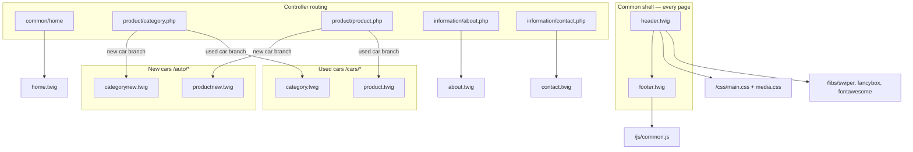

# SITE-001 W2 Visual Refresh Discovery v1

**Type:** W2 read-only visual/UI discovery — **no site modifications performed**  
**Date:** 2026-06-09  
**Site:** SITE-001 — Автосалон СИБКАР  
**Environment:** **TEST only** — `https://sibcar.new-site.space/`  
**Checkpoint:** `site-001-phase1-stable-2026-06` (commit `90dfc7a` referenced by operator)  
**Active theme:** `auto` — `catalog/view/theme/auto/`  
**Discovery methods:** FTP read-only (theme, `/css`, `/js`, shallow `/libs`/`/img` LIST) · HTTP fetch + HTML/CSS parse · controller `load->view` grep · W1B theme scan cross-reference  
**Companion decision:** [SITE-001-W2-VISUAL-REFRESH-DECISION-v1.md](SITE-001-W2-VISUAL-REFRESH-DECISION-v1.md)

**Explicit exclusions observed:** No modifications · No FTP uploads · No admin edits · No DB edits · No cache clears · No redesign proposals.

**Evidence artefact (local, not in git):** `.recovery-temp/site-001-w2-visual-discovery.json`

---

## Executive summary

Theme **`auto`** is a **heavily customized ocStore storefront** with **dual rendering paths** for used vs new vehicles. Visual styling is **not tokenized** — primary brand colors, buttons, cards, and shadows live in **`/css/main.css`** (~6.8k lines) with responsive overrides in **`/css/media.css`**. OpenCart default **`stylesheet.css`** remains for account/checkout surfaces and uses a **different blue palette**.

Phase 2 visual refresh is **feasible incrementally** at the CSS layer for colors and cards; **PDP and catalog require separate tracks** because used (`product.twig`) and new (`productnew.twig`) templates diverge structurally.

| Metric | Value |
|--------|-------|
| Theme files (FTP) | **135** |
| Active storefront CSS (live header) | **6** linked + 2 Google Fonts |
| CSS files on disk (web root + theme) | **8** |
| Backup/alternate product templates | **3** |
| Controller template forks | **2** (category + product) |
| PDP HTTP verified (W2) | **YES** — 1 used + 1 new sample |

---

## W2A — Theme Structure

### W2A.1 — Root map

```
catalog/view/theme/auto/
├── image/                    (10 PNG — payment icons; OC default)
├── stylesheet/
│   └── stylesheet.css        (814 lines — OC Bootstrap legacy)
└── template/
    ├── account/              (17 twig — OC account; low storefront visibility)
    ├── affiliate/            (2 twig)
    ├── checkout/             (11 twig — OC checkout)
    ├── common/               ★ PRIMARY SHELL
    │   ├── header.twig       (343 lines — meta, CSS/JS stack, nav, CTAs)
    │   ├── footer.twig       (410 lines — legal, forms, scripts)
    │   ├── home.twig         (453 lines — homepage body)
    │   ├── menu.twig, search.twig, cart.twig, …
    │   └── header_cup*.html  (4 HTML partials — hero/cup banners)
    ├── error/                (not_found.twig)
    ├── extension/            (modules, payment, captcha, advertise)
    ├── information/          ★ CUSTOM PAGES
    │   ├── about.twig, contact.twig
    │   └── information.twig, sitemap.twig
    ├── mail/                 (10 twig — transactional email HTML)
    └── product/              ★ CATALOG + PDP
        ├── category.twig         (640 lines — **active used-car listing**)
        ├── categorynew.twig      (615 lines — **active new-car listing**)
        ├── category_backup.twig  (700 lines — **inactive backup**)
        ├── product.twig          (925 lines — **active used-car PDP**)
        ├── productnew.twig       (671 lines — **active new-car PDP**)
        ├── product_old.twig      (551 lines — **inactive backup**)
        ├── productnew_Backup.twig (642 lines — **inactive backup**)
        ├── search.twig, compare.twig, review.twig, …
```

**Public asset roots (outside theme — W0.5 confirmed):**

| Path | Role |
|------|------|
| `/css/` | **Primary design system** — `main.css`, `media.css`, `normalize.css`; also `all.css`, `fonts.css` (not in live header stack) |
| `/js/` | `common.js` — sliders, credit calc, forms, viewer count |
| `/libs/` | jQuery 3.7.1, Swiper, Fancybox, Font Awesome, masked input, isotope, html5shiv |
| `/img/` | Logos, slider assets, icons |
| `/favicon/` | Full favicon pack |

### W2A.2 — Template dependency map



**Controller `load->view` calls (FTP read-only, 2026-06-09):**

| Controller | Templates loaded |
|------------|------------------|
| `catalog/controller/product/category.php` | `product/categorynew` · `product/category` · `error/not_found` |
| `catalog/controller/product/product.php` | `product/productnew` · `product/product` · `error/not_found` · `product/review` |

**Assembly model:** OpenCart controllers populate `$data`; twig renders vehicle-specific markup. **No shared partial** for vehicle cards — card HTML is **duplicated inline** in `category.twig`, `categorynew.twig`, and echoed on homepage `home.twig` catalog blocks.

### W2A.3 — Stylesheet load order (live header.twig)

| # | Asset | Source |
|---|-------|--------|
| 1 | `css/normalize.css` | Web root |
| 2 | Google Fonts — Exo 2, Inter 600 | CDN |
| 3 | `/libs/fancybox/fancybox.css` | Vendor |
| 4 | `/libs/swiper/swiper-bundle.min.css` | Vendor |
| 5 | `/libs/fontawesome/css/all.min.css` | Vendor |
| 6 | `` | OC-registered (checkout/account may inject `stylesheet.css`) |
| 7 | `/css/main.css` | **Custom primary** |
| 8 | `/css/media.css` | **Custom responsive** |

**JS (footer.twig + header):** jQuery 3.7.1 (head) · OC `` · `/js/common.js?3` · Callibri · SmartWidgets · DMP sync (head, async).

---

## W2B — CSS / SCSS Inventory

### W2B.1 — Active CSS files

| File | Lines | Bytes | Loaded on storefront | Role |
|------|-------|-------|---------------------|------|
| `css/main.css` | 6 784 | 104 417 | **YES** | Global layout, header/footer, cards, PDP, forms, homepage |
| `css/media.css` | 2 192 | 30 330 | **YES** | Breakpoint overrides |
| `css/normalize.css` | 508 | 9 801 | **YES** | Reset |
| `libs/fancybox/fancybox.css` | — | — | **YES** | Lightbox |
| `libs/swiper/swiper-bundle.min.css` | — | — | **YES** | Carousels |
| `libs/fontawesome/css/all.min.css` | — | — | **YES** | Icons |
| `catalog/view/theme/auto/stylesheet/stylesheet.css` | 814 | 17 302 | **Conditional** (OC routes) | Legacy OC Bootstrap — blues `#229ac8`, `#23a1d1` |
| `css/all.css` | — | — | **NO** (not in header) | **SAFE UNKNOWN** purpose |
| `css/fonts.css` | — | — | **NO** (not in header) | **SAFE UNKNOWN** — may duplicate Google Fonts |

**SCSS source:** **NONE found** in theme or `/css/` — styles are **hand-authored flat CSS**. No build pipeline observed.

### W2B.2 — Color system (main.css)

| Token / value | Usage count (approx) | Role |
|---------------|---------------------|------|
| `rgb(170, 3, 3)` / `#aa0303` | 56+ | **Primary brand red** — buttons, accents, swiper theme |
| `rgb(200, 0, 0)` | 29+ | Hover / emphasis red |
| `rgb(33, 36, 43)` | 48+ | Dark text / nav background |
| `rgb(255, 255, 255)` | 73+ | Surfaces, button text |
| `rgb(36, 38, 43)` / `rgb(14, 15, 16)` | Few | Footer / dark blocks |
| `rgb(44, 183, 65)` | 2+ | WhatsApp hover accent |
| `rgb(0, 170, 0)` | 11+ | Stock / success markers |
| `rgb(246, 248, 250)` | 11+ | Light section backgrounds |

**CSS custom properties:** Minimal — `--swiper-theme-color`, marquee block (`--bg`, `--fg`, `--accent`), `.car-media` block (`--gap`, `--radius`). **No global design-token layer.**

**Dual palette risk:** Storefront red theme vs OC `stylesheet.css` blue theme on account/checkout paths.

### W2B.3 — Component style groups (main.css analysis)

| Group | Selector examples | Rule hits (approx) | Notes |
|-------|---------------------|-------------------|-------|
| **Buttons** | `.callback_btn`, `.phone_btn`, `.whatsapp_btn`, `.home_slider_btn`, `.car_main_info__btns` | 44 | Hardcoded fills/borders; 4px radius dominant |
| **Cards** | `.catalog_item`, `.catalog_item__face`, `.catalog_item__price` | 116 | Swiper carousel per card; shadow on hover |
| **Forms** | `.callback__FORM`, `.phone_mask`, `.popup__FORM_wrap` | 8+ in main; duplicated in twigs | Phone mask class reused sitewide |
| **Shadows** | `box-shadow: 0 0 10px …`, `0px 4px 4px -5px …` | 20 | Consistent red glow on focus/hover |
| **Border radius** | `border-radius: 4px` (dominant); `12px` in `.car-media` | 81 | Mixed 0/4/12px — minor inconsistency |
| **Grid / layout** | `.container`, `.row`, flex columns | 558 | Custom grid atop normalize; not CSS Grid-first |

---

## W2C — Visual Design Audit

**Method:** HTTP fetch 2026-06-09 against Phase 1 stable TEST. Observations only — no redesign proposals.

### W2C.1 — Surface matrix

| Surface | URL / body class | Key template | Cards | Breadcrumbs | Inline styles |
|---------|------------------|--------------|-------|-------------|---------------|
| Homepage | `/` | `home.twig` | 0 on probe (slider-led) | No | 17 |
| Used catalog root | `/cars/` · `used_catalog` | `category.twig` | 14 | No | 11 |
| Used category | `/cars/bmw/` · `used_catalog` | `category.twig` | 0 (empty mfr) | No | 8 |
| New catalog root | `/auto/` · `new_catalog` | `categorynew.twig` | 14 | No | 13 |
| New category | `/auto/haval/` · `new_catalog` | `categorynew.twig` | 0 (empty mfr) | No | 8 |
| PDP used | `/audi-a1-2012-…-799` · `used_car_page` | `product.twig` | — | Yes | 12+ |
| PDP new | `/baic-bj40-new` · `new_car_page` | `productnew.twig` | — | Yes | **SAFE UNKNOWN** count |
| About | `/about` | `about.twig` | — | Yes | 9 |
| Contacts | `/contact/` | `contact.twig` | — | Yes | 10 |
| Mobile homepage | `/` (iPhone UA) | same | — | No | 17 · offcanvas present |

### W2C.2 — Strengths

- **Coherent automotive retail vocabulary** — price/credit/VIN/stock badges read clearly on catalog cards.
- **Strong primary CTA repetition** — phone, WhatsApp, callback modal accessible from header, footer, sliders, PDP.
- **Rich PDP used layout** — gallery + thumbs, characteristics grid, credit calculator, VIN block — information-dense for buyers.
- **New-car PDP differentiation** — trim/variant blocks, color gallery, `car-media` mosaic — appropriate for new inventory.
- **Responsive shell** — dedicated `media.css`, offcanvas mobile menu, duplicated header bars (top + scroll).
- **Phase 1 branding** — СИБКАР visible on all probed surfaces (titles, H1, footer legal).

### W2C.3 — Weaknesses

- **Information density on homepage** — long slider + manufacturer lists + legal footer creates heavy scroll before catalog engagement.
- **Empty manufacturer categories** — `/cars/bmw/`, `/auto/haval/` render shell without listings when inventory sparse (TEST data gap affects UX review).
- **Breadcrumbs absent on catalog listing pages** — present on PDP/about/contact only; wayfinding gap on `/cars/`, `/auto/`.
- **Duplicate `<a>` typo in breadcrumbs** — used PDP shows `</a></a>` nesting (markup quality).
- **Viewer count block** — «Сейчас смотрит … человек» text updated by JS (`common.js`) — credibility/readability concern if static placeholder shown before JS.
- **Footer legal wall** — multiple dense compliance blocks; necessary legally but visually heavy.

### W2C.4 — Visual inconsistency

| Area | Observation |
|------|-------------|
| Used vs new PDP | Different class systems (`car_main_info` vs `new_car_main_info`, `car-media`) — same brand colors but **different layout rhythm** |
| Border radius | 4px (global) vs 12px (`car-media`) vs 0px (some nav elements) |
| Typography | Exo 2 body + Inter 600 accent — no documented scale; heading sizes vary by block |
| OC legacy pages | Account/checkout retain Bootstrap-blue `stylesheet.css` — **off-brand** if users reach those routes |
| Inline styles | Footer loan-terms link, slider backgrounds, popup visibility toggles — bypass CSS file |
| Header cup partials | 4 HTML variants (`header_cup*.html`) — parallel markup paths for hero zones |

### W2C.5 — Readability · hierarchy · CTA

| Criterion | Rating | Notes |
|-----------|--------|-------|
| Readability | **Good** on cards/PDP; **Fair** in footer legal | Small text in compliance blocks |
| Visual hierarchy | **Good** on PDP (price → specs → CTA); **Fair** on homepage | Slider competes with H1 |
| CTA visibility | **Strong** | Red buttons + persistent phone/WhatsApp |
| Information density | **High** on PDP and footer; **Medium** on catalog | Characteristic grids pack many data points |
| Mobile | **Functional** | Offcanvas menu; `user-scalable=no` may affect accessibility |

---

## W2D — Component Registry

| Component | Primary source | Reuse | Customization complexity |
|-----------|---------------|-------|---------------------------|
| **Header** | `template/common/header.twig` | All pages | **HIGH** — 3 phone blocks, 2 logo states, scroll header, mobile offcanvas |
| **Footer** | `template/common/footer.twig` | All pages | **HIGH** — legal wall, 6+ callback forms, manufacturer lists |
| **Menu** | `header.twig` + `menu.twig` | All pages | **MEDIUM** — hardcoded `<ul class="desck_menu">` |
| **Search** | `common/search.twig` (6 lines) | Minimal | **LOW** — OC default stub; not primary UX |
| **Filter** | Embedded in `category.twig` / `categorynew.twig` | 2 templates | **HIGH** — duplicated; JS in `common.js` for model lists |
| **Vehicle card** | `category.twig`, `categorynew.twig`, `home.twig` | 3+ surfaces | **HIGH** — `.catalog_item` markup duplicated, not partialized |
| **Product gallery (used)** | `product.twig` | Used PDP | **MEDIUM** — Swiper + Fancybox |
| **Product gallery (new)** | `productnew.twig` | New PDP | **HIGH** — color gallery + `car-media` mosaic + hidden slides |
| **Characteristics** | `product.twig` — `.car_main_info__characteristics_*` | Used PDP | **MEDIUM** — grid of titled cells |
| **CTA blocks** | Header/footer/home slider/PDP buttons | Sitewide | **MEDIUM** — `.callback_btn`, `.car_main_info__btns`, modals |
| **Forms** | Footer twig, home, about, contact, PDP popups | 8+ embeds | **HIGH** — duplicate AJAX submit handlers per page |
| **Badges** | `.catalog_item__tags`, `.short_btns` | Cards + PDP | **LOW** — CSS-driven |
| **Breadcrumbs** | Per-template inline HTML | PDP, about, contact | **MEDIUM** — not centralized; catalog pages omit |
| **Tabs** | PDP sections / configuration toggles | PDP | **MEDIUM** — `.car_configuration__toggle` |
| **Reviews** | `product/review.twig` + slides in `category_backup.twig` | Low live exposure | **LOW** on live; backup has hardcoded quotes |

---

## W2E — Technical Risk Review

| Risk | Evidence | Future redesign risk |
|------|----------|---------------------|
| **Hardcoded colors in main.css** | 56+ uses of `rgb(170,3,3)` literal | **MEDIUM** — global find/replace feasible; no token layer |
| **Inline styles in twigs** | `footer.twig` (8), `home.twig` (2), `product.twig` (6), cup HTML (4–7 each) | **MEDIUM** — easy to miss in CSS-only refresh |
| **Duplicated card markup** | `category.twig` + `categorynew.twig` + `home.twig` | **HIGH** — card redesign touches 3+ files |
| **Dual PDP templates** | `product.twig` vs `productnew.twig` | **HIGH** — PDP refresh requires two tracks |
| **Backup templates on disk** | `category_backup.twig`, `product_old.twig`, `productnew_Backup.twig` | **LOW** inactive; **MEDIUM** if accidentally activated |
| **Controller-generated meta/HTML** | `category.php`, `product.php` SEO strings | **LOW** for visual; **MEDIUM** if titles coupled to layout |
| **JS-generated HTML** | `common.js` — viewer count, credit price, model filter lists | **MEDIUM** — styling depends on class names in JS strings |
| **OC stylesheet.css drift** | Blue Bootstrap palette | **LOW** storefront; **MEDIUM** if checkout skin matters |
| **Modification cache** | Not inspected W2 | **MEDIUM** — stale compiled twig after template edits |
| **Third-party widgets** | Callibri, SmartWidgets, DMP, Yandex Metrika | **LOW** visual; **MEDIUM** layout shift |

---

## W2F — Visual Refresh Readiness

### W2F.1 — Incremental feasibility

| Scope | Incremental? | Breaking structure? | Notes |
|-------|-------------|---------------------|-------|
| **Colors only** | **YES** | **NO** if scoped to `main.css` + `--swiper-theme-color` | Account/checkout blues remain unless `stylesheet.css` included |
| **Cards only** | **PARTIAL** | **NO** | Must edit `category.twig`, `categorynew.twig`, possibly `home.twig` |
| **PDP only** | **PARTIAL** | **NO** | Two templates — used and new cannot be one pass |
| **Catalog only** | **YES** | **NO** | Listing templates independent of PDP shell |
| **Header/footer only** | **YES** | **NO** | High touch (phones/forms) but isolated files |

**Verdict:** Phase 2 **can proceed incrementally** starting from CSS tokens/colors, then cards, then PDP tracks, then shell — provided dual-template and duplication constraints are scheduled explicitly.

### W2F.2 — Recommended implementation order

1. **W2-PRE** — Introduce CSS custom properties in `main.css` (`:root` block) mapping existing reds/neutrals; no visual change yet.
2. **W2-COLORS** — Swap `:root` values + `--swiper-theme-color`; verify header, buttons, cards, swiper pagination.
3. **W2-CARDS** — Unify `.catalog_item` in `category.twig` + `categorynew.twig` (+ homepage block); single CSS pass.
4. **W2-CATALOG** — Filters, sort, breadcrumbs on listing pages; manufacturer empty states.
5. **W2-PDP-USED** — `product.twig` + gallery/calculator/characteristics.
6. **W2-PDP-NEW** — `productnew.twig` + trim variants + `car-media`.
7. **W2-SHELL** — Header/footer simplification; reduce duplicated phone/form blocks.
8. **W2-OC-LEGACY** — Optional `stylesheet.css` alignment for account/checkout.
9. **W2-QA** — Mobile + cross-browser; cache clear + modification refresh protocol.

### W2F.3 — Preconditions (from Phase 1 checkpoint)

- Bind to checkpoint `site-001-phase1-stable-2026-06` before any write session.
- Fresh backup per [SITE-001-W1-BACKUP-PROCEDURE-v1.md](SITE-001-W1-BACKUP-PROCEDURE-v1.md).
- Phase 2 write authorization **NOT included in this discovery** — operator HITL required.
- Deferred W1F-D/E (SMTP, backup YML) **do not block** visual discovery but remain open for production.

---

## Related documents

| Document | Role |
|----------|------|
| [SITE-001-W0.5-ADMIN-DISCOVERY-v1.md](SITE-001-W0.5-ADMIN-DISCOVERY-v1.md) | Theme + asset root inventory |
| [SITE-001-W1B-THEME-BRANDING-MAP-v1.md](SITE-001-W1B-THEME-BRANDING-MAP-v1.md) | W1B twig scan (135 files) |
| [SITE-001-PHASE1-STABLE-CHECKPOINT-v1.md](SITE-001-PHASE1-STABLE-CHECKPOINT-v1.md) | Recovery baseline |
| [SITE-001-W2-VISUAL-REFRESH-DECISION-v1.md](SITE-001-W2-VISUAL-REFRESH-DECISION-v1.md) | Gate decision |

---

## Change log

| Date | Change |
|------|--------|
| 2026-06-09 | **CREATED** — W2 visual refresh discovery; FTP + HTTP on TEST |

*SITE-001 W2 Visual Refresh Discovery v1 — discovery only; no site modifications.*
