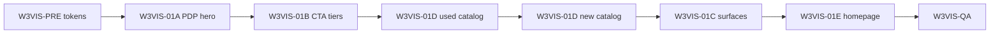

# SITE-001 W3VIS-01 Decision v1

**Type:** Post-discovery gate — Visual Hierarchy & Surface System  
**Date:** 2026-06-09  
**Site:** SITE-001 — Автосалон СИБКАР  
**Environment:** **TEST only** — `https://sibcar.new-site.space/`  
**Discovery input:** [SITE-001-W3VIS-01-DISCOVERY-v1.md](SITE-001-W3VIS-01-DISCOVERY-v1.md)  
**Supersedes:** W3V2 as operator perceptual target (W3V2 execution remains on TEST; rollback not required)

---

## Verdict

**DISCOVERY COMPLETE — READY FOR W3VIS EXECUTION CHARTER**

W3VIS-01 confirms operator assessment: **Visual Impact ≈ 2/10** after W3V2 because prior waves addressed **palette and density**, not **hierarchy and surfaces**. The highest-leverage fixes are **CSS-only**, scoped, and reversible — **no redesign, rebrand, or content change required**.

**No implementation authorized** in this document.

---

## Success criteria pre-check

| # | Criterion | Discovery assessment |
|---|-----------|----------------------|
| 1 | Site feels professionally designed (not “recolored OC template”) | **Achievable** — surface system + CTA tiers |
| 2 | Eye knows primary / secondary / click target | **Achievable** — HF-01–03, W3VIS-01B |
| 3 | PDP hero reads as one product area | **Achievable** — W3VIS-01A wrapper approach |
| 4 | Catalog cards command attention | **Achievable** — extend used pattern + new catalog parity |
| 5 | No content / SEO / route / logic changes | **Achievable** — CSS-only per W3-C lesson |
| 6 | W3UX-C1 + W3V2 preserved | **Achievable** — append `--vis-*` block after existing waves |

---

## Top 5–10 changes — maximum visual impact

These are the **smallest set** that should move operator score from **~2/10 → ~7/10** without redesign:

| Rank | Wave slice | Change | Addresses | Est. impact |
|------|------------|--------|-----------|-------------|
| **1** | **W3VIS-01A** | Unified **PDP hero L2 surface** (used + new) — parent shell, internal split, demote discount island | HF-01, HF-10 | **Very High** |
| **2** | **W3VIS-01B** | **CTA tier system** — primary red at rest; secondary outline; fix shared hover | HF-02, HF-03, HF-08 | **Very High** |
| **3** | **W3VIS-01D** | **Catalog price + CTA hierarchy** — red CTA at rest; price dominant; credit inline | HF-03, HF-04, HF-13 | **Very High** |
| **4** | **W3VIS-01C** | **`--vis-surface-*` tokens** — canvas vs L2 vs L3; stronger body/card contrast | HF-05, HF-06, HF-11 | **High** |
| **5** | **W3VIS-01A** | **VIN + credit panel re-tier** — L3 support / distinct L2 dark panel (not nav clone) | HF-08, HF-09 | **High** |
| **6** | **W3VIS-01D** | **New catalog parity** — apply W3UX-C1 hierarchy pattern to `.new_catalog` | HF-04 | **High** |
| **7** | **W3VIS-01E** | **Homepage section type scale + asymmetric margins** | HF-14 | **Medium–High** |
| **8** | **W3VIS-01C** | **Filter bar as L2 tool surface** (tinted, not card-clone) | HF-11 | **Medium** |
| **9** | **W3VIS-01B** | **Header CTA demotion on scroll / reduced row weight** (CSS only — size/ghost secondary) | HF-07 | **Medium** |
| **10** | **W3VIS-01C** | **Partner banks → L3** (lower shadow, smaller tiles) | HF-17 | **Medium** |

**Expected Visual Impact after waves 1–4:** **7–8 / 10** (operator acceptance target).  
**Expected after full roadmap (1–10):** **8 / 10**.  
**Not in scope for 9–10:** logo, photography, copy, layout restructure.

---

## Recommended execution order

Sequential waves; each requires backup + verification matrix before next.

| Phase | Wave ID | Scope | Files (expected) | Rationale |
|-------|---------|-------|------------------|-----------|
| **0** | W3VIS-PRE | Introduce `--vis-*` tokens in `:root`; no visual change | `css/main.css` | Rollback clarity |
| **1** | **W3VIS-01A** | PDP hero unified surface (used `.car_main_info`, new `.new_car_main_info`) | `css/main.css`, `css/media.css` | Highest operator priority |
| **2** | **W3VIS-01B** | CTA hierarchy (PDP, catalog, forms) | `css/main.css`, `css/media.css` | Conversion path |
| **3** | **W3VIS-01D-U** | Used catalog hierarchy completion (CTA at rest, stock badge) | `css/main.css` | Builds on W3UX-C1 |
| **4** | **W3VIS-01D-N** | New catalog hierarchy parity | `css/main.css`, `css/media.css` | `/auto/` track |
| **5** | **W3VIS-01C** | Surface system rollout (filter, banks, widgets, contrast) | `css/main.css` | Sitewide coherence |
| **6** | **W3VIS-01E** | Homepage section hierarchy | `css/main.css`, `css/media.css` | Entry point polish |
| **7** | **W3VIS-QA** | 7-URL matrix + PDP pair + desktop/tablet/mobile | — | Operator sign-off gate |

### Verification URLs (minimum)

| # | URL |
|---|-----|
| 1 | `/` |
| 2 | `/cars/` |
| 3 | `/auto/` |
| 4 | `/cars/bmw/` |
| 5 | `/auto/haval/` |
| 6 | `/about` |
| 7 | `/contact/` |
| + | 1 used PDP + 1 new PDP |

---

## Authorization prerequisites (before any write)

| Artefact | Status |
|----------|--------|
| W3VIS write charter | **NOT CREATED** — required before execution |
| Change request | **NOT CREATED** |
| Rollback plan | **NOT CREATED** — T1: restore CSS from pre-wave backup |
| Operator approval of discovery | **PENDING** |
| Production deployment | **NOT AUTHORIZED** |

---

## Explicitly forbidden (W3VIS scope)

- Full redesign, rebrand, new logo, new photography
- Content, SEO, routes, forms logic, business rules
- Header/footer **structure** changes (W3-C lesson)
- Twig edits unless CSS-only hero wrapper proves impossible (**defer** — discovery assumes CSS-only)

---

## Rollback decision

| Question | Answer |
|----------|--------|
| Rollback of W3V2 required for W3VIS? | **NO** — W3VIS layers on top |
| Rollback tier if W3VIS rejected | **T1** — remove W3VIS CSS block; restore pre-wave backup |

---

## Notes

| ID | Note | Severity |
|----|------|----------|
| N-W3VIS-01 | Operator Visual Impact 2/10 aligns with HF-05 (uniform surface recipe) | **Info** |
| N-W3VIS-02 | W3V2 operator sign-off should be **superseded** by W3VIS acceptance criteria | **Medium** |
| N-W3VIS-03 | TEST brand pages may show 0 listings — hierarchy QA on main catalogs + PDP | **Low** |
| N-W3VIS-04 | PHP warning on homepage pre-existing — out of scope | **Info** |

---

## Authorization

| Role | Decision | Date |
|------|----------|------|
| Agent discovery | **COMPLETE** | 2026-06-09 |
| Operator discovery acceptance | **PENDING** | — |
| Execution charter | **NOT AUTHORIZED** | — |

---

## Change log

| Date | Change |
|------|--------|
| 2026-06-09 | **CREATED** — W3VIS-01 discovery gate |

*SITE-001 W3VIS-01 Decision v1 — gate only; no site modifications.*
