# SITE-001 W4.1 Visual Proof Pack v1

**Type:** Operator visual evidence — read-only analysis (no site writes)  
**Date:** 2026-06-09  
**Site:** SITE-001 — Автосалон СИБКАР  
**Environment:** **TEST only** — `https://sibcar.new-site.space/`  
**Wave:** W4.1 Header & Hero Authority  
**Viewport:** Desktop **1440×900** (Playwright, 2026-06-09 15:06–15:08)  
**Inputs:** [SITE-001-W4-1-HEADER-HERO-EXECUTION-v1.md](SITE-001-W4-1-HEADER-HERO-EXECUTION-v1.md) · [SITE-001-W4-1-HEADER-HERO-DESIGN-PLAN-v1.md](SITE-001-W4-1-HEADER-HERO-DESIGN-PLAN-v1.md)

**Explicit exclusions:** No FTP · No CSS/Twig · No implementation · No production

---

## Executive summary

W4.1 **технически задеплоен** (9/9 PASS). По скриншотам **самое заметное изменение — promo strip**: красный бегущий тикер → графитовая полоса с CAPS и красными точками (used PDP, `/cars/`). Header shell (тень, градиент nav, дисциплина красного) — **реальный, но тонкий** эффект. Homepage и about first screen для обычного посетителя **почти не меняются**. Used PDP top band (`w4-1-pdp-top`) — лёгкая полировка, не трансформация.

**Вердикт:** **W4.1 PARTIAL SUCCESS** — видно при внимании; promo strip — без A/B на PDP/каталоге.

---

## 1. Homepage top (1440px)

### Before

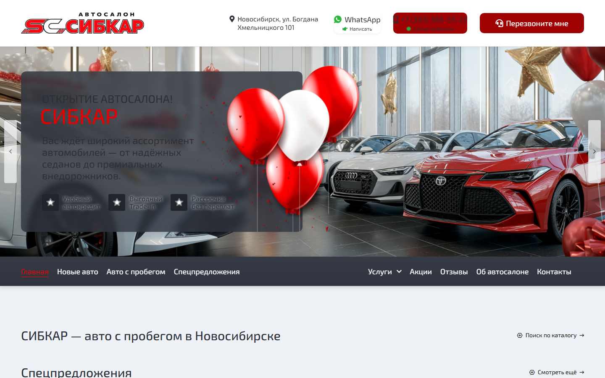

### After

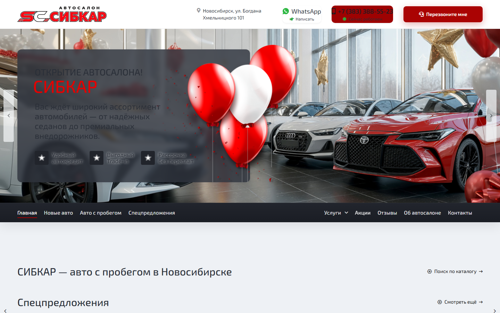

| | |
|---|---|
| **A. What changed visually** | Toolbar чуть плотнее; nav — мягкий graphite gradient вместо плоского `#21242B`; тень под header shell. |
| **B. What did NOT change** | Слайдер, тексты hero, CTA, блок «СИБКАР — авто с пробегом», карточки каталога ниже fold. |
| **C. Would a normal visitor notice?** | **NO** |

*Note:* before/after сняты на **разных кадрах слайдера** (открытие vs октябрьская акция) — сравнение hero по контенту некорректно; оценка только header band.

---

## 2. Used PDP top (1440px)

**URL:** `/audi-a1-2012-s-probegom-149-000-km-799`

### Before

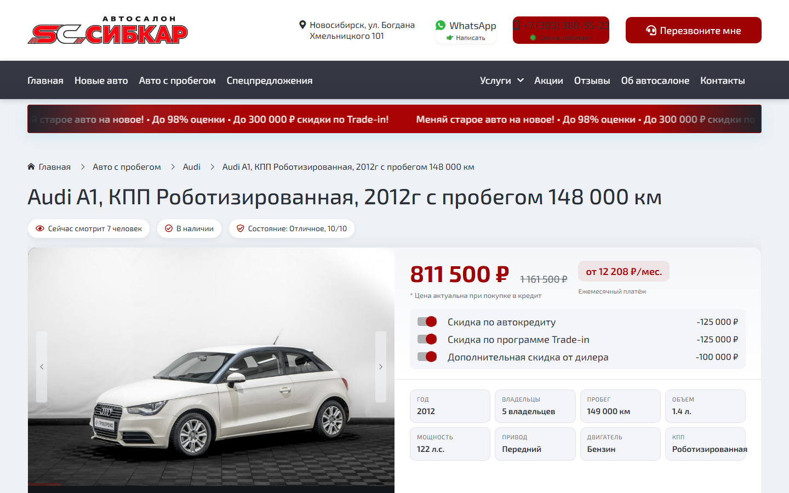

### After

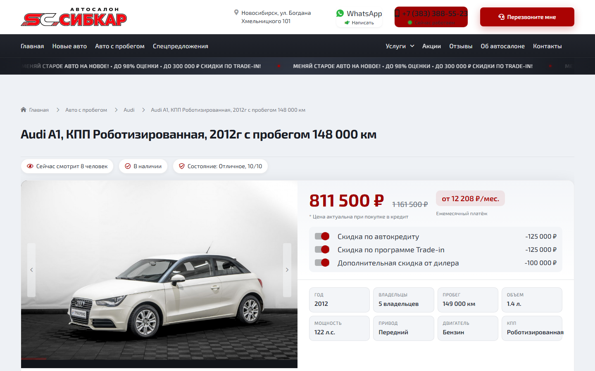

| | |
|---|---|
| **A. What changed visually** | Promo strip: **красный → графит**, текст **UPPERCASE**, красные точки-разделители. Header: gradient nav, phone icon менее красный, callback CTA сильнее. Breadcrumbs/H1 в светлой authority band. |
| **B. What did NOT change** | H1 текст, цена, W4 hero card, галерея, trust badges, скидочные тумблеры, grid характеристик. |
| **C. Would a normal visitor notice?** | **MAYBE** (promo — **YES**; PDP top — **NO** без сравнения) |

---

## 3. Used catalog top `/cars/` (1440px)

### Before

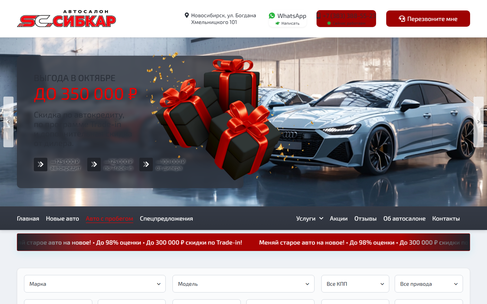

### After

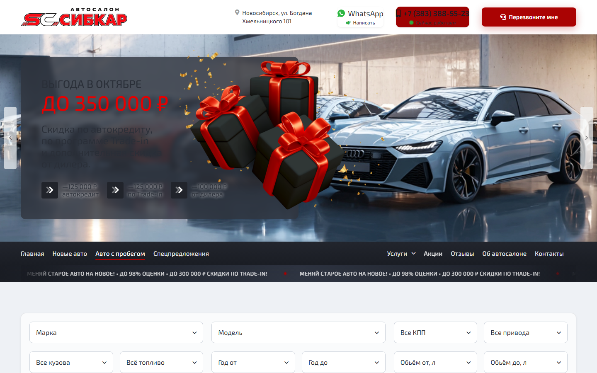

| | |
|---|---|
| **A. What changed visually** | Promo strip под nav: **красный marquee → графитовая CAPS-лента**. Header gradient/shadow как на PDP. |
| **B. What did NOT change** | Hero-слайдер каталога, фильтры, grid карточек, W3UX-C1 density, пункты меню. |
| **C. Would a normal visitor notice?** | **MAYBE** (promo — **YES** на `/cars/`; остальное — **NO**) |

---

## 4. About page top (1440px)

### Before

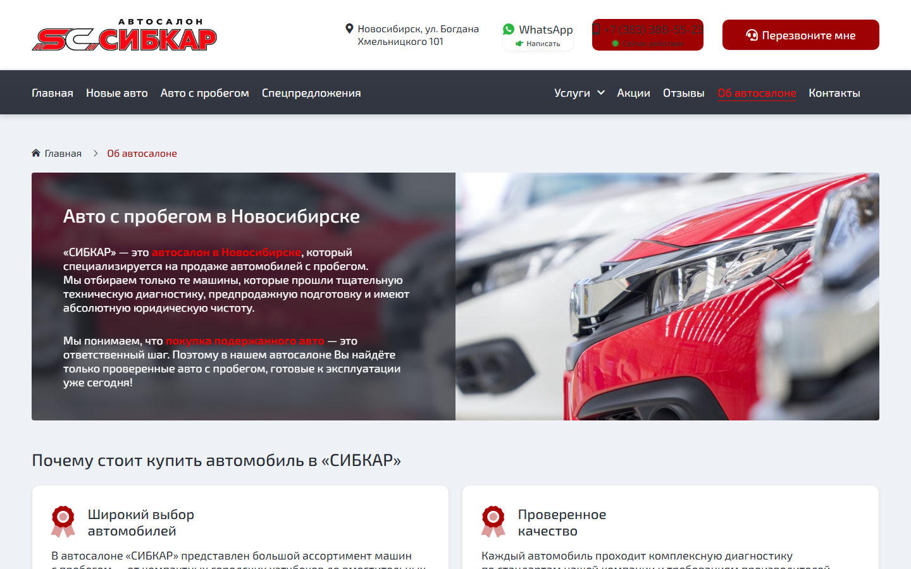

### After

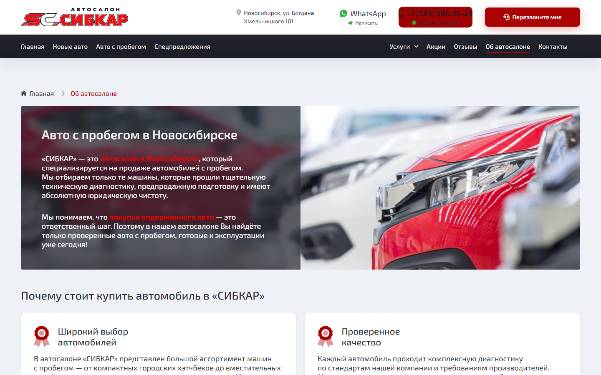

| | |
|---|---|
| **A. What changed visually** | Active nav «Об автосалоне»: **красный текст → белый + underline**. Header shell gradient/shadow. |
| **B. What did NOT change** | Hero split-banner, тексты, карточки преимуществ, breadcrumbs, footer. |
| **C. Would a normal visitor notice?** | **NO** |

---

## 5. Header crop only (1440px)

*Source: used PDP — toolbar + nav без hero bleed.*

### Before

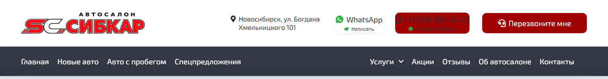

### After

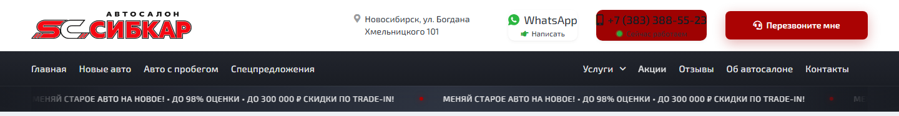

| | |
|---|---|
| **A. What changed visually** | Единый shell с тенью; nav gradient; phone pill — тёмный фон, иконка не красная; callback — единственный яркий red CTA; нижний seam toolbar/nav. |
| **B. What did NOT change** | Logo, адрес, WhatsApp, номер, пункты меню, порядок элементов, sticky behaviour (desktop). |
| **C. Would a normal visitor notice?** | **MAYBE** |

---

## 6. Promo strip crop only (1440px)

*Source: used PDP promo band.*

### Before

### After

| | |
|---|---|
| **A. What changed visually** | Фон **красный → графит**; типографика **sentence case → UPPERCASE**; красные dot-акценты вместо красного поля. |
| **B. What did NOT change** | Текст оффера (trade-in 98% / 300 000 ₽); marquee behaviour; страницы без `.lcd_display.header` без полосы. |
| **C. Would a normal visitor notice?** | **YES** |

*Catalog promo (same treatment):* [before crop](../qa/w4-1-header-hero-screenshots/crops/crop-promo-catalog-before.png) · [after crop](../qa/w4-1-header-hero-screenshots/crops/crop-promo-catalog-after.png)

---

## 7. Used PDP hero crop only (1440px)

*Breadcrumbs + H1 + trust badges (+ верх цены).*

### Before

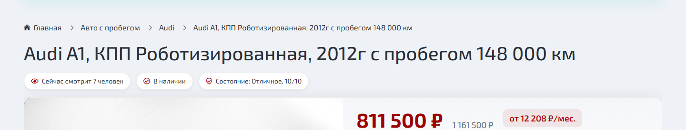

### After

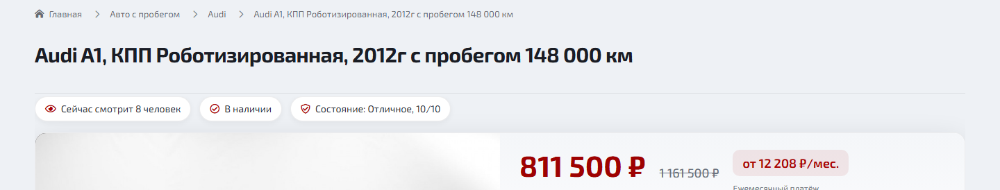

| | |
|---|---|
| **A. What changed visually** | `w4-1-pdp-top` — светлая band, чуть плотнее breadcrumbs, H1 на том же canvas; микро-отступ до W4 hero. |
| **B. What did NOT change** | H1 copy, badges, цена, monthly pill, W4 `w4-used-hero` card ниже. |
| **C. Would a normal visitor notice?** | **NO** |

---

## Required scoring

| Area | Score | One-sentence explanation |
|------|-------|--------------------------|
| **Header** | **5/10** | Gradient и shadow добавляют polish, но header остаётся тем же двухъярусным OC-шаблоном. |
| **Promo strip** | **8/10** | Смена красного тикера на графитовую CAPS-ленту — единственный однозначно заметный W4.1 сигнал. |
| **Homepage first screen** | **3/10** | Слайдер и контент first screen не трансформированы; header delta слишком тонкий. |
| **Used PDP first screen** | **6/10** | Promo тянет оценку вверх; authority band и header без promo не дотягивают до target 7/10. |
| **Catalog first screen** | **5/10** | Promo виден; hero-слайдер и фильтры выглядят как до W4.1. |

---

## IS W4.1 ACTUALLY VISIBLE?

| Area | Visible without A/B? | Score |
|------|---------------------|-------|
| Header | **MAYBE** | 5 |
| Promo strip | **YES** | 8 |
| Homepage | **NO** | 3 |
| Used PDP | **MAYBE** | 6 |
| Catalog | **MAYBE** | 5 |

---

## Final verdict

**2. W4.1 PARTIAL SUCCESS** — Visible only with attention.

Promo strip на used PDP и `/cars/` — реальный, заметный win. Header polish и PDP top band — не дают «premium automotive» jump до target 7/10 на homepage. Оператору: hard-refresh перед live check (CSS `max-age=604800` per decision N-W4-1-03).

---

## Evidence index

| Asset | Path |
|-------|------|
| Full screenshots (16) | `projects/ocpilot/sites/site-001/qa/w4-1-header-hero-screenshots/` |
| Crops (header, promo, PDP hero) | `projects/ocpilot/sites/site-001/qa/w4-1-header-hero-screenshots/crops/` |
| Execution JSON | `.recovery-temp/site-001-w4-1-result.json` |
| Rollback baseline | `pre-w4-1-stable-20260609-1506` |

---

*SITE-001 W4.1 Visual Proof Pack v1 — read-only; no commit; no push; TEST only.*
