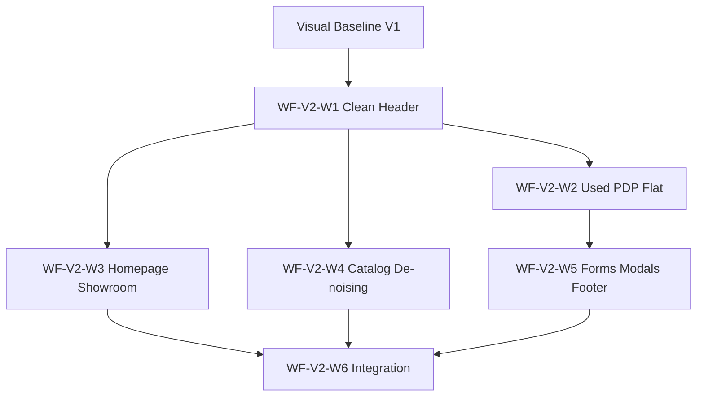

# REPORT — SITE-001 WF V2 IMPLEMENTATION PLAN

**Type:** Transition plan — documentation only  
**Date:** 2026-06-10  
**Site:** SITE-001 — Автосалон СИБКАР  
**Environment:** **TEST only** — `https://sibcar.new-site.space/`  
**From:** **Visual Baseline V1** (Phase 1 + W3* + W4/W4.1 + W5-A/S + W5-C)  
**To:** **WF V2** — `projects/ocpilot/sites/site-001/design/wf-v2-concept/`

**Inputs:**

| Source | Role |
|--------|------|
| [SITE-001-WF-V2-GAP-ANALYSIS-v1.md](SITE-001-WF-V2-GAP-ANALYSIS-v1.md) | Gap matrix, TOP-20 blockers, preservation map |
| `01-sibcar-v2-concept.png` | Целевая композиция (header + used PDP + контентные зоны) |
| `02-sibcar-v2-specification.png` | Clean Header spec + принципы минимализма |

**Mandate:** Это **не polish** (W3/W4/W5). Это **смена визуального класса**: subtractive «light clean showroom» вместо «Graphite Modern Dealer embellishment». Реализация **не авторизована** этим документом.

**Design authority conflict (зафиксировано в GAP):**

- Mock `01` — тёмный header на PDP-макете.
- Spec `02` — **светлый** header (`#F7F8FA` / `#FFFFFF` / `#F3F4F6`).
- **Для всех волн header: приоритет spec `02`.** Mock `01` — для композиции PDP и общего ритма, не для цвета header.

**Pre-implementation gate (HITL):** Подтвердить светлый header (spec `02`) до Wave 1. Без этого — **STOP**.

---

## Executive summary

| Metric | V1 (live) | WF V2 target | После полного плана (оценка) |
|--------|-----------|--------------|------------------------------|
| Alignment vs Concept | ~25–30 / 100 | 100 | ~85–95 / 100 |
| 3-sec modern clean dealer | ~4/10 | ~8/10 | ~7–8/10 |
| CSS direction | Append-only graphite layers | Subtraction + `--wf-v2-*` | Consolidated |

**Парадокс перехода:** W5-A/S/C уже сделали структурную работу (centered nav, commercial stage, static header), но **surface system** уехала **против** WF V2. План = **re-skin + flatten + homepage architecture**, не откат DOM W5-A целиком.

**Wave sequence (recommended):**

```
V1 Baseline
    → W1 Clean Header Light System     [sitewide, VERY HIGH]
    → W2 Used PDP Flat Stage           [concept mock core, VERY HIGH]
    → W3 Homepage Showroom Entry       [largest structural gap, VERY HIGH]
    → W4 Catalog & Global De-noising   [HIGH cross-traffic]
    → W5 Forms, Modals & Footer Pass   [MEDIUM, episodic]
    → W6 Integration & CSS Consolidation [proof + maintainability]
```

W3 и W4 **можно параллелить** после W1 (разные twig-файлы). W2 зависит от W1 (header read на PDP). W6 — только после W1–W5.

---

## OCPilot discipline (все волны)

Каждая волна **до** FTP write:

| Step | Artefact |
|------|----------|
| 1 | Write charter + change request + **rollback plan** (T1 instance) |
| 2 | **Stable backup** → `C:\AI MARS STORAGE\ocpilot\project-sites\site-001\backups\pre-{wave-id}-YYYYMMDD-HHMM\` |
| 3 | `BACKUP-MANIFEST.md` — remote path ↔ local filename map |
| 4 | Working copy → `.recovery-temp/site-001-{wave-id}-work/` |
| 5 | FTP STOR только allow-list из charter |
| 6 | Cache clear (system + modification + image) + modification refresh |
| 7 | 8-URL verification matrix + hard-refresh QA |
| 8 | Operator HITL (3-sec test + zone score) → accept или T1 rollback |

**Rollback (T1):** FTP restore из backup папки **этой волны** → cache clear → verify matrix → confirm wave CSS markers absent/present per plan.

**Known risk:** `max-age=604800` на CSS — hard-refresh / cache-bust query обязателен при QA.

**Frozen (все волны):** Phase 1 copy, URLs, phones, menu labels, AJAX/POST endpoints, Fancybox hooks, W4 `w4-used-*` JS hooks.

---

## Wave 1 — WF-V2-W1: Clean Header Light System

### Цель

Перевести header с «Graphite Salon» (W5-A surface) на **WF V2 Clean Header** по spec `02`: светлые три зоны, контакты **только** в rail, один red CTA в primary band, promo как **светлая** полоса без marquee-dark grammar.

### Затрагиваемые файлы

| Remote path | Change type |
|-------------|-------------|
| `catalog/view/theme/auto/template/common/header.twig` | Minor — вынести promo в sibling `.wfv2-header__promo-strip` (spec DOM); убрать phone/WA из `.w5a-header__cta-cluster` (desktop) |
| `css/main.css` | New block `WF-V2-W1` — override W5-A graphite; `--wf-v2-header-*` tokens; flat dropdown |
| `css/media.css` | Responsive rail wrap, mobile CTA min-height 44px |

**Не трогать:** `home.twig`, `product.twig`, PHP, JS.

### Ожидаемый визуальный эффект

- Мгновенная смена «тёмный дилерский chrome» → «светлый современный салон» на **каждой** странице.
- Contact rail `#F7F8FA`, primary band белый, nav `#111827`, один «Перезвоните мне» `#E60000`.
- Promo `#F3F4F6`, статичная строка с red «+», без dark inset/marquee fade.
- Logo без `filter: invert(1)`.

**Impact:** **VERY HIGH** (GAP ranks #1, #2, #8).

### Риск

| Risk | Severity | Mitigation |
|------|----------|------------|
| Operator ожидает тёмный header как mock `01` | **HIGH** | HITL gate до старта |
| W5-A-S dropdown flat panel ломает hover/focus | **MEDIUM** | Scoped QA на «Ещё» + services submenu |
| Promo DOM move ломает mobile offcanvas order | **MEDIUM** | 8-URL matrix + mobile screenshots |
| Конtrast regression на red CTA | **LOW** | Spec tokens only |

### Backup

**ID:** `pre-wfv2-w1-clean-header-YYYYMMDD-HHMM`  
**Files:** `header.twig`, `main.css`, `media.css`

### Rollback

**Plan:** `SITE-001-WF-V2-W1-ROLLBACK-PLAN-v1.md` (create at charter time)  
**T1 restore:** 3 files from backup → reverts to V1 graphite W5-A/S header  
**Post-rollback state:** Visual Baseline V1 header unchanged; W5-C PDP untouched

---

## Wave 2 — WF-V2-W2: Used PDP Flat Stage

### Цель

Привести used PDP к композиции mock `01` + subtractive principles spec `02`: **убрать** card-in-card и decorative shadows W5-C; интегрировать H1 в product zone; flat offer column (price anchor, inline discounts, borderless spec grid, inline trust).

### Затрагиваемые файлы

| Remote path | Change type |
|-------------|-------------|
| `catalog/view/theme/auto/template/product/product.twig` | Structural — перенос H1/badges в stage; упростить `w4-1-pdp-top`; re-group внутри `w5c-commercial-stage` / `w4-used-hero` |
| `css/main.css` | New block `WF-V2-W2` — **reverse** W5-C shadows/borders/gradients on stage, hero, trust, equipment, credit shell |
| `css/media.css` | Stage column stack mobile; gallery dominance breakpoints |

**Preserve:** `w4-used-*` markers, Swiper/Fancybox, form POST, `#toggleConfigBtn`, modal IDs.

### Ожидаемый визуальный эффект

- PDP перестаёт читаться как «стопка карточек с тенями» → **единая светлая сцена** как на concept.
- H1 рядом с галереей, не editorial band сверху.
- Price 52px+ остаётся anchor; discounts → inline row/list; specs → grid с dividers, не boxed tiles.
- Trust strip → horizontal inline indicators (concept «Полный отчёт» bar).
- Credit block → flat section (dark calculator band concept `01` — **optional sub-phase**; spec `02` prefers flat white; default = flat white per subtractive mandate).

**Impact:** **VERY HIGH** on used PDP (GAP ranks #3, #5, #6, #9, #10, #11).

### Риск

| Risk | Severity | Mitigation |
|------|----------|------------|
| W5-C commercial hierarchy collapse | **HIGH** | Preserve price/credit/CTA order; visual flatten only first |
| Twig move breaks used-car JS selectors | **HIGH** | grep hooks pre-write; PDP regression on target URL |
| Gallery 70% layout breaks thumbs | **MEDIUM** | Progressive: flatten surfaces first, column ratio second |
| Leak of W2 CSS to new-car PDP | **MEDIUM** | Body class / `.product-used` scoping |

### Backup

**ID:** `pre-wfv2-w2-used-pdp-flat-YYYYMMDD-HHMM`  
**Files:** `product.twig`, `main.css`, `media.css` (+ `header.twig` snapshot read-only if unchanged)

### Rollback

**T1 restore:** 3 files → returns to W5-C commercial stage + W1 header (if W1 accepted)  
**Isolated rollback:** W2 only; W1 header remains if backed up separately

---

## Wave 3 — WF-V2-W3: Homepage Showroom Entry

### Цель

Закрыть **крупнейший неstarted gap** (GAP §5): заменить carousel-first grammar на **stable headline + floating search card + featured peek** — showroom entry, не promo rotation. Это архитектурный сдвиг W5-B, но с **WF V2** surface (light canvas, no nested cards).

### Затрагиваемые файлы

| Remote path | Change type |
|-------------|-------------|
| `catalog/view/theme/auto/template/common/home.twig` | Hero restructure — search mount, headline zone, demote Swiper; featured horizontal row |
| `css/main.css` | New block `WF-V2-W3` — hero layout, search card, demote `four_blocks` dominance |
| `css/media.css` | Hero stack mobile; search card full-width |

**Optional (charter decision):** reuse catalog search partial if exists on `/cars/` — no new PHP.

### Ожидаемый визуальный эффект

- First screen: «найти машину здесь» вместо «крутится акция».
- Крупный stable headline; search card overlapping hero photography.
- Carousel demoted to secondary или static hero background from existing slide assets.
- `four_blocks` visually demoted below fold / simplified to inline trust line.

**Impact:** **VERY HIGH** on homepage (GAP rank #4, #14); **не** на concept mock `01`, но критично для sitewide WF V2 class.

### Риск

| Risk | Severity | Mitigation |
|------|----------|------------|
| Largest twig change in plan — layout break | **HIGH** | Phased: search mount first, carousel demote second |
| Search form wiring / route mismatch | **MEDIUM** | Mirror `/cars/` search action verbatim |
| Homepage-only regression on `header_cup` | **MEDIUM** | W5-A order preserved; homepage-specific QA |
| Operator rejects loss of promo carousel | **MEDIUM** | HITL; optional retain carousel below fold |

### Backup

**ID:** `pre-wfv2-w3-homepage-showroom-YYYYMMDD-HHMM`  
**Files:** `home.twig`, `main.css`, `media.css`

### Rollback

**T1 restore:** 3 files → V1 carousel homepage + accepted W1 header + W2 PDP if deployed

---

## Wave 4 — WF-V2-W4: Catalog & Global Surface De-noising

### Цель

Sitewide subtractive pass: убрать **#d0d0d0 borders**, hover shadows, boxed tag pills на catalog; унифицировать light canvas `#EEF1F5` → WF V2 divider system `#E5E7EB`; partner bank logo boxes flatten.

### Затрагиваемые файлы

| Remote path | Change type |
|-------------|-------------|
| `css/main.css` | New block `WF-V2-W4` — `.catalog_item`, tags, filters, partner logos; **no twig required** for MVP |
| `css/media.css` | Catalog grid responsive tweaks |

**Optional twig (charter):** catalog list partial if tag markup needs flattening.

### Ожидаемый визуальный эффект

- `/cars/` перестаёт выглядеть как «OpenCart bordered grid» → clean listing rows/cards без double frames.
- Hover без elevation jump.
- Sidebar «Другие Audi» / related blocks на PDP визуально согласованы с concept.

**Impact:** **HIGH** on high-traffic catalog (GAP rank #7).

### Риск

| Risk | Severity | Mitigation |
|------|----------|------------|
| Card click targets / affordance loss without borders | **MEDIUM** | Gap-only grid or hairline dividers |
| Filter sidebar regression | **MEDIUM** | Scope CSS to `.catalog_item` first |
| Unintended bleed to new-car catalog | **MEDIUM** | Route/body scoping if needed |

### Backup

**ID:** `pre-wfv2-w4-catalog-denoise-YYYYMMDD-HHMM`  
**Files:** `main.css`, `media.css`

### Rollback

**T1 restore:** 2 CSS files only — fast, low blast radius

---

## Wave 5 — WF-V2-W5: Forms, Modals & Footer Light Pass

### Цель

Устранить **dual modal theme** (light used PDP vs dark sitewide); flatten credit panel nested card; soften footer 10px slabs + shadow — body stays light clean through conversion touchpoints.

### Затрагиваемые файлы

| Remote path | Change type |
|-------------|-------------|
| `css/main.css` | New block `WF-V2-W5` — `.popup__FORM_wrap`, `#VIN_report_popup`, `#used_car__credit`, footer chrome |
| `css/media.css` | Modal padding mobile |
| `catalog/view/theme/auto/template/common/footer.twig` | **Optional** — class hooks only; prefer CSS-first |

### Ожидаемый визуальный эффект

- Callback/credit/trade-in modals = light flat (extend W5-C modal direction sitewide).
- Credit calculator без dark wrapper + white inset nesting.
- Footer transition мягче; без тяжёлых 10px border slabs.

**Impact:** **MEDIUM** episodic (modals); **MEDIUM–HIGH** on PDP credit section (GAP #12, #13, #18).

### Риск

| Risk | Severity | Mitigation |
|------|----------|------------|
| Dark modal text/contrast on light shell | **MEDIUM** | Reuse W5-C modal token set |
| VIN big report layout break | **MEDIUM** | Separate scoped rules for `.popup__big_FORM_wrap` |
| Footer dark theme intentionally brand | **LOW** | HITL — footer may stay dark with flattened chrome only |

### Backup

**ID:** `pre-wfv2-w5-forms-footer-YYYYMMDD-HHMM`  
**Files:** `main.css`, `media.css`, optional `footer.twig`

### Rollback

**T1 restore:** CSS (+ footer if touched)

---

## Wave 6 — WF-V2-W6: Integration, Proof & CSS Consolidation

### Цель

Не новая архитектура — **verification wave**: cross-page consistency, retire conflicting W3/W5 surface tokens where superseded, introduce consolidated `--wf-v2-*` layer; operator 3-second HITL sitewide; document final alignment score.

### Затрагиваемые файлы

| Remote path | Change type |
|-------------|-------------|
| `css/main.css` | Consolidation pass — comment/retire dead overrides; single `--wf-v2-*` section |
| `css/media.css` | Duplicate rule cleanup |

**Artefacts only (no FTP unless fixes):** QA screenshots, alignment scorecard, decision doc.

### Ожидаемый визуальный эффект

- Устранение «6+ conflicting layers» — predictable overrides.
- Perceptual polish from consistency, not new features.

**Impact:** **LOW** immediate visual · **HIGH** maintainability (GAP #20).

### Риск

| Risk | Severity | Mitigation |
|------|----------|------------|
| Consolidation accidentally removes needed W4 rules | **HIGH** | Diff-only retire list; full 8-URL matrix |
| Scope creep into full CSS rewrite | **MEDIUM** | Retire only superseded blocks documented in charter |

### Backup

**ID:** `pre-wfv2-w6-consolidation-YYYYMMDD-HHMM`  
**Files:** `main.css`, `media.css`

### Rollback

**T1 restore:** 2 CSS files → post-W5 state with W1–W5 visual wins intact

---

## Dependency graph



**Parallel OK:** W3 + W4 after W1. W2 before W5 (credit panel on PDP).

---

## Verification matrix (all waves)

| URL | Purpose |
|-----|---------|
| `/` | Header + homepage hero |
| `/about` | Header static + content |
| `/contact/` | Header + forms |
| `/cars/` | Header + catalog cards |
| `/cars/bmw/` | Filter + card grid |
| `/auto/` | New catalog path |
| `/auto/haval/` | New subcategory |
| `/audi-a1-2012-s-probegom-149-000-km-799` | Used PDP stage |

**Gate per wave:** HTTP 200 all 8 · wave markers present/absent per charter · operator zone score ≥ **7/10** or T1 rollback.

---

## Минимальный набор для 70–80% сходства с WF V2 Concept

**Reference:** mock `01` = primarily **header + used PDP** composition. Homepage не доминирует в concept frame.

### Bundle «WF-V2-MVP» (3 deploy units)

| Unit | Waves included | Est. alignment contribution | Cumulative vs Concept |
|------|----------------|----------------------------|------------------------|
| **A** | W1 Clean Header | +25–30 pts (sitewide instant class shift) | ~50–55 / 100 |
| **B** | W2 Used PDP Flat Stage | +20–25 pts (concept mock body) | ~70–78 / 100 |
| **C** | W4 Catalog De-noising *(CSS-only, partial)* | +5–8 pts (sidebar/related + catalog coherence) | ~75–82 / 100 |

### Что входит в MVP

1. **W1 полностью** — светлый header spec `02` (не mock `01` dark).
2. **W2 полностью** — flatten stage, H1 integration, inline trust/specs/discounts.
3. **W4 partial** — только `.catalog_item` + tag flatten + partner logo boxes (без full sitewide token purge).

### Что сознательно отложено без потери 70–80% vs Concept

| Deferred | Why |
|----------|-----|
| W3 Homepage | Not in concept mock frame; needed for **full site** class, not Concept screenshot parity |
| W5 Modals/footer | Episodic; concept shows inline credit block, not callback modal |
| W6 Consolidation | Maintainability; minimal perceptual delta |
| W2 sub-phase dark credit calculator | Concept shows dark calc card — **conflicts** with spec `02` subtractive rule; defer HITL |

### MVP operator 3-sec test (expected)

| View | Before V1 | After MVP |
|------|-----------|-----------|
| Header | «Три тёмные полоски — старый дилер» | «Светлый чистый салон» |
| Used PDP | «Каталог с карточками и тенями» | «Одна машина на светлой сцене» |
| **Overall vs Concept** | ~4/10 | **~7–8/10** |

**Estimated alignment:** **70–80 / 100** vs `01-sibcar-v2-concept.png` with MVP bundle. Full plan (W1–W6) → **85–95 / 100** including homepage and sitewide forms.

---

## Explicitly NOT in this plan

- Production deployment
- PHP / DB / JS logic changes (except unavoidable selector hooks in twig)
- W3/W4/W5 **polish** waves (atmosphere, tokens-only, density)
- SEO, content, copy rewrites (hours format etc. frozen)
- Re-authorization of superseded Concept B graphite direction

---

## Charter checklist (per wave, before execution)

- [ ] Operator HITL: light header confirmed (W1 gate)
- [ ] Write charter + CR + rollback plan
- [ ] Stable backup + manifest
- [ ] Allow-list file diff reviewed
- [ ] 8-URL matrix script ready
- [ ] Screenshot folder `qa/wfv2-{wave}-screenshots/`
- [ ] Execution report + decision doc
- [ ] **No commit / no push** unless operator directs

---

## Authorization status

| Action | Status |
|--------|--------|
| WF V2 Implementation Plan | **COMPLETE** (this document) |
| Wave execution (W1–W6) | **NOT AUTHORIZED** |
| FTP / CSS / Twig writes | **NOT AUTHORIZED** |
| Commit / push | **NOT AUTHORIZED** |

---

## Evidence index

| Source | Location |
|--------|----------|
| Gap analysis | [SITE-001-WF-V2-GAP-ANALYSIS-v1.md](SITE-001-WF-V2-GAP-ANALYSIS-v1.md) |
| Concept mock | `projects/ocpilot/sites/site-001/design/wf-v2-concept/01-sibcar-v2-concept.png` |
| Header spec | `projects/ocpilot/sites/site-001/design/wf-v2-concept/02-sibcar-v2-specification.png` |
| Prior W5 structure reference | [SITE-001-W5-FIRST-IMPRESSION-BLUEPRINT-v1.md](SITE-001-W5-FIRST-IMPRESSION-BLUEPRINT-v1.md) |
| Backup discipline reference | [SITE-001-W5-STABLE-BACKUP-v1.md](SITE-001-W5-STABLE-BACKUP-v1.md) |
| Live audit snapshots | `.recovery-temp/wf-v2-audit-*.html`, `wf-v2-audit-main.css` |

*SITE-001 WF V2 Implementation Plan v1 — documentation only; no implementation.*
