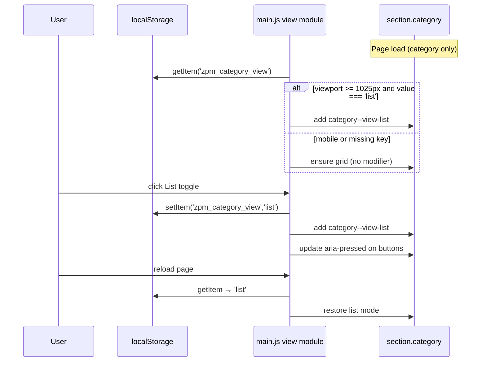

# REPORT — CATEGORY V2 — VIEW SWITCHER DESIGN PLAN

**Project:** SITE-002 (BZPM / ZPM TEST)  
**Phase:** CATEGORY V2 — Phase 1 (View Switcher: Grid / List)  
**Baseline PDP (frozen):** `SITE-002-STABLE-PDP-V4-2026-06-10`  
**Prior audit:** `SITE-002-CATEGORY-AUDIT-V1.md`  
**Date:** 2026-06-10  
**Mode:** READ ONLY — analysis and design only  
**Commit:** NO · **Push:** NO · **FTP changes:** NO · **Deploy:** NO

---

## Preconditions (verified)

| Source | Status |
|--------|--------|
| CATEGORY AUDIT V1 | Read — `projects/ocpilot/sites/site-002/reports/SITE-002-CATEGORY-AUDIT-V1.md` |
| PDP V4 baseline | Read — `projects/ocpilot/sites/site-002/reports/SITE-002-STABLE-PDP-V4-2026-06-10.md` |
| Live Twig copies | Read — `category-audit-v1-work/templates/*` |
| Live CSS (V4) | Read — `backups/stable-pdp-v4-2026-06-10/assets/css/style.css` |
| Live JS (reference) | Read — `.recovery-temp/bzpm-pdp-baseline/assets/js/main.js` |
| Live HTML snapshot | Read — `category-audit-v1-work/category-live.html` |

**Scope lock for Phase 1:** desktop list mode + view switcher + localStorage. Mobile breakpoints **768 / 576 / 390 / 375 / 360 — no changes** (analysis only).

---

## 1. Где находятся шаблоны категории

### Live paths (FTP / OpenCart theme `default`)

| Role | Remote path | Local audit copy |
|------|-------------|------------------|
| **Category page (PLP)** | `catalog/view/theme/default/template/product/category.twig` | `category-audit-v1-work/templates/catalog__view__theme__default__template__product__category.twig` |
| **Filters sidebar** | `catalog/view/theme/default/template/sections/filterssidebar.twig` | `…filterssidebar.twig` |
| **Static prototype (not wired live)** | `catalog/view/theme/default/template/sections/categorylayout.twig` | `…categorylayout.twig` |
| **Product card partial** | `catalog/view/theme/default/template/product/productcard.twig` | `…productcard.twig` |

### Page shell

- `body.page.page--category` — класс страницы категории (live HTML).
- Breadcrumbs + H1 — **вне** `category.twig` (header / page-intro), не трогаем.
- Контроллер категории на сервере: **SAFE UNKNOWN** (PHP не снят в audit session); карточки приходят как `$data['productcards']` — массив уже отрендеренных HTML-фрагментов.

### DOM-цепочка PLP (из Audit V1)

```
section.category
└── .container
    └── .category__layout
        ├── aside.category__sidebar[data-filter-sidebar]  → {{ filter }}
        └── .category__content
            ├── .zpm-sub-cat-chips (optional)
            ├── .category__topbar.category__topbar--mobile
            ├── .category__grid  → loop productcards
            └── nav.pagination
```

---

## 2. Где находятся карточки

### Единый partial

**Template:** `product/productcard.twig`  
**Markup root:** `article.p-card.p-card--{in-stock|order}`

### Где используется `.p-card` / `productcard.twig` (по репозиторию + audit)

| Context | Template / wrapper | Scope for list mode |
|---------|-------------------|---------------------|
| **Category PLP** | `product/category.twig` → `.category__grid` | **YES — Phase 1 target** |
| **Search** | `<section class="category-list">` + `.category__grid` (live HTML: `search-sink.html`) | **NO** — другой wrapper, out of scope |
| **Compare / Wishlist** | **SAFE UNKNOWN** — twig не снят; вероятно тот же partial | **NO** |
| **Related products** | `product/relproducts.twig` → Swiper slides | **NO** |
| **Carousels / home blocks** | `zpm-catalog__grid` tiles — **другой компонент**, не `.p-card` | **NO** |
| **Account orders** | `.page--account-order .category__grid` — упрощённая карточка | **NO** |

**Вывод:** изменения только под селектор `.page--category .category` (или `.page--category .category__grid--view-list`). Карточка и её глобальные стили `.p-card` **не редактируются**.

---

## 3. Можно ли реализовать переключение без дублирования карточки

### Да — рекомендуемый подход: CSS layout modifier + один Twig partial

**Принцип:** `productcard.twig` остаётся единственным источником разметки. List mode = **перекомпоновка существующих блоков** через CSS, scoped на контейнер категории.

```text
section.category.category--view-list     ← класс режима (desktop)
└── .category__grid                      ← grid-template-columns: 1fr
    └── article.p-card                   ← flex-direction: row (desktop)
        ├── .p-card__top                 ← status + wishlist/compare
        ├── .p-card__media-wrap          ← фото
        ├── .p-card__body                ← артикул, название, цена, status dup
        └── .p-card__footer              ← корзина / qty / «Подробнее»
```

**Почему не дублировать Twig:**

- Требование задачи: не ломать search, compare, wishlist, related, carousels.
- Audit V1: карточка уже shared commerce surface (`data-cart-add`, wishlist, compare).
- Дублирование partial → drift при любом будущем fix карточки.

**Отвергнутые альтернативы:**

| Approach | Verdict |
|----------|---------|
| Второй partial `productcard-list.twig` | ❌ дублирование DOM + PHP loop |
| Два include в цикле `` | ❌ то же |
| JS DOM reorder после load | ⚠️ хрупко для cart/qty hooks; CSS предпочтительнее |
| Переиспользовать класс `.category-list` | ❌ **не list view** — см. §Note |

### Note: `.category-list` ≠ list view mode

В live CSS `.category-list` — обёртка **страницы поиска** (`search-sink.html`), меняет только плотность сетки (`repeat(4, 1fr)`), **не** горизонтальную карточку. Для Phase 1 **новый модификатор**, например:

- `section.category.category--view-list`, или
- `div.category__grid.category__grid--list`

Имена не должны конфликтовать с `.category-list`.

---

## 4. Какие файлы потребуется изменить

### Обязательные (Phase 1 implementation)

| # | File (remote) | Change |
|---|---------------|--------|
| 1 | `catalog/view/theme/default/template/product/category.twig` | Блок переключателя в `.category__topbar`; optional `data-category-view` root; **не** трогать loop карточек |
| 2 | `assets/css/style.css` | Desktop-only list layout overrides; switcher UI (стили существующих pill-кнопок); mobile guard `@media (max-width: 1024px)` |
| 3 | `assets/js/main.js` | Module: read/write localStorage, toggle class, `aria-pressed`; init on load; **не** ломать sort/filter modules |

### Не менять (explicit DO NOT TOUCH)

| File | Reason |
|------|--------|
| `product/productcard.twig` | Shared card — внешний вид и сценарии frozen |
| `sections/filterssidebar.twig` | Filter pass — out of scope |
| Pagination partial / markup | Out of scope |
| `common/header.twig`, footer | Out of scope |
| Certificates, dealers form blocks | Out of scope |
| PDP files from V4 baseline | Frozen |
| PHP controllers | Not required if view is client-side only |

### Optional (FOUC reduction, not required for MVP)

| File | Change |
|------|--------|
| Inline micro-script in `category.twig` (top of section) | Sync read `localStorage` + `matchMedia('min-width:1025px')` → add class before paint |

### Baseline capture before first deploy (recommended)

| Artifact | Purpose |
|----------|---------|
| `SITE-002-STABLE-CATEGORY-V1-YYYY-MM-DD` | Rollback bundle: `category.twig`, `style.css`, `main.js` |

---

## 5. Как будет работать localStorage

### Contract

| Key | Value | Default |
|-----|-------|---------|
| `zpm_category_view` | `"grid"` \| `"list"` | `"grid"` |

### Flow



### Rules

1. **Persist per browser**, not per category URL — acceptable for catalog UX (same pattern as `selected_city` in header).
2. **Mobile ignore:** if `window.matchMedia('(max-width: 1024px)').matches`, force grid, do not apply list class, hide switcher (`display: none`).
3. **Filter AJAX:** `updateProducts()` in `main.js` replaces `.category__grid` **innerHTML only** — class on `section.category` **сохраняется**; re-init cart bindings if needed after grid swap.
4. **Sort navigation:** full page reload — localStorage restore on init.
5. **Invalid values:** treat as `"grid"`.

### Integration points in existing JS

| Existing function | Impact |
|-------------------|--------|
| `updateProducts()` (~L3941) | Replaces grid HTML — view class on parent OK; verify cart/qty rebind |
| `initPaginationAJAX()` (~L4013) | Same |
| Sort IIFE (~L6338) | Independent — no conflict |
| Filter IIFE (~L4470 area) | Independent |

**UNKNOWN:** handler for `button.pagination__more[data-next]` — in reference `main.js` **not found**; «Показать ещё» may be full navigation. Verify on deploy QA.

---

## 6. Desktop wireframe — GRID (режим А, текущий)

Viewport: **≥1025px** (sidebar visible). Без изменений.

```text
┌─────────────────────────────────────────────────────────────────────────────┐
│ Breadcrumbs · H1 (page-intro) — unchanged                                   │
├──────────────────┬──────────────────────────────────────────────────────────┤
│ FILTER SIDEBAR   │  Подкатегории chips (optional)                            │
│ 340px            │  ┌─────────────────────────────────────────────────────┐ │
│                  │  │ Sort: [Умолчанию ▼]     [▦ Grid] [≡ List]  (NEW)     │ │
│ price / toggles  │  └─────────────────────────────────────────────────────┘ │
│ attributes…      │  ┌──────────┐ ┌──────────┐ ┌──────────┐                  │
│                  │  │ status   │ │ status   │ │ status   │                  │
│ [Показать]       │  │  photo   │ │  photo   │ │  photo   │                  │
│                  │  │  art     │ │  art     │ │  art     │                  │
│                  │  │  title   │ │  title   │ │  title   │                  │
│                  │  │  price   │ │  price   │ │  price   │                  │
│                  │  │ [cart]   │ │ [cart]   │ │ [cart]   │                  │
│                  │  └──────────┘ └──────────┘ └──────────┘                  │
│                  │  … 3 cols (2 cols @1310px) …                               │
│                  │  [1] [2]  [Показать ещё]                                    │
├──────────────────┴──────────────────────────────────────────────────────────┤
│ SEO · Certificates · Dealers — unchanged                                      │
└─────────────────────────────────────────────────────────────────────────────┘
```

Grid columns (existing CSS):

- default: `repeat(3, 1fr)`
- `@max-width: 1310px`: `repeat(2, 1fr)`
- sidebar: 340px → 320px @1310 → 290px @1440

---

## 7. Desktop wireframe — LIST (режим Б)

Same sidebar/topbar. **One product per row.** Horizontal card from existing blocks.

### Preferred layout: «Фото | Информация | Покупка»

```text
┌──────────────────┬──────────────────────────────────────────────────────────┤
│ FILTER SIDEBAR   │  Sort + [▦ Grid*] [≡ List*]   *List active                 │
│                  │  ┌────────────────────────────────────────────────────────┐ │
│                  │  │ [160px    ]  Название товара (link)      ♡  ⚖ (actions)│ │
│                  │  │  photo     │  Арт: SP-P-18/6 [copy]                   │ │
│                  │  │            │  ● В наличии: 3 шт · срок поставки       │ │
│                  │  │            │  14 380,22 ₽                             │ │
│                  │  │            │                    [ В корзину ] [→]     │ │
│                  │  └────────────────────────────────────────────────────────┘ │
│                  │  ┌────────────────────────────────────────────────────────┐ │
│                  │  │ next product row …                                      │ │
│                  │  └────────────────────────────────────────────────────────┘ │
└──────────────────┴──────────────────────────────────────────────────────────┘
```

### CSS mapping (existing nodes → columns)

| Column | Existing blocks | Notes |
|--------|-----------------|-------|
| **Media ~160–200px** | `.p-card__media-wrap` | Keep `object-fit: contain`; reset card `padding-top: calc(pad*5)` |
| **Info flex 1** | `.p-card__body` | title, article, prices; show **one** status block |
| **Commerce ~200–240px** | `.p-card__footer` | cart/qty + `btn-no-text`; align center-right |
| **Top overlay** | `.p-card__top` | Reposition: static or absolute top-right for wishlist/compare |

### List-specific CSS tasks (style.css only)

- `.page--category .category--view-list .category__grid { grid-template-columns: 1fr; }`
- `.page--category .category--view-list .p-card { flex-direction: row; align-items: center; padding-top: var(--pad-box); }`
- Reset `.p-card__title { height: 105px }` → `height: auto; -webkit-line-clamp: 2` **only in list scope**
- Hide duplicate `.p-card__body .p-card__status` in list (top status visible)
- `@media (max-width: 1024px)`: **strip all** `.category--view-list` overrides

---

## 8. Риски

| # | Risk | Severity | Mitigation |
|---|------|----------|------------|
| 1 | **Absolute `.p-card__top`** breaks row layout | High | List-scoped `position: static` + flex order; QA long titles |
| 2 | **Fixed title height 105px** → empty space in list | Medium | Scoped `height: auto` + line-clamp in list mode only |
| 3 | **Duplicate status** (top + body) | Medium | Hide body status in list scope (pattern exists @490px) |
| 4 | **Cart/qty JS** after filter AJAX grid swap | Medium | Call existing cart card init after `updateProducts` if needed |
| 5 | **FOUC** on reload in list mode | Low | Optional inline pre-paint script |
| 6 | **No grid/list icons** in SVG sprite (`zpm_ico__*`) | Low | Text toggle on existing `category__sort-btn` pill style; aria-labels «Сетка» / «Список» |
| 7 | **`.category-list` name collision** | Low | Use `category--view-list`, not `.category-list` |
| 8 | **Mobile regression** if media queries leak | High | All list rules inside `@media (min-width: 1025px)`; hide switcher ≤1024 |
| 9 | **PDP V4 CSS shared file** | Medium | Scope selectors with `.page--category`; regression-test PDP after style.css edit |
| 10 | **«Показать ещё» behavior** | Unknown | QA append vs replace; may need small JS follow-up |
| 11 | **Accessibility** | Low | `role="group"`, `aria-pressed`, keyboard focus on toggle |

---

## 9. План деплоя

**Precondition:** operator explicit approval (this document is planning only).

### Step 0 — Baseline

1. FTP read-only capture → `backups/stable-category-v1-YYYY-MM-DD/`:
   - `category.twig`
   - `style.css`
   - `main.js`
2. SHA256 manifest (pattern: PDP V4 report).

### Step 1 — Staging implementation (local work dir)

1. Edit `category.twig` — switcher markup in topbar.
2. Edit `style.css` — desktop list layout + switcher (scoped).
3. Edit `main.js` — localStorage module.

### Step 2 — Deploy to TEST (`zpm.new-site.space`)

1. Upload 3 files to matching remote paths.
2. Clear `system/storage/cache/template/`.
3. Hard refresh / bypass CDN if any.

### Step 3 — QA matrix (desktop)

| Check | Grid | List |
|-------|------|------|
| PLP reference URL (Premium-600) | PASS baseline | NEW |
| Sort change + reload | mode persists | mode persists |
| Filter apply (AJAX) | cards refresh | list layout holds |
| Pagination page 2 | OK | OK |
| Cart add / qty on card | OK | OK |
| Wishlist / compare toggle | OK | OK |
| Viewports 1920 / 1440 / 1280 | 3/2 cols | 1 col rows |

### Step 4 — Regression (must not change)

| Area | URL / check |
|------|-------------|
| PDP V4 | SPKB SKU hero + commerce + documents |
| Mobile PLP | 768 / 576 / 390 / 375 / 360 screenshots vs audit V1 |
| Search page | still `.category-list` 4-col grid |
| Related on PDP | swiper cards unchanged |

### Step 5 — Sign-off

Report `SITE-002-CATEGORY-V2-VIEW-SWITCHER-PASS.md` + optional screenshots in `qa/category-v2-view-switcher/`.

---

## 10. План rollback

### Trigger

Visual break, cart regression, PDP CSS collision, mobile layout drift.

### Procedure

1. Verify local baseline manifest SHA256.
2. FTP upload from `stable-category-v1-*`:
   - `catalog/view/theme/default/template/product/category.twig`
   - `assets/css/style.css`
   - `assets/js/main.js`
3. Clear Twig cache.
4. Confirm:
   - no switcher in topbar HTML;
   - grid-only PLP;
   - PDP V4 QA checklist (§6 of STABLE-PDP-V4 report);
   - mobile screenshots match CATEGORY AUDIT V1 baseline.
5. Optional: `localStorage.removeItem('zpm_category_view')` in console — stale key harmless after rollback.

### Partial rollback

| Symptom | Rollback file |
|---------|---------------|
| List layout broken, switcher OK | `style.css` only |
| JS errors | `main.js` only |
| Markup issue | `category.twig` only |

---

## Switcher UI — design constraints (reuse only)

Per task: **no new design system elements.**

| Element | Reuse from site |
|---------|-----------------|
| Toggle container | `.category__topbar` flex row (same gap as sort) |
| Buttons | Visual clone of `.category__sort-btn` (pill, border, 50px height) |
| Active state | Border/text color from existing hover/active tokens (`--accent-color-01` / `--main-dark-color`) |
| Icons | **None in sprite** — use text «Сетка» / «Список» or reuse `.p-card__action` square hit area with aria-label only |
| Placement | Right cluster: `[Sort] [View toggle]` — filters btn stays mobile-only (existing `@min-width:1025`) |

Proposed markup sketch (category.twig only):

```html
<div class="category__view" data-category-view role="group" aria-label="Вид каталога">
  <button type="button" class="category__view-btn is-active"
          data-category-view-mode="grid" aria-pressed="true">Сетка</button>
  <button type="button" class="category__view-btn"
          data-category-view-mode="list" aria-pressed="false">Список</button>
</div>
```

CSS: `.category__view-btn` extends `.category__sort-btn` rules (no new colors).

---

## Mobile — analysis only (no changes Phase 1)

From Audit V1 + CSS review:

| Viewport | Grid cols | Switcher |
|----------|-----------|----------|
| 768 | 2 | hidden |
| 576 | 2 | hidden |
| 390 / 375 | 2 | hidden |
| 360 | 1 | hidden |

Implementation guard:

```css
@media (max-width: 1024px) {
  .category__view { display: none !important; }
}
```

JS: on resize crossing 1024, strip `category--view-list` from DOM.

---

## UNKNOWN / SECURITY

| Item | Status |
|------|--------|
| Category PHP controller path | SAFE UNKNOWN — not in repo snapshot |
| `pagination__more` JS handler | SAFE UNKNOWN — not in reference main.js |
| Compare/wishlist twig paths | SAFE UNKNOWN |
| Grid/list icons in design files | Not in live SVG sprite — confirmed absent |
| FTP credentials | In audit scripts only — not for commit |

---

## Summary

Phase 1 **может быть реализована без изменения `productcard.twig`**: один модификатор на `section.category`, CSS flex/grid перекомпоновка на desktop, localStorage + минимальный JS. Затрагиваются **3 файла**. Mobile и shared card contexts **изолированы** селекторами `.page--category` и media guard. Deploy и rollback — по паттерну PDP V4 baseline.

**Next step after operator approval:** capture CATEGORY V1 baseline → implement in work folder → deploy to TEST → QA pass report.

---

**Git:** no commit · **Push:** no · **FTP changes:** none · **Deploy:** none
