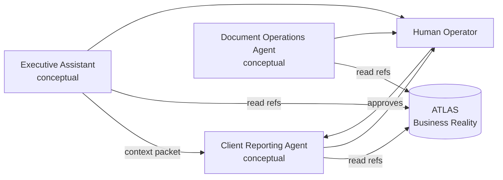

# OPS Agent Decomposition v1

**Status:** **documented** — conceptual operational roles only.  
**Program:** OPS — Business Operations Domain  
**Date:** 2026-06-04  
**Parent:** [OPS-BOUNDARIES-v1.md](OPS-BOUNDARIES-v1.md) · [OPS-MVP-SCOPE-v1.md](OPS-MVP-SCOPE-v1.md)

---

## Critical disclaimer

The roles below are **conceptual operational roles** for human-supervised work decomposition.

They are **NOT**:

- runtime agents
- MARS agent cards
- implemented software components
- autonomous operators

Any future agent implementation requires a **separate charter**, registry decisions, and explicit anti-autonomy boundaries.

---

## Role catalog overview

| # | Conceptual role | Primary MVP touch |
|---|-----------------|-------------------|
| 1 | Executive Assistant | Triggers, reminders, context assembly |
| 2 | Document Operations Agent | Document prep and routing (non-legal) |
| 3 | Client Reporting Agent | Monthly client reporting workflow |

---

## 1. Executive Assistant (conceptual)

### Purpose

Support the **studio operator** with calendar rhythm, deadline awareness, and **context assembly** before operational work begins — without making business decisions.

### Responsibilities

| Area | Responsibility |
|------|----------------|
| Rhythm | Surface reporting period boundaries and due dates |
| Context | Gather pointers to ATLAS entities (client, project, agreement) |
| Coordination | Prepare checklist for operator before draft work |
| Follow-up | Track open OPS cycles until closed |

### Inputs

| Input | Source |
|-------|--------|
| Reporting calendar / trigger event | Human-defined schedule |
| ATLAS entity references | ATLAS (when available) or operator attestation |
| Prior cycle completion record | OPS operational artifacts |
| Operator notes | Human |

### Outputs

| Output | Consumer |
|--------|----------|
| Context packet for reporting cycle | Operator, Client Reporting role |
| Reminder / deadline status | Operator (HomeGateway display **future — SAFE UNKNOWN**) |
| Blockers list (missing ATLAS refs) | Missing Data Review stage |

### Approval points

| Gate | Approver |
|------|----------|
| Start reporting cycle for client | **Human operator** |
| Use non-ATLAS fallback identity | **Human operator** (explicit attestation) |

### ATLAS relationship

**Read-only consumer** of clients, projects, agreements, contacts. **Never** writes canonical fields.

---

## 2. Document Operations Agent (conceptual)

### Purpose

Structure **document preparation and routing workflows** (contracts support packs, acts, annexes, internal checklists) as **operational steps** — not legal drafting or signing authority.

### Responsibilities

| Area | Responsibility |
|------|----------------|
| Workflow | Document stage checklist (collect → draft → review → route) |
| Version tracking | Operational version labels (not legal registry) |
| Routing | Who must review internally before external send |
| Completeness | Flag missing attachments or requisites references |

### Inputs

| Input | Source |
|-------|--------|
| Document templates (operational) | Human-maintained library **outside OPS SoT** |
| ATLAS organization / agreement refs | ATLAS |
| Requisites | ATLAS — **never invented in OPS** |
| Operator instructions | Human |

### Outputs

| Output | Consumer |
|--------|----------|
| Document workflow status | Operator |
| Internal review package | Human reviewers |
| Handoff to legal/accounting | **Outside OPS** — human channels |

### Approval points

| Gate | Approver |
|------|----------|
| Internal operational review complete | **Human reviewer** |
| External send / sign | **Human** — legal/accounting authority **outside OPS** |

### ATLAS relationship

References organizations, agreements, requisites from ATLAS. Document **legal substance** is **not** owned by OPS or this role.

**MVP note:** Document Operations is **deferred** from Monthly Client Reporting MVP — role documented for future expansion.

---

## 3. Client Reporting Agent (conceptual)

### Purpose

Drive the **Monthly Client Reporting** operational workflow: evidence collection, draft report, missing-data review, approval, delivery prep, and completion recording.

### Responsibilities

| Area | Responsibility |
|------|----------------|
| Evidence | Collect operator-attested work evidence (MIG, ORCA, MetaBOT, WPilot, OCPilot summaries) |
| Draft | Assemble draft client report from templates + evidence |
| Quality | Run missing-data and consistency checks against ATLAS refs |
| Delivery prep | Package approved report for client channel |
| Closure | Record completion and update cycle status |

### Inputs

| Input | Source |
|-------|--------|
| ATLAS client / project / website / service context | ATLAS (or attested fallback) |
| Work evidence | Human-curated attachments (tickets, exports, summaries) |
| Reporting template | OPS workflow doc + human templates |
| Prior month report (optional) | OPS operational archive |

### Outputs

| Output | Consumer |
|--------|----------|
| Draft monthly report | Operator review |
| Approved report package | Client delivery (human send) |
| Completion record | OPS operational tracking |
| Missing data register | Operator / ATLAS intake |

### Approval points

| Gate | Approver |
|------|----------|
| Draft acceptable for review | **Human operator** |
| Client delivery authorized | **Human operator** (explicit approval) |
| Canonical fact correction | **ATLAS path** — not OPS alone |

### ATLAS relationship

**Primary MVP consumer role.** All client-facing identity and structure citations must align with ATLAS anti-duplication rules ([OPS-ATLAS-RELATIONSHIP-v1.md](OPS-ATLAS-RELATIONSHIP-v1.md)).

---

## 4. Role interaction (conceptual)

---

## 5. Implementation status

| Item | State |
|------|-------|
| Role definitions | **documented** |
| Agent cards | **not created** |
| Runtime | **none** |
| Automation | **none claimed** |

---

*OPS Agent Decomposition v1 · conceptual roles only.*
