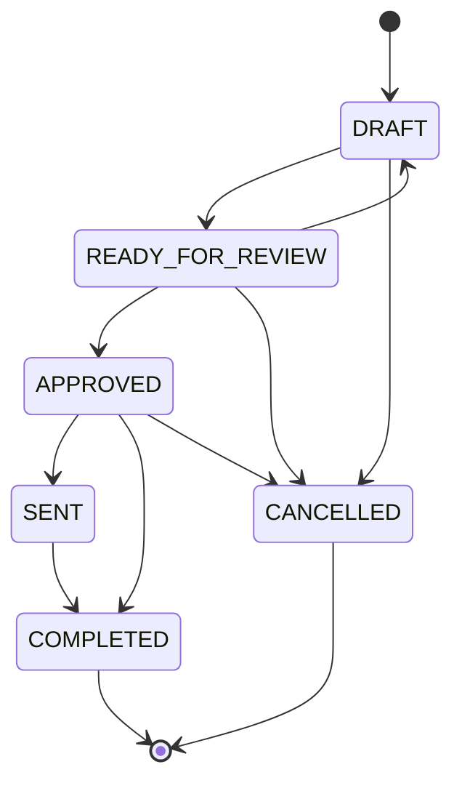

# OPS — Approval Model v1

**Status:** **documented** — conceptual approval model (design).  
**Program:** OPS — Business Operations Domain  
**Phase:** 2 — Operational Data Model Foundation  
**Date:** 2026-06-04  
**Parent:** [OPS-OPERATIONAL-DATA-MODEL-v1.md](OPS-OPERATIONAL-DATA-MODEL-v1.md) · [OPS-CASE-MODEL-v1.md](OPS-CASE-MODEL-v1.md)  
**Is not:** e-signature product, legal sign-off system, or automated approval engine.

---

## 1. Purpose

Define **ApprovalRequest** lifecycle, states, transitions, and **human authority** requirements so client-facing and financially sensitive actions never proceed without explicit human gates.

---

## 2. ApprovalRequest definition

| Aspect | Definition |
|--------|------------|
| **Name** | ApprovalRequest |
| **Owner domain** | OPS (operational gate tracking) |
| **Scope** | One approval decision for one artifact or action |
| **Legal binding** | **No** — OPS approval means **operational permission to proceed**, not contract signature |

---

## 3. Recommended states

| State | Meaning |
|-------|---------|
| `DRAFT` | Request prepared; artifact incomplete or not yet submitted for review |
| `READY_FOR_REVIEW` | Artifact fixed; awaiting designated approver |
| `APPROVED` | Approver attested readiness; outbound or closure may proceed |
| `SENT` | For outbound flows — artifact dispatched after approval (human confirms) |
| `COMPLETED` | Approval thread closed; no further action on this request |
| `CANCELLED` | Request withdrawn; must not be used to justify send or closure |

---

## 4. Allowed transitions

| From | To | Condition |
|------|-----|-----------|
| `DRAFT` | `READY_FOR_REVIEW` | Submitter confirms artifact ready |
| `READY_FOR_REVIEW` | `APPROVED` | **Approver** explicitly approves |
| `READY_FOR_REVIEW` | `DRAFT` | Rework required |
| `READY_FOR_REVIEW` | `CANCELLED` | Request abandoned |
| `APPROVED` | `SENT` | Outbound action executed (reports, comms) |
| `APPROVED` | `COMPLETED` | Non-send closure (e.g. internal-only approval) |
| `SENT` | `COMPLETED` | Delivery confirmed by operator |
| Any non-terminal | `CANCELLED` | Human cancel with reason |

**Forbidden transitions (normative):**

| Forbidden | Rationale |
|-----------|-----------|
| `DRAFT` → `APPROVED` | Skips review gate |
| `DRAFT` → `SENT` | Skips review and approval |
| `CANCELLED` → `APPROVED` | Revive requires new ApprovalRequest |
| Autonomous → `APPROVED` | No unsupervised approval in OPS v1 |

---

## 5. Human authority requirements

| Requirement ID | Requirement |
|----------------|-------------|
| **HA-01** | Every `APPROVED` transition requires a named **human approver** (role title or person id — format SAFE UNKNOWN) |
| **HA-02** | Approver must **not** be the sole author of the artifact when policy demands four-eyes — studio policy **SAFE UNKNOWN**; OPS recommends separation for client reports |
| **HA-03** | `SENT` requires prior `APPROVED` for the same request id |
| **HA-04** | Legal binding signatures are **outside** OPS — human/legal process |
| **HA-05** | Payment initiation is **outside** OPS — accounting/human only |
| **HA-06** | Approval timestamps are **human-attested** until trusted audit log exists |

### 5.1 Suggested approver categories (non-exhaustive)

| Category | Typical approver |
|----------|------------------|
| Client report send | Studio lead or delegated operator |
| Client communication | Studio lead or account owner |
| Document package routing | Operations lead (non-legal) |
| Invoice issuance trigger | **Outside OPS** — accounting authority |

---

## 6. Mandatory approval before (normative)

Approval is **mandatory** before:

| Action | Approval subject | Notes |
|--------|------------------|-------|
| **Document sending** | Document package or version | Operational routing — not legal sign-off |
| **Report sending** | Client report for period | Aligns with workflow stage 7 |
| **Client communication** | `CommunicationDraft` | Email/message to client |
| **Invoice issuance** | Invoice trigger | OPS tracks **request for accounting** only — **no** OPS authority on amounts |
| **Closure actions** | Case or document closure | `PROJECT_COMPLETION`, `DOCUMENT_CLOSING` case types |

**Rule MA-01:** If no `ApprovalRequest` exists in `APPROVED` or terminal send state, operators **must not** claim completion of gated actions in OPS records.

---

## 7. Fields (conceptual)

### Required

| Field | Description |
|-------|-------------|
| `approval_id` | Unique label within case |
| `case_id` | Parent OpsCase |
| `status` | Approval state |
| `approval_subject_type` | e.g. `report`, `document`, `communication`, `closure`, `invoice_trigger` |
| `requested_at` | When review was requested |
| `approver` | Named human (required from `READY_FOR_REVIEW` onward) |

### Suggested

| Field | Description |
|-------|-------------|
| `submitter` | Who requested review |
| `approved_at` | When moved to `APPROVED` |
| `sent_at` | When moved to `SENT` |
| `artifact_pointer` | Link to draft file or record id |
| `rejection_notes` | When returned to `DRAFT` |
| `cancellation_reason` | When `CANCELLED` |

---

## 8. Relationship to OpsCase

| Case status | Approval interaction |
|-------------|---------------------|
| `PENDING_APPROVAL` | One or more requests in `READY_FOR_REVIEW` or awaiting `APPROVED` |
| `IN_PROGRESS` | May have requests in `DRAFT` |
| `BLOCKED` | Approval rejected or approver unavailable |
| `CLOSED` | All mandatory approvals `COMPLETED` or `CANCELLED` with documented exception |

---

## 9. Relationship to other OPS records

| Record | Link |
|--------|------|
| `ReportRecord` | Primary artifact for monthly report approval |
| `DocumentRecord` | Document package version under review |
| `CommunicationDraft` | Message body under review |
| `EscalationRecord` | May be created if approval SLA missed |

---

## 10. What this model does not define

| Topic | Status |
|-------|--------|
| Notification to approver | **SAFE UNKNOWN** |
| Integration with email | **Not claimed** |
| Digital signature providers | **Out of scope** |
| Multi-step approval chains | Deferred — v1 allows multiple requests per case, not a full workflow engine |

---

## 11. Related documents

| Document | Link |
|----------|------|
| OPS boundaries (approval workflows) | [OPS-BOUNDARIES-v1.md](OPS-BOUNDARIES-v1.md) |
| Monthly reporting workflow stage 7 | [../workflows/OPS-MONTHLY-REPORTING-WORKFLOW-v1.md](../workflows/OPS-MONTHLY-REPORTING-WORKFLOW-v1.md) |
| Status model (approval statuses) | [OPS-STATUS-MODEL-v1.md](OPS-STATUS-MODEL-v1.md) |
| Case model | [OPS-CASE-MODEL-v1.md](OPS-CASE-MODEL-v1.md) |

---

*OPS — Approval Model v1 · conceptual approval gates (documentation only).*
