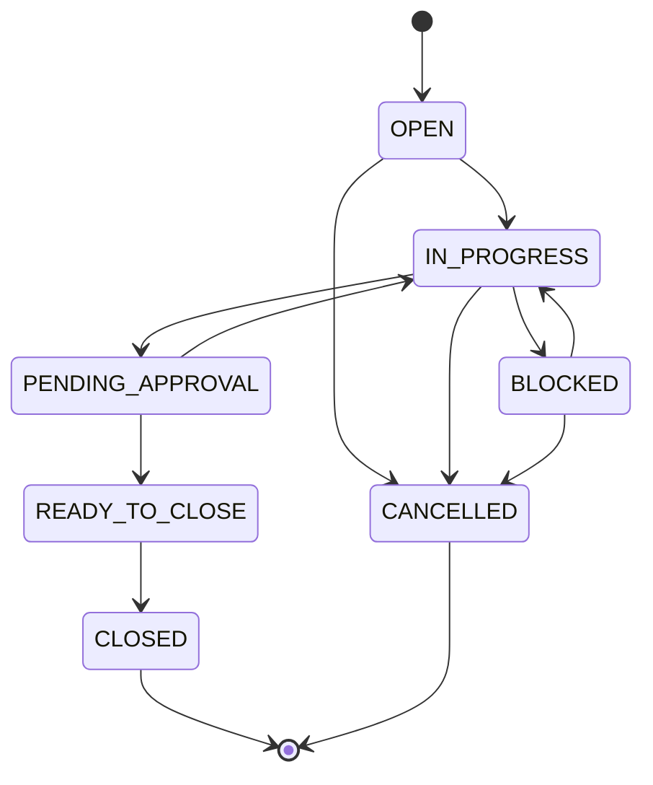

# OPS — Case Model v1

**Status:** **documented** — conceptual case model (design).  
**Program:** OPS — Business Operations Domain  
**Phase:** 2 — Operational Data Model Foundation  
**Date:** 2026-06-04  
**Parent:** [OPS-OPERATIONAL-DATA-MODEL-v1.md](OPS-OPERATIONAL-DATA-MODEL-v1.md) · [OPS-STATUS-MODEL-v1.md](OPS-STATUS-MODEL-v1.md)  
**Is not:** database schema, ticket system implementation, or JIRA replacement.

---

## 1. Purpose

Define **OpsCase** as the **primary operational object** in OPS — the container for one coherent thread of back-office work (a reporting month, a document closing, a follow-up chain, an escalation).

All other OPS records (deadlines, approvals, report metadata, tasks) **attach to** or **reference** a case unless explicitly standalone (rare — deferred).

---

## 2. Conceptual disclaimer

> **OpsCase** is a **conceptual model** for human-supervised operations. Field names below are **suggested attributes**, not SQL columns, not API payloads, and not enforced by runtime in Phase 2.

---

## 3. OpsCase definition

| Aspect | Definition |
|--------|------------|
| **Name** | OpsCase (operational case) |
| **Owner domain** | OPS |
| **Scope** | One operational thread with clear open/close semantics |
| **ATLAS coupling** | Holds **references** to ATLAS entities; does not replace them |

---

## 4. Case types

| Type code | Label | Typical use |
|-----------|-------|-------------|
| `MONTHLY_REPORTING` | Monthly reporting | Client report cycle for a defined period |
| `DOCUMENT_CLOSING` | Document closing | Contract, act, annex, or closure package prep and routing |
| `PROJECT_COMPLETION` | Project completion | Operational wrap-up checklist (non-structural — project SoT stays ATLAS) |
| `FOLLOW_UP` | Follow-up | Post-delivery or post-meeting action chain |
| `ESCALATION` | Escalation | Elevated handling when blockers or SLA risk persist |
| `OTHER` | Other | Operator-defined; requires human `case_subtype_label` |

**Rule CT-01:** Exactly one primary `case_type` per case. Secondary concerns use linked child records or `TaskRecord`, not duplicate cases for the same period+client+type without human acknowledgment (see ODM-06).

---

## 5. Lifecycle

### 5.1 Case status flow (high level)

Uses case statuses from [OPS-STATUS-MODEL-v1.md](OPS-STATUS-MODEL-v1.md):



### 5.2 Lifecycle meanings

| Phase | Meaning |
|-------|---------|
| **Open** | Case created; scope and period confirmed by human |
| **In progress** | Active operational work (draft, evidence, routing) |
| **Blocked** | Cannot proceed — missing ATLAS data, approval hold, or external dependency |
| **Pending approval** | One or more `ApprovalRequest` in non-terminal state blocks progression |
| **Ready to close** | Deliverables sent or obligations met; awaiting completion record |
| **Closed** | Human attested completion; no further operational work expected |
| **Cancelled** | Case abandoned with documented reason |

**Automation:** None claimed. Transitions are **human-operated**.

---

## 6. Fields

### 6.1 Required fields (conceptual)

| Field | Description |
|-------|-------------|
| `case_id` | Operator- or system-assigned unique label — see §6.4 for non-binding documentation convention |
| `case_type` | One of case types in §4 |
| `status` | Case status vocabulary |
| `priority` | `LOW` \| `NORMAL` \| `HIGH` \| `URGENT` — human-assigned |
| `owner` | Human operator responsible for case progression |
| `opened_at` | When case was opened (human-attested timestamp) |
| `related_atlas_entities` | Non-empty list **or** explicit `attestation_mode: safe_unknown` with operator note |

### 6.2 Suggested fields

| Field | Description |
|-------|-------------|
| `case_title` | Short operator-facing label |
| `case_subtype_label` | Free text when `case_type` is `OTHER` |
| `reporting_period` | For `MONTHLY_REPORTING` — e.g. `2026-05` |
| `due_at` | Primary deadline pointer (may duplicate `Deadline` record) |
| `closed_at` | When status became `CLOSED` |
| `cancelled_at` | When status became `CANCELLED` |
| `cancellation_reason` | Human text |
| `blocker_summary` | Current blocker when `BLOCKED` |
| `notes` | Non-canonical operator notes |

### 6.3 Related collections (by reference)

| Collection | Record type | Cardinality |
|------------|-------------|-------------|
| Deadlines | `Deadline` | 0..n |
| Reminders | `Reminder` | 0..n |
| Approvals | `ApprovalRequest` | 0..n |
| Reports | `ReportRecord` | 0..1 typical for monthly reporting |
| Documents | `DocumentRecord` | 0..n |
| Communications | `CommunicationDraft` | 0..n |
| Escalations | `EscalationRecord` | 0..n |
| Tasks | `TaskRecord` | 0..n |
| Related files | File pointers | 0..n — **storage location SAFE UNKNOWN** |

### 6.4 Case ID guidance (documentation convention only — A-06)

**Not** persistence schema, database primary key, or mandatory format. Operators and pilots may use readable slugs for human navigation.

| Pattern | Example | When to use |
|---------|---------|-------------|
| `OPS-MR-{YYYY}-{MM}-{seq}` | `OPS-MR-2026-06-001` | `MONTHLY_REPORTING` |
| `OPS-DC-{YYYY}-{MM}-{seq}` | `OPS-DC-2026-07-001` | `DOCUMENT_CLOSING` |
| `OPS-FU-{YYYY}-{MM}-{seq}` | `OPS-FU-2026-06-003` | `FOLLOW_UP` |
| `OPS-PC-{YYYY}-{MM}-{seq}` | `OPS-PC-2026-08-001` | `PROJECT_COMPLETION` |
| `OPS-ES-{YYYY}-{MM}-{seq}` | `OPS-ES-2026-06-001` | `ESCALATION` |

**Rules (guidance only):**

| Rule | Statement |
|------|-----------|
| **CID-G01** | `{seq}` is operator-assigned per period — zero-padded three digits recommended |
| **CID-G02** | Slugs must remain unique within operator workspace for the active period |
| **CID-G03** | Legacy pilot slugs (e.g. `ops-wf01-pilot-2026-06-example-client`) remain valid evidence labels |

---

## 7. Example structure (illustrative)

```yaml
# Conceptual example — not a persisted file format claim
case_id: "OPS-MR-2026-05-001"
case_type: MONTHLY_REPORTING
status: IN_PROGRESS
priority: NORMAL
owner: "operator@studio"
opened_at: "2026-06-01T09:00:00+03:00"
reporting_period: "2026-05"
related_atlas_entities:
  - atlas_entity_type: client
    atlas_entity_id: null
    atlas_entity_label: "Acme LLC (attested)"
    attestation_mode: operator_attested
  - atlas_entity_type: project
    atlas_entity_id: "proj-42"
    attestation_mode: atlas_verified
deadlines:
  - deadline_id: "dl-internal-draft"
    category: REPORTING
    due_at: "2026-06-05"
approvals:
  - approval_id: "apr-report-send"
    status: DRAFT
related_files:
  - label: "draft-v2.docx"
    pointer: "SAFE UNKNOWN"
notes: "Awaiting ORCA screenshot from PPC lead"
```

---

## 8. Relationships

| From | To | Relationship |
|------|-----|--------------|
| OpsCase | ATLAS entities | **References** (0..n) |
| OpsCase | Deadline | **Contains** / links (0..n) |
| OpsCase | ApprovalRequest | **Contains** / links (0..n) |
| OpsCase | ReportRecord | **Contains** (0..1 typical) |
| OpsCase | DocumentRecord | **Contains** (0..n) |
| OpsCase | EscalationRecord | **May spawn** when escalation case type or child record |
| OpsCase | TaskRecord | **Decomposes** work (0..n) |
| Monthly reporting workflow | OpsCase | Workflow stages 1–10 map to case lifecycle — see workflow doc |

---

## 9. Mapping to Monthly Reporting Workflow

Canonical case status timing (alignment A-03) — authority: [OPS-WF-01-MONTHLY-REPORTING-v1.md](../workflows/OPS-WF-01-MONTHLY-REPORTING-v1.md) §4–§5:

| Workflow stage | Typical case status | Rationale |
|----------------|---------------------|-----------|
| 1 Reporting Trigger | `OPEN` | Case opened; scope confirmed |
| 2–4 Context / evidence / draft | `IN_PROGRESS` | Active preparation work |
| 5 Missing Data Review | `BLOCKED` or `IN_PROGRESS` | Hold when blockers unresolved |
| 6 Operator Review | `IN_PROGRESS` | Internal review; ApprovalRequest may enter `READY_FOR_REVIEW` |
| 7 Approval | `PENDING_APPROVAL` → `IN_PROGRESS` | Gate active; returns to active prep after approval |
| 8 Client Delivery Preparation | `IN_PROGRESS` | Send and packaging still in progress |
| 9 Completion Recording | `READY_TO_CLOSE` | Delivery attested; completion metadata recorded — work complete, awaiting final close |
| 10 Closing Status Update | `CLOSED` | Terminal close record and follow-ups captured |

**Rule CM-01:** Case enters `READY_TO_CLOSE` at **stage 9**, not stage 8. Stage 8 remains `IN_PROGRESS` until human-attested send and delivery prep complete.

---

## 10. Executive Assistant role touchpoint

The conceptual **Executive Assistant** role (see [OPS-AGENT-DECOMPOSITION-v1.md](OPS-AGENT-DECOMPOSITION-v1.md)) typically:

- Opens or suggests opening an `OpsCase` at period boundary
- Attaches initial ATLAS references and deadline reminders
- Surfaces blocker summary when case is `BLOCKED`

No autonomous case creation is claimed.

---

## 11. Related documents

| Document | Link |
|----------|------|
| Operational data model | [OPS-OPERATIONAL-DATA-MODEL-v1.md](OPS-OPERATIONAL-DATA-MODEL-v1.md) |
| Status model | [OPS-STATUS-MODEL-v1.md](OPS-STATUS-MODEL-v1.md) |
| Approval model | [OPS-APPROVAL-MODEL-v1.md](OPS-APPROVAL-MODEL-v1.md) |
| Deadline model | [OPS-DEADLINE-MODEL-v1.md](OPS-DEADLINE-MODEL-v1.md) |
| Monthly reporting workflow | [../workflows/OPS-MONTHLY-REPORTING-WORKFLOW-v1.md](../workflows/OPS-MONTHLY-REPORTING-WORKFLOW-v1.md) |

---

*OPS — Case Model v1 · OpsCase conceptual model (documentation only).*
