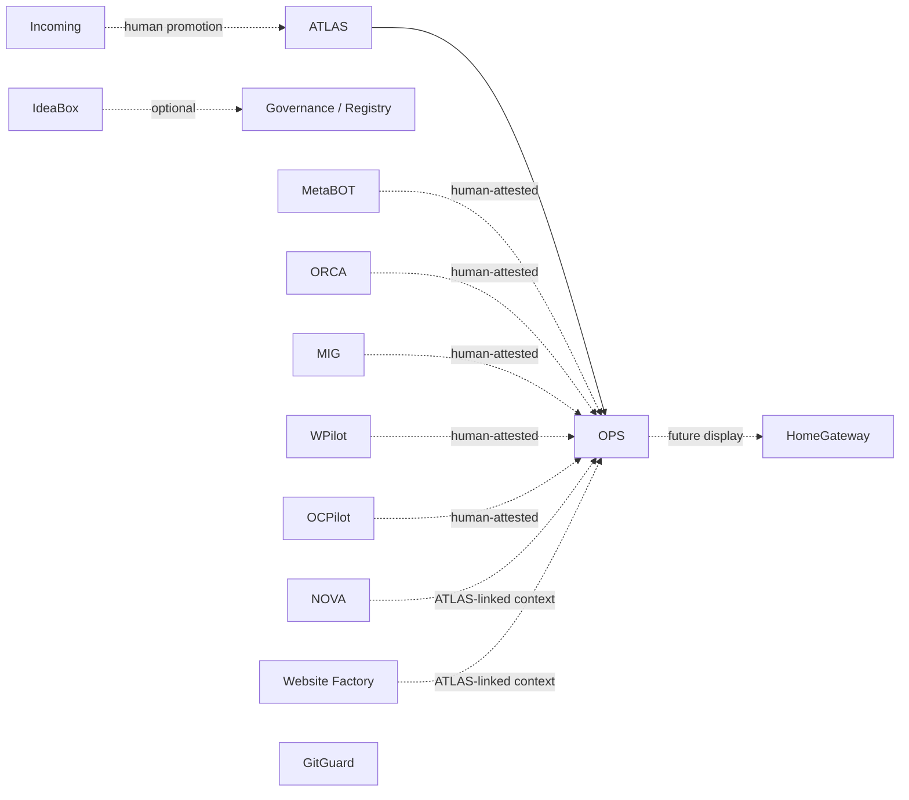

# OPS — Ecosystem Relationships v1

**Status:** **documented** — ecosystem relationship map (design).  
**Program:** OPS — Business Operations Domain  
**Phase:** 4 — Operational Mission & System Positioning  
**Date:** 2026-06-04  
**Parent:** [OPS-SYSTEM-POSITIONING-v1.md](OPS-SYSTEM-POSITIONING-v1.md) · [OPS-ATLAS-RELATIONSHIP-v1.md](OPS-ATLAS-RELATIONSHIP-v1.md)  
**Is not:** update to `governance/ecosystem-topology-index.md`, integration spec, or API catalog.

---

## 1. Purpose

Provide a **relationship map** between OPS and major MARS ecosystem entities: relationship type, what each side consumes or provides, and the **boundary** OPS must preserve.

**Normative constraint:**

> **OPS never becomes ecosystem authority** — it does not register programs, define topology, own external execution truth, or replace ATLAS, governance, or product lanes.

---

## 2. Relationship map (summary table)

| Entity | Relationship type | OPS consumes | OPS provides | Boundary |
|--------|-------------------|--------------|--------------|----------|
| **ATLAS** | **Upstream SoT (intent)** | C-01–C-09 entity context | Operational discovery signals (human intake to ATLAS — future) | OPS references; never duplicates canonical identity |
| **HomeGateway** | **Downstream surface (future)** | Possible status display contract | Documented workflow semantics for cockpit | HomeGateway does not own cases or approvals |
| **NOVA** | **Adjacent methodology** | ATLAS project refs for reporting narrative | — | NOVA owns app factory; OPS owns back-office rhythm |
| **MetaBOT** | **Evidence supplier (external)** | Human-attested content summaries | — | OPS does not execute n8n; MetaBOT owns execution truth |
| **ORCA** | **Evidence supplier** | Human-attested PPC summaries | — | ORCA owns PPC ops; OPS owns report cycle |
| **MIG** | **Evidence supplier** | Human-attested research attachments | — | MIG owns acquisition; OPS owns reporting workflow |
| **WPilot** | **Adjacent site ops** | Operator-confirmed site ops facts in reports | — | WPilot owns WP runtime ops |
| **OCPilot** | **Adjacent site ops** | Same as WPilot for OpenCart | — | OCPilot owns storefront ops |
| **GitGuard** | **Orthogonal survivability** | — | — | Repo survivability ≠ back-office case tracking |
| **IdeaBox** | **Orthogonal incubation** | — | — | Ideas deferred ≠ operational cases |
| **Incoming** | **Orthogonal intake** | — | — | Untrusted drops ≠ OPS SoT; promotion is human |
| **MARS Website Factory** | **Adjacent production** | ATLAS-linked project context in reports | — | Factory owns artifact semantics; OPS owns report stages |
| **Registry / governance** | **External authority** | Registration readiness artifacts (reports) | Documented domain pack | OPS does not edit registry in foundation passes |

---

## 3. Per-entity detail

### 3.1 ATLAS

| Field | Value |
|-------|-------|
| **Relationship type** | Consumer ← **Business Reality Registry** |
| **OPS consumes** | Clients, contacts, organizations, projects, websites, services, agreements, requisites, relationships |
| **OPS provides** | None to ATLAS SoT — optional future **intake hints** (new contact discovered during reporting) via human governance |
| **Boundary** | ATLAS wins on identity/structure disagreements (AD-04) |

### 3.2 HomeGateway

| Field | Value |
|-------|-------|
| **Relationship type** | Potential **UI consumer** of OPS status |
| **OPS consumes** | — |
| **OPS provides** | Normative ops vocabulary (case status, report due, approval pending) for future display |
| **Boundary** | Cockpit ≠ workflow engine; see governance topology “surface layer” |

### 3.3 NOVA

| Field | Value |
|-------|-------|
| **Relationship type** | **Adjacent** production methodology |
| **OPS consumes** | Project identity via ATLAS when reporting on mobile engagements |
| **OPS provides** | — |
| **Boundary** | NOVA documentation does not define monthly reporting gates |

### 3.4 MetaBOT

| Field | Value |
|-------|-------|
| **Relationship type** | **External execution** · evidence via human |
| **OPS consumes** | Operator-supplied evidence of content production (exports, screenshots, summaries) |
| **OPS provides** | — |
| **Boundary** | [external-system-boundaries.md](../../../governance/external-system-boundaries.md) — adapter ≠ MetaBOT |

### 3.5 ORCA

| Field | Value |
|-------|-------|
| **Relationship type** | **Evidence supplier** (PPC lane) |
| **OPS consumes** | PPC review outputs cited in client reports |
| **OPS provides** | — |
| **Boundary** | ORCA owns campaign/SERP operational truth; OPS owns report workflow |

### 3.6 MIG

| Field | Value |
|-------|-------|
| **Relationship type** | **Evidence supplier** (research lane) |
| **OPS consumes** | Research session outputs as attachments |
| **OPS provides** | — |
| **Boundary** | MIG owns acquisition methodology; OPS does not run SERP capture |

### 3.7 WPilot

| Field | Value |
|-------|-------|
| **Relationship type** | **Adjacent** WordPress operations |
| **OPS consumes** | Operator-confirmed maintenance/deploy facts for reporting |
| **OPS provides** | — |
| **Boundary** | WPilot pack owns WP ops; OPS references ATLAS websites |

### 3.8 OCPilot

| Field | Value |
|-------|-------|
| **Relationship type** | **Adjacent** OpenCart operations |
| **OPS consumes** | Same pattern as WPilot |
| **OPS provides** | — |
| **Boundary** | Storefront runtime outside OPS |

### 3.9 GitGuard

| Field | Value |
|-------|-------|
| **Relationship type** | **Orthogonal** — repository survivability |
| **OPS consumes** | — (no dependency for case lifecycle) |
| **OPS provides** | — |
| **Boundary** | Git checkpoints and freeze discipline ≠ monthly report approval |

### 3.10 IdeaBox (continuity)

| Field | Value |
|-------|-------|
| **Relationship type** | **Orthogonal** — incubation |
| **OPS consumes** | — |
| **OPS provides** | — |
| **Boundary** | Deferred ideas in `continuity/` are not OpsCases |

### 3.11 Incoming

| Field | Value |
|-------|-------|
| **Relationship type** | **Orthogonal** — untrusted intake |
| **OPS consumes** | — (promoted material may inform human ops work) |
| **OPS provides** | — |
| **Boundary** | `incoming/` quarantine is not OPS storage or SoT |

---

## 4. Ecosystem diagram

Solid arrow: normative data dependency (ATLAS → OPS). Dotted: human-attested or future. Tilde: no operational dependency.

---

## 5. OPS never becomes ecosystem authority

| Forbidden elevation | Correct owner |
|---------------------|---------------|
| Registering or retiring `project_id` rows | Governance + registry pass |
| Editing ecosystem topology index | Governance maintainers |
| Declaring MetaBOT/WPilot “part of OPS” | External-system-boundaries + pack README |
| Promoting OPS working copy to ATLAS SoT | ATLAS governance |
| Autonomous client communication | Human operator + explicit charter |

---

## 6. Cross-links (canonical paths)

| Entity | MARS path (documentation) |
|--------|---------------------------|
| ATLAS | `projects/atlas/` |
| HomeGateway | governance topology · HomeGateway v4.ai |
| NOVA | `projects/nova/` (per topology) |
| MetaBOT | `projects/metabot-seo-content-agent/` |
| ORCA | `projects/orca/` |
| MIG | `incoming/mig/` + program pilots |
| WPilot | `projects/wpilot/` |
| OCPilot | `projects/ocpilot/` |
| GitGuard | `projects/mars-survivability/registries/gitguard-system-entry-v1.md` |
| IdeaBox | `continuity/` |
| Incoming | `incoming/README.md` |

Paths reflect **documented** topology — OPS does not assert all packs are equally mature.

---

## 7. SAFE UNKNOWN

| Topic | Unknown | Verification |
|-------|---------|--------------|
| Bidirectional HomeGateway API | Read/write shape for case status | Joint charter |
| Automated evidence ingest | Per-lane adapters | Explicit integration charter per supplier |

---

*OPS Ecosystem Relationships v1 · Phase 4 · Business Operations Domain.*
