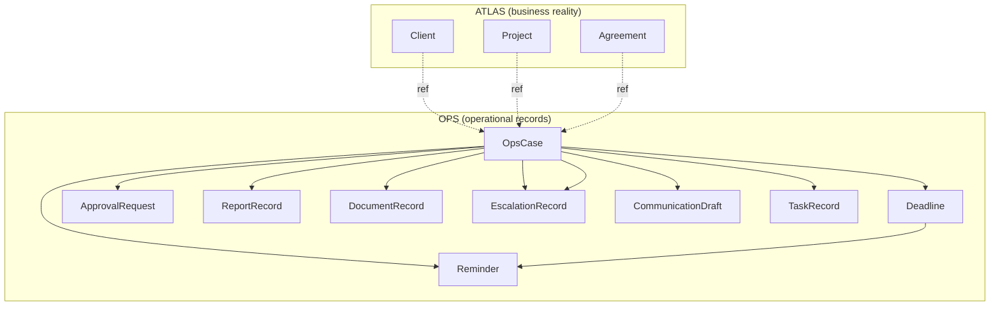

# OPS — Operational Data Model v1

**Status:** **documented** — conceptual domain model (design).  
**Program:** OPS — Business Operations Domain  
**Phase:** 2 — Operational Data Model Foundation  
**Date:** 2026-06-04  
**Parent:** [OPS-BOUNDARIES-v1.md](OPS-BOUNDARIES-v1.md) · [OPS-ATLAS-RELATIONSHIP-v1.md](OPS-ATLAS-RELATIONSHIP-v1.md)  
**Is not:** database schema, storage engine, API specification, runtime implementation, or registry entry.

---

## 1. Purpose

Define the **operational records** that OPS owns so future workflows (monthly reporting, document operations, executive assistant functions, approvals, reminders, follow-ups, escalations) share one vocabulary and one ownership boundary.

This model is **ATLAS-consuming** and **not ATLAS-replacing**.

---

## 2. Design principles

| Principle | Statement |
|-----------|-----------|
| **P-01** | OPS records describe **operational work** — cycles, gates, deadlines, drafts, delivery — not canonical business identity |
| **P-02** | Every OPS record that names a business entity **references** ATLAS (or explicit human attestation when ATLAS ids are unavailable) |
| **P-03** | OPS does **not** become a business registry — no parallel master lists for clients, orgs, or projects |
| **P-04** | This document is a **conceptual model** — field names are illustrative, not SQL columns |
| **P-05** | Persistence location, APIs, and automation are **SAFE UNKNOWN** until separate charters |

---

## 3. ATLAS-owned entities vs OPS-owned records

### 3.1 Separation table

| Layer | Owner | Examples | SoT intent |
|-------|-------|----------|------------|
| **Business reality** | **ATLAS** | Client, Organization, Contact, Project, Website, Service, Agreement, Requisites, Relationship | Canonical **who / what / how related** |
| **Operational work** | **OPS** | OpsCase, Deadline, Reminder, ApprovalRequest, ReportRecord, DocumentRecord, EscalationRecord, CommunicationDraft, TaskRecord | Canonical **how back-office work is structured and tracked** for a period or action |

### 3.2 ATLAS entity examples (consumer reference only)

| ATLAS entity (design) | OPS may store |
|----------------------|---------------|
| Client | `atlas_client_ref` — stable id or attested label + **SAFE UNKNOWN** if id missing |
| Organization | `atlas_organization_ref` |
| Contact | `atlas_contact_ref` (delivery routing) |
| Project | `atlas_project_ref` |
| Website | `atlas_website_ref` |
| Service | `atlas_service_ref` |
| Agreement | `atlas_agreement_ref` (scope pointer — not legal interpretation) |
| Requisites | `atlas_requisites_ref` (values copied only from ATLAS-attested fields) |
| Relationship | `atlas_relationship_ref` or derived edge set from ATLAS export |

**OPS must not** store authoritative copies of ATLAS canonical fields (legal name, tax id, bank details, relationship graph) as editable master data.

### 3.3 OPS record examples (operational SoT intent)

| OPS record | Role |
|------------|------|
| **OpsCase** | Primary container for one operational thread (reporting cycle, document closing, follow-up, escalation) — see [OPS-CASE-MODEL-v1.md](OPS-CASE-MODEL-v1.md) |
| **Deadline** | Due moment for an obligation tied to a case — see [OPS-DEADLINE-MODEL-v1.md](OPS-DEADLINE-MODEL-v1.md) |
| **Reminder** | Human-facing nudge linked to deadline or case — no calendar product claimed |
| **ApprovalRequest** | Gate before sensitive outbound or closure actions — see [OPS-APPROVAL-MODEL-v1.md](OPS-APPROVAL-MODEL-v1.md) |
| **ReportRecord** | Monthly (or other) client report draft, review, delivery, close, and **completion metadata** — see §3.4 |
| **DocumentRecord** | Operational tracking for contract/act/annex prep and routing (not legal substance) |
| **EscalationRecord** | Elevated attention when SLA, approval, or data blockers persist |
| **CommunicationDraft** | Client-bound message draft pending approval |
| **TaskRecord** | Granular human task within a case (checklist item, sub-step) |

---

## 4. Reference model (ATLAS identities in OPS)

OPS stores **references**, not replacements:

| Reference field (conceptual) | Meaning |
|------------------------------|---------|
| `atlas_entity_type` | e.g. `client`, `project`, `agreement` |
| `atlas_entity_id` | Stable id when ATLAS provides one |
| `atlas_entity_label` | Human-readable label for operator UI when id missing |
| `attestation_mode` | `atlas_verified` \| `operator_attested` \| `safe_unknown` |
| `referenced_at` | When reference was last confirmed by operator |

**Rule R-01:** If `atlas_entity_id` is absent, workflows must use **SAFE UNKNOWN** markers in client-facing artifacts — not invented canonical facts.

**Rule R-02:** Multiple OPS records may reference the same ATLAS entity; deduplication of **business** identity is ATLAS responsibility, not OPS.

### 3.4 ReportRecord — completion and review (alignment A-01, A-04)

**Decision (Pilot Alignment Pass v1):** `CompletionRecord` is **not** a separate OPS record type. Workflow and pilot language **CompletionRecord** maps to the **`completion_metadata`** block embedded on `ReportRecord` at stage 9 (Completion Recording).

| Concept | Representation |
|---------|----------------|
| **CompletionRecord** (workflow/pilot term) | `ReportRecord.completion_metadata` — human-attested cycle completion |
| **review_log** (stage 6) | `ReportRecord.review_log` — ordered operator review entries |

**Suggested `completion_metadata` fields (conceptual):**

| Field | Description |
|-------|-------------|
| `completed_at` | When cycle completion was recorded (human-attested) |
| `completed_by` | Operator who recorded completion |
| `archive_pointer` | Optional pointer to archived package — **storage SAFE UNKNOWN** |
| `follow_ups` | Optional list of follow-up items for WF-03 or next trigger |

**Suggested `review_log` entry fields (conceptual):**

| Field | Description |
|-------|-------------|
| `reviewed_at` | Human-attested timestamp |
| `reviewer` | Named operator |
| `draft_version` | Label of draft under review (e.g. `v1.0-reviewed`) |
| `notes` | Review findings and required edits |
| `outcome` | `approved_for_submission` \| `rework_required` |

**Rule ODM-07:** Do not create a standalone `CompletionRecord` row or file format in v1 — completion is always anchored to the parent `ReportRecord`.

---

## 5. Record relationship overview

---

## 6. Anti-duplication rules (operational data model)

Extends [OPS-ATLAS-RELATIONSHIP-v1.md](OPS-ATLAS-RELATIONSHIP-v1.md) AD-01–AD-06:

| Rule ID | Rule |
|---------|------|
| **ODM-01** | Creating an OPS record **does not** create an ATLAS entity |
| **ODM-02** | Renaming a client in an OPS note **does not** update ATLAS — intake to ATLAS is a separate human process |
| **ODM-03** | Report or document **draft content** may differ from ATLAS facts; **identity fields** in outbound artifacts must match ATLAS or be omitted |
| **ODM-04** | OPS spreadsheets used during a cycle are **working copies**; on conflict, ATLAS wins for identity/structure |
| **ODM-05** | `ReportRecord` and `DocumentRecord` may embed snapshots for audit — snapshots are **non-canonical** unless promoted through ATLAS |
| **ODM-06** | Duplicate OPS cases for the same client+period+type require **human merge or cancel** — no automatic dedupe in v1 |

---

## 7. Status and lifecycle (cross-cutting)

Controlled vocabularies live in [OPS-STATUS-MODEL-v1.md](OPS-STATUS-MODEL-v1.md). Case-specific lifecycle in [OPS-CASE-MODEL-v1.md](OPS-CASE-MODEL-v1.md). Approval states in [OPS-APPROVAL-MODEL-v1.md](OPS-APPROVAL-MODEL-v1.md).

---

## 8. What this model does not define

| Topic | Status |
|-------|--------|
| Database tables or indexes | **Out of scope** |
| File storage paths for drafts | **SAFE UNKNOWN** — infrastructure / EAR decision |
| ATLAS read API or sync | **SAFE UNKNOWN** — see ATLAS relationship doc |
| Agent persistence or message bus | **Forbidden** to claim in v1 |
| Registry row for OPS | **Not done** — intentional |

---

## 9. Related documents

| Document | Link |
|----------|------|
| OPS Case model | [OPS-CASE-MODEL-v1.md](OPS-CASE-MODEL-v1.md) |
| OPS Approval model | [OPS-APPROVAL-MODEL-v1.md](OPS-APPROVAL-MODEL-v1.md) |
| OPS Deadline model | [OPS-DEADLINE-MODEL-v1.md](OPS-DEADLINE-MODEL-v1.md) |
| OPS Status model | [OPS-STATUS-MODEL-v1.md](OPS-STATUS-MODEL-v1.md) |
| Monthly reporting workflow | [../workflows/OPS-MONTHLY-REPORTING-WORKFLOW-v1.md](../workflows/OPS-MONTHLY-REPORTING-WORKFLOW-v1.md) |
| Phase 2 report | [../reports/REPORT-ops-operational-data-model-v1.md](../reports/REPORT-ops-operational-data-model-v1.md) |

---

*OPS — Operational Data Model v1 · conceptual domain model (documentation only).*
