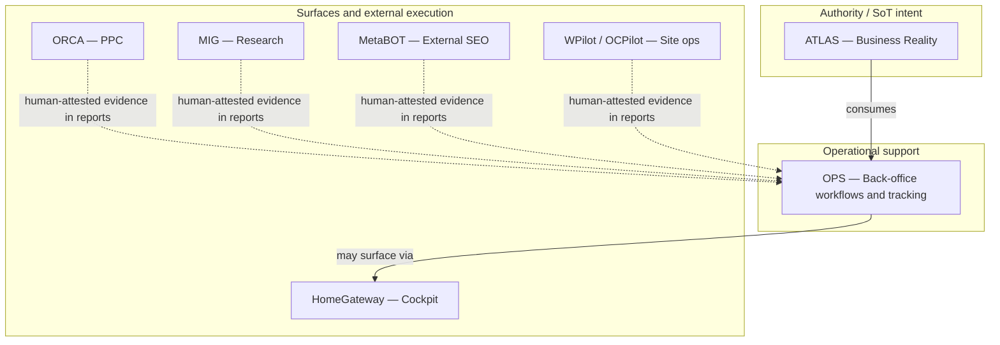

# OPS — System Positioning v1

**Status:** **documented** — ecosystem positioning layer (design).  
**Program:** OPS — Business Operations Domain  
**Phase:** 4 — Operational Mission & System Positioning  
**Date:** 2026-06-04  
**Parent:** [OPS-OPERATIONAL-MISSION-v1.md](OPS-OPERATIONAL-MISSION-v1.md) · [OPS-BOUNDARIES-v1.md](OPS-BOUNDARIES-v1.md)  
**Is not:** registry row, topology index edit, or implementation roadmap.

---

## 1. Purpose

Answer **why OPS exists as a separate domain** in MARS and **why it is not** ATLAS, HomeGateway, MetaBOT, ORCA, MIG, WPilot, OCPilot, or other registered lanes — using a single positioning table and explicit scope / non-scope lists.

---

## 2. Why OPS exists as a separate system

| Reason | Explanation |
|--------|-------------|
| **Different question** | ATLAS answers *who/what exists*; OPS answers *what back-office work is due, in what stage, and who approved it* |
| **Different lifecycle** | Operational cases (reporting month, document closing) have open/close semantics unrelated to entity taxonomy |
| **Creep resistance** | Without a named domain, spreadsheets and chat become shadow CRM and shadow registry |
| **Consumer clarity** | HomeGateway, reporting roles, and future surfaces need a **documented** ops contract, not ad-hoc process |
| **Human-supervised by design** | OPS normatively forbids autonomous client/money/legal decisions — a boundary other systems do not own |

OPS is **not** separated for branding; it is separated so **operational tracking** does not absorb **business reality** or **product execution** domains.

---

## 3. Positioning table

| System | Primary role | What it owns | What it does not own |
|--------|--------------|--------------|----------------------|
| **OPS** | Business Operations — human-supervised back-office workflows and operational tracking | Reporting/document/follow-up/approval/deadline **workflow structure**, OpsCase and operational record **intent**, completion and gate visibility | Canonical identity, legal/financial truth, PPC/SERP/CMS runtime, registry rows, autonomous execution |
| **ATLAS** | Business Reality Registry | Clients, orgs, contacts, projects, websites, services, agreements, requisites, relationships (SoT **intent**) | Monthly report stages, operational approvals, reminder products |
| **HomeGateway** | Personal operational cockpit (surface) | Operator navigation, links, signals, quick actions UI | OPS workflow SoT, approval authority, business registry |
| **MetaBOT** | External SEO content multi-workflow system (n8n) | Live content production graphs, credentials, execution truth | Client reporting workflow, document closing, ATLAS entities |
| **ORCA** | PPC operational toolkit | Campaign review, PPC evidence, human-supervised PPC ops | Monthly reporting workflow, client identity, document routing |
| **MIG** | Market intelligence / research acquisition | Research sessions, SERP/market evidence packs | Reporting cycle ownership, client SoT, operational approvals |
| **WPilot** | WordPress-oriented site operations | WP site ops domain in MARS pack | Back-office reporting methodology, ATLAS, OPS case lifecycle |
| **OCPilot** | OpenCart storefront operations | OpenCart ops domain in MARS pack | Same as WPilot — storefront ops, not OPS |
| **NOVA** | Mobile / PWA production methodology | App factory vocabulary, design-before-runtime discipline | Back-office rhythms, client report approval gates |
| **MARS Website Factory** | Multi-agent website production (documented) | Site artifact architecture, semantic layers (docs) | OPS operational cases (may be **referenced** in reports via ATLAS) |

*ORCA, MIG, WPilot, OCPilot, NOVA rows reflect documented MARS packs and governance topology — **not** claims that OPS integrates with them automatically.*

---

## 4. Why OPS is not each system (summary)

### 4.1 Not ATLAS

ATLAS maintains **canonical business identity and structure**. OPS **consumes** that reality for operational threads. If OPS owned identity, every report spreadsheet would become a fork of the business registry — violating AD-01–AD-06 in [OPS-ATLAS-RELATIONSHIP-v1.md](OPS-ATLAS-RELATIONSHIP-v1.md).

### 4.2 Not HomeGateway

HomeGateway is a **cockpit surface** for visibility and navigation. OPS is the **domain** that defines how reporting and back-office workflows run. HomeGateway may **display** OPS-related status in the future; it does **not** own workflow stages, approvals, or case records.

### 4.3 Not MetaBOT

MetaBOT is an **external** execution system for SEO content. OPS does **not** run n8n graphs or own content production truth. OPS may track **human-attested** summaries of content work in client reports — not live MetaBOT dispatch.

### 4.4 Not ORCA

ORCA owns **PPC operational evidence and review**. OPS may **cite** ORCA evidence in a monthly report when an operator attaches it — OPS does not own bids, campaigns, or SERP tooling.

### 4.5 Not MIG

MIG **acquires** market reality. OPS does **not** own research methodology or evidence capture. MIG outputs may appear as attachments in OPS-driven reporting — operator-attested only.

### 4.6 Not WPilot / OCPilot

WPilot and OCPilot own **CMS/storefront operations** for their stacks. OPS may reference **websites** via ATLAS and report operational facts the operator confirms — not deploy pipelines or storefront runtime.

### 4.7 Not NOVA

NOVA is a **production methodology** for mobile/PWA apps. OPS has no production-line ownership over NOVA deliverables; cross-reference is via ATLAS project identity when reporting.

### 4.8 Not MARS registry / governance authority

OPS Foundation passes **do not** modify `registry/project-registry.md` or ecosystem topology. OPS is **not** the program registry and **not** the authority on what is “registered” in MARS.

---

## 5. OPS scope

| In scope | Description |
|----------|-------------|
| **Operational workflows** | WF-01–WF-06 documented families |
| **Operational data model** | OpsCase, deadlines, approvals, report/document records (conceptual) |
| **Human supervision norms** | Approval gates, no autonomous client delivery |
| **ATLAS consumption** | Reference discipline and anti-duplication |
| **MVP** | Monthly Client Reporting Control (WF-01) |
| **Role decomposition** | Executive Assistant, Document Operations, Client Reporting — **conceptual** |

---

## 6. OPS non-scope

| Out of scope | Owner / lane |
|--------------|--------------|
| Canonical business identity | ATLAS |
| Cockpit UI and operator home navigation | HomeGateway |
| SEO content execution | MetaBOT (external) |
| PPC campaign truth | ORCA |
| Market research truth | MIG |
| WordPress / OpenCart runtime ops | WPilot / OCPilot |
| Mobile app factory methodology | NOVA |
| Website artifact production semantics | MARS Website Factory |
| Git survivability advisories | GitGuard / mars-survivability |
| Idea incubation filesystem | IdeaBox / continuity |
| Untrusted external intake quarantine | Incoming |
| Registry rows and ecosystem topology edits | Governance / registry passes |
| Runtime, agents, n8n, databases | **Not claimed** — separate charters |

---

## 7. Positioning diagram (conceptual)

---

## 8. SAFE UNKNOWN

| Topic | Unknown | Verification |
|-------|---------|--------------|
| HomeGateway OPS module | Whether cockpit shows case/report status | HomeGateway integration charter |
| Cross-pack deep links | Standard URLs from ORCA/MIG into OPS cases | Per-consumer charter when tooling exists |

---

*OPS System Positioning v1 · Phase 4 · Business Operations Domain.*
