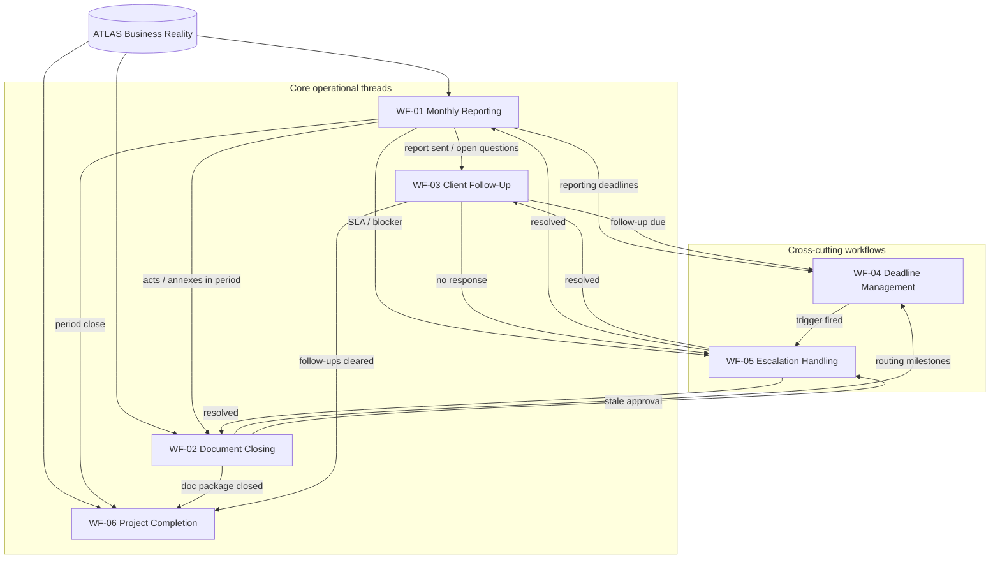

# OPS — Workflow Architecture v1

**Status:** **documented** — conceptual workflow layer (design).  
**Program:** OPS — Business Operations Domain  
**Phase:** 3 — Workflow Architecture  
**Date:** 2026-06-04  
**Parent:** [OPS-OPERATIONAL-DATA-MODEL-v1.md](OPS-OPERATIONAL-DATA-MODEL-v1.md) · [OPS-CASE-MODEL-v1.md](OPS-CASE-MODEL-v1.md)  
**Is not:** workflow engine, orchestration runtime, agent implementation, or automation product.

---

## 1. Purpose

Define the **complete operational workflow layer** for OPS: how back-office work **moves conceptually** through human-supervised stages, who **owns** progression, how **approvals** and **deadlines** bind workflows, and how the six workflow families **relate** to one another.

This layer sits on top of:

| Foundation | Role in workflow layer |
|------------|------------------------|
| **ATLAS** (business reality) | Read-only context and references — OPS does not redefine project or client truth |
| **OPS Operational Data Model** | Record types and reference discipline |
| **OpsCase** | Primary container per operational thread |
| **Approval Model** | Gates before send, route, and closure |
| **Deadline Model** | Obligations, reminders, escalation triggers |
| **Status Model** | Controlled vocabularies mapped to workflow stages |

**Normative constraint:**

> All OPS workflows are **human-supervised**. No autonomous execution. No workflow engine is assumed or claimed.

---

## 2. Workflow family overview

| ID | Workflow | Case type | MVP / phase |
|----|----------|-----------|-------------|
| **WF-01** | Monthly Reporting | `MONTHLY_REPORTING` | **MVP** — approved pilot scope |
| **WF-02** | Document Closing | `DOCUMENT_CLOSING` | Documented — deferred from MVP |
| **WF-03** | Client Follow-Up | `FOLLOW_UP` | Documented — human comms prep |
| **WF-04** | Deadline Management | Cross-cutting | Documented — no calendar product |
| **WF-05** | Escalation Handling | `ESCALATION` (or child of parent case) | Documented — human-triggered |
| **WF-06** | Project Completion | `PROJECT_COMPLETION` | Documented — operational wrap-up only |

Each workflow has a dedicated specification:

| Workflow | Document |
|----------|----------|
| WF-01 | [OPS-WF-01-MONTHLY-REPORTING-v1.md](../workflows/OPS-WF-01-MONTHLY-REPORTING-v1.md) |
| WF-02 | [OPS-WF-02-DOCUMENT-CLOSING-v1.md](../workflows/OPS-WF-02-DOCUMENT-CLOSING-v1.md) |
| WF-03 | [OPS-WF-03-CLIENT-FOLLOW-UP-v1.md](../workflows/OPS-WF-03-CLIENT-FOLLOW-UP-v1.md) |
| WF-04 | [OPS-WF-04-DEADLINE-MANAGEMENT-v1.md](../workflows/OPS-WF-04-DEADLINE-MANAGEMENT-v1.md) |
| WF-05 | [OPS-WF-05-ESCALATION-HANDLING-v1.md](../workflows/OPS-WF-05-ESCALATION-HANDLING-v1.md) |
| WF-06 | [OPS-WF-06-PROJECT-COMPLETION-v1.md](../workflows/OPS-WF-06-PROJECT-COMPLETION-v1.md) |

**Legacy detail doc (WF-01 stages):** [OPS-MONTHLY-REPORTING-WORKFLOW-v1.md](../workflows/OPS-MONTHLY-REPORTING-WORKFLOW-v1.md) — stage-by-stage contract retained; WF-01 is the architecture-family member.

---

## 3. Workflow relationships (conceptual map)

### 3.1 Relationship summary

| From | To | Relationship |
|------|-----|--------------|
| WF-01 | WF-03 | Post-delivery follow-ups often spawn from reporting close (stage 10) |
| WF-01 | WF-02 | Reporting period may surface document obligations (acts, annexes) |
| WF-01 | WF-06 | End-of-engagement or milestone completion review includes report history |
| WF-02 | WF-01 | Document context may feed next monthly report evidence |
| WF-04 | All | Deadlines and reminders attach to any OpsCase |
| WF-05 | All | Escalation may block or overlay any active case |
| WF-06 | WF-01, WF-02, WF-03 | Completion review checks outstanding operational threads |
| ATLAS | WF-01, WF-02, WF-06 | Context and references — never rewritten by OPS closure |

---

## 4. Workflow ownership model

### 4.1 Human operator (primary owner)

| Responsibility | Scope |
|----------------|-------|
| Case progression | Moves OpsCase through status model |
| Approvals | Named approver for gated actions |
| Send / route | Executes outbound actions outside OPS transmission |
| Escalation judgment | Decides when WF-05 applies |
| ATLAS attestation | Confirms references or marks SAFE UNKNOWN |

**Rule WO-01:** Every OpsCase has exactly one **owner** (human) at a time; transfer requires explicit handoff note.

### 4.2 Conceptual roles (not runtime)

Roles from [OPS-AGENT-DECOMPOSITION-v1.md](OPS-AGENT-DECOMPOSITION-v1.md) **decompose work** but do not execute autonomously:

| Role | Primary workflows |
|------|-----------------|
| **Executive Assistant** | WF-01 trigger rhythm, WF-03 reminders, WF-04 awareness |
| **Client Reporting Agent** | WF-01 stages (evidence, draft, review) |
| **Document Operations Agent** | WF-02 prep and routing |

**Rule WO-02:** Role names describe **who typically prepares** work; **human operator** remains accountable for case status and approvals.

### 4.3 Approver (gate owner)

| Gate class | Typical approver |
|------------|------------------|
| Client report send | Studio lead or delegated operator |
| Client communication | Studio lead or account owner |
| Document package routing | Operations lead (non-legal) |
| Project completion closure | Operations lead + engagement owner |

See [OPS-APPROVAL-MODEL-v1.md](OPS-APPROVAL-MODEL-v1.md) for state machine and HA-01–HA-06.

---

## 5. Workflow dependency model

### 5.1 Hard dependencies (normative)

| Dependency | Rule |
|------------|------|
| **Approval before send** | WF-01 stage 8, WF-03 send, WF-02 external route require `ApprovalRequest` in `APPROVED` or valid terminal path |
| **ATLAS reference before client-facing artifact** | Missing identity → WF-01 stage 5 hold or SAFE UNKNOWN — not invented facts |
| **Case open before child records** | Deadlines, approvals, reports attach to an open or in-progress OpsCase unless escalation child pattern documented in WF-05 |

### 5.2 Soft dependencies (operational)

| Dependency | Notes |
|------------|-------|
| WF-04 before WF-01 peak load | Reporting deadlines should exist before draft crunch — human sets |
| WF-02 parallel to WF-01 | Document closing may run in same period without blocking report if resources allow |
| WF-06 after WF-01/WF-02 | Completion review assumes operational threads are addressable |

### 5.3 Forbidden dependency claims

| Forbidden | Rationale |
|-----------|-----------|
| Autonomous WF-04 → WF-05 | Escalation requires human trigger |
| WF-06 redefines ATLAS project status | OPS records completion only |
| WF-02 legal sign-off in OPS | Legal binding outside OPS |

---

## 6. Workflow lifecycle principles

| Principle | Statement |
|-----------|-----------|
| **WL-01** | One primary `case_type` per OpsCase — secondary work uses linked records or tasks |
| **WL-02** | Workflow stages map to **status model** vocabularies — not ad-hoc strings (ST-01) |
| **WL-03** | Terminal case state is `CLOSED` or `CANCELLED` with human reason |
| **WL-04** | Cross-cutting WF-04 and WF-05 **overlay** thread workflows — they do not replace them |
| **WL-05** | Completion (WF-06) is **operational attestation**, not structural project mutation in ATLAS |
| **WL-06** | No stage auto-advances — human confirms each transition |
| **WL-07** | Evidence and drafts are **operator-attested** — storage location SAFE UNKNOWN |

### 6.1 Required use of foundation models

| Model | Workflow usage |
|-------|----------------|
| **OpsCase** | Every WF-01–03 and WF-06 thread opens or links to a case; WF-05 may be case type or child escalation |
| **Deadline** | WF-04 defines creation/monitoring; WF-01/02/03 consume categories `REPORTING`, `DOCUMENTS`, `FOLLOW_UP` |
| **Reminder** | Human-set nudges per WF-04 — dismiss does not close deadline |
| **ApprovalRequest** | Mandatory gates per WF-01 stage 7, WF-02 routing, WF-03 send, WF-06 closure |
| **Status Model** | Case, report, document, communication, escalation, deadline statuses — per record type |

---

## 7. OpsCase mapping discipline

| Workflow | Default case type | Typical linked records |
|----------|-------------------|------------------------|
| WF-01 | `MONTHLY_REPORTING` | `ReportRecord`, `Deadline` (REPORTING), `ApprovalRequest` |
| WF-02 | `DOCUMENT_CLOSING` | `DocumentRecord`, `Deadline` (DOCUMENTS), `ApprovalRequest` |
| WF-03 | `FOLLOW_UP` | `CommunicationDraft`, `Deadline` (FOLLOW_UP), `Reminder` |
| WF-04 | Any active case | `Deadline`, `Reminder` |
| WF-05 | `ESCALATION` or parent + `EscalationRecord` | Links to triggering case |
| WF-06 | `PROJECT_COMPLETION` | Reviews WF-01/02/03 artifacts; closure `ApprovalRequest` |

---

## 8. Human supervision statement

| Topic | Position |
|-------|----------|
| Execution | **Human-operated** at every stage |
| Agents | Conceptual roles only — see agent decomposition |
| Automation | **None claimed** in Phase 3 |
| Orchestration | **No** MARS orchestration graph, n8n export, or state machine runtime |
| Notifications | Channel and delivery **SAFE UNKNOWN** |

---

## 9. Explicit non-goals (Phase 3)

| Non-goal | Status |
|----------|--------|
| OPS registry registration | Not performed — separate governance pass |
| ATLAS schema or API changes | Not performed |
| Persistence / database | Not specified |
| Calendar / cron implementation | WF-04 documents model only |
| Multi-step approval engine | Multiple `ApprovalRequest` per case allowed; no engine |

---

## 10. Related documents

| Layer | Document |
|-------|----------|
| Boundaries | [OPS-BOUNDARIES-v1.md](OPS-BOUNDARIES-v1.md) |
| ATLAS relationship | [OPS-ATLAS-RELATIONSHIP-v1.md](OPS-ATLAS-RELATIONSHIP-v1.md) |
| MVP scope | [OPS-MVP-SCOPE-v1.md](OPS-MVP-SCOPE-v1.md) |
| Operational index | [../OPERATIONAL-INDEX.md](../OPERATIONAL-INDEX.md) |
| Phase 3 report | [../reports/REPORT-ops-workflow-architecture-v1.md](../reports/REPORT-ops-workflow-architecture-v1.md) |

---

*OPS — Workflow Architecture v1 · human-supervised workflow layer (documentation only).*
