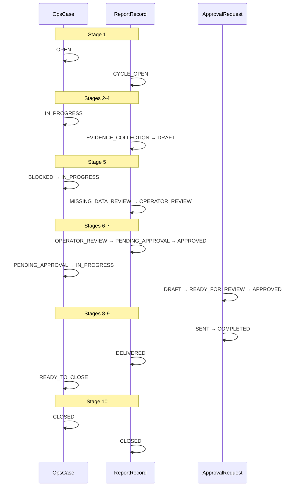

# OPS WF-01 Live Binding Pilot v1

**Status:** **pilot evidence** — human-supervised cycle with live ATLAS references (documentation only).  
**Program:** OPS — Business Operations Domain  
**Workflow:** WF-01 Monthly Reporting  
**Pilot date:** 2026-06-10  
**ATLAS snapshot basis:** ATLAS Integrity Snapshot Register v1 (audit date 2026-06-07) · operator context 2026-06-09  
**Pilot mode:** Human-supervised walkthrough · no runtime · no automation · no registry changes · no ATLAS changes  
**Normative sources:** [OPS-WF-01-MONTHLY-REPORTING-v1.md](../workflows/OPS-WF-01-MONTHLY-REPORTING-v1.md) · [OPS-MONTHLY-REPORTING-WORKFLOW-v1.md](../workflows/OPS-MONTHLY-REPORTING-WORKFLOW-v1.md) · [OPS-CASE-MODEL-v1.md](../foundation/OPS-CASE-MODEL-v1.md) · [OPS-STATUS-MODEL-v1.md](../foundation/OPS-STATUS-MODEL-v1.md) · [OPS-APPROVAL-MODEL-v1.md](../foundation/OPS-APPROVAL-MODEL-v1.md) · [OPS-DEADLINE-MODEL-v1.md](../foundation/OPS-DEADLINE-MODEL-v1.md) · [OPS-ATLAS-RELATIONSHIP-v1.md](../foundation/OPS-ATLAS-RELATIONSHIP-v1.md)

**Prior pilot:** [OPS-WF01-PILOT-v1.md](OPS-WF01-PILOT-v1.md) — placeholder entities; verdict **PARTIAL** (model usability). Alignment pass v1 (2026-06-05) closed findings A-01–A-06.

---

## 1. Pilot charter

| Constraint | Value |
|------------|-------|
| Purpose | Validate OPS operational model against **live ATLAS entity references** — binding validation, not report quality |
| Runtime | **None** |
| Integrations | **None** |
| Registry / topology / lifecycle / ATLAS | **Not modified** |
| ATLAS entity creation | **Forbidden** — use attested reality only |
| Registration impact | **None** — OPS already **REGISTERED** (2026-06-05) |

---

## 2. Pilot subject selection

### 2.1 Organization (fixed contour)

| Field | ATLAS value |
|-------|-------------|
| **Organization** | **ORG-0004** — Триумф |
| **Legal entity** | **LE-0003** — ООО «Триумф» |
| **Lifecycle** | **active** (Wave 1) |
| **Vendor relationship** | **REL-0016** — ORG-0004 → ORG-0001 **CLIENT_OF** (Веб-студия «Полигон») |

**Rationale:** ORG-0004 is the strongest populated ATLAS contour for WF-01 — four active projects, four websites, four domains, three attested persons, and commercial edges **CLIENT_OF** / **COMMISSIONED_BY** attested per ATLAS Operational Snapshot context (2026-06-09).

### 2.2 Project selection

| Candidate | Status | Website binding | Selection note |
|-----------|--------|-----------------|----------------|
| PRJ-0005 Грузотакси | **active** | WEB-0008 (1:1) | Valid; landing-only scope |
| PRJ-0006 SEO gktriumph.ru | **active** | WEB-0006 (shared with **deprecated** PRJ-0004) | Multi-project website — complicates monthly scope narrative |
| PRJ-0007 Блог gktriumph.ru | **active** | WEB-0007 (1:1) | Valid; blog subsite scope |
| **PRJ-0008 Манипулятор** | **active** | **WEB-0009 (1:1)** | **Selected** |

**Selected project:** **PRJ-0008** — Манипулятор

**Selection rationale:**

1. **Clean 1:1 graph** — PRJ-0008 ↔ WEB-0009 ↔ DOM-0004 with no deprecated or multi-project website overlap (contrast PRJ-0006 / WEB-0006 / PRJ-0004).
2. **Active lifecycle** — COMMISSIONED_BY ORG-0004 (**REL-0025**), EXECUTES ORG-0001 (**REL-0026**), BELONGS_TO WEB-0009 (**REL-0031**).
3. **Attested live property** — `https://manipulator-triumph.ru` documented in ATLAS Wave 4/5 registers.
4. **Operational reporting fit** — discrete landing engagement; monthly report scope maps cleanly to one website and one domain without cross-project evidence allocation.

### 2.3 Reporting period

| Field | Value |
|-------|-------|
| **Reporting period** | `2026-05` (previous calendar month — trigger on 2026-06-10) |
| **Pilot operator (owner)** | `Operator` |
| **Approver** | `studio-lead@polygon` *(human role label — not an ATLAS Person id)* |
| **Cycle label** | `WF01-LIVE-BIND-2026-05-TRIUMPH-MANIPULATOR` |

---

## 3. OpsCase record (simulated — live ATLAS bindings)

```yaml
case_id: "OPS-MR-2026-05-001"
case_title: "Триумф — Monthly Report 2026-05 — Манипулятор"
case_type: MONTHLY_REPORTING
status: CLOSED  # terminal after stage 10
priority: NORMAL
owner: "Operator"
opened_at: "2026-06-10T09:00:00+03:00"
closed_at: "2026-06-10T16:30:00+03:00"
reporting_period: "2026-05"
related_atlas_entities:
  - atlas_entity_type: organization
    atlas_entity_id: "ORG-0004"
    atlas_entity_label: "Триумф"
    lifecycle: active
    attestation_mode: atlas_verified
    source: "ATLAS-INTEGRITY-SNAPSHOT-REGISTER-v1"
  - atlas_entity_type: legal_entity
    atlas_entity_id: "LE-0003"
    atlas_entity_label: "ООО «Триумф»"
    lifecycle: active
    attestation_mode: atlas_verified
    source: "ATLAS-INTEGRITY-SNAPSHOT-REGISTER-v1"
  - atlas_entity_type: organization
    atlas_entity_id: "ORG-0001"
    atlas_entity_label: "Веб-студия «Полигон»"
    relationship_context: "EXECUTES via REL-0026"
    attestation_mode: atlas_verified
  - atlas_entity_type: project
    atlas_entity_id: "PRJ-0008"
    atlas_entity_label: "Манипулятор"
    lifecycle: active
    attestation_mode: atlas_verified
  - atlas_entity_type: website
    atlas_entity_id: "WEB-0009"
    atlas_entity_label: "manipulator-triumph.ru"
    canonical_url: "https://manipulator-triumph.ru"
    lifecycle: active
    attestation_mode: atlas_verified
  - atlas_entity_type: domain
    atlas_entity_id: "DOM-0004"
    atlas_entity_label: "manipulator-triumph.ru"
    lifecycle: active
    attestation_mode: atlas_verified
  - atlas_entity_type: person
    atlas_entity_id: "PER-0004"
    atlas_entity_label: "Макарова Алеся Леонидовна"
    role_edge: "REL-0013 REPRESENTATIVE"
    attestation_mode: atlas_verified
  - atlas_entity_type: person
    atlas_entity_id: "PER-0006"
    atlas_entity_label: "Вагин Иван Владимирович"
    role_edge: "REL-0015 GENERAL_DIRECTOR"
    attestation_mode: atlas_verified
  - atlas_entity_type: person
    atlas_entity_id: "PER-0005"
    atlas_entity_label: "Подзолков Максим"
    role_edge: "REL-0014 EMPLOYEE"
    attestation_mode: atlas_verified
related_atlas_relationships:
  - relationship_id: "REL-0016"
    type: CLIENT_OF
    source: "ORG-0004"
    target: "ORG-0001"
  - relationship_id: "REL-0025"
    type: COMMISSIONED_BY
    source: "PRJ-0008"
    target: "ORG-0004"
  - relationship_id: "REL-0026"
    type: EXECUTES
    source: "ORG-0001"
    target: "PRJ-0008"
  - relationship_id: "REL-0031"
    type: BELONGS_TO
    source: "WEB-0009"
    target: "PRJ-0008"
  - relationship_id: "REL-0035"
    type: OWNS
    source: "ORG-0004"
    target: "WEB-0009"
  - relationship_id: "REL-0039"
    type: PRIMARY_DOMAIN
    source: "DOM-0004"
    target: "WEB-0009"
  - relationship_id: "REL-0013"
    type: REPRESENTATIVE
    source: "PER-0004"
    target: "ORG-0004"
blocker_summary: null  # cleared at stage 5
notes: "WF-01 live binding pilot v1 — all entity ids from attested ATLAS documentation; no placeholders."
```

**Rule WF01-C01 check:** Single primary case for client contour + project + `2026-05` — **satisfied**.

**Case ID convention:** `OPS-MR-2026-05-001` per [OPS-CASE-MODEL-v1.md](../foundation/OPS-CASE-MODEL-v1.md) §6.4 (CID-G01).

---

## 4. Linked records (simulated)

### 4.1 Deadlines

| deadline_id | category | label | due_at | status | met_at |
|-------------|----------|-------|--------|--------|--------|
| `dl-draft-internal` | REPORTING | Internal draft ready | 2026-06-05 | MET | 2026-06-10T12:00:00+03:00 |
| `dl-approval` | REPORTING | Report approved for send | 2026-06-08 | MET | 2026-06-10T14:00:00+03:00 |
| `dl-client-send` | REPORTING | Client send attested | 2026-06-10 | MET | 2026-06-10T15:00:00+03:00 |

### 4.2 ReportRecord

```yaml
report_id: "rpt-ops-mr-2026-05-001"
case_id: "OPS-MR-2026-05-001"
reporting_period: "2026-05"
status: CLOSED
title: "Monthly Report — May 2026 — Триумф / Манипулятор (manipulator-triumph.ru)"
atlas_identity_block:
  client_org: "ORG-0004 Триумф"
  legal_entity: "LE-0003 ООО «Триумф»"
  project: "PRJ-0008 Манипулятор"
  website: "WEB-0009 manipulator-triumph.ru"
  domain: "DOM-0004 manipulator-triumph.ru"
  vendor: "ORG-0001 Веб-студия «Полигон» (EXECUTES)"
evidence_index:
  - label: "Landing deployment log — May 2026"
    pointer: "operator-attested: studio delivery notes (not in ATLAS)"
    attestation: operator_attested
    atlas_refs: ["PRJ-0008", "WEB-0009"]
  - label: "Site availability check — manipulator-triumph.ru"
    pointer: "operator-attested: live URL probe per ATLAS Wave 4 register"
    attestation: operator_attested
    atlas_refs: ["WEB-0009", "DOM-0004"]
  - label: "EV-0005 Triumph counterparty card (context only)"
    pointer: "ATLAS evidence tier E1 — not structured OPS evidence bundle"
    attestation: atlas_verified
    atlas_refs: ["ORG-0004", "LE-0003"]
missing_data_register:
  - item: "Agreement scope / service line for PRJ-0008"
    resolution: "No Agreement entity in ATLAS MVP — operator attested scope: landing support & maintenance"
    blocks_delivery: false
  - item: "Client delivery email for PER-0004"
    resolution: "ATLAS Person has name + role only — delivery channel operator-attested"
    blocks_delivery: false
  - item: "Bank requisites for report footer"
    resolution: "Not in ATLAS structured requisites export — omitted with SAFE UNKNOWN footer"
    blocks_delivery: false
draft_versions:
  - version: "v0.1"
    created_at: "2026-06-10T11:00:00+03:00"
  - version: "v1.0-reviewed"
    created_at: "2026-06-10T13:00:00+03:00"
review_log:
  - reviewed_at: "2026-06-10T13:00:00+03:00"
    reviewer: "Operator"
    outcome: "approved_for_submission"
    notes: "ATLAS identity block verified against snapshot register; scope note for missing Agreement accepted"
delivery_attestation:
  channel: "email"
  sent_by: "Operator"
  sent_at: "2026-06-10T15:00:00+03:00"
  recipients:
    - label: "PER-0004 Макарова Алеся Леонидовна (REPRESENTATIVE)"
      contact_channel: "operator_attested"
completion_metadata:
  completed_at: "2026-06-10T15:30:00+03:00"
  completed_by: "Operator"
  archive_pointer: "SAFE UNKNOWN — pilot documentation only"
  follow_ups:
    - "Confirm June reporting trigger by 2026-07-02"
    - "ATLAS intake: agreement / service line for PRJ-0008 if recurring reporting required"
    - "Optional WF-03 if client replies with open questions"
```

### 4.3 ApprovalRequest

```yaml
approval_id: "apr-report-send-ops-mr-2026-05-001"
case_id: "OPS-MR-2026-05-001"
approval_subject_type: report
status: COMPLETED
submitter: "Operator"
approver: "studio-lead@polygon"
requested_at: "2026-06-10T13:30:00+03:00"
approved_at: "2026-06-10T14:00:00+03:00"
sent_at: "2026-06-10T15:00:00+03:00"
artifact_pointer: "rpt-ops-mr-2026-05-001 / v1.0-reviewed"
rejection_notes: null
```

**ApprovalRequest state path:** `DRAFT` → `READY_FOR_REVIEW` → `APPROVED` → `SENT` → `COMPLETED`

### 4.4 CommunicationDraft

```yaml
communication_id: "comm-delivery-email-ops-mr-2026-05-001"
case_id: "OPS-MR-2026-05-001"
status: SENT
subject: "Ежемесячный отчёт — май 2026 — Манипулятор (manipulator-triumph.ru)"
body_pointer: "operator-attested draft — not persisted in repo"
linked_approval_id: "apr-report-send-ops-mr-2026-05-001"
atlas_recipient_ref: "PER-0004"
```

---

## 5. Stage-by-stage execution (WF-01)

### Stage 1 — Reporting Trigger

| Aspect | Record |
|--------|--------|
| **Inputs** | Calendar rhythm (May 2026 ended); ATLAS contour ORG-0004 known from snapshot |
| **Actions** | Confirmed period `2026-05`; selected PRJ-0008 as primary engagement; opened OpsCase `OPS-MR-2026-05-001`; set three `REPORTING` deadlines |
| **Outputs** | Case `OPEN`; ReportRecord created with status `CYCLE_OPEN` |
| **Case status** | `OPEN` |
| **Report status** | `CYCLE_OPEN` |
| **Approval** | None |
| **ATLAS refs used** | ORG-0004 (client selection) |
| **Issues** | None — case ID follows post-alignment convention §6.4 |

---

### Stage 2 — Context Collection

| Aspect | Record |
|--------|--------|
| **Inputs** | ATLAS Integrity Snapshot Register; Wave 4 Website Register; Wave 5 Domain Register |
| **Actions** | Assembled context packet: ORG-0004, LE-0003, PRJ-0008, WEB-0009, DOM-0004, vendor ORG-0001, persons PER-0004/0005/0006, relationship edges REL-0016, 0025, 0026, 0031, 0035, 0039, 0013 |
| **Outputs** | `related_atlas_entities` and `related_atlas_relationships` on OpsCase |
| **Case status** | `IN_PROGRESS` |
| **Report status** | `CYCLE_OPEN` |
| **Approval** | None |
| **ATLAS refs used** | Full Triumph / Манипулятор subgraph |
| **Issues** | No prescribed `context_packet` structure — operator used entity + relationship lists; **Agreement** and **Service** classes absent in ATLAS MVP |

---

### Stage 3 — Work Evidence Collection

| Aspect | Record |
|--------|--------|
| **Inputs** | PRJ-0008 scope (operator-attested); expected landing maintenance evidence categories |
| **Actions** | Curated evidence index with operator-attested delivery notes and live URL reference aligned to WEB-0009; cited EV-0005 as context-only |
| **Outputs** | `evidence_index` on ReportRecord |
| **Case status** | `IN_PROGRESS` |
| **Report status** | `EVIDENCE_COLLECTION` |
| **Approval** | None |
| **ATLAS refs used** | PRJ-0008, WEB-0009, DOM-0004, ORG-0004 |
| **Issues** | No ATLAS **evidence reference** entity — pointers remain operator-defined; MetaBOT/ORCA/MIG hooks **SAFE UNKNOWN** |

---

### Stage 4 — Draft Report Preparation

| Aspect | Record |
|--------|--------|
| **Inputs** | Human-maintained template (outside OPS); context + evidence |
| **Actions** | Draft v0.1 with ATLAS identity block using real ids; noted missing Agreement scope with operator attestation |
| **Outputs** | Draft v0.1 |
| **Case status** | `IN_PROGRESS` |
| **Report status** | `DRAFT` |
| **Approval** | `ApprovalRequest` created in `DRAFT` |
| **ATLAS refs used** | All case-bound entities in report header |
| **Issues** | Template location outside OPS — acceptable per docs |

---

### Stage 5 — Missing Data Review

| Aspect | Record |
|--------|--------|
| **Inputs** | Draft v0.1; evidence index; ATLAS refs |
| **Actions** | Recorded gaps: Agreement, Service line, Person email, Requisites; confirmed structural identity resolved via ATLAS; non-blocking proceed |
| **Outputs** | `missing_data_register` (three non-blocking items) |
| **Case status** | Brief `BLOCKED` (documentation hold) → `IN_PROGRESS` after operator waiver |
| **Report status** | `MISSING_DATA_REVIEW` → `OPERATOR_REVIEW` |
| **Approval** | None |
| **ATLAS refs used** | Comparison against OPS-ATLAS-RELATIONSHIP C-01..C-09 expectations |
| **Issues** | ATLAS MVP lacks Agreements, Services, Contacts (as channels), Requisites as structured entities — see §8 Reality Gaps |

---

### Stage 6 — Operator Review

| Aspect | Record |
|--------|--------|
| **Inputs** | Draft v0.1 |
| **Actions** | Verified ATLAS ids against snapshot register; tone/scope review; edits → v1.0-reviewed; `review_log` entry |
| **Outputs** | Review log entry; revised draft |
| **Case status** | `IN_PROGRESS` |
| **Report status** | `OPERATOR_REVIEW` |
| **Approval** | `ApprovalRequest` → `READY_FOR_REVIEW` |
| **ATLAS refs used** | Cross-check ORG-0004 / PRJ-0008 / WEB-0009 / DOM-0004 lifecycle **active** |
| **Issues** | None blocking |

---

### Stage 7 — Approval

| Aspect | Record |
|--------|--------|
| **Inputs** | Draft v1.0-reviewed; `ApprovalRequest` `READY_FOR_REVIEW` |
| **Actions** | Studio lead approved; MA-01 satisfied |
| **Outputs** | Approved package; `ApprovalRequest` `APPROVED` |
| **Case status** | `PENDING_APPROVAL` → `IN_PROGRESS` |
| **Report status** | `PENDING_APPROVAL` → `APPROVED` |
| **Approval** | `APPROVED` at 2026-06-10T14:00:00+03:00 |
| **ATLAS refs used** | None required at approval gate |
| **Issues** | Report `APPROVED` vs Approval `APPROVED` — distinct record types (ST-01 discipline) |

---

### Stage 8 — Client Delivery Preparation

| Aspect | Record |
|--------|--------|
| **Inputs** | Approved report; CommunicationDraft |
| **Actions** | Prepared email to PER-0004 (REPRESENTATIVE); delivery channel operator-attested — no ATLAS email field |
| **Outputs** | Delivery-ready package; CommunicationDraft finalized |
| **Case status** | `IN_PROGRESS` (per alignment pass A-03) |
| **Report status** | `APPROVED` |
| **Approval** | Human send after `APPROVED` — no skip |
| **ATLAS refs used** | PER-0004 as recipient identity |
| **Issues** | Contact delivery channel not in ATLAS Person record |

---

### Stage 9 — Completion Recording

| Aspect | Record |
|--------|--------|
| **Inputs** | Sent package; evidence index; ATLAS refs |
| **Actions** | Recorded `completion_metadata` on ReportRecord; attested delivery |
| **Outputs** | Completion metadata; ReportRecord `DELIVERED` |
| **Case status** | `READY_TO_CLOSE` (per alignment pass A-03) |
| **Report status** | `DELIVERED` |
| **Approval** | `ApprovalRequest` → `SENT` then `COMPLETED` |
| **ATLAS refs used** | Case entity list preserved in completion record |
| **Issues** | Archive storage **SAFE UNKNOWN** |

---

### Stage 10 — Closing Status Update

| Aspect | Record |
|--------|--------|
| **Inputs** | `completion_metadata`; open deadlines |
| **Actions** | Marked deadlines MET; set case `CLOSED`; captured follow-ups |
| **Outputs** | Closed cycle |
| **Case status** | `CLOSED` |
| **Report status** | `CLOSED` |
| **Approval** | All mandatory approvals terminal |
| **ATLAS refs used** | None |
| **Issues** | HomeGateway signal — **SAFE UNKNOWN** |

---

## 6. Lifecycle summary (status timeline)



---

## 7. ATLAS binding validation

| Binding dimension | Verdict | Explanation |
|-------------------|---------|-------------|
| **Organization** | **PASS** | ORG-0004 **active**; LE-0003 bound; CLIENT_OF REL-0016 to ORG-0001 attested |
| **Project** | **PASS** | PRJ-0008 **active**; COMMISSIONED_BY REL-0025; EXECUTES REL-0026; clean single-website scope |
| **Website** | **PASS** | WEB-0009 **active**; BELONGS_TO REL-0031; OWNS REL-0035; live URL attested |
| **Domain** | **PASS** | DOM-0004 **active**; PRIMARY_DOMAIN REL-0039 to WEB-0009 |
| **Person** | **PARTIAL** | PER-0004, PER-0005, PER-0006 **active** with role edges — names and roles sufficient for report addressing; **no** email/phone in ATLAS Person records |
| **Relationship** | **PASS** | Full O↔O, Pj↔O, W↔Pj, O↔W, D↔W edges for pilot subgraph attested and endpoint-valid |

---

## 8. OPS validation (against live ATLAS)

| Dimension | Verdict | Rationale |
|-----------|---------|-----------|
| **OpsCase** | **PASS** | Container held period, owner, live ATLAS refs, relationships, deadlines, child records; lifecycle matched stages 1–10 |
| **Approval Model** | **PASS** | MA-01 gate enforced; ApprovalRequest path complete; post-alignment `READY_FOR_REVIEW` disambiguation clear |
| **Status Model** | **PASS** | Vocabularies sufficient; `READY_TO_CLOSE` at stage 9 per alignment pass A-03 |
| **Deadline Model** | **PASS** | Three `REPORTING` deadlines tracked to MET |
| **Workflow Model** | **PARTIAL** | All 10 stages executable with live refs; operator must supplement ATLAS gaps (agreement, contacts, requisites) via attestation |

---

## 9. Reality gaps (facts only — not repaired)

| OPS expected (per OPS-ATLAS-RELATIONSHIP C-*) | ATLAS provided | Gap fact |
|-----------------------------------------------|----------------|----------|
| **C-01 Clients** | ORG-0004 as organization | OPS "client" maps to Organization — **usable**; no separate Client entity |
| **C-02 Contacts** | Person + relationship role | **No** email/phone/delivery channel on PER-0004 |
| **C-03 Organizations** | ORG-0004, LE-0003 | **Provided** |
| **C-04 Projects** | PRJ-0008 | **Provided** |
| **C-05 Websites** | WEB-0009 | **Provided** |
| **C-06 Services** | — | **Not in ATLAS MVP taxonomy** |
| **C-07 Agreements** | — | **Not in ATLAS MVP taxonomy** — scope operator-attested |
| **C-08 Requisites** | EV-0005 CC evidence tier E1 | **Not structured** ATLAS requisites fields for report footer |
| **C-09 Relationships** | REL-0016, 0025, 0026, 0031, 0035, 0039, 0013 | **Provided** for pilot subgraph |
| **Evidence references** | EV-0005 (counterparty card) | Evidence exists but **not** OPS-consumable evidence bundle format |
| **Domain registrant OWNS** | SU-DOM-02 / SU-W5-01 | ORG-0004 → DOM-* domain-level OWNS **not attested** — website-level OWNS only |
| **primary_contact_person_id on org** | REL-0013 cites PER-0004 as primary contact | Field on org register for ORG-0004 **SAFE UNKNOWN** vs ZPM pattern |
| **Live ATLAS runtime service** | Documentation registers only | Whether ids resolve on live service — **SAFE UNKNOWN** |

---

## 10. Completion criteria check (WF-01 §8)

| Condition | Pilot result |
|-----------|----------------|
| ReportRecord status `CLOSED` | **Yes** |
| Mandatory ApprovalRequest terminal | **Yes** (`COMPLETED`) |
| Client delivery human-attested | **Yes** |
| Reporting deadlines `MET` or `WAIVED` | **Yes** (all MET) |
| OpsCase status `CLOSED` | **Yes** |
| No open `BLOCKED` without waiver | **Yes** |

---

## 11. Final verdicts (pilot scope)

| Verdict | Result |
|---------|--------|
| **ATLAS Consumption Verdict** | **PARTIAL** |
| **OPS Live Binding Verdict** | **PARTIAL** |
| **Registration Impact** | **No impact** — OPS already REGISTERED |

**ATLAS PARTIAL rationale:** Structural entities (org, project, website, domain, persons, relationships) are attested and bind cleanly. Operational consumer classes (agreements, services, contact channels, structured requisites, evidence bundles) are absent or incomplete.

**OPS PARTIAL rationale:** WF-01 completes end-to-end with live ATLAS ids; operator attestation fills predictable gaps. Not FAIL because binding validation goal met; not PASS because OPS consumer contract assumes entities ATLAS MVP does not yet expose as structured data.

---

## 12. Explicit exclusions (this pilot)

- No ATLAS entity creation or register edits
- No registry, topology, lifecycle, or OPS architecture edits
- No runtime, agents, n8n, or automation
- No report quality evaluation
- No second case (other PRJ-0005..0007 not exercised as primary subjects)

---

*OPS WF-01 Live Binding Pilot v1 · ORG-0004 / PRJ-0008 / WEB-0009 / DOM-0004 · documentation evidence (2026-06-10).*
