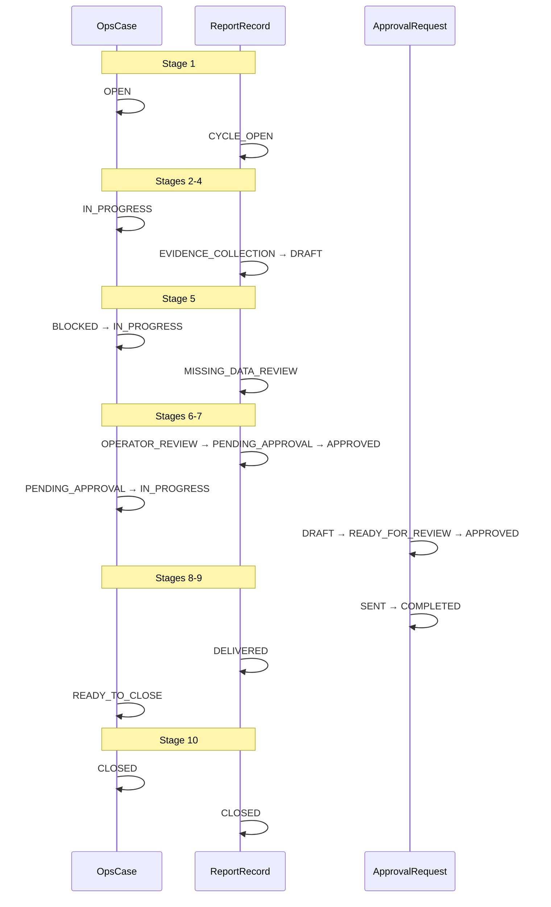

# OPS WF-01 Human Pilot v1

**Status:** **pilot evidence** — simulated human-supervised cycle (documentation only).  
**Program:** OPS — Business Operations Domain  
**Workflow:** WF-01 Monthly Reporting  
**Pilot date:** 2026-06-04  
**Pilot mode:** Human-supervised walkthrough · no runtime · no automation · no registry changes  
**Normative sources:** [OPS-WF-01-MONTHLY-REPORTING-v1.md](../workflows/OPS-WF-01-MONTHLY-REPORTING-v1.md) · [OPS-MONTHLY-REPORTING-WORKFLOW-v1.md](../workflows/OPS-MONTHLY-REPORTING-WORKFLOW-v1.md) · [OPS-CASE-MODEL-v1.md](../foundation/OPS-CASE-MODEL-v1.md) · [OPS-STATUS-MODEL-v1.md](../foundation/OPS-STATUS-MODEL-v1.md) · [OPS-APPROVAL-MODEL-v1.md](../foundation/OPS-APPROVAL-MODEL-v1.md) · [OPS-DEADLINE-MODEL-v1.md](../foundation/OPS-DEADLINE-MODEL-v1.md)

---

## 1. Pilot charter

| Constraint | Value |
|------------|-------|
| Purpose | Validate OPS operational model (not report quality) |
| Runtime | **None** |
| Integrations | **None** |
| Registry / topology / lifecycle / ATLAS | **Not modified** |
| Registration | **Not executed** — pilot evidence only |

---

## 2. Example case (placeholder data)

| Field | Value |
|-------|-------|
| **Client** | Example Client LLC |
| **Project** | Example SEO Retainer |
| **Reporting period** | `2026-06` |
| **Agreement scope (attested)** | Monthly SEO retainer: on-page, content pipeline, technical fixes, monthly summary |
| **Pilot operator (owner)** | `pilot-operator@studio.example` |
| **Approver** | `studio-lead@studio.example` |
| **Cycle label** | `WF01-PILOT-2026-06-EXAMPLE` |

---

## 3. OpsCase record (simulated)

```yaml
case_id: "ops-wf01-pilot-2026-06-example-client"
case_title: "Example Client LLC — Monthly Report 2026-06"
case_type: MONTHLY_REPORTING
status: CLOSED  # terminal after stage 10
priority: NORMAL
owner: "pilot-operator@studio.example"
opened_at: "2026-06-04T09:00:00+03:00"
closed_at: "2026-06-04T16:30:00+03:00"
reporting_period: "2026-06"
related_atlas_entities:
  - atlas_entity_type: client
    atlas_entity_id: "atlas-client-placeholder-001"
    atlas_entity_label: "Example Client LLC"
    attestation_mode: operator_attested
  - atlas_entity_type: organization
    atlas_entity_id: "atlas-org-placeholder-001"
    atlas_entity_label: "Example Client LLC (legal entity)"
    attestation_mode: operator_attested
  - atlas_entity_type: project
    atlas_entity_id: "atlas-project-placeholder-seo-001"
    atlas_entity_label: "Example SEO Retainer"
    attestation_mode: operator_attested
  - atlas_entity_type: agreement
    atlas_entity_id: "atlas-agreement-placeholder-2024-001"
    atlas_entity_label: "SEO Retainer Agreement 2024 (placeholder)"
    attestation_mode: operator_attested
  - atlas_entity_type: website
    atlas_entity_id: "atlas-website-placeholder-001"
    atlas_entity_label: "https://example-client.example"
    attestation_mode: operator_attested
blocker_summary: null  # cleared at stage 5
notes: "WF-01 human pilot v1 — all IDs and metrics are placeholders."
```

**Rule WF01-C01 check:** Single primary case for client + `2026-06` — **satisfied** (no duplicate case opened in pilot).

---

## 4. Linked records (simulated)

### 4.1 Deadlines

| deadline_id | category | label | due_at | status | met_at |
|-------------|----------|-------|--------|--------|--------|
| `dl-draft-internal` | REPORTING | Internal draft ready | 2026-06-08 | MET | 2026-06-04T12:00:00+03:00 |
| `dl-approval` | REPORTING | Report approved for send | 2026-06-10 | MET | 2026-06-04T14:00:00+03:00 |
| `dl-client-send` | REPORTING | Client send attested | 2026-06-12 | MET | 2026-06-04T15:00:00+03:00 |

### 4.2 ReportRecord

```yaml
report_id: "rpt-wf01-pilot-2026-06-example"
case_id: "ops-wf01-pilot-2026-06-example-client"
reporting_period: "2026-06"
status: CLOSED
title: "Monthly SEO Report — June 2026 (Example Client LLC)"
evidence_index:
  - label: "MetaBOT content summary (placeholder)"
    pointer: "file://pilot-evidence/metabot-summary-2026-06.pdf"
    attestation: operator_attested
  - label: "GSC export snippet (placeholder)"
    pointer: "file://pilot-evidence/gsc-export-2026-06.csv"
    attestation: operator_attested
  - label: "Studio delivery log (placeholder)"
    pointer: "file://pilot-evidence/studio-tickets-2026-06.md"
    attestation: operator_attested
missing_data_register:
  - item: "ORCA PPC slice"
    resolution: "Out of scope for SEO-only retainer — documented in report §Scope"
    blocks_delivery: false
draft_versions:
  - version: "v0.1"
    created_at: "2026-06-04T11:00:00+03:00"
  - version: "v1.0-reviewed"
    created_at: "2026-06-04T13:00:00+03:00"
delivery_attestation:
  channel: "email"
  sent_by: "pilot-operator@studio.example"
  sent_at: "2026-06-04T15:00:00+03:00"
  recipients: ["client-pm@example-client.example"]
```

### 4.3 ApprovalRequest

```yaml
approval_id: "apr-report-send-wf01-pilot"
case_id: "ops-wf01-pilot-2026-06-example-client"
approval_subject_type: report
status: COMPLETED
submitter: "pilot-operator@studio.example"
approver: "studio-lead@studio.example"
requested_at: "2026-06-04T13:30:00+03:00"
approved_at: "2026-06-04T14:00:00+03:00"
sent_at: "2026-06-04T15:00:00+03:00"
artifact_pointer: "rpt-wf01-pilot-2026-06-example / v1.0-reviewed"
rejection_notes: null
```

**State path exercised:** `DRAFT` → `READY_FOR_REVIEW` → `APPROVED` → `SENT` → `COMPLETED`

### 4.4 CommunicationDraft

```yaml
communication_id: "comm-delivery-email-wf01-pilot"
case_id: "ops-wf01-pilot-2026-06-example-client"
status: SENT
subject: "Monthly report — June 2026 — Example Client LLC"
body_pointer: "file://pilot-evidence/email-body-2026-06.txt"
linked_approval_id: "apr-report-send-wf01-pilot"
```

### 4.5 CompletionRecord

```yaml
completion_id: "cmp-wf01-pilot-2026-06-example"
case_id: "ops-wf01-pilot-2026-06-example-client"
report_id: "rpt-wf01-pilot-2026-06-example"
completed_at: "2026-06-04T15:30:00+03:00"
completed_by: "pilot-operator@studio.example"
archive_pointer: "SAFE UNKNOWN — pilot used notional file:// paths only"
follow_ups:
  - "Confirm July reporting trigger by 2026-07-02"
  - "ATLAS: verify contact `client-pm@` still canonical"
  - "Optional WF-03 if client replies with open questions"
```

---

## 5. Stage-by-stage execution

### Stage 1 — Reporting Trigger

| Aspect | Record |
|--------|--------|
| **Inputs** | Calendar rhythm (June period ended); client/project names from operator memory |
| **Actions** | Confirmed period `2026-06`; opened OpsCase; set three `REPORTING` deadlines |
| **Outputs** | Case `OPEN`; ReportRecord created with status `CYCLE_OPEN` |
| **Case status** | `OPEN` → (end of stage) remains `OPEN` until stage 2 work begins |
| **Report status** | `CYCLE_OPEN` |
| **Approval** | None |
| **Issues** | `case_id` format not normatively specified — operator invented slug (see gaps §8) |

---

### Stage 2 — Context Collection

| Aspect | Record |
|--------|--------|
| **Inputs** | ATLAS reference placeholders (client, org, project, agreement, website) |
| **Actions** | Assembled context packet; noted contacts for delivery |
| **Outputs** | Context packet attached to case `related_atlas_entities` |
| **Case status** | `IN_PROGRESS` |
| **Report status** | `CYCLE_OPEN` |
| **Approval** | None |
| **Issues** | No prescribed context-packet structure — operator used YAML list only |

---

### Stage 3 — Work Evidence Collection

| Aspect | Record |
|--------|--------|
| **Inputs** | Agreement scope; expected categories (SEO content, GSC, studio log) |
| **Actions** | Curated three placeholder evidence items; flagged ORCA gap as out-of-scope |
| **Outputs** | `evidence_index` on ReportRecord |
| **Case status** | `IN_PROGRESS` |
| **Report status** | `EVIDENCE_COLLECTION` |
| **Approval** | None |
| **Issues** | Evidence `pointer` format undefined — used fictional `file://` URIs |

---

### Stage 4 — Draft Report Preparation

| Aspect | Record |
|--------|--------|
| **Inputs** | Template (operator-maintained, not in repo); context + evidence |
| **Actions** | Draft v0.1 with ATLAS identity block, metrics placeholders, scope note for missing PPC |
| **Outputs** | Draft v0.1 |
| **Case status** | `IN_PROGRESS` |
| **Report status** | `DRAFT` |
| **Approval** | `ApprovalRequest` created in `DRAFT` (linked, not yet submitted) |
| **Issues** | Template location outside OPS — acceptable per docs but increases operator burden |

---

### Stage 5 — Missing Data Review

| Aspect | Record |
|--------|--------|
| **Inputs** | Draft v0.1; evidence index; ATLAS refs |
| **Actions** | Recorded ORCA gap; confirmed identity resolved via attested ATLAS placeholders; go for stage 6 |
| **Outputs** | `missing_data_register` with non-blocking PPC item |
| **Case status** | Brief `BLOCKED` (simulated hold 15 min) → `IN_PROGRESS` after resolution |
| **Report status** | `MISSING_DATA_REVIEW` → `OPERATOR_REVIEW` (advanced early for pilot flow) |
| **Approval** | None |
| **Issues** | Unclear whether report should stay `MISSING_DATA_REVIEW` when case unblocks — pilot used parallel advance |

---

### Stage 6 — Operator Review

| Aspect | Record |
|--------|--------|
| **Inputs** | Draft v0.1 |
| **Actions** | Tone/scope review; numeric spot-check against placeholder evidence; edits → v1.0-reviewed |
| **Outputs** | Review log (inline in pilot notes); revised draft |
| **Case status** | `IN_PROGRESS` |
| **Report status** | `OPERATOR_REVIEW` |
| **Approval** | Moved ApprovalRequest to `READY_FOR_REVIEW` |
| **Issues** | No normative `review_log` record type — stored in case `notes` only |

---

### Stage 7 — Approval

| Aspect | Record |
|--------|--------|
| **Inputs** | Draft v1.0-reviewed; ApprovalRequest `READY_FOR_REVIEW` |
| **Actions** | Studio lead approved; HA-01 satisfied (named approver) |
| **Outputs** | Approved package; ApprovalRequest `APPROVED` |
| **Case status** | `PENDING_APPROVAL` → `IN_PROGRESS` after approval (prep for delivery) |
| **Report status** | `PENDING_APPROVAL` → `APPROVED` |
| **Approval** | `APPROVED` at 2026-06-04T14:00:00+03:00 |
| **Issues** | Report status `APPROVED` vs approval status `APPROVED` — same label, different record types (ST-01 discipline required) |

---

### Stage 8 — Client Delivery Preparation

| Aspect | Record |
|--------|--------|
| **Inputs** | Approved report; CommunicationDraft |
| **Actions** | PDF export (placeholder); email body draft; recipient from attested contact |
| **Outputs** | Delivery-ready package; CommunicationDraft finalized |
| **Case status** | `IN_PROGRESS` (WF-01 table also allows `READY_TO_CLOSE` here — pilot kept `IN_PROGRESS` until stage 9) |
| **Report status** | `APPROVED` |
| **Approval** | Human send after `APPROVED` — no skip |
| **Issues** | Stage 8 vs case `READY_TO_CLOSE` timing ambiguous between WF-01 architecture table and case model §9 |

---

### Stage 9 — Completion Recording

| Aspect | Record |
|--------|--------|
| **Inputs** | Sent package; evidence index; ATLAS refs |
| **Actions** | Recorded CompletionRecord; archived pointers (notional) |
| **Outputs** | CompletionRecord; ReportRecord `DELIVERED` |
| **Case status** | `READY_TO_CLOSE` |
| **Report status** | `DELIVERED` |
| **Approval** | ApprovalRequest → `SENT` then `COMPLETED` |
| **Issues** | Archive storage **SAFE UNKNOWN** — completion metadata only |

---

### Stage 10 — Closing Status Update

| Aspect | Record |
|--------|--------|
| **Inputs** | CompletionRecord; open deadlines |
| **Actions** | Marked deadlines MET; set case `CLOSED`; captured follow-ups |
| **Outputs** | Closed cycle; follow-up list for WF-03 / next trigger |
| **Case status** | `CLOSED` |
| **Report status** | `CLOSED` |
| **Approval** | All mandatory approvals terminal |
| **Issues** | HomeGateway signal — **SAFE UNKNOWN** (deferred) |

---

## 6. Lifecycle summary (status timeline)



---

## 7. Validation (model usability)

| Dimension | Verdict | Rationale |
|-----------|---------|-----------|
| **OpsCase usability** | **PASS** | Single container held period, owner, ATLAS refs, deadlines, child records; lifecycle matched stages 1–10 |
| **Approval usability** | **PARTIAL** | MA-01 gate clear; dual `APPROVED` labels across record types require operator discipline; no `review_log` artifact |
| **Status usability** | **PARTIAL** | Vocabularies sufficient; stage 8/9 vs `READY_TO_CLOSE` timing slightly inconsistent across docs |
| **Deadline usability** | **PASS** | Three `REPORTING` deadlines tracked to MET; categories and statuses unambiguous |
| **Workflow usability** | **PARTIAL** | All 10 stages executable; operators must cross-read WF-01 architecture + monthly stage doc |

---

## 8. Architectural gap analysis (record only — not fixed)

### 8.1 Missing fields

| Gap | Where noticed |
|-----|----------------|
| Normative `case_id` / `report_id` format | Stage 1 |
| `review_log` or structured operator review artifact | Stage 6 |
| `context_packet` structure (beyond `related_atlas_entities`) | Stage 2 |
| `CompletionRecord` not defined in operational data model index table | Stage 9 |
| Four-eyes policy flag on ApprovalRequest | Stage 7 (HA-02 **SAFE UNKNOWN**) |

### 8.2 Missing statuses

| Gap | Notes |
|-----|-------|
| Report `READY_FOR_REVIEW` | Mentioned in WF-01 §6 state path but **not** in OPS-STATUS-MODEL report vocabulary |
| Rejection outcome on ApprovalRequest | Return to `DRAFT` documented; no `REJECTED` terminal state |

### 8.3 Missing workflow steps

| Gap | Notes |
|-----|-------|
| Explicit template-selection sub-step | Assumed inside stage 4 |
| Escalation spawn criteria when approval stale | WF-05 referenced but not exercised |

### 8.4 Duplicate concepts

| Concept A | Concept B | Issue |
|-----------|-----------|-------|
| WF-01 architecture doc | OPS-MONTHLY-REPORTING-WORKFLOW stage doc | Two navigation targets for same MVP |
| Case `due_at` | `Deadline.due_at` | Optional duplication — pilot used Deadline records only |
| Report `APPROVED` | Approval `APPROVED` | Same string, different record types |

### 8.5 Approval issues

| Issue | Severity |
|-------|----------|
| No `REJECTED` state — rework via `DRAFT` only | Low |
| Approver notification **SAFE UNKNOWN** | Medium (operational risk, not pilot failure) |
| Multi-step approval chains deferred | Low for MVP |

### 8.6 ATLAS integration assumptions

| Assumption | Pilot treatment |
|------------|-----------------|
| ATLAS read for context | Manual placeholder refs — **not implemented** |
| Contacts for delivery | Operator-attested email |
| Requisites | Not required for SEO-only placeholder report |
| OPS never writes ATLAS | **Honored** |

### 8.7 Storage assumptions

| Topic | Status |
|-------|--------|
| Draft/archive location | **SAFE UNKNOWN** — pilot used fictional `file://` pointers |
| Evidence bundle packaging | Operator-defined |
| Prior month report archive | **SAFE UNKNOWN** |

### 8.8 SAFE UNKNOWN items (pilot-confirmed)

| Item | What would verify |
|------|-------------------|
| ATLAS read surface | ATLAS consumer contract + implementation |
| `case_id` persistence format | OPS storage / registry charter |
| Evidence storage standard | Infrastructure / EAR decision |
| HomeGateway OPS reporting signal | HomeGateway integration charter |
| Studio four-eyes policy | Studio ops policy doc |

---

## 9. Completion criteria check (WF-01 §8)

| Condition | Pilot result |
|-----------|----------------|
| ReportRecord status `CLOSED` | **Yes** |
| Mandatory ApprovalRequest terminal | **Yes** (`COMPLETED`) |
| Client delivery human-attested | **Yes** |
| Reporting deadlines `MET` or `WAIVED` | **Yes** (all MET) |
| OpsCase status `CLOSED` | **Yes** |
| No open `BLOCKED` without waiver | **Yes** |

---

## 10. Explicit exclusions (this pilot)

- No registry, topology, lifecycle, or ATLAS file edits
- No runtime, agents, n8n, or automation
- No second pilot case (WF-02–06 not exercised)

---

*OPS WF-01 Human Pilot v1 · simulated case evidence (2026-06-04).*
