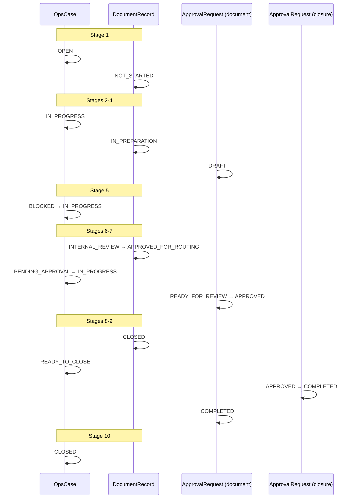

# OPS WF-02 Live Pilot v1

**Status:** **pilot evidence** — human-supervised document-closing walkthrough with live ATLAS + Agreement references (documentation only).  
**Program:** OPS — Business Operations Domain  
**Workflow:** WF-02 Document Closing  
**Pilot date:** 2026-06-10  
**ATLAS snapshot basis:** ATLAS Integrity Snapshot Register v1 (audit date 2026-06-07) · Agreement Register v1 (AGL-01, 2026-06-10) · operator context 2026-06-10  
**Pilot mode:** Human-supervised walkthrough · no runtime · no automation · no registry changes · no ATLAS changes  
**Normative sources:** [OPS-WF-02-DOCUMENT-CLOSING-v1.md](../workflows/OPS-WF-02-DOCUMENT-CLOSING-v1.md) · [OPS-CASE-MODEL-v1.md](../foundation/OPS-CASE-MODEL-v1.md) · [OPS-STATUS-MODEL-v1.md](../foundation/OPS-STATUS-MODEL-v1.md) · [OPS-APPROVAL-MODEL-v1.md](../foundation/OPS-APPROVAL-MODEL-v1.md) · [OPS-DEADLINE-MODEL-v1.md](../foundation/OPS-DEADLINE-MODEL-v1.md) · [OPS-ATLAS-RELATIONSHIP-v1.md](../foundation/OPS-ATLAS-RELATIONSHIP-v1.md) · [ATLAS-AGREEMENT-REGISTER-v1.md](../../atlas/population/ATLAS-AGREEMENT-REGISTER-v1.md)

**Prior pilot:** [OPS-WF01-LIVE-BINDING-PILOT-v1.md](OPS-WF01-LIVE-BINDING-PILOT-v1.md) — same ORG-0004 / PRJ-0008 contour; WF-01 identified Agreement as consumer gap; **AGL-01** (2026-06-10) attested **AGR-0005** for PRJ-0008.

---

## 1. Pilot charter

| Constraint | Value |
|------------|-------|
| Purpose | Validate OPS **Document Closing** workflow against **live ATLAS entities** including **Agreement** references — reality validation only |
| Runtime | **None** |
| Integrations | **None** |
| Registry / topology / lifecycle / ATLAS | **Not modified** |
| ATLAS entity creation | **Forbidden** — use attested reality only |
| Real documents | **None** — no invoices, acts, EDO, accounting, or legal workflow |
| Registration impact | **None** — OPS already **REGISTERED** (2026-06-05) |

---

## 2. Pilot subject selection

### 2.1 Candidate comparison

| Criterion | ORG-0004 Триумф | ORG-0005 ЗПМ |
|-----------|-----------------|--------------|
| Active agreements | **4** (AGR-0002..0005) | **1** (AGR-0006) |
| Agreement evidence level | **E1** (all Triumph rows) | **E0** (AGR-0006) |
| Attested projects (active) | PRJ-0005..0008 | PRJ-0009 |
| Commercial edge | REL-0016 CLIENT_OF | REL-0040 CLIENT_OF |
| Counterparty evidence | EV-0005 (E1 CC) | EV-W1B-CC-01, EV-ZPM-OP-ACT-01 (E0) |
| Prior OPS binding | WF-01 live pilot contour (PRJ-0008) | None |
| Website register | WEB-0006..0009 (core Wave 4) | WEB-ZPM-01 (ZPM tranche namespace) |

**Selected organization:** **ORG-0004** — Триумф

**Selection rationale:**

1. **Strongest agreement-backed contour** — four ACTIVE agreements with E1 attestation vs one E0 agreement for ZPM.
2. **AGL-01 completeness** — Triumph agreements AGR-0001..0005 fully attested in Agreement Register; ZPM has fewer rows and lower evidence tier.
3. **Continuity with WF-01 live binding** — PRJ-0008 / AGR-0005 explicitly closes the Agreement gap identified in WF-01 pilot §9.
4. **Clean operational graph** — PRJ-0008 ↔ WEB-0009 ↔ DOM-0004 1:1 binding without deprecated-project overlap (contrast PRJ-0006 / WEB-0006).

**ZPM not selected:** Valid single-agreement candidate (AGR-0006 / PRJ-0009 / WEB-ZPM-01) but weaker for Agreement consumption validation — E0 evidence, operator-statement basis, ZPM tranche website namespace not in core WEB-* roster.

### 2.2 Agreement and engagement (fixed contour)

| Field | ATLAS value |
|-------|-------------|
| **Organization** | **ORG-0004** — Триумф |
| **Legal entity** | **LE-0003** — ООО «Триумф» |
| **Agreement** | **AGR-0005** — ACTIVE · DEVELOPMENT · scope: Landing / сайт manipulator-triumph.ru |
| **Project** | **PRJ-0008** — Манипулятор |
| **Website** | **WEB-0009** — manipulator-triumph.ru |
| **Domain** | **DOM-0004** — manipulator-triumph.ru |
| **Vendor (EXECUTES)** | **ORG-0001** — Веб-студия «Полигон» |
| **Attestation ref** | AT-AGL-05 |

**Agreement selection rationale:** AGR-0005 binds PRJ-0008 with E1 evidence, ACTIVE status, and explicit WF-01 contour note in Agreement Attestation v1 §4.5. Suitable for document-closing trigger tied to development delivery scope without multi-project website ambiguity.

### 2.3 Pilot scenario (simulated — no real document)

| Field | Value |
|-------|-------|
| **Trigger** | Reporting surfacing — WF-01 May 2026 cycle (`OPS-MR-2026-05-001`) noted operational need to prepare acceptance-package routing under AGR-0005 |
| **Document scope (operational label only)** | Internal act-of-acceptance **preparation and routing thread** for May 2026 delivery period — **no file created** |
| **Pilot operator (owner)** | `Operator` |
| **Approver** | `studio-lead@polygon` *(human role label — not an ATLAS Person id)* |
| **Cycle label** | `WF02-LIVE-2026-06-TRIUMPH-AGR0005-MANIPULATOR` |

---

## 3. OpsCase record (simulated — live ATLAS + Agreement bindings)

```yaml
case_id: "OPS-DC-2026-06-001"
case_title: "Триумф — Document Closing — AGR-0005 / Манипулятор — May 2026 period"
case_type: DOCUMENT_CLOSING
status: CLOSED  # terminal after stage 10
priority: NORMAL
owner: "Operator"
opened_at: "2026-06-10T10:00:00+03:00"
closed_at: "2026-06-10T17:00:00+03:00"
document_scope_label: "Act-of-acceptance preparation package — May 2026 (operational tracking only)"
related_atlas_entities:
  - atlas_entity_type: organization
    atlas_entity_id: "ORG-0004"
    atlas_entity_label: "Триумф"
    lifecycle: active
    attestation_mode: atlas_verified
    source: "ATLAS-INTEGRITY-SNAPSHOT-REGISTER-v1"
  - atlas_entity_type: legal_entity
    atlas_entity_id: "LE-0003"
    atlas_entity_label: "ООО «Триумф»"
    lifecycle: active
    attestation_mode: atlas_verified
  - atlas_entity_type: agreement
    atlas_entity_id: "AGR-0005"
    atlas_entity_label: "DEVELOPMENT — manipulator-triumph.ru"
    status: ACTIVE
    agreement_type: DEVELOPMENT
    evidence_level: E1
    attestation_mode: atlas_verified
    source: "ATLAS-AGREEMENT-REGISTER-v1"
  - atlas_entity_type: organization
    atlas_entity_id: "ORG-0001"
    atlas_entity_label: "Веб-студия «Полигон»"
    relationship_context: "vendor / EXECUTES via REL-0026"
    attestation_mode: atlas_verified
  - atlas_entity_type: project
    atlas_entity_id: "PRJ-0008"
    atlas_entity_label: "Манипулятор"
    lifecycle: active
    attestation_mode: atlas_verified
  - atlas_entity_type: website
    atlas_entity_id: "WEB-0009"
    atlas_entity_label: "manipulator-triumph.ru"
    canonical_url: "https://manipulator-triumph.ru"
    lifecycle: active
    attestation_mode: atlas_verified
  - atlas_entity_type: domain
    atlas_entity_id: "DOM-0004"
    atlas_entity_label: "manipulator-triumph.ru"
    lifecycle: active
    attestation_mode: atlas_verified
  - atlas_entity_type: person
    atlas_entity_id: "PER-0006"
    atlas_entity_label: "Вагин Иван Владимирович"
    role_edge: "REL-0015 GENERAL_DIRECTOR"
    attestation_mode: atlas_verified
  - atlas_entity_type: person
    atlas_entity_id: "PER-0004"
    atlas_entity_label: "Макарова Алеся Леонидовна"
    role_edge: "REL-0013 REPRESENTATIVE"
    attestation_mode: atlas_verified
related_atlas_relationships:
  - relationship_id: "REL-0016"
    type: CLIENT_OF
    source: "ORG-0004"
    target: "ORG-0001"
  - relationship_id: "REL-0025"
    type: COMMISSIONED_BY
    source: "PRJ-0008"
    target: "ORG-0004"
  - relationship_id: "REL-0026"
    type: EXECUTES
    source: "ORG-0001"
    target: "PRJ-0008"
  - relationship_id: "REL-0031"
    type: BELONGS_TO
    source: "WEB-0009"
    target: "PRJ-0008"
  - relationship_id: "REL-0035"
    type: OWNS
    source: "ORG-0004"
    target: "WEB-0009"
  - relationship_id: "REL-0039"
    type: PRIMARY_DOMAIN
    source: "DOM-0004"
    target: "WEB-0009"
  - relationship_id: "REL-0013"
    type: REPRESENTATIVE
    source: "PER-0004"
    target: "ORG-0004"
  - relationship_id: "REL-0015"
    type: GENERAL_DIRECTOR
    source: "PER-0006"
    target: "ORG-0004"
blocker_summary: null  # cleared at stage 5
notes: "WF-02 live pilot v1 — Agreement AGR-0005 consumed from AGL-01 register; no real document produced."
```

**Case ID convention:** `OPS-DC-2026-06-001` per [OPS-CASE-MODEL-v1.md](../foundation/OPS-CASE-MODEL-v1.md) §6.4 (CID-G01).

---

## 4. Linked records (simulated)

### 4.1 DocumentRecord

```yaml
document_id: "doc-ops-dc-2026-06-001-act"
case_id: "OPS-DC-2026-06-001"
document_label: "Act-of-acceptance package — May 2026 — manipulator-triumph.ru"
document_kind: "act_of_acceptance"  # operational label — not legal classification
status: CLOSED
version_labels:
  - version: "v0.1-checklist"
    created_at: "2026-06-10T11:30:00+03:00"
  - version: "v1.0-reviewed"
    created_at: "2026-06-10T14:30:00+03:00"
atlas_identity_block:
  agreement: "AGR-0005 ACTIVE DEVELOPMENT"
  client_org: "ORG-0004 Триумф"
  legal_entity: "LE-0003 ООО «Триумф»"
  project: "PRJ-0008 Манипулятор"
  website: "WEB-0009 manipulator-triumph.ru"
  vendor: "ORG-0001 Веб-студия «Полигон» (EXECUTES)"
attachments_checklist:
  - item: "Scope summary from AGR-0005"
    status: "referenced"
    atlas_ref: "AGR-0005"
  - item: "Delivery period narrative (May 2026)"
    status: "operator_attested"
    atlas_ref: ["PRJ-0008", "WEB-0009"]
  - item: "Counterparty requisites block"
    status: "missing_safe_unknown"
    atlas_ref: null
  - item: "Authorized signatory identity"
    status: "partial"
    atlas_ref: ["PER-0006", "REL-0015"]
routing_notes: "Operational routing prep only — external legal/accounting channel not executed in pilot"
completion_metadata:
  completed_at: "2026-06-10T16:30:00+03:00"
  completed_by: "Operator"
  operational_outcome: "Package approved for routing — external send not performed (pilot boundary)"
  archive_pointer: "SAFE UNKNOWN — pilot documentation only"
```

### 4.2 Deadlines

| deadline_id | category | label | due_at | status | met_at |
|-------------|----------|-------|--------|--------|--------|
| `dl-doc-package-draft` | DOCUMENTS | Internal document package draft ready | 2026-06-12 | MET | 2026-06-10T12:00:00+03:00 |
| `dl-doc-routing-approval` | DOCUMENTS | Document package approved for routing | 2026-06-14 | MET | 2026-06-10T15:00:00+03:00 |
| `dl-doc-case-close` | DOCUMENTS | Document closing case completion recorded | 2026-06-16 | MET | 2026-06-10T16:45:00+03:00 |

### 4.3 ApprovalRequests

```yaml
# Document routing approval
approval_id: "apr-doc-routing-ops-dc-2026-06-001"
case_id: "OPS-DC-2026-06-001"
approval_subject_type: document
status: COMPLETED
submitter: "Operator"
approver: "studio-lead@polygon"
requested_at: "2026-06-10T14:00:00+03:00"
approved_at: "2026-06-10T15:00:00+03:00"
sent_at: null  # routing not executed — pilot boundary
artifact_pointer: "doc-ops-dc-2026-06-001-act / v1.0-reviewed"
rejection_notes: null

# Case closure approval
approval_id: "apr-closure-ops-dc-2026-06-001"
case_id: "OPS-DC-2026-06-001"
approval_subject_type: closure
status: COMPLETED
submitter: "Operator"
approver: "studio-lead@polygon"
requested_at: "2026-06-10T16:00:00+03:00"
approved_at: "2026-06-10T16:15:00+03:00"
artifact_pointer: "OPS-DC-2026-06-001"
rejection_notes: null
```

**Document ApprovalRequest path:** `DRAFT` → `READY_FOR_REVIEW` → `APPROVED` → `COMPLETED` *(no SENT — external routing outside pilot)*

**Closure ApprovalRequest path:** `DRAFT` → `READY_FOR_REVIEW` → `APPROVED` → `COMPLETED`

---

## 5. Stage-by-stage execution (WF-02 — 10-stage pilot contour)

### Stage 1 — Closing Trigger

| Aspect | Record |
|--------|--------|
| **Inputs** | WF-01 pilot completion note; calendar review; AGR-0005 ACTIVE in Agreement Register |
| **Actions** | Operator identified document-closing obligation for May 2026 delivery under AGR-0005; opened OpsCase `OPS-DC-2026-06-001`; set three `DOCUMENTS` deadlines |
| **Outputs** | Case `OPEN`; DocumentRecord created with status `NOT_STARTED` |
| **Case status** | `OPEN` |
| **Document status** | `NOT_STARTED` |
| **Approval** | None |
| **ATLAS refs used** | AGR-0005 (trigger), ORG-0004 (client) |
| **Issues** | No ATLAS signal for "document due" — trigger is human-identified per WF-02 §2 |

---

### Stage 2 — Context Collection

| Aspect | Record |
|--------|--------|
| **Inputs** | ATLAS Integrity Snapshot Register; Agreement Register v1; Wave 4 Website Register; Wave 5 Domain Register |
| **Actions** | Assembled context packet: ORG-0004, LE-0003, AGR-0005, ORG-0001, PRJ-0008, WEB-0009, DOM-0004, PER-0004/0006, relationship edges REL-0016, 0025, 0026, 0031, 0035, 0039, 0013, 0015 |
| **Outputs** | `related_atlas_entities` and `related_atlas_relationships` on OpsCase; DocumentRecord `atlas_identity_block` draft |
| **Case status** | `IN_PROGRESS` |
| **Document status** | `NOT_STARTED` → `IN_PREPARATION` |
| **Approval** | None |
| **ATLAS refs used** | Full Triumph / AGR-0005 / Манипулятор subgraph |
| **Issues** | Agreement row lacks start_date/end_date — period narrative operator-attested |

---

### Stage 3 — Agreement Validation

| Aspect | Record |
|--------|--------|
| **Inputs** | AGR-0005 register row; AT-AGL-05 attestation; project coverage matrix |
| **Actions** | Verified AGR-0005 **ACTIVE**; agreement_type **DEVELOPMENT**; related_projects **PRJ-0008**; client ORG-0004 / vendor ORG-0001; corroborated via REL-0025 COMMISSIONED_BY and REL-0016 CLIENT_OF |
| **Outputs** | Agreement validation note on case; DocumentRecord scope bound to AGR-0005 |
| **Case status** | `IN_PROGRESS` |
| **Document status** | `IN_PREPARATION` |
| **Approval** | None |
| **ATLAS refs used** | AGR-0005, PRJ-0008, ORG-0004, ORG-0001, REL-0016, REL-0025 |
| **Issues** | Agreement dates **SAFE UNKNOWN** — cannot derive billing/closing period from ATLAS alone; scope_summary text-only; no document-type obligations field in Agreement entity |

---

### Stage 4 — Document Preparation Readiness

| Aspect | Record |
|--------|--------|
| **Inputs** | WF-02 §3 inputs; human template library (outside OPS); AGR-0005 scope_summary |
| **Actions** | Built attachments checklist; labeled package v0.1-checklist; mapped checklist items to ATLAS refs where available |
| **Outputs** | DocumentRecord v0.1-checklist; checklist with 2 referenced, 1 operator-attested, 1 missing, 1 partial |
| **Case status** | `IN_PROGRESS` |
| **Document status** | `IN_PREPARATION` |
| **Approval** | `ApprovalRequest` (document) created in `DRAFT` |
| **ATLAS refs used** | AGR-0005 scope; PRJ-0008; WEB-0009 |
| **Issues** | Document templates outside OPS SoT — acceptable per WF-02 §3; no ATLAS document template entity |

---

### Stage 5 — Missing Information Review

| Aspect | Record |
|--------|--------|
| **Inputs** | Checklist v0.1; ATLAS Agreement + Person + Requisites consumer expectations (C-07, C-08, C-02) |
| **Actions** | Recorded gaps: agreement dates, structured requisites, signatory contact channels, EDO channel, document template registry; confirmed AGR-0005 + structural identity sufficient for **non-blocking** operational prep |
| **Outputs** | `missing_data_register` on case notes; brief `BLOCKED` → `IN_PROGRESS` after operator waiver |
| **Case status** | `BLOCKED` → `IN_PROGRESS` |
| **Document status** | `IN_PREPARATION` |
| **Approval** | None |
| **ATLAS refs used** | Comparison against OPS-ATLAS-RELATIONSHIP C-02, C-07, C-08 |
| **Issues** | Requisites and signers incomplete in ATLAS structured form; EDO not in ATLAS taxonomy |

**Missing data register (facts only):**

| Item | ATLAS state | Blocks routing prep? |
|------|-------------|----------------------|
| Agreement start/end dates | **SAFE UNKNOWN** on AGR-0005 | No — operator waived with period label |
| Bank requisites | EV-0005 E1 CC exists; no structured requisites fields | No — omitted with SAFE UNKNOWN |
| Signatory contact channel | PER-0006 identity + role; no email/phone | No — routing channel operator-attested |
| EDO provider / channel | Not in ATLAS | No — outside pilot |
| Document template | Human library outside OPS | No |

---

### Stage 6 — Operator Review

| Aspect | Record |
|--------|--------|
| **Inputs** | Checklist v0.1; agreement validation note |
| **Actions** | Verified all ATLAS ids against registers; internal completeness review; edits → v1.0-reviewed; DocumentRecord → `INTERNAL_REVIEW` |
| **Outputs** | Review log entry; revised package label |
| **Case status** | `IN_PROGRESS` |
| **Document status** | `INTERNAL_REVIEW` |
| **Approval** | Document `ApprovalRequest` → `READY_FOR_REVIEW` |
| **ATLAS refs used** | Cross-check AGR-0005 ACTIVE; PRJ-0008 / WEB-0009 lifecycle **active** |
| **Issues** | None blocking |

---

### Stage 7 — Approval

| Aspect | Record |
|--------|--------|
| **Inputs** | Package v1.0-reviewed; document `ApprovalRequest` `READY_FOR_REVIEW` |
| **Actions** | Studio lead approved operational routing permission; MA-01 satisfied |
| **Outputs** | DocumentRecord → `APPROVED_FOR_ROUTING`; document approval `APPROVED` |
| **Case status** | `PENDING_APPROVAL` → `IN_PROGRESS` |
| **Document status** | `PENDING_APPROVAL` → `APPROVED_FOR_ROUTING` |
| **Approval** | Document approval `APPROVED` at 2026-06-10T15:00:00+03:00 |
| **ATLAS refs used** | None required at approval gate |
| **Issues** | Operational approval ≠ legal signature — per WF-02 §6 |

---

### Stage 8 — Delivery Preparation

| Aspect | Record |
|--------|--------|
| **Inputs** | Approved package; routing instructions (human) |
| **Actions** | Prepared routing handoff record for legal/accounting channel; **did not execute external send** (pilot boundary) |
| **Outputs** | Routing notes on DocumentRecord; status remains `APPROVED_FOR_ROUTING` (not `ROUTED`) |
| **Case status** | `IN_PROGRESS` |
| **Document status** | `APPROVED_FOR_ROUTING` |
| **Approval** | Document approval stays `APPROVED` — no `SENT` in pilot |
| **ATLAS refs used** | PER-0004 as operational counterparty contact identity |
| **Issues** | External route channel not in ATLAS; pilot explicitly excludes real dispatch |

---

### Stage 9 — Completion Recording

| Aspect | Record |
|--------|--------|
| **Inputs** | Approved package; checklist; ATLAS refs |
| **Actions** | Recorded `completion_metadata` on DocumentRecord; opened closure `ApprovalRequest` |
| **Outputs** | Completion metadata; DocumentRecord → `CLOSED` (operational thread); case → `READY_TO_CLOSE` |
| **Case status** | `READY_TO_CLOSE` |
| **Document status** | `CLOSED` |
| **Approval** | Closure `ApprovalRequest` → `READY_FOR_REVIEW` → `APPROVED` → `COMPLETED` |
| **ATLAS refs used** | Case entity list preserved in completion record |
| **Issues** | Legal/financial outcome **SAFE UNKNOWN** in external systems — acceptable per WF-02 §8 |

---

### Stage 10 — Closing Status Update

| Aspect | Record |
|--------|--------|
| **Inputs** | `completion_metadata`; open deadlines |
| **Actions** | Marked all `DOCUMENTS` deadlines MET; set case `CLOSED`; captured follow-ups |
| **Outputs** | Closed document-closing cycle |
| **Case status** | `CLOSED` |
| **Document status** | `CLOSED` |
| **Approval** | All mandatory approvals terminal |
| **ATLAS refs used** | None |
| **Issues** | WF-06 cross-link — open document cases checklist **not exercised** in this pilot |

**Follow-ups captured:**

- ATLAS intake: agreement date fields for AGR-0005 when E2 extract available
- Optional real routing execution outside OPS when legal channel ready
- Re-run WF-02 on AGR-0003 (SEO_RETAINER) to stress retainer act cadence

---

## 6. Lifecycle summary (status timeline)



---

## 7. ATLAS consumption validation

| Binding dimension | Verdict | Explanation |
|-------------------|---------|-------------|
| **Organization** | **PASS** | ORG-0004 **active**; LE-0003 bound; CLIENT_OF REL-0016 to ORG-0001 attested |
| **Agreement** | **PARTIAL** | AGR-0005 **ACTIVE** with type, scope_summary, related_projects, E1 — consumable for scope binding; start_date/end_date **SAFE UNKNOWN**; no document-obligation or signer fields |
| **Project** | **PASS** | PRJ-0008 **active**; COMMISSIONED_BY REL-0025; EXECUTES REL-0026; 1:1 with AGR-0005 per coverage matrix |
| **Website** | **PASS** | WEB-0009 **active**; BELONGS_TO REL-0031; OWNS REL-0035; live URL attested |
| **Relationship** | **PASS** | Full O↔O, Ag↔Pj (via register), Pj↔O, W↔Pj, O↔W, D↔W, P↔O edges for pilot subgraph attested |

---

## 8. WF-02 validation (against live ATLAS)

| Dimension | Verdict | Rationale |
|-----------|---------|-----------|
| **OpsCase** | **PASS** | `DOCUMENT_CLOSING` container held Agreement + structural refs, deadlines, DocumentRecord, dual ApprovalRequests; lifecycle matched stages 1–10 |
| **Approval Model** | **PASS** | MA-01 enforced; document + closure approval paths complete; `READY_FOR_REVIEW` on ApprovalRequest only |
| **Deadline Model** | **PASS** | Three `DOCUMENTS` category deadlines tracked to MET |
| **Status Model** | **PASS** | Document status vocabulary sufficient; case `READY_TO_CLOSE` at stage 9 |
| **Document Workflow** | **PARTIAL** | All 10 stages executable with live refs; Agreement improves scope binding vs WF-01 but requisites, dates, signers, EDO, templates require operator attestation |

---

## 9. Reality gaps (facts only — not repaired)

| OPS expected (per OPS-ATLAS-RELATIONSHIP C-*) | ATLAS provided | Gap fact |
|-----------------------------------------------|----------------|----------|
| **C-07 Agreements** | AGR-0005 ACTIVE row | **Provided** at documentation layer post-AGL-01 — scope binding usable |
| **Agreement dates** | start_date / end_date on all register rows | **SAFE UNKNOWN** — no E2 date extract attested |
| **C-08 Requisites** | EV-0005 E1 CC | **Not structured** ATLAS requisites fields for document package |
| **C-02 Contacts / signers** | PER-0004, PER-0006 with role edges | Names and roles **provided**; email/phone/EDO **absent** |
| **Document templates** | — | Human library **outside OPS** — no ATLAS entity |
| **Evidence references** | EV-0005, AT-AGL-05 | Evidence exists but **not** OPS-consumable document bundle format |
| **EDO** | — | **Not in ATLAS taxonomy** |
| **Legal signatory authority** | Person + role edges | Operational identity only — legal authority **outside OPS** |
| **Agreement → document-type mapping** | scope_summary text | No field for act/annex/contract obligation types |
| **Live ATLAS runtime service** | Documentation registers only | Id resolution on live service — **SAFE UNKNOWN** |

---

## 10. Completion criteria check (WF-02 §8)

| Condition | Pilot result |
|-----------|----------------|
| All in-scope DocumentRecord `CLOSED` or `CANCELLED` | **Yes** — one DocumentRecord `CLOSED` |
| Mandatory approvals `COMPLETED` or documented exception | **Yes** — document + closure approvals `COMPLETED` |
| External legal/financial outcomes in OPS | **Not required** — remain SAFE UNKNOWN |
| OpsCase `CLOSED` | **Yes** |
| Document deadlines `MET` or `WAIVED` | **Yes** — all MET |

---

## 11. Final verdicts (pilot scope)

| Verdict | Result |
|---------|--------|
| **ATLAS Agreement Consumption** | **PARTIAL** |
| **WF-02 Live Pilot Verdict** | **PARTIAL** |
| **OPS Impact** | **WF-02 PARTIAL** |
| **Registration Impact** | **No impact** — OPS already REGISTERED |

**ATLAS Agreement Consumption PARTIAL rationale:** AGL-01 delivers consumable Agreement anchors (AGR-0005 binds PRJ-0008 with ACTIVE status and scope). Document closing still requires operator attestation for dates, requisites, contact channels, EDO, and templates — not **READY** for zero-attestation closing.

**WF-02 PARTIAL rationale:** End-to-end walkthrough completes with real ids including Agreement; OpsCase, approval, deadline, and status models **PASS**. **PARTIAL** because document workflow stages 3, 5, and 8 routinely hit ATLAS gaps predictable from WF-01 plus Agreement-layer limits.

**Not FAIL:** Agreement entity now consumable; structural binding PASS; completion criteria met; human operation viable.

**Not full PASS:** Agreement row lacks fields document closing expects (dates, requisites, signers, EDO, document obligations).

---

## 12. Explicit exclusions (this pilot)

- No ATLAS entity creation or register edits
- No registry, topology, lifecycle, or OPS architecture edits
- No runtime, agents, n8n, or automation
- No real documents, invoices, acts, EDO, or accounting
- No legal workflow execution
- ZPM contour (AGR-0006) not exercised as primary subject

---

*OPS WF-02 Live Pilot v1 · ORG-0004 / AGR-0005 / PRJ-0008 / WEB-0009 / DOM-0004 · documentation evidence (2026-06-10).*
