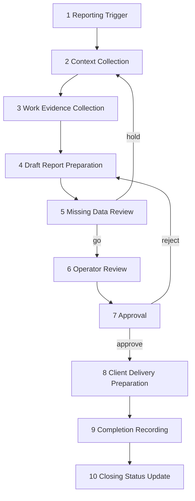

# OPS Monthly Reporting Workflow v1

**Status:** **documented** — stage detail reference (human-operated).  
**Program:** OPS — Business Operations Domain  
**MVP:** Monthly Client Reporting Control MVP  
**Date:** 2026-06-04  
**Parent:** [../foundation/OPS-MVP-SCOPE-v1.md](../foundation/OPS-MVP-SCOPE-v1.md) · [../foundation/OPS-ATLAS-RELATIONSHIP-v1.md](../foundation/OPS-ATLAS-RELATIONSHIP-v1.md)  
**Workflow contract (authority):** [OPS-WF-01-MONTHLY-REPORTING-v1.md](OPS-WF-01-MONTHLY-REPORTING-v1.md)

---

## Document authority (A-05)

This file is the **stage detail reference** for WF-01 Monthly Reporting. For triggers, OpsCase rules, approval gates, completion conditions, and status timing, use **[OPS-WF-01-MONTHLY-REPORTING-v1.md](OPS-WF-01-MONTHLY-REPORTING-v1.md)** as the workflow contract.

---

## Workflow identity

| Field | Value |
|-------|-------|
| **Workflow name** | Monthly Client Reporting |
| **Cadence** | Calendar month (or contract-defined period — human confirms) |
| **Automation** | **None** — all stages human-executed |
| **Integrations** | **None claimed as implemented** |

---

## Stage overview

| Stage | Name | Primary actor |
|-------|------|---------------|
| 1 | Reporting Trigger | Human operator |
| 2 | Context Collection | Human operator |
| 3 | Work Evidence Collection | Human operator |
| 4 | Draft Report Preparation | Human operator |
| 5 | Missing Data Review | Human operator |
| 6 | Operator Review | Human operator |
| 7 | Approval | Human approver |
| 8 | Client Delivery Preparation | Human operator |
| 9 | Completion Recording | Human operator |
| 10 | Closing Status Update | Human operator |

---

## Stage 1 — Reporting Trigger

**Purpose:** Start a reporting cycle for a specific client and period.

| Step | Action |
|------|--------|
| 1.1 | Confirm reporting period (e.g. previous calendar month) |
| 1.2 | Confirm target client / engagement |
| 1.3 | Record cycle id (operator-defined label until persistence exists) |
| 1.4 | Set internal due date (reminder — OPS tracking only) |

**Outputs:** Cycle opened · period bounds documented

**Automation:** None

---

## Stage 2 — Context Collection

**Purpose:** Assemble **read-only** business context from ATLAS (or attested fallback).

| Step | Action |
|------|--------|
| 2.1 | Resolve ATLAS references: client, organization, project(s), website(s), service(s), agreement(s) |
| 2.2 | Pull contacts relevant to report delivery |
| 2.3 | Note requisites pointer (from ATLAS only) |
| 2.4 | If ATLAS unavailable → operator attestation + **SAFE UNKNOWN** markers |

**Outputs:** Context packet (references + pointers)

**Anti-duplication:** Do not create canonical client records in OPS — see [OPS-ATLAS-RELATIONSHIP-v1.md](../foundation/OPS-ATLAS-RELATIONSHIP-v1.md)

**Automation:** None · **Integration:** ATLAS read — **not implemented** (manual copy allowed)

---

## Stage 3 — Work Evidence Collection

**Purpose:** Gather **human-attested** evidence of work performed in the period.

| Evidence type | Typical source (human-curated) | OPS ownership |
|---------------|-------------------------------|---------------|
| SEO / content summary | MetaBOT exports, operator notes | Citation only |
| PPC / ads summary | ORCA review artifacts | Citation only |
| Research / market | MIG research pack | Citation only |
| Site / storefront ops | WPilot / OCPilot operator notes | Citation only |
| Studio delivery | Tickets, commits, manual logs | Operator attestation |

| Step | Action |
|------|--------|
| 3.1 | List expected evidence categories per agreement scope |
| 3.2 | Collect files/links/summaries |
| 3.3 | Mark gaps explicitly (feeds Stage 5) |

**Outputs:** Evidence bundle (attachments index)

**Automation:** None · **No live pull** from external systems claimed

---

## Stage 4 — Draft Report Preparation

**Purpose:** Produce a **draft** client-facing report.

| Step | Action |
|------|--------|
| 4.1 | Apply report template (operator-maintained) |
| 4.2 | Insert ATLAS-backed identity block (or SAFE UNKNOWN) |
| 4.3 | Insert evidence summaries with clear attribution |
| 4.4 | Separate facts vs operator commentary |
| 4.5 | AI assist optional — **human remains author** |

**Outputs:** Draft report (version labeled)

**Automation:** None

---

## Stage 5 — Missing Data Review

**Purpose:** Block or qualify delivery when required data is missing or contradictory.

| Check | Fail action |
|-------|-------------|
| Client/org identity unresolved | Hold — intake to ATLAS or explicit attestation |
| Agreement scope unclear | Hold — operator clarifies with client offline |
| Required evidence category empty | Document gap in report or hold delivery |
| Requisites mismatch vs ATLAS | Correct via ATLAS — do not invent |

**Outputs:** Missing data register · go/no-go for Stage 6

**Automation:** None

---

## Stage 6 — Operator Review

**Purpose:** Qualitative review of draft accuracy, tone, and scope.

| Step | Action |
|------|--------|
| 6.1 | Verify numbers and claims against evidence |
| 6.2 | Verify no forbidden authority (legal, accounting, payment confirmation) |
| 6.3 | Record review entries on `ReportRecord.review_log` (see [OPS-OPERATIONAL-DATA-MODEL-v1.md](../foundation/OPS-OPERATIONAL-DATA-MODEL-v1.md) §3.4) |
| 6.4 | Move linked `ApprovalRequest` to `READY_FOR_REVIEW` when draft ready for approver |
| 6.5 | Apply edits → revised draft |

**Outputs:** Reviewed draft · `ReportRecord.review_log` · `ApprovalRequest` `READY_FOR_REVIEW`

**Status (typical):** Case `IN_PROGRESS` · Report `OPERATOR_REVIEW` · Approval `READY_FOR_REVIEW`

**Automation:** None

---

## Stage 7 — Approval

**Purpose:** Explicit human authorization to prepare client delivery.

| Step | Action |
|------|--------|
| 7.1 | Named approver confirms draft |
| 7.2 | Record approver identity and timestamp (operational record) |
| 7.3 | If rejected → return to Stage 4 or 6 |

**Outputs:** Approved report package

**Automation:** None · **No autonomous send**

---

## Stage 8 — Client Delivery Preparation

**Purpose:** Package and prepare send via human-chosen channel.

| Step | Action |
|------|--------|
| 8.1 | Select format (PDF, email body, portal upload, etc.) |
| 8.2 | Attach evidence index if contract requires |
| 8.3 | Prepare recipient list from ATLAS contacts (or attested list) |
| 8.4 | **Human sends** — OPS does not transmit |

**Outputs:** Delivery-ready package · send record (who/when/channel)

**Automation:** None · Email/bot integrations **not claimed**

---

## Stage 9 — Completion Recording

**Purpose:** Record that the cycle completed for operational tracking.

| Step | Action |
|------|--------|
| 9.1 | Archive approved report + evidence index |
| 9.2 | Link to ATLAS entity refs used |
| 9.3 | Record `ReportRecord.completion_metadata` (workflow term **CompletionRecord** — period, approver, delivery date, follow-ups) |

**Outputs:** `ReportRecord.completion_metadata` populated · Report status `DELIVERED`

**Status (typical):** Case `READY_TO_CLOSE` · Report `DELIVERED` · Approval `SENT` → `COMPLETED`

**Storage:** **SAFE UNKNOWN** — no prescribed persistence in v1

**Automation:** None

---

## Stage 10 — Closing Status Update

**Purpose:** Mark cycle **closed** and surface follow-ups.

| Step | Action |
|------|--------|
| 10.1 | Set case and report status to terminal close values |
| 10.2 | Capture follow-up items (next month, ATLAS intake, client questions) |
| 10.3 | Optional: feed reminder for next Reporting Trigger |

**Outputs:** Closed cycle · follow-up list

**Status (typical):** Case `CLOSED` · Report `CLOSED` · Approval `COMPLETED`

**Automation:** None · HomeGateway signal feed **deferred — SAFE UNKNOWN**

---

## Workflow diagram

---

## Governance alignment

This workflow must be described without violating [governance/enforcement/forbidden-runtime-claims.md](../../../governance/enforcement/forbidden-runtime-claims.md) and **GC-OPS-008** (no fake operational automation claims).

---

*OPS Monthly Reporting Workflow v1 · human-operated only.*
