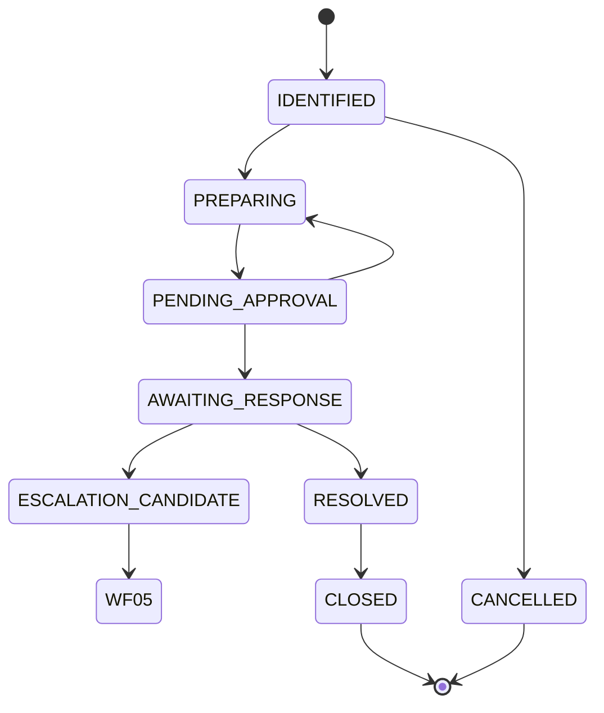

# OPS WF-03 — Client Follow-Up v1

**Status:** **documented** — human-operated workflow (architecture family).  
**Workflow ID:** WF-03  
**Program:** OPS — Business Operations Domain  
**Date:** 2026-06-04  
**Parent:** [../foundation/OPS-WORKFLOW-ARCHITECTURE-v1.md](../foundation/OPS-WORKFLOW-ARCHITECTURE-v1.md)

---

## 1. Purpose

Manage **post-delivery and post-meeting follow-up**: open questions, client responses, reminder rhythm, and approved client communications — without autonomous outreach or CRM SoT claims.

---

## 2. Trigger

| Trigger type | Description |
|--------------|-------------|
| **WF-01 close** | Stage 10 follow-up list |
| **Client message** | Operator logs inbound need |
| **Internal action item** | Meeting notes, project checkpoint |
| **WF-04 overdue** | Follow-up deadline passed |

---

## 3. Follow-up lifecycle

| Phase | Meaning | OpsCase status (typical) |
|-------|---------|--------------------------|
| **Identified** | Follow-up item recorded | `OPEN` |
| **Preparing** | Draft comm or internal action | `IN_PROGRESS` |
| **Pending approval** | Outbound draft in review | `PENDING_APPROVAL` |
| **Awaiting response** | Sent or internal task waiting | `IN_PROGRESS` |
| **Resolved** | Client answered or obligation met | `READY_TO_CLOSE` |
| **Closed** | No further follow-up on item | `CLOSED` |

Lifecycle labels are **operational** — map `CommunicationDraft` statuses where applicable.

---

## 4. Communication preparation

| Step | Action |
|------|--------|
| 1 | Confirm ATLAS contact refs for recipients |
| 2 | Draft `CommunicationDraft` — facts from ATLAS/evidence only |
| 3 | Separate operator commentary from contractual claims |
| 4 | Submit for approval — no send without gate |
| 5 | **Human sends** via chosen channel |

**OPS does not transmit** messages.

---

## 5. Reminder usage

| Construct | Usage |
|-----------|-------|
| `Deadline` category `FOLLOW_UP` | Target date for response or action |
| `Reminder` | Operator-set `remind_at` before or after due |
| Executive Assistant | Surfaces upcoming reminders — does not auto-send |

**Rule WF03-RM01:** Dismissing reminder does not close case or deadline ([OPS-DEADLINE-MODEL-v1.md](../foundation/OPS-DEADLINE-MODEL-v1.md) RM-02).

---

## 6. Escalation triggers

Human evaluates escalation when:

| Trigger | Typical action |
|---------|----------------|
| `DEADLINE_PASSED` on follow-up | Open WF-05 or link `EscalationRecord` |
| No client response beyond threshold | Studio SLA **SAFE UNKNOWN** — human sets |
| `BLOCKED` on missing ATLAS contact | ATLAS intake or attestation |
| Repeated approval rejection | WF-05 if approver unavailable |

See [OPS-WF-05-ESCALATION-HANDLING-v1.md](OPS-WF-05-ESCALATION-HANDLING-v1.md).

---

## 7. Approvals

| Gate | `ApprovalRequest` subject |
|------|---------------------------|
| Client-bound email/message | `communication` |
| Commitment affecting scope or fees | **Escalate outside OPS** — not OPS authority |

Approver: studio lead or account owner (HA-01).

---

## 8. Completion conditions

| Condition | Required |
|-----------|----------|
| Follow-up obligation met or explicitly waived | Yes |
| Outbound comms: approval `COMPLETED` and human send attested | If applicable |
| `CommunicationDraft` terminal or `CANCELLED` | Yes |
| OpsCase `CLOSED` | Yes |
| Linked deadlines `MET` or `WAIVED` | Yes |

---

## 9. OpsCase usage

| Aspect | Specification |
|--------|---------------|
| **Case type** | `FOLLOW_UP` |
| **Records** | `CommunicationDraft`, `Deadline`, `Reminder`, optional `TaskRecord` |
| **ATLAS** | Client, contact, project refs |

**Rule WF03-C01:** Multiple follow-ups may share one case if one thread; distinct client issues → separate cases with human acknowledgment.

---

## 10. Relationship with Executive Assistant

| Function | WF-03 touch |
|----------|-------------|
| Reminder rhythm | Proposes `FOLLOW_UP` deadlines after WF-01 close |
| Context | Pulls ATLAS contacts before draft |
| Tracking | Surfaces open follow-ups until `CLOSED` |
| Escalation flag | Suggests WF-05 candidacy — **human decides** |

Does not approve or send client communications.

---

## 11. Cross-workflow links

| Workflow | Link |
|----------|------|
| WF-01 | Primary source of follow-up items |
| WF-04 | Deadline and reminder operations |
| WF-05 | Persistent non-response or blocker |
| WF-06 | Completion review lists open follow-ups |

---

*OPS WF-03 — Client Follow-Up v1 · human-operated only.*
