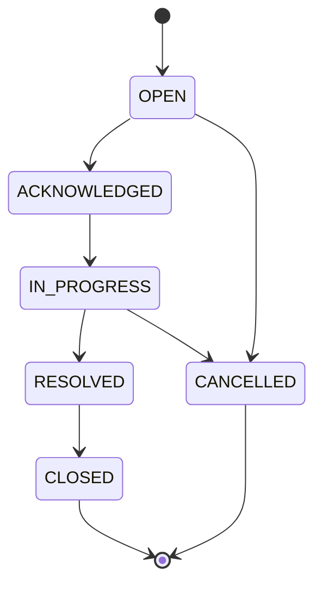

# OPS WF-05 — Escalation Handling v1

**Status:** **documented** — human-operated workflow (architecture family).  
**Workflow ID:** WF-05  
**Program:** OPS — Business Operations Domain  
**Date:** 2026-06-04  
**Parent:** [../foundation/OPS-WORKFLOW-ARCHITECTURE-v1.md](../foundation/OPS-WORKFLOW-ARCHITECTURE-v1.md) · [../foundation/OPS-DEADLINE-MODEL-v1.md](../foundation/OPS-DEADLINE-MODEL-v1.md)

---

## 1. Purpose

Provide a **human-supervised escalation path** when operational blockers, missed deadlines, or stale approvals require elevated attention — without automated SLA enforcement or autonomous escalation.

---

## 2. Escalation categories

| Category code | Label | Typical source workflow |
|---------------|-------|-------------------------|
| `DEADLINE` | Deadline / SLA risk | WF-04, WF-01, WF-02, WF-03 |
| `APPROVAL` | Approval stale or rejected loop | WF-01, WF-02, WF-03, WF-06 |
| `DATA` | ATLAS or evidence gap | WF-01 stage 5, WF-02 intake |
| `COMMUNICATION` | Client non-response or dispute | WF-03 |
| `DOCUMENT` | External hold on routing | WF-02 |
| `CAPACITY` | Resource / ownership conflict | Any |
| `OTHER` | Operator-defined | Human `category_detail` |

Categories are **operational labels** — not IT incident severities unless studio maps them.

---

## 3. Escalation lifecycle

Aligns with `EscalationRecord` statuses in [OPS-STATUS-MODEL-v1.md](../foundation/OPS-STATUS-MODEL-v1.md).

| Phase | Meaning |
|-------|---------|
| **Open** | Human raised escalation |
| **Acknowledged** | Named owner assigned |
| **In progress** | Remediation active |
| **Resolved** | Blocker cleared or deadline recovered |
| **Closed** | Terminal — no further escalation work |
| **Cancelled** | Withdrawn — parent case continues without elevation |

---

## 4. Severity model

Operational severity (human-assigned on `EscalationRecord`):

| Severity | Guidance |
|----------|----------|
| `LOW` | Awareness — no client commitment at risk |
| `MEDIUM` | Internal deadline or approval at risk |
| `HIGH` | Client-visible commitment or revenue rhythm at risk |
| `CRITICAL` | Leadership decision required — still **human** resolution |

**Rule WF05-S01:** Severity does not auto-notify executives — channel **SAFE UNKNOWN**.

---

## 5. Operator review

| Step | Action |
|------|--------|
| 1 | Confirm trigger validity (not dismissed reminder noise) |
| 2 | Link `parent_case_id` and triggering records (deadline, approval, report, document, comm) |
| 3 | Assign escalation owner (may differ from case owner) |
| 4 | Document `blocker_summary` on parent case if still `BLOCKED` |
| 5 | Set remediation plan as `TaskRecord` items |

**OpsCase patterns:**

| Pattern | Use |
|---------|-----|
| Dedicated `ESCALATION` case | Broad or multi-workflow issues |
| Child `EscalationRecord` on parent case | Single-thread blocker |

---

## 6. Resolution

| Resolution type | Outcome |
|-----------------|---------|
| **Data fixed** | ATLAS intake or attestation — parent returns `IN_PROGRESS` |
| **Deadline renegotiated** | `due_at` updated, `WAIVED` with note, or `MET` |
| **Approval cleared** | Approver assigned; request moves to `APPROVED` |
| **Communication sent** | WF-03 path completed with approval |
| **Scope change** | **Outside OPS** — human decision; OPS notes only |
| **Case cancelled** | Parent `CANCELLED` with reason if work abandoned |

---

## 7. Closure

| Condition | Required |
|-----------|----------|
| `EscalationRecord` `CLOSED` or `CANCELLED` | Yes |
| Parent case not `BLOCKED` without documented reason | Yes |
| Escalation owner attestation | Yes |
| No autonomous reopen | New escalation = new record |

---

## 8. Relationship with deadlines, reports, documents, communications

| Artifact | WF-05 relationship |
|----------|------------------|
| **Deadlines** | `DEADLINE_PASSED` common trigger; resolution may set `MET` or waive |
| **Reports** | WF-01 `BLOCKED` at missing data; approval stale on `ReportRecord` |
| **Documents** | WF-02 `ON_HOLD`; external legal wait |
| **Communications** | WF-03 no-response; may require approved chaser message |

Escalation **does not** edit ATLAS canonical fields or send client messages without WF-03 approval path.

---

## 9. Approvals

Escalation itself rarely requires `ApprovalRequest` unless resolution includes **client send** or **closure** — then parent workflow gates apply (MA-01).

---

## 10. Cross-workflow links

| Workflow | Link |
|----------|------|
| WF-04 | Primary trigger source |
| WF-01–03, WF-06 | Parent operational threads |
| WF-06 | Open escalations block completion attestation |

---

*OPS WF-05 — Escalation Handling v1 · human-operated only.*
