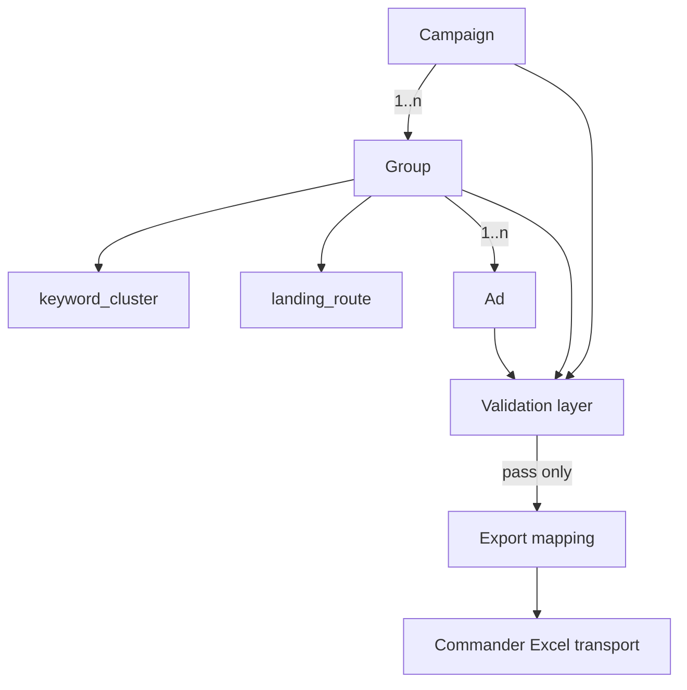

# ORCA PPC Entity Model Overview v1

**Pack:** Triumph Manipulator · **Lane:** Search-only · **Human-supervised**

---

## What this model is

The **structured data layer** between ORCA doctrine and Direct Commander transport.

ORCA produces and maintains:

- **Campaign** — semantic container (geo, strategy, negatives, extensions, routing role)
- **Group** — one semantic intent + keyword cluster + landing route + ads
- **Ad** — Yandex Search creative with alignment and extension fields
- **Landing route** — intent continuation binding (attached to group)
- **Validation report** — output artifact (future); rules in validation schema
- **Export mapping** — dumb transform to Excel (future)

This is **not** a database schema product and **not** runtime code in Phase 2.

---

## Entity relationship diagram



---

## Identity and versioning

| Concept | Convention | Example |
|---------|------------|---------|
| `entity_id` | Stable string within a project draft | `camp_triumph_search_v1` |
| `parent_id` | Group → campaign, Ad → group | `grp_03_bytovka` |
| `schema_version` | Literal `v1` on root document | `v1` |
| `pack_ref` | Fixed pack identifier | `triumph-manipulator` |
| `draft_status` | `draft` \| `review` \| `approved_for_export` | Human-set |

**Rule:** IDs are for operator/debug survivability — not platform IDs until after human import.

---

## Document shape (logical root)

A single **PPC project document** holds one or more campaigns for Triumph Manipulator search work:

```yaml
# Logical shape — documentation only, not enforced JSON yet
schema_version: v1
pack_ref: triumph-manipulator
project_label: string          # human label, e.g. "Triumph Krasnodar Search 2026-Q2"
campaigns: [Campaign]
meta:
  created_by: human | assisted
  last_validated_at: null | iso8601
  validation_passed: boolean
```

See [future-json-model-notes-v1.md](future-json-model-notes-v1.md) for serialization notes.

---

## Layer responsibilities

| Layer | Owns | Must NOT own |
|-------|------|----------------|
| Campaign | Geo, schedule, campaign negatives, extensions, routing role | Keyword dumps, mixed intents |
| Group | Intent, keywords, group negatives, landing route, ad list | Multiple unrelated intents |
| Ad | Creative text, fastlinks, callouts, alignment metadata | Landing strategy decisions |
| Landing route | Blueprint ref, URL, routing type, fallback | Ad copy generation |
| Validation | Pass/fail + findings | Auto-launch, auto-fix silently |
| Export | Column mapping, formatting | Semantic reasoning |

---

## Production pipeline position

Aligned with [direct-commander-foundation-v0.md](../export/direct-commander-foundation-v0.md):

1. Intent analysis (research + doctrine) — **outside** entity file, feeds entity creation  
2. Segmentation → **Campaign / Group** entities  
3. Keyword clustering → **Group.keyword_cluster**  
4. Ad generation → **Ad** entities under group  
5. Landing assignment → **Group.landing_route**  
6. **Validation** (full graph)  
7. **Export** (validated graph only)  
8. Human review → Commander import  

Validation is **step 6**, never post-export only.

---

## Search-only envelope

Every v1 campaign document must declare:

```yaml
search_only_scope: true
forbidden_campaign_types:
  - rsya
  - master_campaign
  - retargeting
  - performance_autopilot
```

Details: [campaign-entity-schema-v1.md](campaign-entity-schema-v1.md).

---

## One group = one semantic intent

Non-negotiable rule carried from doctrine:

- If psychology, landing logic, or commercial stage **differ materially** → **new group** (or new campaign if campaign-level split applies).
- Keyword clusters that share commercial meaning may live in **one** group (e.g. «заказать» / «вызвать» манипулятор).

Group schema: [group-entity-schema-v1.md](group-entity-schema-v1.md).

---

## Landing continuation

Ad intent and group intent must **continue** on the assigned landing blueprint.

- Routing schema: [landing-routing-schema-v1.md](landing-routing-schema-v1.md)  
- Blueprint index: [landing-pages/INDEX.md](../landing-pages/INDEX.md)

---

## Child schema index

| Entity / concern | Schema file |
|------------------|---------------|
| Campaign | [campaign-entity-schema-v1.md](campaign-entity-schema-v1.md) |
| Group | [group-entity-schema-v1.md](group-entity-schema-v1.md) |
| Ad | [ad-entity-schema-v1.md](ad-entity-schema-v1.md) |
| Landing routing | [landing-routing-schema-v1.md](landing-routing-schema-v1.md) |
| Validation | [validation-schema-v1.md](validation-schema-v1.md) |
| Export mapping | [export-mapping-schema-v1.md](export-mapping-schema-v1.md) |

---

## Future implementation hooks (honest)

| Consumer | Uses this model for |
|----------|---------------------|
| Validation engine (Phase 3) | Rule execution, report artifact |
| Exporter (Phase 4) | [export-mapping-schema-v1.md](export-mapping-schema-v1.md) |
| Prompt system (Phase 5) | Constrained JSON emission |
| n8n (Phase 6) | Human-triggered pipelines |

**Current status:** schemas exist as **markdown contracts only**.
