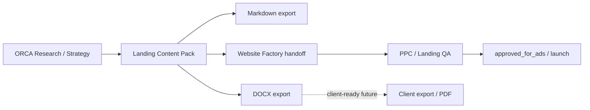

# ORCA Content Export Pipeline v0

## Status

**PRE-IMPLEMENTATION FOUNDATION** — human-operated export pipeline semantics.

**Not:** a running pipeline, job queue, CI job, or agent orchestration.

## Pipeline overview

## Stages (human-operated)

| Stage | Actor | Input | Output | Gate |
|-------|-------|-------|--------|------|
| **S0 — Intake** | Operator | Raw research, SERP notes, files | Normalized notes in project tree | — |
| **S1 — Pack draft** | Operator (+ optional AI assist) | Sources in S0 | `*.md` pack `draft` | — |
| **S2 — Internal review** | Operator | Pack draft | Pack `reviewed` | Operator checklist |
| **S3 — Pack approval** | Operator | Reviewed pack | Pack `approved` | Human sign-off |
| **S4 — DOCX export** | Operator (future tooling) | Approved pack | DOCX + export metadata | `approved_for_client_export` optional |
| **S5 — Factory handoff** | Operator | Approved pack | Handoff doc + MODE 1 | `approved_for_factory` |
| **S6 — Implementation** | Factory lane | Handoff | Built page in workspace | Semantic lock QA |
| **S7 — Ads readiness** | Operator | Live/staging URL + QA | Launch decision | `approved_for_ads`, `approved_for_launch` |

## Export channels

| Channel | Primary use | Approval typical |
|---------|-------------|------------------|
| **Markdown** | Git diff, internal collaboration, pack SoT editing | `reviewed` sufficient for internal |
| **DOCX** | Operator sign-off, client review, archival | `approved` minimum; client needs `approved_for_client_export` |
| **PDF** | Future external delivery | Same as DOCX + redaction policy |
| **Factory handoff** | Lane A build | `approved_for_factory` + MODE 1 |

Architecture per channel: [exporters/](exporters/).

## Separation from Commander export

| System | Path | Delivers |
|--------|------|----------|
| **Content export layer** | `content-packs/` | Landing semantics → DOCX/MD → Factory |
| **Commander exporter** | `ppc/triumph-manipulator/tools/exporter-cli/` | Campaign XLSX / sheet patches |

Do not merge these pipelines in documentation or tooling without explicit charter.

## Export metadata

Every export run (when tooling exists) should record:

- `export_id`, `exported_at`, `exported_by` (human)
- `source_pack_id`, `source_pack_version`, `source_artifact_state`
- `export_format` (`docx` | `markdown` | `pdf`)
- `semantic_lock_snapshot` (active locks at export time)
- `approval_gates_snapshot`

Schema: [schemas/export-metadata-schema-v0.md](schemas/export-metadata-schema-v0.md).

## Failure handling (operational)

| Condition | Action |
|-----------|--------|
| Pack `draft` | No DOCX labeled “approved”; no Factory MODE 1 |
| Lock violation in Factory build | Halt; operator reconciles pack vs HTML |
| Missing price / NAP evidence | **SAFE UNKNOWN** in pack; do not invent in export |
| Export tooling not built | Pipeline stops at approved Markdown pack — valid v0 state |

## Related

- [artifact-lifecycle-v0.md](artifact-lifecycle-v0.md)
- [workflows/research-to-pack-workflow-v0.md](workflows/research-to-pack-workflow-v0.md)
- [workflows/pack-to-factory-workflow-v0.md](workflows/pack-to-factory-workflow-v0.md)

## Boundary

Stage names and human gates only. No scheduler, no autonomous export.
