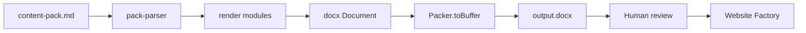

# DOCX Pilot Architecture v1

## Purpose

Minimal operational export layer: **ORCA semantic pack (Markdown) → DOCX** for operator review and Website Factory handoff.

## Components

```
docx-pilot/
├── scripts/
│   ├── export-content-pack-docx.js   # Orchestrator (CLI entry)
│   ├── pack-parser.js                # Markdown → structured pack model
│   ├── render-cover.js               # Cover + metadata + gate snapshot
│   ├── render-section.js             # Sections 01–10 + PPC/SEO blocks
│   ├── render-safe-unknown.js        # Aggregated UNKNOWN section
│   ├── render-factory-notes.js       # MODE 1 / Factory scope
│   ├── render-approvals.js           # Approval footer + sign-off blank
│   └── lib/docx-helpers.js           # Shared Word formatting primitives
├── templates/                        # Layout rules (human-readable)
├── validation/                       # Post-export checklist
└── output/                           # Generated DOCX (gitignored optional)
```

## Data flow



## Document sections (export order)

1. Cover — project_id, route_id, export_version, generated_at, semantic lock, gates
2. PPC continuity
3. SEO continuity
4. Sections 01–10 (hero … final_cta)
5. SAFE UNKNOWN (dedicated warning)
6. Factory implementation notes
7. Approval section + operator sign-off blank

## Parser contract

Parser reads YAML frontmatter and `# 0N SECTION_KEY` blocks. Subsections (`### Copy blocks`, `### CTA`, etc.) map to render fields. Parser is **tolerant** — missing subsections log warnings but do not block pilot export.

## Expansion points (future, not implemented)

| Extension | Hook |
|-----------|------|
| Additional packs | CLI arg `input.md` |
| Client DOCX profile | `export-modes-v0.md` `client_docx` watermark rules |
| Sidecar metadata JSON | Post-write hook in orchestrator |
| Round-trip MD merge | Out of scope v1 — human merge only |

## Boundaries

| In scope | Out of scope |
|----------|----------------|
| Local Node + `docx` npm | Cloud APIs, browser automation |
| Single-run CLI | Daemons, queues, cron |
| Gate snapshot | Auto-approval |
| MODE 1 lock display | Semantic validation engine |

## Version

`v1` — pilot tied to `triumph-manipulyator-5-tonn-pack-v0.md`.
