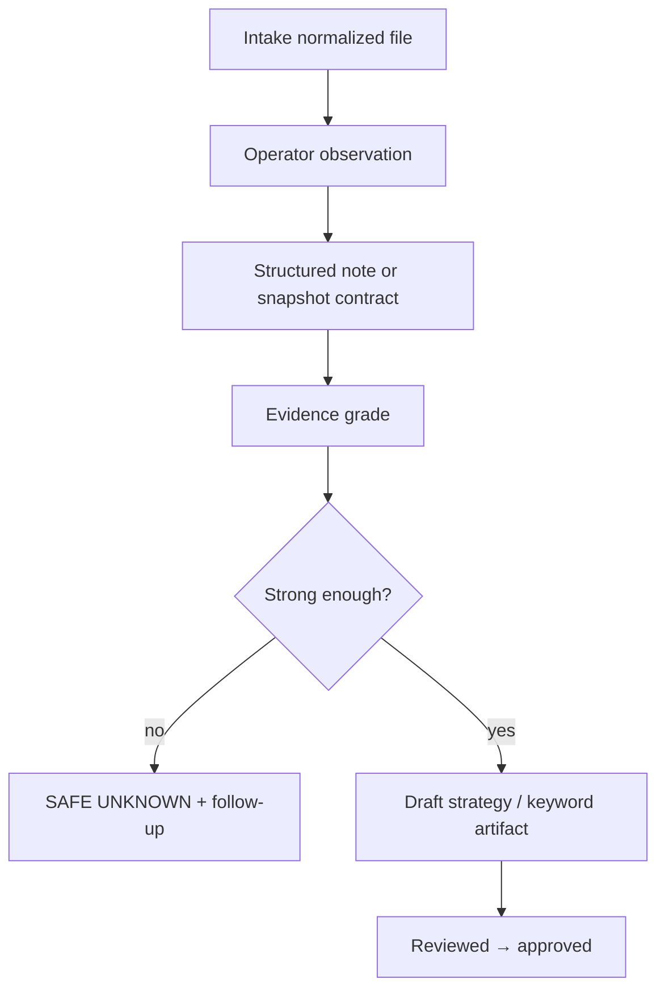

# ORCA Research Layer v0

## Status

**PRE-IMPLEMENTATION FOUNDATION** — human-operated evidence collection design.

**Not** a runtime crawler. **Not** an autonomous scraping cluster. **Not** live SERP monitoring as a product.

## Purpose

Define how ORCA collects, preserves, and uses market intelligence from chaotic inputs through normalized project folders — for Search, RSYA, audits, and Factory handoff.

## Boundary

| Human-operated | Not claimed |
|----------------|-------------|
| Operator captures screenshots | 24/7 SERP bots |
| Manual URL review | Headless crawl farm |
| Paste exports into raw pack | Auto competitor tracking |
| SERP snapshot contracts | ML ranking prediction |

## Research Domains

### 1 — SERP intelligence

- Capture: query, engine, region, device, timestamp.
- Record: ad blocks, maps pack, aggregators, offer/CTA patterns.
- Contract alignment: [serp-snapshot-contract-v1.md](serp-snapshot-contract-v1.md).
- Storage: `projects/orca/projects/<id>/serp/` or legacy research paths.

### 2 — Competitor observation

- Ads, landings, pricing language, trust signals.
- Evidence-graded per [evidence-classification-system-v0.md](../evidence/evidence-classification-system-v0.md).
- Storage: `competitors/`.
- **No** inferred budgets or Quality Score.

### 3 — Keyword discovery

- Sources: operator tools, client lists, SERP suggestions (manual note), exports.
- Clustering semantics live in mode packs — Search vs RSYA differ.
- Storage: `keywords/`.
- Draft until reviewed.

### 4 — Landing extraction

- Extract: hero, sections, proof blocks, forms, click-to-call.
- Purpose: continuation QA and brief authoring — not blind cloning.
- Storage: `normalized/`, `research/`.

### 5 — CTA extraction

- Primary/secondary CTA, channel, mobile prominence.
- Links to landing-match and CTA review docs in parent ORCA tree.

### 6 — Offer extraction

- Price framing, scope, urgency, guarantee language.
- Feeds offer evaluation methodology — human judges supportability.

### 7 — Snapshot preservation

- Original screenshots and files retained with manifest `item_id`.
- Observations are **time-bound** — label `historical` / `stale` when aged.
- Do not overwrite captures — add new snapshot with new timestamp.

## Research Workflow (HITL)

## Outputs by Consumer

| Consumer | Research inputs needed |
|----------|------------------------|
| Search mode | SERP per intent tier, query groups, competitor search ads |
| RSYA mode | Display creatives, placement context, visual offers |
| Audits | PDF-ready summaries with evidence table |
| Website Factory | Approved landing briefs — **ORCA-RS-001** Executive Research Package when research program completes — not raw screenshots alone |
| Validation CLI | Structured entities — not screenshot folders |

## Integration with Intake

1. Raw competitor screenshot lands in `incoming/...-raw-pack/`.
2. Manifest classifies `screenshots` + `competitors`.
3. Normalized copy → `competitors/` or `serp/`.
4. Operator fills snapshot or observation template.
5. Approved findings → `strategy/` or `artifacts/`.

## Coexistence with ORCA `research/` Tree

Repository already contains methodology docs (e.g. `serp-snapshot-contract-v1.md`). This v0 layer defines **project-local storage and operator flow**, not replacement of methodology v1 files.

## AI Assistance

AI may **draft** observation summaries from captures — tag `ai-derived`, require operator confirmation before `approved`.

## Anti-Patterns

- Claiming "ORCA researched the market" when only files were dropped.
- Single screenshot → global niche doctrine.
- Deleting stale SERP without archival note.

## SAFE UNKNOWN

- Standard observation template per niche — **optional** in v0.
- Automated screenshot naming — **not required**.

## Related Documents

- [ORCA-RS-001-EXECUTIVE-RESEARCH-PUBLICATION-STANDARD-v1.md](../standards/ORCA-RS-001-EXECUTIVE-RESEARCH-PUBLICATION-STANDARD-v1.md) — Executive Research Package publication gate
- [orca-universal-intake-architecture-v0.md](../intake/orca-universal-intake-architecture-v0.md)
- [evidence-classification-system-v0.md](../evidence/evidence-classification-system-v0.md)
- [orca-campaign-mode-architecture-v0.md](../campaign-modes/orca-campaign-mode-architecture-v0.md)
- [project-memory-system-v0.md](../intelligence/project-memory-system-v0.md)
