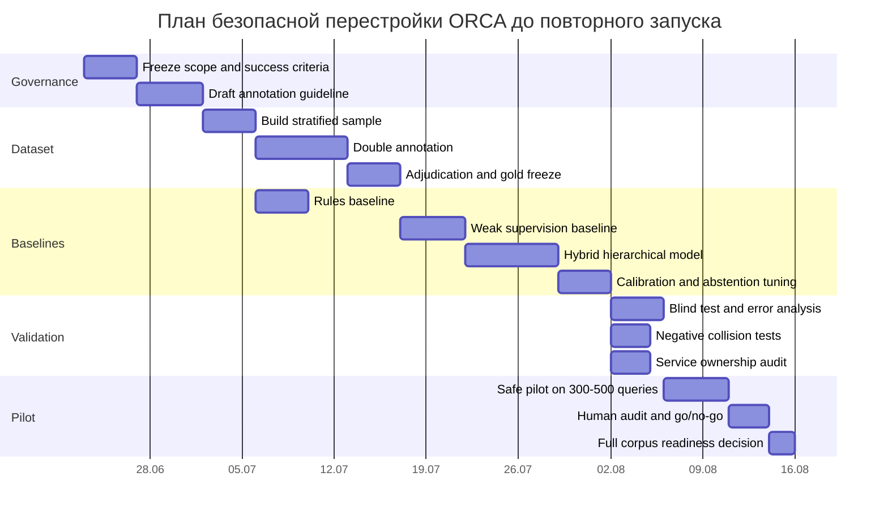

# Аналитический отчет по теме ORCA и PPC Semantic Core

## Executive summary

В исходном meta-запросе тема была помечена как **«не указано»**, но приложенный пользователем бриф задает конкретную предметную область: исследование мировых практик построения систем, которые превращают большие массивы поисковых запросов в чистое рекламное семантическое ядро для PPC, с целью исправления архитектуры ORCA в проекте MARS. Ключевая проблема сформулирована прямо: ORCA подменяет **коммерческий интент** тематическим совпадением фразы с услугой. fileciteturn0file0

Главный вывод исследования: зрелая PPC-система не должна пытаться «угадывать коммерческость» из одной лишь тематической близости. Официальные материалы Google Ads прямо показывают, что современные платформы уже используют семантику, контекст, посадочные страницы, другие ключевые слова группы и даже недавние поиски пользователя для расширения матчинга; Яндекс Директ аналогично использует семантическое соответствие, автотаргетинг, словоформы, синонимы и связанные темы. Это означает, что ошибка на уровне допуска запроса в semantic core затем автоматически масштабируется платформой. Поэтому ORCA должна быть **консервативной на входе** и работать по модели **hierarchical gates + calibrated abstention + human review**, а не по модели «семантически похоже на услугу — значит коммерческий запрос». citeturn5view0turn16view0turn16view4turn6view3turn9view3

Наиболее перспективная тема для глубокого исследования и внедрения — **референсная архитектура ORCA Semantic Intelligence для B2B-услуг и сложной русскоязычной семантики**, потому что она имеет прямой бизнес-эффект, закрывает уже обнаруженный failure mode и дает основу для всех следующих уровней: минусовки, кластеризации, архитектуры кампаний и post-launch learning. Для нее оптимален hybrid-подход: жесткие правила для hard exclusions, weak supervision для дешевого расширения разметки, supervised/hierarchical classifier для основных решений, retrieval/embeddings — для similarity и ambiguity support, LLM — только как adjudication layer с обязательным abstention и последующей валидацией. Такой стек лучше согласуется с промышленными результатами по weak supervision, active learning, intent taxonomies и classification with rejection, чем pure rules или pure LLM. citeturn23academia1turn23academia2turn23academia0turn18academia0turn24academia2turn20academia1

Production-блокером для ORCA должна быть не общая accuracy и не macro-F1 сами по себе, а **commercial precision на auto-admit-потоке**. Причина проста: в paid search false positive стоит реальных денег, а современные match systems расширяют охват за пределы буквальной формулировки. Практически это означает: прежде чем запускать кампании и экспорты, ORCA должна доказывать очень высокую точность на авто-допущенных фразах, уметь уходить в abstain, а ambiguity и дорогие типы ошибок — карьерные, DIY, учебные, нормативные, навигационные и troubleshooting-запросы — маршрутизировать человеку. citeturn16view0turn21view0turn9view0turn24academia2turn25academia0

## Разрешение неопределенности темы и shortlist направлений

Поскольку исходная формулировка запроса содержала пометку **«не указано»**, ниже дан короткий shortlist правдоподобных тем. Но фактический attached brief уже задает конкретную тему — ORCA/PPC semantic core — и именно она выбрана как приоритетная. fileciteturn0file0

### Короткий shortlist тем

| Тема | Scope | Ключевые вопросы | Первичные источники | Методология | Оценка времени и усилий | Deliverables | Следующий шаг |
|---|---|---|---|---|---|---|---|
| Архитектура PPC semantic core для ORCA в B2B-услугах | От intake до approved semantic core; русскоязычная морфология; negatives; human review | Как отличать topical relevance от commercial intent; где нужны human gates; как задать thresholds | Google Ads Help, Yandex Direct Help, научные papers по query intent, weak supervision, sponsored search | Official-doc review + literature review + reference architecture + pilot design | 3–5 недель, high effort | Архитектура, decision standard, gold dataset, thresholds, pilot plan | Выбрано как основная тема |
| Конкурентный анализ enterprise PPC platforms | Optmyzr, SA360, Skai, Marin, Adalysis, Semrush PPC | Какие паттерны автоматизации реально production-grade; что копировать, а что нет | Product docs, engineering blogs, case studies | Feature decomposition + architecture pattern analysis | 2–3 недели, medium effort | Competitive landscape, build-vs-buy memo | Использовать как дополнительный модуль к теме ORCA |
| Техническая feasibility-оценка LLM + rules для query adjudication | LLM as judge, abstention, reproducibility, QA | Где LLM полезен; как избежать hallucinated commercial intent | Research on LLM evaluation, calibration, selective classification, platform docs | Prototype design + risk model + benchmark spec | 2–4 недели, medium/high effort | Risk register, prompt standard, eval protocol | После gold dataset |
| Исследование negative keyword intelligence для русскоязычного PPC | Campaign/ad-group/global negatives, collision risks, Yandex operators | Как не ломать полезный спрос; как проверять destructive negatives | Google Ads negative keyword docs, Yandex operators/negative docs, search query reports | Rules audit + morphology analysis + collision testing | 1–2 недели, medium effort | Negative policy, validators, repair logic | Подпроект внутри ORCA |

### Почему выбрана именно тема ORCA

Эта тема обладает наибольшим ожидаемым эффектом и наименьшей двусмысленностью: проблема уже обнаружена, бизнес-ущерб от false positives прямой, а attached brief задает детальные исследовательские требования именно под ORCA. Кроме того, она является «верхним уровнем власти» над всеми последующими операциями: campaign build, ads, landing alignment и export не должны стартовать до утверждения semantic core. fileciteturn0file0

Ниже приведен уже не просто план исследования, а сжатый **deep research report + implementation blueprint** по выбранной теме.

## Что показывает исследование мировых практик

### Как зрелые PPC semantic systems реально устроены

Официальная логика Google Ads показывает, что matching — это многоступенчатый процесс: система интерпретирует запрос, формирует retrieval query с учетом spelling corrections, synonyms и related concepts, затем проверяет eligibility по match type и дополнительным критериям кампании/группы, а далее выбирает наиболее релевантный ad group и объявление. Google отдельно подчеркивает важность тематической группировки keywords/ad groups и не рекомендует дублировать одинаковые keywords по match types ради псевдо-управления приоритетом. citeturn16view0turn5view0turn21view1turn28view0

Из этого следует жесткий архитектурный вывод для ORCA: стадии **market research**, **semantic-core production**, **campaign production** и **platform export** нельзя смешивать. Если система одновременно решает, что фраза коммерческая, кому она принадлежит, какие минусы поставить и в какой ad group ее выгрузить, то стадия экспорта начинает влиять на стадии допуска и разметки. Это создает pipeline contamination: решения об eligibility начинают зависеть от удобства будущей структуры, а не от настоящего пользовательского намерения. Подобный риск особенно высок в современном sponsored search, где платформы расширяют охват семантически. citeturn16view0turn35academia2turn3academia0

Для Яндекс Директа риск еще выше из‑за сочетания word-to-word и semantic matching, операторов, стоп-слов и автотаргетинга. Яндекс прямо пишет, что показы возможны не только по полному вхождению, но и по запросам, которые семантически уточняют ключевую фразу; автотаргетинг вовсе не базируется на keywords и использует данные из объявления и посадочной страницы. Следовательно, «грязное» ядро затем усиливается мощностью платформы. citeturn6view3turn9view3turn9view5

### Search intent не равен topical relevance

Google в своих материалах открыто описывает переход от syntax-based matching к semantics-based matching; broad match использует landing pages, другие keywords в ad group и недавнюю поисковую активность пользователя, чтобы понять смысл запроса. Это полезно для охвата, но опасно как источник логики для допущения запросов в manual semantic core услуг, потому что сам matching engine оптимизирован на аукционный охват и performance, а не на строгую редакторскую чистоту ядра. citeturn5view0turn16view0turn26view0turn26view1

Исследования по query intent подтверждают, что внутри одной и той же темы скрываются разные пользовательские задачи. ORCAS-I показывает, что даже классический триплет informational / navigational / transactional недостаточен и что полезно выделять подтипы informational и отдельный abstain-класс; Product Insights на данных Bing показывает, что product-related queries составляют лишь часть общего web search и требуют отдельной taxonomy; Search4Code демонстрирует, что запросы с одинаковой предметной лексикой могут относиться к коду, документации, debugging и другим задачам. Для ORCA это прямо означает: наличие термина услуги в запросе не доказывает намерение нанять исполнителя или купить услугу. citeturn23academia0turn34academia1turn34academia0

Для B2B IT и ERP/CRM-тематик это особенно критично. Запросы вроде «маркировка в 1С», «программист 1С», «внешние печатные формы» могут обозначать минимум семь разных целей: поиск подрядчика, поиск вакансии, обучение, DIY, документацию, техподдержку, поиск модуля/продукта. Поэтому для ORCA нужна не тема запроса, а **probable next task** пользователя. Иными словами, ядро должно отвечать не на вопрос «про что это?», а на вопрос «что человек, вероятнее всего, хочет сделать дальше?». Это и есть правильный смысл commercial-intent adjudication для paid search. fileciteturn0file0 citeturn23academia0turn19academia2turn34academia1

### Лучшая архитектурная опция — не single model, а hierarchical gates

Pure rules удобны для hard exclusions и операторных кейсов, но плохо переносят длинный хвост, контекст и неоднозначность. Pure LLM хорошо объясняет и обобщает, но склонен к over-classification, confirmation bias и нестабильности решений. Pure embeddings полезны для retrieval/similarity и clustering, но сами по себе не решают cost-sensitive admission. Weak supervision и active learning, напротив, хорошо подходят для дешевого наращивания обучающих данных и для управления длинным хвостом, а classification with rejection естественно ложится на задачу abstention там, где ошибка дороже пропуска. citeturn23academia1turn23academia2turn18academia0turn24academia2turn20academia1

Практически для корпуса от нескольких тысяч до сотен тысяч фраз наиболее надежна последовательность:

1. **Hard exclusion screening**  
2. **Query-type classification**  
3. **Commercial eligibility adjudication**  
4. **Provider-hire likelihood / product-vs-service split**  
5. **Service mapping**  
6. **Ambiguity detection**  
7. **Human-review routing**  

Именно такая схема лучше согласуется и с weak supervision, и с modern platform behavior. Она минимизирует дорогие ложноположительные допуски, дает естественный слой abstention и не заставляет одну модель одновременно решать слишком много плохо совместимых задач. citeturn23academia0turn23academia1turn24academia2turn16view0turn9view3

### Negative keyword intelligence и clustering нельзя строить «слишком рано»

Google подчеркивает, что negative keywords работают иначе, чем positive keywords, и **не матчятся по close variants**; Яндекс добавляет, что negative keywords могут задаваться на разных уровнях, поддерживают операторы, а если negative keyword полностью перекрывается ключом, он игнорируется. Яндекс также предупреждает, что negative keywords в сетях надо использовать осторожно, иначе можно отрезать заинтересованную аудиторию. Следовательно, агрессивная минусовка до определения phrase ownership и service ownership — архитектурная ошибка. citeturn21view0turn9view0turn9view2turn8view0

Та же логика действует для clustering. Google рекомендует группировать keywords и ads по темам и выбирать наиболее релевантные ad groups; sponsored search research показывает, что category similarity и semantic expansion улучшают coverage только при downstream relevance control. Поэтому правильная единица PPC-кластера — не «набор похожих слов», а **набор фраз с одним primary intent, одной честной landing-page compatibility и единым ownership внутри service map**. Кластеры, построенные только по lexical similarity, неизбежно смешают «нанять», «научиться», «скачать», «исправить самому» и «получить документацию». citeturn28view0turn16view0turn35academia1turn35academia2turn3academia0

## Рекомендуемая целевая архитектура ORCA

### Сравнение подходов

Ниже — сжатая оценка вариантов, которые чаще всего рассматривают для подобных систем.

| Подход | Преимущества | Недостатки | Основные риски | Подходит ORCA | Где применять |
|---|---|---|---|---|---|
| Pure rules | Прозрачность, дешево, быстро | Плохо масштабируется на хвост и контекст | «термин услуги = коммерческий запрос», rule regression | Частично | Hard exclusions, operators, malformed queries |
| Pure LLM | Хорошо объясняет и обобщает | Нестабилен, дорог, склонен к hallucinated intent | Over-admission, template reasoning, self-validation | Нет как core | Adjudication only, rationale draft |
| Supervised classifier | Стабильные решения, калибруемые thresholds | Нужна разметка и versioning | Drift, плохая работа на unseen hard cases | Да | Query-type, eligibility, mapping support |
| Embeddings / similarity | Сильны для retrieval и ambiguity support | Не дают policy decision сами по себе | Topic match вместо intent | Да, вспомогательно | Candidate recall, hard-case retrieval, clustering |
| Hybrid rules + classifier | Лучший баланс precision/control | Сложнее дизайн | Rule conflict, maintenance debt | Да | Production core |
| Hierarchical gates | Позволяют cost-sensitive admission | Больше orchestration | Ошибки на раннем gate cascading downstream | Да, оптимально | Full pipeline |
| Ensemble | Выше robustness | Выше сложность и latency | Сложный QA и versioning | Да, ограниченно | Final adjudication on hard set |
| Human-only | Высокая точность на малых объемах | Дорого и медленно | Низкая масштабируемость | Нет | Gold dataset, pilot, audits |
| Active learning | Ускоряет разметку hardest cases | Нужна дисциплина цикла | Sampling bias | Да | Dataset growth, reviewer queues |
| Weak supervision | Быстро расширяет обучающие labels | Шум и коррелированные правила | Ложная уверенность baseline | Да | Rules baseline, bootstrapping |

Вывод: для ORCA оптимален **hybrid hierarchical system** с четким разделением authority layers. Выбор поддерживается промышленными кейсами Snorkel/weak supervision, intent taxonomies и selective classification. citeturn23academia1turn23academia2turn23academia0turn18academia0turn24academia2

### Референсная архитектура ORCA

| Layer | Назначение | Вход | Выход | Authority | Автоматизация | Human gate | Запрещено | QA и versioning |
|---|---|---|---|---|---|---|---|---|
| Operator Authority Layer | Фиксирует business scope | brief, services, geo | approved scope | оператор | low | обязательный | генерировать keywords | versioned brief |
| Market Evidence Layer | Сбор фактов рынка | Wordstat, keyword tools, logs | evidence pack | аналитик | medium | optional | делать final admission | source log |
| Source Corpus Layer | Объединение фраз | выгрузки, исследования, search terms | raw corpus | система | high | нет | минусовать/кластеризовать | corpus snapshot |
| Normalization Layer | Лемматизация, dedupe, cleanup | raw corpus | normalized corpus | система | high | нет | присваивать intent | rule version |
| Query Understanding Layer | Разбор entity/action/object/modifiers | normalized query | feature object | система | high | нет | final commercial decision | model/rule version |
| Intent Screening Layer | Hard exclusions и query type | feature object | type + exclusions | система | high | review on low confidence | маппить в кампании | confusion audit |
| Commercial Eligibility Layer | Допуск в рекламное ядро | type/features | eligible / reject / abstain | система + оператор | medium/high | mandatory on abstain/high-risk | export | threshold version |
| Semantic Adjudication Layer | Literal interpretation и rationale | candidate query | adjudication record | оператор/модель | medium | mandatory on hard set | придумывать коммерческую трактовку | rationale audit |
| Service Mapping Layer | Привязка к услуге | eligible query | service ownership | система + оператор | medium | for conflicts | cross-negative build | ownership tests |
| Cluster Discovery Layer | Поиск task-based clusters | mapped queries | cluster proposals | оператор | medium | approve cluster spec | писать объявления | cluster QA |
| Negative Intelligence Layer | Semantic exclusion и cross-negatives | ownership + clusters | negative candidates | оператор | medium | mandatory before apply | минусовать до ownership | collision tests |
| Human Review Layer | Разбор ambiguity | abstain/hard cases | final labels | reviewer | low | core | auto-approve self output | double review |
| Semantic Core Authority Layer | Freeze approved core | reviewed outputs | approved semantic core | оператор | low | обязательный | campaign build before freeze | signed artifact |
| Campaign Architecture Layer | Группа/кампания | approved core | campaign blueprint | специалист | medium | approve | менять admission | diff QA |
| Ad and Landing Alignment Layer | Проверка честного соответствия | cluster + landing | alignment spec | специалист | medium | approve | компенсировать плохое ядро объявлениями | landing QA |
| Bid and Match-Type Layer | Match strategy | blueprint + risk mode | bid/match plan | специалист | medium | approve | переписывать core | policy version |
| Production Dataset Layer | Экспортные таблицы/JSON/XLSX | approved plan | production artifacts | система | high | pre-export QA | semantic decisions | schema validation |
| Platform Export Layer | Загрузка в платформы | production artifacts | draft imports | система | high | final check | self-correct semantics | checksum |
| External Artefact QA | Проверка JSON/XLSX/API parity | exported files | QA report | система + оператор | high | mandatory | silent mutations | parity test |
| Post-Launch Search-Term Learning | Feedback loop после запуска | search terms, clicks, conv | optimization queue | оператор | medium/high | mandatory for policy changes | оправдывать плохой pre-launch core | release notes |

### Стандарт semantic adjudication для одной фразы

Ниже — минимальный production-standard, который стоит считать обязательным для ORCA. Это уже **рекомендация для проекта**, а не документированное свойство платформ.

| Поле | Допустимые значения / формат | Правило |
|---|---|---|
| query_id | UUID / stable hash | неизменяемый id |
| raw_query | string | оригинал |
| normalized_query | string | после нормализации |
| language | `ru`, `en`, `mixed`, `unknown` | автоматически + override |
| source | `wordstat`, `platform_search_terms`, `competitor`, `manual`, `other` | provenance обязателен |
| frequency | integer / null | `null`, если не указано |
| literal_interpretation | short text | буквальное чтение без коммерческой фантазии |
| likely_user_goal | controlled text | что пользователь хочет сделать дальше |
| primary_intent | `hire_service`, `buy_product`, `support`, `troubleshoot_self`, `learn`, `career`, `regulatory`, `navigational`, `documentation`, `download`, `other`, `ambiguous` | один главный |
| secondary_intent | same set / `none` | необязателен |
| provider_hire_signal | `high`, `medium`, `low`, `none` | отдельный, не синоним commercial |
| transaction_signal | `high`, `medium`, `low`, `none` | отдельный |
| informational_signal | same scale | отдельный |
| diy_signal | same scale | отдельный |
| career_signal | same scale | отдельный |
| educational_signal | same scale | отдельный |
| regulatory_signal | same scale | отдельный |
| navigation_signal | same scale | отдельный |
| product_module_signal | same scale | модуль/продукт vs услуга |
| problem_signal | same scale | есть ли symptom/problem framing |
| geography | text / `none` | отдельный признак |
| service_candidate | controlled service ID / `none` / `multiple` | только candidate |
| service_mapping_confidence | 0–1 | калибруемый score |
| commercial_eligibility | `accept`, `reject`, `abstain` | финал gate |
| eligibility_confidence | 0–1 | после calibration |
| ambiguity | `none`, `lexical`, `intent`, `service`, `high` | причина abstain |
| risk | `low`, `medium`, `high`, `critical` | cost-sensitive flag |
| decision | `core`, `negative_candidate`, `review`, `discard` | operational action |
| reason | short controlled rationale | без шаблонной воды |
| reviewer | human/model id | traceability |
| model_version | string | обязательно |
| rule_version | string | обязательно |
| provenance | source ids | обязательно |
| operator_override | boolean + note | override логируется |

### Практическое дерево решений

Ниже — рекомендуемое decision tree, пригодное и для deterministic rules, и для prompt-based adjudication, и для human review.

1. **Есть ли очевидный hard exclusion?**  
   Карьера, вакансии, стажировка, резюме, обучение, курсы, с нуля, бесплатно скачать, DIY/how-to, нормативка, личный кабинет, документация, forum-only intent, malformed spam. Если да — `reject`, если нет — дальше. Поддержка такой предфильтрации согласуется с weak supervision и intent taxonomies. citeturn23academia0turn23academia1

2. **Какова буквальная задача пользователя?**  
   Нанять, купить, разобраться самому, изучить, найти работу, скачать, войти, узнать правила, найти модуль/продукт, получить поддержку. Если задача не формулируется без натяжки — `abstain`. citeturn34academia1turn34academia0turn19academia0

3. **Есть ли честный provider/service answer?**  
   Может ли сервисная посадочная страница честно удовлетворить запрос без переинтерпретации смысла? Если нет — `reject`.

4. **Есть ли сигнал найма исполнителя или платного контакта?**  
   Явный или сильный косвенный signal: внедрение, заказать, услуги, настройка под ключ, сопровождение, аудит, доработка, интеграция, подрядчик, поддержка, цена проекта. Если сигнал слабый, но problem-centric — переход в `abstain/review`, а не auto-accept.

5. **Это продукт/модуль или услуга?**  
   Если вероятнее product/module intent — либо отдельный service/product split, либо `reject` для service-only core.

6. **Есть ли service ownership без конфликта?**  
   Если ownership multiple или unclear — `review`.

7. **Есть ли destructive negative risk?**  
   Если возможен конфликт с соседними services/clusters — negative generation блокируется до ручного утверждения ownership.

Рекомендованное operational rule: **если сомнение нельзя снять из буквальной формулировки запроса, ORCA должна abstain, а не “домысливать коммерцию”**. Это соответствует логике classification with rejection и cost-sensitive admission. citeturn24academia2turn25academia0

## План исследования, gold dataset, метрики и безопасный пилот

### Дизайн benchmark и gold dataset

Для ORCA нужен не случайный sample, а **stratified benchmark**, где отдельно представлены классы, критичные именно для дорогих false positives. ORCAS-I и исследования по weak supervision/active learning полезны здесь прежде всего тем, что показывают ценность явной taxonomy, abstain-класса и targeted annotation на трудноразрешимых кейсах. citeturn23academia0turn23academia1turn18academia0

Рекомендуемая структура gold dataset для первого production-grade цикла:

| Страта | Доля |
|---|---:|
| Очевидно коммерческие service-hire | 20% |
| Problem queries с вероятным коммерческим продолжением | 15% |
| Product/module intent | 10% |
| DIY / how-to / self-service | 10% |
| Educational / courses / from scratch | 10% |
| Career / jobs / salary / interview | 10% |
| Regulatory / documentation / official rules | 8% |
| Navigational / brand / login / кабинет | 7% |
| Troubleshooting / support / error fixing | 5% |
| Ambiguous / short head terms / malformed | 5% |

Практический размер первого качественного gold set: **1,200–2,000 фраз**, из которых blind test — не менее 300–400, pilot set — 300–500, hard-negative set — отдельный и фиксированный. Такой объем уже позволяет сравнить baseline rules, weak supervision baseline, hybrid model и human-review policy без иллюзии качества на слишком маленькой выборке. Если available historical search terms, CRM labels и отраслевой split отсутствуют, это нужно пометить как **не указано** и заложить в риски. fileciteturn0file0 citeturn18academia0turn23academia1

### Метрики и production thresholds

Для ORCA главная бизнес-ошибка — не общий recall loss, а **ложноположительный допуск некоммерческих фраз в ядро**. Поэтому production-blocker должен быть связан с precision и cost-weighted risk, а не только с macro-F1. Современные системы необходимости abstention и calibrated confidence подтверждаются работами по rejection/cost-sensitive classification и calibration. citeturn24academia2turn24academia3turn25academia0

Рекомендуемые acceptance thresholds для первого pilot-to-production перехода:

| Метрика | Порог |
|---|---:|
| Commercial Precision на `auto-accept` | **≥ 0.95** |
| False Positive Rate для career/DIY/education/regulatory/navigational в `auto-accept` | **≤ 0.01** по каждой protected strata |
| Overall False Positive Rate в `auto-accept` | **≤ 0.03** |
| Service Mapping Precision на принятых коммерческих | **≥ 0.97** |
| Ambiguity Recall на blind hard set | **≥ 0.90** |
| Abstention Rate | **не ниже 0.15** на первых релизах |
| Calibration quality | ECE в допустимом коридоре и стабильность по dev/test |
| Human audit disagreement | устойчивое снижение по версиям |

Если система «признает слишком много фраз коммерческими», production должна блокировать именно **Commercial Precision на auto-accept потоке**. Это лучший one-number guardrail для ORCA, потому что напрямую защищает от дорогих false positives при платформенном семантическом расширении. citeturn16view0turn5view0turn9view3turn24academia2turn25academia0

### Safe pilot design

Безопасный пилот перед перезапуском Corvonero должен идти через размеченную выборку, а не через полный корпус. Это полностью соответствует attached brief. fileciteturn0file0

Рекомендуемая конструкция пилота:

| Параметр | Рекомендация |
|---|---|
| Объем | 300–500 фраз |
| Состав | balanced strata + отдельный hard-negative pack |
| Blind set | не менее 100 unseen фраз |
| Разметка | double annotation на 100% pilot set |
| Разрешение разногласий | adjudication operator |
| Что проверяет человек | все `abstain`, все `high/critical risk`, 20% random auto-accept, 20% random rejects |
| Условие допуска к full corpus | выполнение порогов из предыдущей таблицы |
| Запрещено | строить кампании, объявления и export до sign-off semantic core |

### Failure-mode catalogue

Ниже — сжатый каталог типовых failure modes для автоматических PPC semantic systems.

| Failure mode | Причина | Симптом | Preventive control | Detection | Severity | Recovery |
|---|---|---|---|---|---|---|
| Topic match mistaken for commercial intent | смешение темы и цели | «стажер 1С» попадает в core | separate intent gates | protected-strata FP audit | Critical | rollback + relabel |
| Classifier over-admission | низкий threshold | много информационных в core | conservative admission | commercial precision drop | Critical | threshold raise |
| Keyword-count padding | KPI на объем, а не качество | раздутые списки | authority on core quality | core size vs precision | High | re-score corpus |
| Copied rationales | LLM/template reuse | одинаковые reason texts | rationale validator | repetitive rationale check | Medium | force evidence mode |
| Copied controlled-test hypotheses | model leakage | «обоснования» повторяют examples | blind test isolation | similarity audit | High | refresh eval |
| False confidence | плохая calibration | high-conf wrong accepts | calibration layer | reliability curve / ECE | Critical | recalibrate |
| Invalid cluster inheritance | перенос intent по шаблону | неправильное group ownership | cluster approval gate | cluster diff audit | High | rebuild cluster |
| Exclusion regression | новые rules ломают recall | коммерческие пропали | regression anchors | anchor suite | High | revert rules |
| Stale registries | outdated lexicons/services | новые услуги не маппятся | versioned registries | freshness review | Medium | refresh registry |
| Pipeline stage contamination | export влияет на admission | решения «под кампанию» | strict layer separation | artifact lineage audit | Critical | re-run from frozen core |
| Long inline-minus rescue | попытка чинить плохое ядро минусами | громоздкие negatives | ownership-before-negatives | minus-length/collision checks | High | strip and rebuild |
| Semantic decisions made during export | поздняя подмена логики | JSON/XLSX не совпадают | semantic freeze before export | parity QA | Critical | invalidate export |
| Self-validating pipeline | model approves own outputs | искусственно высокий QA | independent review set | reviewer/model disagreement | Critical | external audit |
| Operator scope loss | системы игнорируют `! + []` и т.п. | loss of meaning in ru | operator-aware normalizer | operator test suite | High | parser fix |
| False negative caused by broad negatives | агрессивные минусы | core queries не показываются | collision testing | search-term / simulation audit | Critical | negative rollback |
| Commercial seed suppression | hard rules режут valid problem queries | пропуск service-demand | hard-negative exceptions | cohort recall audit | High | revise lexicons |
| Duplicate ownership | фраза принадлежит двум services | конкурирующие кластеры | ownership authority | ownership conflict report | High | adjudicate ownership |

### Приоритетный backlog ORCA

| Приоритет | Проблема | Решение | Слой | Эффект | Риски | Зависимости | Критерий готовности |
|---|---|---|---|---|---|---|---|
| P0 | Тема подменяет intent | Ввести explicit intent/eligibility gates | Intent + Eligibility | убирает главный defect | initial recall loss | guideline | protected FP control |
| P0 | Нет abstention | Ввести `accept/reject/abstain` | Eligibility | снижает дорогие ошибки | больше ручной работы | calibration | abstain route работает |
| P0 | Нет gold dataset | Собрать/разметить benchmark | Human Review | дает source of truth | время команды | guideline | blind set frozen |
| P0 | Минусы строятся слишком рано | Запретить negatives до ownership | Negative Intelligence | снижает destructive negatives | временный friction | service map | collision test pass |
| P0 | Campaign build слишком рано | Semantic freeze до export | Semantic Core Authority | убирает contamination | slows throughput | workflow | export blocked pre-freeze |
| P1 | Нет cost-sensitive thresholds | Внедрить calibrated thresholds | Eligibility | выше commercial precision | under-coverage | eval infra | threshold governance |
| P1 | Нет hard-case routing | Стратифицированные reviewer queues | Human Review | меньше ручной waste | queue imbalance | risk labels | SLA on hard cases |
| P1 | Нет weak supervision baseline | Построить labeling functions | Dataset / Modeling | быстрый bootstrap | noisy labels | taxonomy | measurable lift over rules |
| P1 | Нет ownership validator | Проверка service conflicts | Service Mapping | чище clusters/minuses | edge cases | service catalog | conflict rate under control |
| P2 | Нет post-launch learning loop | Отдельный search-term feedback | Post-Launch | continuous improvement | misuse stats as excuse | reporting | policy-changes logged |
| P2 | Нет retrieval support | Similar-query evidence retrieval | Query Understanding | better hard-case review | semantic drift | embedding store | reviewer utility proven |
| P2 | LLM layer небезопасен | Structured adjudication with evidence | Adjudication | faster review | prompt drift | baseline first | versioned stable outputs |

### Gantt-план

## Практические рекомендации и стартовый набор источников

### Конкретные рекомендации для ORCA

Самая важная практическая рекомендация: **отвязать semantic-core adjudication от дальнейшего производства кампаний**. ORCA должна заканчивать первый большой этап артефактом `Approved Semantic Core`, и только после его утверждения могут стартовать cluster-to-campaign, ad drafting, bid/match-type decisions и export. Это не бюрократия, а защитный барьер от смешения редакторских и производственных решений. citeturn16view0turn21view1turn9view3

Второе: **не использовать broad-match логику платформы как ground truth для коммерческого интента**. Платформы расширяют matching ради охвата и performance; это полезно после запуска, но опасно как upstream policy для pre-launch core. Поэтому ORCA должна быть строже Google/Yandex на входе и допускать в ядро только те фразы, где есть буквальная или сильная косвенная вероятность платного контакта с provider-side landing fit. citeturn5view0turn16view0turn6view3turn9view3

Третье: **LLM не должен принимать окончательное решение в одиночку**. Безопасный режим — deterministic prefilters, rigid output schema, evidence requirement, counterfactual prompt («что делает эту фразу некоммерческой?»), second-pass validation и право модели сказать `abstain`. Такой подход лучше соответствует исследованиям по weak supervision, selective classification и реальным рискам prompt sensitivity. citeturn23academia1turn24academia2turn25academia0

Четвертое: **не копировать вслепую старые практики SKAG и keyword multiplication**. Google прямо пишет, что повтор одинаковых keywords в разных match types не нужен для funneling traffic и может мешать Smart Bidding; однако это не означает, что semantic core утратил значение. Наоборот, в эпоху broad match, AI prioritization, PMax search themes и autotargeting semantic core становится не less important, а more important as control surface. Но его роль смещается от «ручного перечисления всего спроса» к «policy-grade admission, ownership, exclusions и landing-compatible task structure». citeturn16view0turn5view0turn16view4turn9view3turn9view5

### Что не стоит копировать вслепую из мировой практики

Не стоит копировать без адаптации четыре вещи: платформенную broad-match философию как редакторский стандарт; LLM-as-judge без abstention; глобальные stem-like negatives без collision QA; и идею, что post-launch search terms «потом все поправят». Последнее особенно опасно: search-term feedback — это отдельный контур оптимизации после запуска, а не оправдание плохого исходного semantic core. Google и Яндекс оба предлагают search terms / search queries reports как инструмент оптимизации, но эти отчеты работают **после** факта показа и клика, а не до него. citeturn29view0turn6view1turn9view4

### Stakeholders to contact

Для полного цикла исследования и пилота нужны следующие роли. Если их availability не подтверждена, это следует считать **не указано**.

| Stakeholder | Зачем нужен |
|---|---|
| PPC lead / operator authority | утверждение guidelines, threshold policy, спорные кейсы |
| Domain expert по услугам 1С / ERP / CRM | disambiguation отраслевых запросов |
| Data/ML engineer | pipeline, calibration, model serving |
| Analyst / researcher | corpus assembly, benchmark, error analysis |
| QA owner | parity JSON/XLSX/API, regression suite |
| Landing/page owner | честная landing compatibility |
| Finance/ops owner | cost of FP, budget modes, go/no-go |

### Suggested search queries

Ниже — стартовый набор поисковых формулировок для продолжения исследования и расширения source base.

**На русском**

- `классификация поисковых запросов коммерческий интент контекстная реклама`
- `weak supervision intent classification поисковые запросы`
- `active learning text classification annotation query intent`
- `sponsored search relevance query ad matching paper`
- `Яндекс Директ операторы минус-фразы автотаргетинг официальная документация`
- `Google Ads broad match Smart Bidding official help`
- `query decomposition B2B services intent classification`
- `classification with rejection cost-sensitive text classification`

**In English**

- `sponsored search query intent classification service hire intent`
- `commercial intent adjudication search query classification`
- `weak supervision query intent taxonomy sponsored search`
- `classification with rejection cost-sensitive query classification`
- `active learning annotation strategy short query classification`
- `Google Ads broad match Smart Bidding keyword matching official`
- `Yandex Direct operators negative keywords autotargeting official`
- `B2B services search query decomposition provider intent`

### Стартовый набор авторитетных источников

Ниже — 12 источников, с которых стоит начинать research sprint и architecture drafting. Все это либо official documentation, либо papers/engineering-grade materials.

1. **Google Ads Help — About keyword matching options**: официальное описание broad / phrase / exact, дополнительных сигналов broad match и роли Smart Bidding. citeturn5view0  
2. **Google Ads technical guide — Unlock the Power of Search**: официальная схема того, как Google интерпретирует query, проверяет eligibility и выбирает keyword/ad group. citeturn16view0  
3. **Google Ads Help — About the search terms report**: официальный источник по post-launch search-term learning и ограничениям видимости. citeturn29view0  
4. **Google Ads Help — About negative keywords**: официальный источник по negative match types и ограничениям close variants. citeturn21view0  
5. **Yandex Direct — Keywords**: официальное описание word-by-word и semantic matching, stop words и search query report. citeturn6view3  
6. **Yandex Direct — Symbols and operators**: официальный справочник по `" "`, `!`, `+`, `[]` и их смысловым последствиям. citeturn8view0  
7. **Yandex Direct — Negative keywords**: официальный источник по минус-фразам, уровням применения и рискам отсечения аудитории. citeturn9view0  
8. **Yandex Direct — Autotargeting**: официальный источник по non-keyword matching и роли landing/ad text. citeturn9view3turn9view4  
9. **ORCAS-I: Queries Annotated with Intent using Weak Supervision**: полезная intent taxonomy с abstain-слоем и weak supervision на веб-запросах. citeturn23academia0  
10. **Snorkel: Rapid Training Data Creation with Weak Supervision**: базовая промышленная рамка для labeling functions и probabilistic label aggregation. citeturn23academia1  
11. **A Survey of Active Learning for Text Classification using Deep Neural Networks**: обзор стратегий, полезных для reviewer queues и разметки hard cases. citeturn18academia0  
12. **Classification with Rejection Based on Cost-sensitive Classification**: сильная теоретическая опора для abstention и risk-based admission. citeturn24academia2  

### Краткие исполнительные выводы

ORCA нельзя безопасно использовать дальше в текущей логике, если она выводит коммерчность из тематического совпадения. attached brief фиксирует именно эту проблему, а platform docs и sponsored-search research показывают, что downstream matching engines дополнительно усиливают такие ошибки. fileciteturn0file0 citeturn16view0turn5view0turn9view3

Целевая архитектура ORCA должна быть построена вокруг пяти принципов: **strict stage separation**, **hierarchical intent gates**, **cost-sensitive acceptance**, **abstention with human review**, **negative/cluster decisions only after ownership**. Именно эта комбинация лучше всего соответствует мировым практикам и специфике B2B IT-услуг с русскоязычной морфологией. citeturn23academia0turn23academia1turn18academia0turn21view0turn8view0

Практический следующий шаг перед любым restart Corvonero: заморозить scope, написать annotation guideline, собрать stratified benchmark, провести double annotation, построить rules baseline и hybrid baseline, откалибровать thresholds, провести safe pilot на 300–500 фразах и только после этого решать вопрос о полном корпусе. Это и есть наименее рискованный и наиболее профессиональный путь перестройки ORCA. fileciteturn0file0 citeturn18academia0turn24academia2turn25academia0