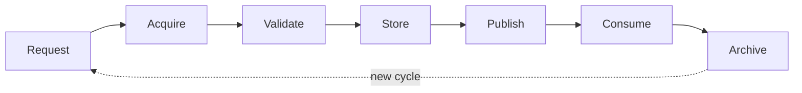

# EAR Acquisition Workflow v1

**Purpose:** Canonical **read-only acquisition workflow** — how a Snapshot Package is produced from an external SITE.  
**Status:** architecture specification — **no** code, runtime, connectors, scripts, automation, SSH, or FTP implementation.  
**Phase:** 2B — Read-Only Acquisition Workflow  
**Supersedes in role:** process detail for acquisition; complements [EAR-SNAPSHOT-LIFECYCLE-v1.md](EAR-SNAPSHOT-LIFECYCLE-v1.md) (Phase 2A stage semantics).

**Source of truth:** All future connectors, runbooks, and helpers must align with this workflow — they **implement** steps; they do **not** redefine lifecycle or ownership.

---

## Architectural position

```
SITE (external, passive)
    ↓
EAR (acquisition workflow — this document)
    ↓
Snapshot Package (contract per Phase 2A)
    ↓
Consumer (read-only analysis)
```

Phase 2A defined **what** a Snapshot Package is ([EAR-OPENCART-SNAPSHOT-SPEC-v1.md](EAR-OPENCART-SNAPSHOT-SPEC-v1.md), [EAR-SNAPSHOT-CONTRACT-v1.md](EAR-SNAPSHOT-CONTRACT-v1.md)).  
Phase 2B defines **how** evidence becomes that package through a governed, human-operated process.

---

## End-to-end workflow

```
Request  →  Acquire  →  Validate  →  Store  →  Publish  →  Consume  →  Archive
```

| Stage | One-line purpose |
|-------|------------------|
| **Request** | Charter and scope before any collection |
| **Acquire** | Collect evidence into a candidate package |
| **Validate** | Confirm contract, quality level, and safety |
| **Store** | Place immutable artifacts in agreed storage classes |
| **Publish** | Make a validated snapshot visible to consumers |
| **Consume** | Consumer analysis using snapshot only |
| **Archive** | Retire from active use; preserve audit history |



**Re-entry:** Each new acquisition cycle starts at **Request** (or a scoped re-Request) and yields a new `snapshot_id`. Prior packages move toward **Archive** when superseded.

---

## Stage definitions

### Request

| Dimension | Definition |
|-----------|------------|
| **Purpose** | Establish human authority, target SITE, environment class, acquisition mode (0–2), target quality level, consumer, and channel boundaries **before** collection. |
| **Owner (primary)** | **Operator** — authorizes; **EAR** — documents required artifacts and mode-appropriate checklist. |
| **Inputs** | Site charter; consumer audit charter (e.g. OCPilot Run 5); mode selection per [EAR-ACQUISITION-MODES-v1.md](EAR-ACQUISITION-MODES-v1.md); connection-type intent per [EAR-CONNECTION-TYPES-v1.md](EAR-CONNECTION-TYPES-v1.md) (documentation only). |
| **Outputs** | Approved acquisition request record (logical): `site_id`, scope, mode, quality target, HITL reference, forbidden actions (no Mode 3). |
| **Failure conditions** | No operator approval; Mode 3 requested; scope undefined; consumer not identified. |
| **SAFE UNKNOWN** | Automated request ticketing — not defined; request may be markdown charter or operator chat record until tooling exists. |

---

### Acquire

| Dimension | Definition |
|-----------|------------|
| **Purpose** | Collect evidence from SITE into a **candidate** Snapshot Package per platform spec. |
| **Owner (primary)** | **EAR** — defines what to collect and assembles logical package; **Operator** — executes or supervises collection per mode. |
| **Inputs** | Approved request; credentials **outside** package/git; mode-appropriate channel access (operator-held). |
| **Outputs** | Candidate package sections; `acquisition-log` / `access-log`; populated `safe-unknown` for gaps. |
| **Failure conditions** | Write to live SITE attempted; secrets embedded in candidate; collection outside approved scope; Mode 3 path taken. |
| **SAFE UNKNOWN** | Connector automation — future; candidate may be operator-assembled folder until EAR wrap exists. |

---

### Validate

| Dimension | Definition |
|-----------|------------|
| **Purpose** | Confirm candidate meets contract, declared quality level, security rules, and honesty (`safe-unknown` covers gaps). |
| **Owner (primary)** | **EAR** — contract and quality checklist; **Operator** — publish go/no-go. |
| **Inputs** | Candidate package; declared quality level; [EAR-READINESS-GATES-v1.md](EAR-READINESS-GATES-v1.md) criteria. |
| **Outputs** | **Validated** package (approved for Store/Publish) **or** **Rejected** candidate with documented reasons. |
| **Failure conditions** | Quality level overstated; credentials in git-bound copy; critical section empty without `safe-unknown`; validation checklist failed. |
| **SAFE UNKNOWN** | Automated validator CLI — Phase 4 candidate; human checklist is v1 default. |

See [EAR-FAILURE-MODELS-v1.md](EAR-FAILURE-MODELS-v1.md) for failure taxonomy.

---

### Store

| Dimension | Definition |
|-----------|------------|
| **Purpose** | Place validated snapshot artifacts in agreed **storage classes** without exposing credentials to consumers. |
| **Owner (primary)** | **Operator** — bulk placement and retention policy; **EAR** — metadata references (`bulk_root`, storage class labels). |
| **Inputs** | Validated package; storage policy per [EAR-STORAGE-MODEL-v1.md](EAR-STORAGE-MODEL-v1.md). |
| **Outputs** | Immutable stored snapshot (contract slice + optional bulk refs); storage references in metadata. |
| **Failure conditions** | Mutable overwrite of published `snapshot_id`; secrets stored alongside snapshot in consumer-accessible location. |
| **SAFE UNKNOWN** | WORM, encryption at rest, checksum registry — operator policy, not v1 spec. |

---

### Publish

| Dimension | Definition |
|-----------|------------|
| **Purpose** | Transition snapshot from operator/EAR-held validated state to **consumer-visible** published state. |
| **Owner (primary)** | **Operator** — final publish approval; **EAR** — documents publish record in metadata / acquisition-log. |
| **Inputs** | Stored, validated snapshot; publish gate passed per [EAR-READINESS-GATES-v1.md](EAR-READINESS-GATES-v1.md). |
| **Outputs** | Published snapshot reference consumable by registered consumers; **no** raw credentials in handoff. |
| **Failure conditions** | Publish attempted without Validate pass; consumer given candidate or raw FTP folder without spec wrap. |
| **SAFE UNKNOWN** | Publish notification webhooks — not in v1. |

See [EAR-SNAPSHOT-PUBLISHING-v1.md](EAR-SNAPSHOT-PUBLISHING-v1.md).

---

### Consume

| Dimension | Definition |
|-----------|------------|
| **Purpose** | Consumer performs read-only analysis using **published snapshot only** as structural input. |
| **Owner (primary)** | **Consumer** — intake, analysis, reports; **Operator** — unblock via new Request/Acquire if needed. |
| **Inputs** | Published snapshot; consumer baseline registry. |
| **Outputs** | Consumer reports referencing `snapshot_id` and quality level — **not** owned by EAR. |
| **Failure conditions** | Consumer initiates live acquisition; consumer mutates snapshot; consumer upgrades quality without new snapshot. |
| **SAFE UNKNOWN** | Consumer auto-retry against live SITE — forbidden by charter; behavior is consumer policy. |

---

### Archive

| Dimension | Definition |
|-----------|------------|
| **Purpose** | Retire snapshot from active consumer default while preserving citeability for historical reports. |
| **Owner (primary)** | **Operator** — retention and supersession; **Consumer** — marks reports tied to archived `snapshot_id`. |
| **Inputs** | Superseding snapshot, audit closure, or retention policy elapsed. |
| **Outputs** | Archived state (logical); optional catalog note — **not implemented** in v1. |
| **Failure conditions** | Destruction without operator policy; consumer treats archive as live refresh. |
| **SAFE UNKNOWN** | Legal hold / GDPR erasure — operator legal review. |

---

## Responsibility matrix (by stage)

| Stage | Operator | EAR | Consumer |
|-------|----------|-----|----------|
| **Request** | Authorizes target, mode, scope, quality target | Documents artifact checklist and mode rules | Declares intake needs (charter); does **not** initiate acquisition |
| **Acquire** | Executes/supervises collection (Modes 0–1); approves channel (Mode 2 future) | Assembles candidate; logs acquisition; fills `safe-unknown` | — |
| **Validate** | Publish go/no-go on validated candidate | Contract + quality + security checks | — |
| **Store** | Places bulk; retention | Documents storage refs in metadata | — |
| **Publish** | Final publish approval | Publish record; consumer routing metadata | Receives reference only after Publish |
| **Consume** | Unblocks via new cycle if needed | — | Analyzes; reports |
| **Archive** | Retention, supersession | Optional catalog (future) | Historical reference only |

Consumers **never** receive raw credentials. Consumers **never** initiate acquisition. Consumers **only** consume **published** snapshots.

---

## Relation to Phase 2A lifecycle

[EAR-SNAPSHOT-LIFECYCLE-v1.md](EAR-SNAPSHOT-LIFECYCLE-v1.md) defined Acquire → Validate → Store → Consume → Archive. Phase 2B **extends** that model:

| Phase 2A stage | Phase 2B addition |
|----------------|-----------------|
| (implicit charter) | Explicit **Request** stage before Acquire |
| Validate → Store | **Publish** as explicit gate before consumer visibility |

Semantics of Acquire, Validate, Store, Consume, Archive remain compatible; Phase 2B is the **canonical acquisition process** document for connectors and runbooks.

---

## Acquisition modes (summary)

| Mode | Name | v1 |
|------|------|-----|
| 0 | Manual Evidence | Supported |
| 1 | Guided Evidence | Supported |
| 2 | Connected Read Only | Design target; **not implemented** |
| 3 | Connected Read Write | **Forbidden** |

Detail: [EAR-ACQUISITION-MODES-v1.md](EAR-ACQUISITION-MODES-v1.md). Numeric mode IDs align with [EAR-MODES-v1.md](EAR-MODES-v1.md).

---

## Cross-references

| Document | Use |
|----------|-----|
| [EAR-SNAPSHOT-PUBLISHING-v1.md](EAR-SNAPSHOT-PUBLISHING-v1.md) | Publish gate and consumer visibility |
| [EAR-STORAGE-MODEL-v1.md](EAR-STORAGE-MODEL-v1.md) | Storage classes |
| [EAR-READINESS-GATES-v1.md](EAR-READINESS-GATES-v1.md) | Advancement rules |
| [EAR-FAILURE-MODELS-v1.md](EAR-FAILURE-MODELS-v1.md) | Failure taxonomy |
| [EAR-SITE-001-WORKFLOW-EXAMPLE-v1.md](EAR-SITE-001-WORKFLOW-EXAMPLE-v1.md) | Walkthrough example |
| [EAR-SECURITY-MODEL-v1.md](EAR-SECURITY-MODEL-v1.md) | Secrets and HITL |

---

## SAFE UNKNOWN

- Request record format (YAML vs markdown vs external ticket) — operator choice until Phase 2C+ charter.
- Whether Store and Publish are separate operator actions or one HITL step — both allowed; gates in [EAR-READINESS-GATES-v1.md](EAR-READINESS-GATES-v1.md) still apply.
- Central MARS-wide acquisition registry — not claimed.

---

## Non-goals (this document)

- Connector design, SSH/FTP implementation, scripts, automation
- Consumer audit methodology
- Mode 3 write paths
