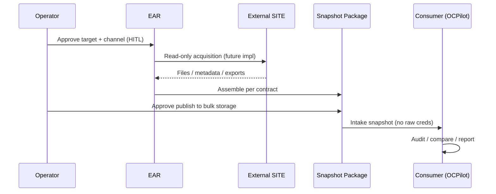

# EAR Architecture v1

**Type:** document-first layer model  
**Implementation:** **none claimed** in MARS repo at foundation freeze

---

## Layer stack

```
┌─────────────────────────────────────────────────────────────┐
│  Operator (human authority, credentials, approvals)        │
└────────────────────────────┬────────────────────────────────┘
                             │ charters target, approves channel
                             ▼
┌─────────────────────────────────────────────────────────────┐
│  EAR — External Access Runtime (acquisition only)            │
│  • Mode 0 / 1 / 2 (v1 target: Mode 2 read-only)              │
│  • Connectors (future) — SFTP, SSH, exports, admin read paths │
│  • No analysis, no remediation                               │
└────────────────────────────┬────────────────────────────────┘
                             │ produces
                             ▼
┌─────────────────────────────────────────────────────────────┐
│  Snapshot Package (contracted evidence bundle)               │
│  metadata · manifest · inventories · db-metadata · access-log  │
│  · safe-unknown                                                │
└────────────────────────────┬────────────────────────────────┘
                             │ consumed by
                             ▼
┌─────────────────────────────────────────────────────────────┐
│  Consumer System (read-only analysis)                        │
│  OCPilot · WPilot · Website Factory (future) · Landing Pilot   │
└─────────────────────────────────────────────────────────────┘
```

---

## Responsibility matrix

| Layer | Owns | Must not own |
|-------|------|----------------|
| **Operator** | Credentials, hosting contracts, go/no-go, backup facts | Audit methodology, baseline passports |
| **EAR** | Acquisition procedure, snapshot assembly, access log | Findings, risk ratings, change plans |
| **Snapshot** | Immutable-ish evidence package for a point in time | Live connection after handoff |
| **Consumer** | Diff vs baseline, reports, knowledge extraction | Storing passwords in git; silent live access |

---

## Data flow (target — Mode 2)



**Today (SITE-001):** Operator uses manual tools (e.g. WinSCP) → files → OCPilot. EAR documentation defines the **replacement shape**, not live replacement.

---

## Consumer examples

| Consumer | Domain | Typical snapshot use |
|----------|--------|----------------------|
| **OCPilot** | OpenCart / ocStore | Version proof, file manifest vs `ocstore-3038-rs2`, extension inventory |
| **WPilot** | WordPress | Plugin/theme inventory, core version, read-only export |
| **Website Factory** | Multi-site ops | **SAFE UNKNOWN** — factory intake may require unified snapshot Phase 4 |
| **Landing Pilot** | Landing / static | File tree + asset manifest — **SAFE UNKNOWN** depth |

Consumers **never** receive raw credentials in the snapshot contract. They may receive **secret references** (paths outside git) for operator use only — see [EAR-SECURITY-MODEL-v1.md](EAR-SECURITY-MODEL-v1.md).

---

## Storage placement (conceptual)

| Artifact | Typical location |
|----------|------------------|
| EAR contracts & docs | `shared/external-access-runtime/` (git) |
| Snapshot bulk | External storage per consumer registry (e.g. `C:\AI MARS STORAGE\ocpilot\project-sites\<site>\snapshots\`) |
| Secrets | External `secrets/` — never git |
| Consumer analysis | Consumer repo paths + external bulk |

Exact paths are consumer-defined; EAR documents the **handoff contract**, not every consumer folder layout.

---

## Failure and partial snapshot behavior

- Missing sections must appear in **`safe-unknown`** — consumers must not infer completeness.
- Consumers halt analysis phases that depend on missing sections (OCPilot Run 5 model).
- Operator may re-run acquisition (new snapshot id) — versioning **SAFE UNKNOWN** until Phase 4.

---

## Relation to external-access-patterns

| external-access-patterns | EAR |
|--------------------------|-----|
| Per-channel human gates | Composes into Mode 1/2 procedures |
| Browser / FTP / PMA docs | Inform connector risk tables |
| Not a package format | Defines **Snapshot Package** |

---

## SAFE UNKNOWN

- Snapshot immutability enforcement (WORM, checksum registry) — not defined v1.
- Multi-site batch acquisition — future Factory concern.
