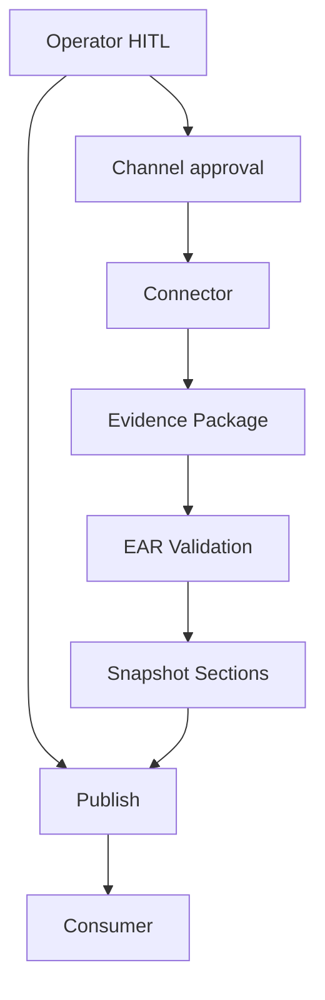

# EAR Connector Architecture v1

**Purpose:** Canonical architecture for **Mode 2 read-only connectors** — what a connector is, how it sits in EAR, and how it relates to channels, evidence, validation, and snapshots.  
**Status:** architecture specification only — **no** code, runtime, connector implementation, scripts, automation, SSH, FTP, or agents.  
**Phase:** 2D — Mode 2 Read-Only Connector Architecture  
**Source of truth:** All future Mode 2 connector designs, runbooks, and runtime charters must align with this document and its Phase 2D siblings.

**Supersedes in role:** connector semantics; complements [EAR-CONNECTION-TYPES-v1.md](EAR-CONNECTION-TYPES-v1.md) (foundation catalog of channels) and [EAR-OPENCART-ACQUISITION-DESIGN-v1.md](EAR-OPENCART-ACQUISITION-DESIGN-v1.md) (Phase 2C channel → snapshot paths).

---

## Architectural position

Phase 2A defined the **Snapshot Package** contract.  
Phase 2B defined the **Acquisition Workflow** (Request → Archive).  
Phase 2C defined **OpenCart acquisition channels** and quality paths.  
Phase 2D defines the **connector layer** — the adapter between an approved **channel** and an **Evidence Package**, before EAR validation produces **Snapshot sections**.

```
Channel (approved access path)
    ↓
Connector (read-only acquisition adapter — future impl)
    ↓
Evidence Package (temporary acquisition artifact)
    ↓
EAR Validation (workflow stage — human-supervised)
    ↓
Snapshot Sections (contracted consumer input)
```

Connectors are **not** consumers. Connectors are **not** the snapshot. Connectors are **not** credential stores.

---

## What is a connector?

A **connector** is a documented, bounded **read-only acquisition adapter** that:

1. Operates only after operator HITL approval of target, channel, and scope.
2. Maps a specific **channel class** (e.g. SFTP, ZIP intake) to structured **evidence** suitable for EAR validation.
3. Emits an **Evidence Package** per [EAR-EVIDENCE-PACKAGE-v1.md](EAR-EVIDENCE-PACKAGE-v1.md).
4. Conforms to the **Connector Contract** per [EAR-CONNECTOR-CONTRACT-v1.md](EAR-CONNECTOR-CONTRACT-v1.md).
5. Respects **Credential Boundaries** per [EAR-CREDENTIAL-BOUNDARY-v1.md](EAR-CREDENTIAL-BOUNDARY-v1.md).

**Not claimed at Phase 2D freeze:** Any connector is implemented, deployed, or executable in the MARS repository.

---

## Connector purpose

| Goal | Detail |
|------|--------|
| **Repeatability** | Mode 2 acquisition produces comparable evidence across runs when scope is unchanged |
| **Boundary enforcement** | Read-only scope, path limits, and channel rules are connector responsibilities — not consumer responsibilities |
| **Separation** | Acquisition mechanics stay out of consumer analysis logic (OCPilot, WPilot, etc.) |
| **Auditability** | Connector status, warnings, and errors feed `acquisition-log` / `access-log` without secrets |
| **Honesty** | Partial or failed acquisition is explicit — never silent inflation of snapshot quality |

---

## Connector responsibilities

| Responsibility | Owner |
|----------------|-------|
| Execute **read-only** acquisition steps for one approved channel (or coordinate via Hybrid) | Connector (future runtime) under operator supervision |
| Respect approved **scope** (paths, tables, size limits, environment class) | Connector |
| Emit **Evidence Package** with provenance (channel, timestamps, scope echo) | Connector |
| Report **Connector Status**, errors, warnings per contract | Connector |
| Surface **read-only violations** immediately and stop | Connector |
| Never write secrets into evidence or logs | Connector |
| Never publish directly to consumers | Connector — publish remains workflow stage |

---

## Connector non-responsibilities

| Non-responsibility | Correct owner |
|--------------------|---------------|
| Snapshot **quality level** certification | EAR Validation + operator publish approval |
| Consumer **analysis**, diff, findings, reports | Consumer (e.g. OCPilot) |
| **Credential** storage and rotation | Operator / external secrets store |
| **HITL** go/no-go before connected acquisition | Operator |
| **Remediation** or write operations | Out of scope — Mode 3 forbidden in v1 |
| **Schema** definition for snapshot sections | Phase 2A specs — connectors contribute raw evidence only |
| **Git** commits of bulk or secrets | Forbidden — see credential boundary |

---

## Channel vs connector

| Term | Definition |
|------|------------|
| **Channel** | Class of access path to external SITE (SFTP, admin UI, ZIP drop, etc.) — see Phase 2C and [EAR-CONNECTION-TYPES-v1.md](EAR-CONNECTION-TYPES-v1.md) |
| **Connector** | Named adapter implementation **for** a channel (or hybrid coordination) that produces an Evidence Package |

One channel may have zero or one primary connector in runtime; multiple connectors may contribute to one acquisition via **Hybrid Coordinator** (sequential or parallel evidence merge at validation).

---

## Connector lifecycle (conceptual)

```
┌─────────────┐
│  DORMANT    │  Connector defined in docs; no runtime
└──────┬──────┘
       │ runtime charter + readiness gates
       ▼
┌─────────────┐
│  REGISTERED │  Connector type known to EAR; not bound to a site
└──────┬──────┘
       │ operator Request stage approves channel + connector class
       ▼
┌─────────────┐
│  ARMED      │  Credentials loaded from external store; scope locked
└──────┬──────┘
       │ operator starts Acquire (Mode 2)
       ▼
┌─────────────┐
│  ACQUIRING  │  Read-only operations in progress
└──────┬──────┘
       │ success | partial | failure
       ▼
┌─────────────┐
│  EMITTED    │  Evidence Package handed to EAR Validation
└──────┬──────┘
       │ validation pass | fail
       ▼
┌─────────────┐
│  CLOSED     │  Session torn down; credentials released from connector context
└─────────────┘
```

**Re-entry:** A new acquisition cycle returns to **Request** → **Armed** with a new scope or connector class; prior Evidence Packages are not mutated.

---

## End-to-end flow (Mode 2 target)



| Stage | Connector involvement |
|-------|------------------------|
| **Request** | None — operator selects connector **class** intent |
| **Acquire** | Full — produces Evidence Package |
| **Validate** | None — EAR maps evidence → sections; connector may answer scope queries |
| **Store / Publish / Consume / Archive** | None — snapshot and bulk only |

---

## Layer alignment

| Layer | Document |
|-------|----------|
| Modes | [EAR-MODES-v1.md](EAR-MODES-v1.md) — Mode 2 target |
| Workflow | [EAR-ACQUISITION-WORKFLOW-v1.md](EAR-ACQUISITION-WORKFLOW-v1.md) |
| Connector types | [EAR-CONNECTOR-TYPES-v1.md](EAR-CONNECTOR-TYPES-v1.md) |
| Connector contract | [EAR-CONNECTOR-CONTRACT-v1.md](EAR-CONNECTOR-CONTRACT-v1.md) |
| Evidence | [EAR-EVIDENCE-PACKAGE-v1.md](EAR-EVIDENCE-PACKAGE-v1.md) |
| Snapshot mapping | [EAR-SNAPSHOT-MAPPING-v1.md](EAR-SNAPSHOT-MAPPING-v1.md) |
| Failures | [EAR-CONNECTOR-FAILURES-v1.md](EAR-CONNECTOR-FAILURES-v1.md) |
| Credentials | [EAR-CREDENTIAL-BOUNDARY-v1.md](EAR-CREDENTIAL-BOUNDARY-v1.md) |
| OpenCart example | [EAR-MODE-2-OPENCART-REFERENCE-v1.md](EAR-MODE-2-OPENCART-REFERENCE-v1.md) |

---

## Relation to Phase 2C channels

Phase 2C described **channels** (human-operated evidence classes). Phase 2D assigns each channel a **connector class** with explicit input/output and snapshot contribution limits. A channel without a future connector remains valid under **Mode 0 / 1** (operator delivers artifacts; EAR assembles without connected connector).

---

## SAFE UNKNOWN

- Connector registry format and versioning at runtime — not defined until Phase 3+ charter.
- Parallel connector execution policy (Hybrid) — coordinator semantics documented; scheduling **SAFE UNKNOWN**.
- Whether one Evidence Package may span multiple connector sessions in one `snapshot_id` — default: yes with Hybrid; merge rules at validation.

---

## Non-goals (Phase 2D)

- Implementation code, CLI, MCP tools, or Cursor agents as connectors.
- Automated credential discovery or vault product.
- Cross-site batch connectors (Website Factory) — future charter.
