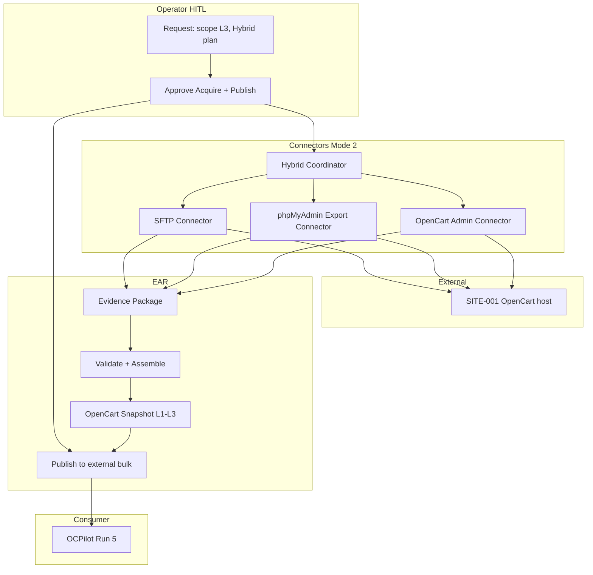
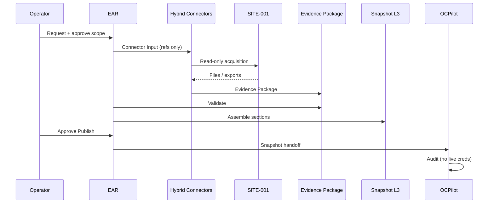

# EAR Mode 2 OpenCart Reference Architecture v1

**Purpose:** **Reference architecture only** — OpenCart / ocStore as exemplar for Mode 2 connector flow from SITE to OCPilot.  
**Status:** documentation example — **no** implementation, runtime, credentials, or access attempts.  
**Phase:** 2D  
**Relation:** Composes Phase 2A–2C + Phase 2D connector layer. **Not** a charter to execute SITE-001 or any live host.

---

## Reference scope

| Item | Value (example) |
|------|-----------------|
| Site | `SITE-001` (documentation pilot) |
| Platform | ocStore 3.0.3.8 (rs.2) — **claim only** |
| Consumer | OCPilot Run 5 read-only audit |
| Mode | **2** — Connected Read Only (design target) |
| Implementation | **None** — diagram and document flow only |

---

## End-to-end reference flow

```
SITE (external OpenCart / ocStore host)
    ↓
Connector(s) — read-only, HITL-approved
    ↓
Evidence Package(s)
    ↓
EAR Validation (workflow)
    ↓
OpenCart Snapshot Package — Level 1 / 2 / 3
    ↓
OCPilot (consumer analysis)
```

No credentials appear in this document. No connection is attempted from MARS repository.

---

## Reference diagram



---

## SITE

Passive external system: file tree, database, admin UI. EAR does not mutate SITE in this reference.

| Asset class | Relevant snapshot sections |
|-------------|---------------------------|
| PHP / OpenCart files | file-manifest, theme-info, extension-inventory, ocmod-inventory, seo-structure |
| Database | database-metadata |
| Admin UI | metadata claims, extension-inventory corroboration |
| Environment | environment (TEST vs PRODUCTION) |

---

## Connector(s) — reference selection

For **Snapshot Level 3** OpenCart target, reference plan (theoretical):

| Order | Connector | Contribution |
|-------|-----------|----------------|
| 1 | SFTP Connector | Live file-manifest, ocmod paths, seo files, version files |
| 2 | phpMyAdmin Export Connector | Structure-only export → database-metadata |
| 3 | OpenCart Admin Connector | Extension list + active theme corroboration |

**Hybrid Coordinator** merges three legs under one `acquisition_id`.

Alternative reference (backup-only SITE): **ZIP Intake** replaces SFTP; PMA may be embedded in zip or separate export.

See [EAR-OPENCART-SNAPSHOT-PATHS-v1.md](EAR-OPENCART-SNAPSHOT-PATHS-v1.md) for channel → level mapping.

---

## Evidence Package

| Leg | Artifacts (conceptual) |
|-----|------------------------|
| SFTP | `manifest.json` ref, version file hashes, bulk root external |
| PMA | `schema-export.sql` ref (structure-only) |
| Admin | `extension-list.json` or screenshot refs |

Merged index under Hybrid — per [EAR-EVIDENCE-PACKAGE-v1.md](EAR-EVIDENCE-PACKAGE-v1.md).

---

## EAR Validation

| Check | Reference outcome |
|-------|-------------------|
| Redact `config.php` secrets | Required before snapshot |
| Map evidence → sections | Per [EAR-SNAPSHOT-MAPPING-v1.md](EAR-SNAPSHOT-MAPPING-v1.md) |
| Quality level | L3 if all primaries satisfied |
| Contradictions | Admin vs file version → `safe-unknown` until operator resolves |
| Publish gate | [EAR-SNAPSHOT-PUBLISHING-v1.md](EAR-SNAPSHOT-PUBLISHING-v1.md) + operator APP |

---

## Snapshot Levels 1 / 2 / 3 (reference)

| Level | Reference minimum (OpenCart) |
|-------|----------------------------|
| **L1** | metadata + environment + partial file-manifest + database-metadata table list |
| **L2** | L1 + extension-inventory + theme-info + ocmod-inventory names |
| **L3** | L2 + high-confidence file-manifest hashes + DB metadata detail + seo-structure |

Reference target for SITE-001 Run 5: **L2 minimum**, **L3 desired** — per OCPilot charter (documentation cross-ref only).

Package identity fields per [EAR-OPENCART-SNAPSHOT-SPEC-v1.md](EAR-OPENCART-SNAPSHOT-SPEC-v1.md): `snapshot_id`, `ear_mode: 2`, `package_quality_level`.

---

## OCPilot (consumer)

| Step | Behavior |
|------|----------|
| Intake | Published snapshot from external bulk — [EAR-OPENCART-CONSUMER-GUIDE-v1.md](EAR-OPENCART-CONSUMER-GUIDE-v1.md) |
| Baseline diff | `file-manifest` vs `ocstore-3038-rs2` |
| Halt rules | Missing sections → read `safe-unknown`; stop dependent phases |
| Output | Audit report — **not** part of EAR |

OCPilot does **not** invoke connectors. Re-acquisition requires new EAR cycle.

---

## Sequence (reference only)



---

## What this reference does not do

| Excluded | Reason |
|----------|--------|
| SSH/FTP scripts | Phase 2D non-goal |
| Credential storage design | See [EAR-CREDENTIAL-BOUNDARY-v1.md](EAR-CREDENTIAL-BOUNDARY-v1.md) |
| Live SITE-001 access | No execution charter |
| OCPilot implementation | Consumer project scope |

---

## SAFE UNKNOWN

- Actual SITE-001 connector plan when Run 5 resumes — operator charter.
- Whether L3 is achievable on host without SSH — host-dependent.

---

## Cross-references

| Document | Use |
|----------|-----|
| [EAR-OPENCART-ACQUISITION-DESIGN-v1.md](EAR-OPENCART-ACQUISITION-DESIGN-v1.md) | Channel catalog |
| [EAR-SITE-001-ACQUISITION-OPTIONS-v1.md](EAR-SITE-001-ACQUISITION-OPTIONS-v1.md) | Theoretical options |
| [EAR-CONNECTOR-ARCHITECTURE-v1.md](EAR-CONNECTOR-ARCHITECTURE-v1.md) | Connector model |
